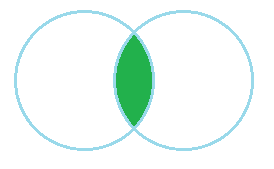

### Inner join
#### 2021_02_21
---
> 일단 inner join 이란 간단하게 말하면 A와 B의 교집합을 뜻한다고 할 수 있다.
> 
> 
>
> 위 그림과 같이 벤다이어그램을 그렸을 때 교차되는 부분이다.
> 
> 그렇담 inner 조인은 어떤 결과를 출력 하는 것인가.
> 
> ```
>   A          B
>  ex1        ex2
> ----       -----
>   a          b
>   b          d
>   c          f
>   d          h
>   위와 같은 테이블이 있을 때.
>   
> select * from A INNER JOIN B on A.ex1 = B.ex2;
> select A.*,B.* from A,B where A.ex1 = B.ex2; 의 결과는 아래와 같다.
> 
> ex1 | ex2
> ---------
>  b  |  b
>  d  |  d
>  ```
>  즉 두 집합에 모두 있는 열만 남게 된다.
