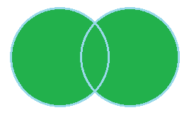

### OUTER JOIN
#### 2021_02_21
---
> OUTER JOIN은 합집합이라고 생각하면된다.
> 
> 
>
> 위 벤다이어그램의 색칠된 모든 부분이라고 할 수 있다.  
> 
> 그렇담 inner 조인은 어떤 결과를 출력 하는 것인가.
> 
> ```
>   A          B
>  ex1        ex2
> ----       -----
>   a          b
>   b          d
>   c          f
>   d          h
>   위와 같은 테이블이 있을 때.
>   
> select * from A LEFT OUTER JOIN B on A.ex1 = B.ex2;
> select A.*,B.* from A,B where A.ex1 = B.ex2; 의 결과는 아래와 같다.
> 
> ex1 | ex2
> ---------
>  a  | null
>  b  |  b
>  c  | null
>  d  |  d
>  
> 물론 select * from A RIGHT OUTER JOIN B on A.ex1 = B.ex2;
> select A.*,B.* from A,B where A.ex1 = B.ex2; 의 결과는 아래와 같다.
> ex1 | ex2
> ---------
>  b  |  b
>  d  |  d
> null|  f
> null|  h
> 
> 또한 FULL OUTER JOIN 도 있다.
> select * from A FULL OUTER JOIN B on A.ex1 = B.ex2;
> 
> ex1 | ex2
> ---------
>  a  | null
>  b  |  b
>  c  | null
>  d  |  d
> null|  f
> null|  h
>  ```
>  outer join은 전부 보여주지만 원래 가지고 있지 않던 값은 null로 처리한다.
> 합집합!
