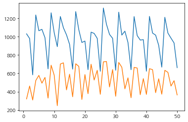
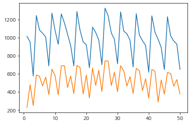
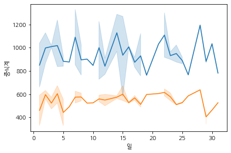

# Multicampus Projects
---
#### 인공지능 자연어처리[NLP]기반 기업 데이터 분석 과정

#### [구내식당 식수 인원 예측 AI 경진대회](https://dacon.io/competitions/official/235743/overview/description)
---
> colab 일단은 colab에서 진행. [공개코드 참고하여 진행](https://dacon.io/competitions/official/235743/codeshare/2856?page=1&dtype=recent)
>
> ### 1. 드라이브 마운트
> 
> #### 2. 설정(import, 폰트적용, 데이터 로드)
> 
> 폰트 설치, matplotlib업데이트
>> ```Python
>> pip install matplotlib -U # 업데이트
>> 
>> !sudo apt-get install -y fonts-nanum # 한글 글꼴 다운로드
>> !sudo fc-cache -fv # 캐시 삭제.
>> !rm ~/.cache/matplotlib -rf 
>> ```
>>
>> ```Python
>> import numpy as np 
>> import pandas as pd
>> import matplotlib.pyplot as plt
>> import seaborn as sns
>> import warnings # 자잘한 경고 메시지(오류 말고) 안나오게.
>> 
>> warnings.filterwarnings(action='ignore') # 경고 메시지 출력 안함.
>> 
>> plt.rcParams['font.family']=['NanumGothic', 'sans-serif'] # 한글 폰트 적용
>> plt.rcParams['axes.unicode_minus'] = False
>> 
>> train = pd.read_csv('/content/drive/MyDrive/Dacon/data/train.csv') # 드라이브 마운트 하고 train data 읽어옴
>> test = pd.read_csv('/content/drive/MyDrive/Dacon/data/test.csv') # 드라이브 마운트 하고 test data 읽어옴
>> ```
>
> #### 3. 데이터 정제
> drop
>> ```Python
>> # 일자는 년-월-일 로 구성된다. 사실 월,일 만 필요하다고 생각한다. 대부분의 업무나 행사들은 1년 주기로 순환하니까.
>> train['월'] = pd.DatetimeIndex(train['일자']).month # 리스트로 반환, 리스트는 시리즈니까 바로 담는거 가능. 아래도 마찬가지.
>> test['월'] = pd.DatetimeIndex(test['일자']).month
>> 
>> train['일'] = pd.DatetimeIndex(train['일자']).day
>> test['일'] = pd.DatetimeIndex(test['일자']).day
>> 
>> train = train.drop(drops, axis=1)
>> test = test.drop(drops, axis=1)
>> # 월~금요일 은 object즉 str형이라 모델에 넣을 수 없으니 인코딩을 진행해야한다. 일단은 원핫 말고 그냥 카테고라이즈만.
>> def day_to_num(d): # .apply() 할때 사용할 함수 선언, 요일을 숫자로
>>     if d == '월':
>>         return 1
>>     elif d == '화':
>>         return 2
>>     elif d == '수':
>>         return 3
>>     elif d == '목':
>>         return 4
>>     elif d == '금':
>>         return 5
>>  
>> train['요일'] = train['요일'].apply(day_to_num)
>> test['요일'] = test['요일'].apply(day_to_num)
>> 
>> # 필요없는거 drop
>> d_name = ['일자', '조식메뉴', '중식메뉴', '석식메뉴']
>> train = train.drop(d_name, axis=1)
>> test = test.drop(d_name, axis=1)
>> ```
> 필요한 데이터 생성. (밥먹을 가능성이 없는 사람 제거 -> 휴가자, 재택근무자.
>> ```Python
>> # 출장자수도 뺄라고 생각했지만 오후 출근시 점심을 먹는 경우가 있을테니 일단은 확실히 안먹는 것만 제거.
>> train['실제출근인원수'] = train['본사정원수'] - train['본사휴가자수'] - train['현본사소속재택근무자수']
>> test['실제출근인원수'] = test['본사정원수'] - test['본사휴가자수'] - test['현본사소속재택근무자수']
>> 
>> train['중식참여비율'] = train['중식계'] / train['식사가능자수']
>> train['석식참여비율'] = train['석식계'] / train['식사가능자수']
>> ```
> #### 4. 사용할 train, test 데이터 준비
> ```Python
> x_lu_train = train[['월', '일', '요일', '실제출근인원수', '본사출장자수', '본사시간외근무명령서승인건수']]
> y_lu_train = train['중식계']
> x_lu_test = test[['월', '일', '요일', '실제출근인원수', '본사출장자수', '본사시간외근무명령서승인건수']]
> 
> 
> x_di_train = train[['월', '일', '요일', '실제출근인원수', '본사출장자수', '본사시간외근무명령서승인건수']]
> y_di_train = train['석식계']
> x_di_test= test[['월', '일', '요일', '실제출근인원수', '본사출장자수', '본사시간외근무명령서승인건수']]
> ```
> #### 5. 모델 fit()
> - 베이스 라인 모델(RandomForestRegressor) 사용
>> ```Python
>> from sklearn.ensemble import RandomForestRegressor
>> lunch_model = RandomForestRegressor(n_jobs=-1, random_state=42)
>> dinner_model = RandomForestRegressor(n_jobs=-1, random_state=42)
>> 
>> lunch_model.fit(x_lu_train, y_lu_train)
>> dinner_model.fit(x_di_train, y_di_train)
>> 
>> pred1 = lunch_model.predict(x_lu_test)
>> pred2 = dinner_model.predict(x_di_test)
>> ```
>
> 
>
> - 다른 모델(XGBoost) 사용
>> ```Python
>> from sklearn.model_selection import GridSearchCV
>> from xgboost import XGBRegressor
>> 
>> params = {
>>     'learning_rate': [0.0, 0.1, 0.09, 0.089, 0.08],
>>     'boosting_type': ['gbtree', 'gblinear', 'dart'],
>>     
>> }
>> 
>> lunch_r = XGBRegressor(objective='reg:squarederror')
>> dinner_r = XGBRegressor(objective='reg:squarederror')
>> 
>> lunch_model = GridSearchCV(lunch_r, params, scoring='neg_mean_absolute_error')
>> dinner_model = GridSearchCV(dinner_r, params, scoring='neg_mean_absolute_error')
>> 
>> lunch_model.fit(x_lu_train, y_lu_train) # 여러 파라미터를 적용해가며 최적의 파라미터 찾는다
>> lunch_model = lunch_model.best_estimator_ # 찾은 최적의 파라미터 사용시 모델 획득
>> y_lu_pred = lunch_model.predict(x_lu_test) # 예측 수행
>> 
>> dinner_model.fit(x_di_train, y_di_train) # 여러 파라미터를 적용해가며 최적의 파라미터 찾는다
>> dinner_model = dinner_model.best_estimator_ # 찾은 최적의 파라미터 사용시 모델 획득
>> y_di_pred = dinner_model.predict(x_di_test) # 예측 수행
>> ```
>
> 
>
> 원본 데이터의 50일치 그래프.
>
> 
> 
> 초반에 감을 잡기가 힘들어서 다른분이 공개해주신 코드를 보고 따라 타이핑하며 하나하나 분석했다.
> 
> 어떤 방식으로 초점을 잡고 필요한 데이터를 구분하는지 아직까지는 완전 마스터하진 못했지만 점점 뭔가 알것같긴 하다.
> 
> 갈피를 조금이나마 잡는 느낌이라 다행이다.
>
> 다음엔 처음부터 내 주관적인 생각으로 만들어 볼것이다.
---
> #### 06_28 추가
>> 기상 데이터 어떤식으로 결합할지 생각해봄.
>> 
>> - 습도, 온도를 합친다.
>>
>> - 강수량의 기본값을 0으로 두어 강수량 정보를 살린다.
>>
>> - 강수량의 결측치가 너무 많다 강수량을 drop한다.
>> 
>> - 강수량과 습도, 온도를 합친다.
>>
>> - 대기질 정보를 추가한다.
>>
>> - 습도에 따른 불쾌지수를 추가한다.
>>
>> 등 다양한 방법을 추가해 모델에 적용해 본다.
>>
>> 각각의 데이터마다 어떤식으로 인코딩하고 적용해야할지도 마저 고민해야한다.
>>
>> 모델 선정보다 정확한 데이터를 가공하고 사용하는 것 이 더 중요하다는 것을 새삼 느꼈다..
>> 
>> 오늘은 여기까지. 내일은 노트북 정리.. 새로 구매해서..
