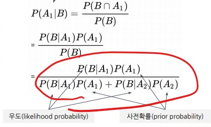
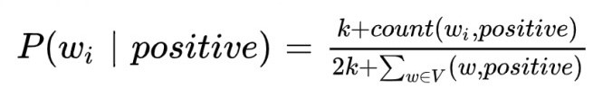
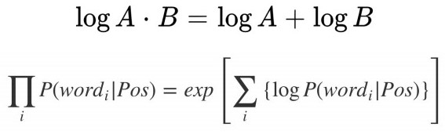

### 멀티캠퍼스 인공지능 자연어처리[NLP]기반 기업 데이터 분석.
- 9주차 1일 07/05
---
## 문서 분류(Document Classification)
> #### 문서 분류
>
> 문서를 사전에 구성된 그룹으로 분류하는 모델
> - 카테고리 분류, 감정 분석, 언어 탐지 등
> 
> 텍스트 분류는 텍스트를 빠르고 비용 효율적으로 적용이 가능
> 
> 문서의 내용을 토대로 어떤 주제의 문서인지 분류 하는것 이라 생각하면 될듯.
>
> 학습 데이터는 텍스트와 라벨(분류)로 구성
> 
> 학습 데이터를 훈련하고 새로운 문서가 입력되면 학습한 분류 내에서 문서의 문류를 예측
> 
> #### 분류 모델(1) - 나이브 베이즈 분류
>
> 베이즈 정리를 사용하는 분류 모델
> 
> 학습 데이터에서 추출한 이미 알고 있는 사전 확률을 바탕으로 사후(모르는)확률을 계산하여 분류
> 
> #### 분류 모델(2) - 서포트 벡터 머신
> 
> SVM(Support Vector Machines)은 제한된 양의 데이터를 처리 할 때 좋은 성능을 보이는 분류 알고리즘
> 
> 주어진 그룹에 속하는 벡터와 그룹에 속하지 않는 벡터 간 분류를 결정
> 
> SVM는 많은 학습 데이터가 필요하지 않지만, 나이브 베이즈 분류보다 좋은 성능을 내기 위해선 더 많은 계산 리소스가 필요
> 
> #### 분류 모델(3) - 딥러닝
> 
> 분류에는 널리 사용되는 주요 딥러닝 모델인 CNN, RNN, Transformer기반 모델
> - CNN은 입력 레이어, 출력 레이어 및 컨볼루션 레이어로 구성된 딥러닝 모델
> 
> - RNN은 시퀀스 정보를 처리하는 딥러닝 모델, RNN은 이전 계산 결과를 기억해 현재 계산에 사용
> 
> 딥러닝은 데이터가 많을 수록 잘 작동하기 때문에 잘 태깅된 데이터가 필수.
> 
> ### Bayes Classifier
> 
> 데이터의 **조건부 확률에 기반**한 분류 = > 데이터 중심
> 
> **범주형 자료에만 적용**가능 : 수치형 자료(예: 키, 체중, 주가 등)는 범주형으로 변환 필요
> 
> 좋은 성능을 위해서는 **대량 데이터**가 필요
> 
> - 종류
>> Exact Bayes Classifier
>> - 조건부 확율과 베이즈 확율에 기반
>> 
>> - 조건이 많으면 계산이 어려움
>> 
>> Naive Bayes Classifier
>> - 독립변수가 많을때 간단히 계산
>
> #### 확률
> - 확률이란
>> 어떤 사건이 발생할 가능성(사건 결과의 비율)
>> 
>> 확률 = 가능성 = %
>> 
>> 어떤 사건이 발생할 가능성을 0~1 값으로 표현한 것
>> 
> - 확률 계산
>> P(A) = 관심사건(A) / 표본공간(S) = A의 개수 / S의 개수 = n_A / n_S
>> - S : 표본 공간(Sample Space)
>> 
>> - A : 사건(event)
>> 
> #### 조건부 확률
> - 조건부 확률(Conditional probability)이란?
>> P(A), P(B) 두 개의 사건이 발생함
>> 
>> P(B|A) =
>> - A 조건이 주어진 상태에서 B가 발생 할 확률
>> 
>> - A 사건이 발생한 이후, B 사건이 발생 할 확률
>> 
>> 예 : 동전 2번 던져 모두 앞면 나올 확률
>>  - (앞,앞   앞,뒤   뒤,앞   뒤,뒤) 4개의 상황중 1번 즉 1/4 = 0.25
>> 
>> 사전 확률 : P(A)
>> 
>> 사후 확률: P(B|A)
>> 
>> A라는 추가 조건이 주어진 상태에서 다른 사건 B가 발생 할 확률
>> 
>> 표본공간 S가 바뀜
>> 
> ### 나이브 베이즈 분류(Naive Bayes Classifier)
>
> 사용자가 사전에 정의한 범주를 학습하여 새로운 문서가 입력되었을 때 범주 분류를 예측
> 
> 베이즈 정리(Bayes Rule) : 사전 확률과 사후확률 사이의 관계를 조건을 이용해 계산하는 확률 이론
> 
> #### 베이즈 정리
> - 사전 확률(prior probability) - 관찰 가능
>> 이미 알고 있는 사건이 발생할 확률
>> 
>> P(A): 원인(A)이 발생할 확률, 결과가 나타나기 전에 사전에 결정된 확률
>> 
> - 우도(likelihood probability) - 관찰 가능
>> 이미 알고 있는 사건이 발생한다는 조건하에 다른 사건이 발생할 확률
>> 
>> (B given A)에서 원인(A)가 발생한 후, 결과(B)가 나타날 확률
>> 
> - 사후 확률(posterior probability)
>> 사전확률과 우도를 통해서 알게 되는 조건부 확률
>> 
>> P(A given B)에서 결과(B)가 나온 이루, 원인(A)일 확률
>
> 확률론과 통계하게서, 베이즈 정리는 두 확률 변수의 사전 확률과 사후 확률 사이의 관계를 나타내는 정리다. 베이즈 확률론 해석에 따르면 베이즈 정리는 사전확률로부터 사후확률을 구할 수 있다.
> 
> 
> 
> - 확률 종류
>> 사전(prior) 확률 : P(A)
>> 
>> 우도(likelihood) 확률 : P(B|A) = P(A∩B) / P(A)
>> 
>> 사후(posterior) 확률 : 
>> - P(A|B) = P(A∩B) / P(B)
>>
>> - P(A∩B) = P(B|A) x P(A)\
>> 
>> - P(B) = P(A)P(B|A) + P(A’)P(B|A’)
>> 
>> - P(A|B) = P(A∩B) / P(B) = [P(B|A) x P(A)] / [P(A)P(B|A) + P(A’)P(B|A’)]
> 
> #### Naive Bayes Classifier 장단점
> - 장점
>> 범주형 변수 처리
>> 
>> 단순성, 계산 효율성
>> 
>> 좋은 분류 성늠
> - 단점
>> 많은 데이터 필요
>> 
>> 값이 0일 확률 처리 : Laplace smoothing
>>
> #### Naive Bayes 개선 - Laplace smoothing
> 
> 입력 텍스트가 기존에 계산한 확률이 존재하지 않을 경우 0으로 계산될 수 있다.
> - 분자와 분모에 일정 상수(K)를 더해 신규 단어가 출현했을 때 0으로 계산되는 것을 방지
> 
> 
> 
> #### Naive Bayes 개선 - Log 이용 언더 플로우 방지
>
> 확률을 계산하고 확률간의 곱으로 연산이 이루어짐
> 
> 1이하 값으로 이루어지는 값을 계속 해서 곱하면 소수점 이하로 작아져 계산할 수 없는 범위 이하로 작아지는 것을 언더플로우라 한다.
> 
> Log의 성질을 활용해 곱셈을 덧겜으로 변환하여 underflow방지
> 
> 
> 
> #### 나이브 베이즈 성능 개선
> - 성능 개선을 위한 방법
>> 불용어 처리 : 분류를 판단하는데 불필요한 단어 제거
>> 
>> 원형복원 : 같은 의미의 다른 표현을 원형복원하여 표준화
>> 
>> N-gram : n개의 단어 묶음. 문맥을 포함할 수 있음
>> 
>> TF-IDF : 단순 빈도 기반이 아니라 문서 빈도-역문서 빈도에 기반하여 각 단어의 점수를 결정
