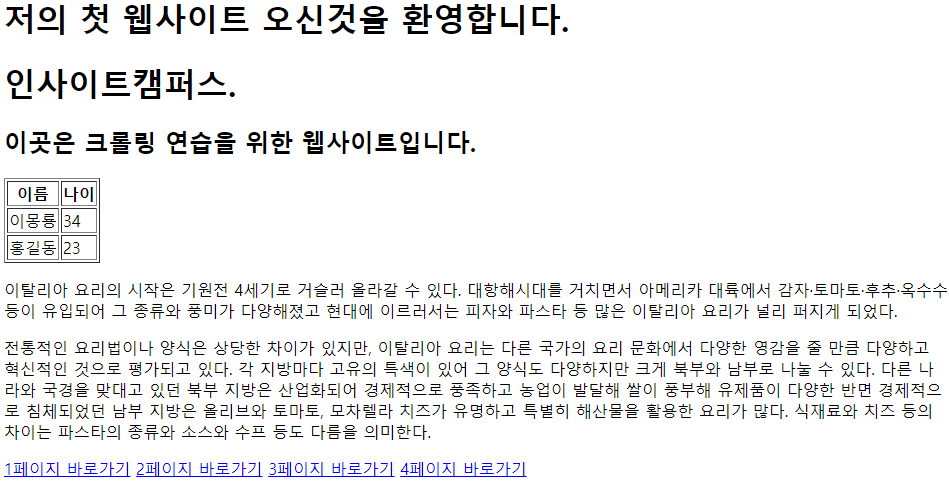

### 멀티캠퍼스 인공지능 자연어처리[NLP]기반 기업 데이터 분석.
- 2주차 4일 (5/21)

정규표현식 복습.

---
> ## 1. HTML 기본 크롤링 (크롤링)
>> ## request 객체
>> - HTTP 요청을 보내는 모듈(웹사이트 접속)
>>> ```Python
>>> import request
>>> URL = 'https://scrapying-study.firebaseapp.com/01/'
>>> 
>>> response = requests.get(URL)
>>> 
>>> print(response.status_code) # [HTTP 상태코드](https://ko.wikipedia.org/wiki/HTTP_%EC%83%81%ED%83%9C_%EC%BD%94%EB%93%9C) 반환 -> 200 (정상 작동)
>>> print(response.text) # 페이지 html 코드 반환.
>>> 
>>> # Header추가, header확인할때 사용(연습 사이트엔 없음.)
>>> import request
>>> URL = 'https://scrapying-study.firebaseapp.com/01/'
>>> 
>>> headers = {'Content-Type':'application/json; charser=utf-8'}
>>> response = requests.get(URL) 
>>> 
>>> print(response.status_code)
>>> print(response.text)
>>> 
>>> # Get방식 데이터 전송
>>> import request
>>> URL = 'https://scrapying-study.firebaseapp.com/01/'
>>> 
>>> data ={'name':'ronen'} # 딕셔너리 형
>>> response = requests.get(URL, data=data) #뒤에 data에 알맞은 변수 전달. 
>>> 
>>> print(response.status_code)
>>> print(response.text)
>>> ```
>> ## Beautiful Soup
>> - HTML에서 손쉽게 원하는 데이터를 가져올수있도록 지원
>> 
>> - pip install beautifulsoup4 로 패키지 설치
>> 
>> 타깃 사이트 이미지는 아래와 같다.
>> 
>> 
>> 
>>> ```Python
>>> import requests
>>> from bs4 import BeautifulSoup
>>> 
>>> URL = 'https://scrapying-study.firebaseapp.com/01/'
>>> response = requests.get(URL)
>>> soup = BeautifulSoup(response.text, "html.parser")
>>> result = soup.find("title")
>>> print(result)
>>> print(result.text)
>>> """
>>> <title>크롤링 연습사이트 01</title>
>>> 크롤링 연습사이트 01
>>> """
>>> 
>>> soup.find("p") # 가장 상단에 있는 p태그 하나만
>>> """
>>> <p id="hello">
>>>     이탈리아 요리의 시작은 기원전 4세기로 거슬러 올라갈 수 있다.
>>>     대항해시대를 거치면서 아메리카 대륙에서 감자·토마토·후추·옥수수 등이 유입되어 그 종류와 풍미가 다양해졌고
>>>     현대에 이르러서는 피자와 파스타 등 많은 이탈리아 요리가 널리 퍼지게 되었다.
>>> </p>
>>> """
>>> 
>>> soup.find_all("p", limti=2) # 일치하는 모든 탸그(limit: 가져올 갯수제한., 생략가능)
>>> """
>>> [<p id="hello">
>>>     이탈리아 요리의 시작은 기원전 4세기로 거슬러 올라갈 수 있다.대항해시대를 거치면서 아메리카 대륙에서 감자·토마토·후추·옥수수 등이 유입되어 그 종류와 풍미가 다양해졌고 현대에 이르러서는 피자와 파스타 등 많은 이탈리아 요리가 널리 퍼지게 되었다.
>>> </p>, <p id="cook">
>>>     전통적인 요리법이나 양식은 상당한 차이가 있지만, 이탈리아 요리는 다른 국가의 요리 문화에서 다양한 영감을 줄 만큼 다양하고 혁신적인 것으로 평가되고 있다. 각 지방마다 고유의 특색이 있어 그 양식도 다양하지만 크게 북부와 남부로 나눌 수 있다. 다른 나라와 국경을 맞대고 있던 북부 지방은 산업화되어 경제적으로 풍족하고 농업이 발달해 쌀이 풍부해 유제품이 다양한 반면 경제적으로 침체되었던 남부 지방은 올리브와 토마토, 모차렐라 치즈가 유명하고 특별히 해산물을 활용한 요리가 많다. 식재료와 치즈 등의 차이는 파스타의 종류와 소스와 수프 등도 다름을 의미한다.
>>> </p>]
>>> """
>>> 
>>> soup.find("th", "tablehead") # 옵션값이 class가 tablehead인것
>>> # <th class="tablehead">이름</th>
>>> 
>>> soup.find("th", class_="tablehead") # 옵션값이 class가 tablehead인것
>>> # <th class="tablehead">이름</th>
>>> 
>>> soup.find("th", attrs={"class":"tablehead"}) # 옵션값이 class가 tablehead인것(옵션명 변경 가능)
>>> # <th class="tablehead">이름</th>
>>> 
>>> soup.find("h1", attrs={"title":"welcome"}) # 옵션값이 title가 welcome인것(옵션명 변경 가능)
>>> # <h1 title="welcome">인사이트캠퍼스.</h1>
>>> 
>>> soup.find(id="hello") # 옵션값이 id가 hello인것.
>>> """
>>> <p id="hello">
>>>     이탈리아 요리의 시작은 기원전 4세기로 거슬러 올라갈 수 있다. 대항해시대를 거치면서 아메리카 대륙에서 감자·토마토·후추·옥수수 등이 유입되어 그 종류와 풍미가 다양해졌고 현대에 이르러서는 피자와 파스타 등 많은 이탈리아 요리가 널리 퍼지게 되었다.
>>> </p>
>>> """
>>> 
>>> URL = 'https://scrapying-study.firebaseapp.com/01/'
>>> response = requests.get(URL)
>>> soup = BeautifulSoup(response.text, "html.parser")
>>> result = soup.find("a")
>>> print(result.text) # .text - 태그내에 내용만 추출
>>> # 1페이지 바로가기
>>> print(result.attrs["href"]) # .attrs["옵션명"] - 태그내에 옵션을 추출
>>> # 01.html
>>> 
>>> # 결과값에서 다시 검색가능
>>> result = soup.find("table")
>>> result2 = soup.find("table")
>>> ```
> ## 2. CSS 셀렉터를 활용한 크롤링
>> ## CSS란?
>> - HTML 요소들이 어떻게 보이는가를 정의하는 언어.
>> 
>> 1994년 10월 10일 하콤 비움 리가 처음 제안. 최신버전은 CSS3
>> 
>> ## CSS 사용방법
>> ### 1, 태그내에 지정
>>> ```HTML
>>> <div style='border:1px solid red;font-size:20px">
>>> 안녕하세요 DIV박스입니다.
>>> </div>
>>> ```  
>>> 강의자료를 통해서 확인하자.
>>> 
>>> 그게 훨씬 보기 좋다.(데이터수집_기초.pdf의 44페이지 부터.)
