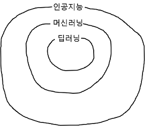
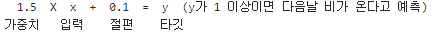

## [Do it! 정직하게 코딩하며 배우는 딥러닝 입문](https://play.google.com/store/books/details?id=fsGyDwAAQBAJ&pcampaignid=books_web_aboutlink)
### 딥러닝이란.
##### Date 2021_02_16
---
### 1. 인공지능이란.
> '사람의 지능을 만들기 위한 시스템이나 프로그램'
>> - 강 인공지능(strong AI) : 사람과 구분이 안 될 정도로 강한 성능을 가진 인공지능
>>
>> - 약 인공지능(weak AI) : 거의 대다수를 차지하는 인공지능(로봇청소기, 번역, 테슬라 등), 전문가 시스템적인 인공지능
>
> 머신러닝과 딥러닝은 약 인공지능에 포함되는 기술이다, 또한 딥러닝은 머신러닝에 포함되는 기술이다.
>
> 
>
### 2. 머신러닝이란.
> 한국말로 번역한다면 기계 학습이다.
>
> 학습 : 머신러닝과 딥러닝에서 말하는 학습은 데이터의 규칙을 컴퓨터 스스로 찾아내는 것을 말한다.
>
> 전통적인 프로그램이 사람이 정한 규칙대로 동작하는 것과는 전혀 다르다.
>
> 반면에 머신러닝은 규칙을 스스로 찾아 수정한다. 이 과정을 학습 또는 훈련이라고 한다.
>
> - 지금까지 데이터로는 습도가 XX% 이상일때 다음날 비가 왔다 하지만 새로운 데이터가 들어온다면 바뀔 가능성이 있다.
>
> #### 학습 방식
> - 지도 학습 : 입력과 타깃으로 모델을 훈련시킨다.
>> 훈련데이터 : 습도와 비가 왔는지 안왔는지를 함께 제공(습도 : 입력, 비가 왔는지: 타깃)
>>
>> 입력은 모델이 풀어야할 일종의 문제
>>
>> 타깃은 모델이 맞춰야할 정답과 같은 것
>>
>> 학습을 통해 만들어진 프로그램은 모델이라 하며 모델은 새로운 입력에 대한 예측을 만든다.
> 지도 학습은 기돈의 데이터를 통해 모델을 학습시키고 학습시킨 모델로 새오룬 입역에 대한 예측을 할 수 있으므로 기사예측, 스팸 메일 분류등의 일을 해결할 때 많이 사용한다.
>
> 지도 학습에서 가장 어려운 일은 훈련 데이터를 생성하는 작업이다.
>
> 적확한 입력과 타깃만을 포함해야 하며 데이터의 양 또한 적어서는 안된다.
>
> - 비지도 학습 : 타깃이 없는 데이터를 사용한다.
>> 기업이 고객의 소비 성향에 따라 그룹을 지정하는 상황에 비유한다.
>>
>> 그룹을 만들기 전까지는 어떤 그룹이 존재하는지, 몇개의 그룹이 생성될지 알 수 없다. 즉 타깃이 없는 상황이다.
>>
>> 비슷한 모양끼리 그룹을 생성한다고 할 때, 현재 존재하는 모양과 다른 모양이 나올 경우 새 그룹이 생성된다.
>>
>> 비지도 학습의 모델 훈련 결과는 평가하기 어렵다는 특징이 있다.
>
> - 강화 학습 : 주어진 환경으로부터 피드백을 받아 훈련한다.
>> 머신러닝 알고리즘으로 에이전트라는 것을 훈련시킨다.
>>
>> 훈련한 에이전트는 특정 환경에 최적화된 행동을 수행하고 수행에 대한 보상과 현재 상태를 받는다.
>>
>> 에이전트의 목표는 최대한 많은 보상을 받는 것이며 이를 위해 에이전트는 주어진 환경에서 최대한 많은 행동을 수행하며 학습된다.
>>
>> 대표적인 알고리즘 : Q-러닝, SSARSA, DQN
>>
>> 대표적인 예 : 알파고
>
> #### 규칙이란 가중치와 절편을 말한다.
> 
> 
> 위 규칙은 각각 가중치와 절편이라고 부르며 입력과 곱하는 수가 가중치, 더하는 수가 절편이다.
>
> 딥러닝은 이것보다 훨씬 많은(약 10~100만)의 가중치와 절편을 가진다.
>
---
> 오늘은 17p..
