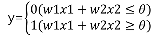

## [밑바닥부터 시작하는 딥러닝]
> ~~02/19 새로 공부할 책을 구매 했습니다.
> 
> 전 석사도 아니고 물론 학사도 정보보호학 이지만
> 
> 많은 것을 배우고, 배우는 과정에서 나만의 학습법을 찾는 즐거움이 있더라구요
> 
> 또 배운만큼 사용할 수 있는 것들이 늘고 생각의 범위가 넓혀진다고 생각합니다.
> 
> 공부 열심히..~~
#### 2021_02_23
#### CHAPTER2_퍼셉트론
---
> 퍼셉트론은 프랑크 로젠블라트가 1957년 고안한 알고리즘이다.
> 
> 굉장히 오래된 이 알고리즘을 학습하는 이유는 신경망(딥러닝)의 기원이 되는 알고리즘이기 때문이다.
> 
> #### 2.1 퍼셉트론이란?
>> 퍼셉트론은 다수의 신로호를 입력받아 하나의 신호로 출력한다. (**신호** = 전류, 강물처럼 **흐름**이 있는것 이라 생각하라 한다.)
>> 
>> 전류가 전선을 타고 흐르는 전자를 내보내듯이 퍼셉트론 신호도 흐름을 만들고 정보를 앞으로 전달하기 때문이다.
>> - 하지만 실제 전류와 달리 퍼셉트론 신호는 "**흐른다/안흐른다(0/1)**"의 두 가지 값을 가진다.(책에서는 "1 = 흐른다", "0 = 안흐른다"로 약속)
>> 
>> 
>>
>> 위 그림은 입력으로 2개의 신호를 받은 퍼셉트론이다.
>> 
>> x1과 x2는 입력 신호, y는 출력신호, w1과 w2는 가중치를 뜻한다(weight). 그림의 원을 **뉴런** 또는 **노드**라고 부른다.
>> 
>> 입력 신호가 뉴런에 보내질 때 각각 고유한 **가중치**가 곱해진다(w1*x1, w2*x2).
>> 
>> 뉴런에서 보낸 신호의 총합이 정해진 한계를 넘어설 때만 1을 출력한다('뉴런이 활성화 한다'라고 표현하기도 한다고함)
>>  - 이 책에선 그 한계를 **임계값**이라 하며 쎄타 기호(θ)를 사용한다.
>>  
>> 
>> 
>> 수식으로 정리하면 위의 그림과 같다.
>> 
>> 퍼셉트론은 복수의 입력 신호에 각각의 고유한 가중치를 부여한다.
>> 
>> 가중치는 각 신호가 결과에 주는 영향력을 조절하는 요소로 작용한다.
>> - 가중치가 클수록 해당 신호가 그만큼 더 중요하다는 뜻이다.
