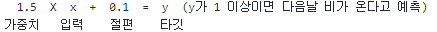

## [Do it! 정직하게 코딩하며 배우는 딥러닝 입문](https://play.google.com/store/books/details?id=fsGyDwAAQBAJ&pcampaignid=books_web_aboutlink)
### 딥러닝이란.
##### Date 2021_02_16
---
### 1. 인공지능이란.
> '사람의 지능을 만들기 위한 시스템이나 프로그램'
>> - 강 인공지능(strong AI) : 사람과 구분이 안 될 정도로 강한 성능을 가진 인공지능
>>
>> - 약 인공지능(weak AI) : 거의 대다수를 차지하는 인공지능(로봇청소기, 번역, 테슬라 등), 전문가 시스템적인 인공지능
>
> 머신러닝과 딥러닝은 약 인공지능에 포함되는 기술이다, 또한 딥러닝은 머신러닝에 포함되는 기술이다.
>
> 
>
### 2. 머신러닝이란.
> 한국말로 번역한다면 기계 학습이다.
>
> 학습 : 머신러닝과 딥러닝에서 말하는 학습은 데이터의 규칙을 컴퓨터 스스로 찾아내는 것을 말한다.
>
> 전통적인 프로그램이 사람이 정한 규칙대로 동작하는 것과는 전혀 다르다.
>
> 반면에 머신러닝은 규칙을 스스로 찾아 수정한다. 이 과정을 학습 또는 훈련이라고 한다.
>
> - 지금까지 데이터로는 습도가 XX% 이상일때 다음날 비가 왔다 하지만 새로운 데이터가 들어온다면 바뀔 가능성이 있다.
>
> #### 학습 방식
> - 지도 학습 : 입력과 타깃으로 모델을 훈련시킨다.
>> 훈련데이터 : 습도와 비가 왔는지 안왔는지를 함께 제공(습도 : 입력, 비가 왔는지: 타깃)
>>
>> 입력은 모델이 풀어야할 일종의 문제
>>
>> 타깃은 모델이 맞춰야할 정답과 같은 것
>>
>> 학습을 통해 만들어진 프로그램은 모델이라 하며 모델은 새로운 입력에 대한 예측을 만든다.
> 지도 학습은 기돈의 데이터를 통해 모델을 학습시키고 학습시킨 모델로 새오룬 입역에 대한 예측을 할 수 있으므로 기사예측, 스팸 메일 분류등의 일을 해결할 때 많이 사용한다.
>
> 지도 학습에서 가장 어려운 일은 훈련 데이터를 생성하는 작업이다.
>
> 적확한 입력과 타깃만을 포함해야 하며 데이터의 양 또한 적어서는 안된다.
>
> - 비지도 학습 : 타깃이 없는 데이터를 사용한다.
>> 기업이 고객의 소비 성향에 따라 그룹을 지정하는 상황에 비유한다.
>>
>> 그룹을 만들기 전까지는 어떤 그룹이 존재하는지, 몇개의 그룹이 생성될지 알 수 없다. 즉 타깃이 없는 상황이다.
>>
>> 비슷한 모양끼리 그룹을 생성한다고 할 때, 현재 존재하는 모양과 다른 모양이 나올 경우 새 그룹이 생성된다.
>>
>> 비지도 학습의 모델 훈련 결과는 평가하기 어렵다는 특징이 있다.
>
> - 강화 학습 : 주어진 환경으로부터 피드백을 받아 훈련한다.
>> 머신러닝 알고리즘으로 에이전트라는 것을 훈련시킨다.
>>
>> 훈련한 에이전트는 특정 환경에 최적화된 행동을 수행하고 수행에 대한 보상과 현재 상태를 받는다.
>>
>> 에이전트의 목표는 최대한 많은 보상을 받는 것이며 이를 위해 에이전트는 주어진 환경에서 최대한 많은 행동을 수행하며 학습된다.
>>
>> 대표적인 알고리즘 : Q-러닝, SSARSA, DQN
>>
>> 대표적인 예 : 알파고
>
> #### 규칙이란 가중치와 절편을 말한다.
> 
> 
> 위 규칙은 각각 가중치와 절편이라고 부르며 입력과 곱하는 수가 가중치, 더하는 수가 절편이다.
>
> 딥러닝은 이것보다 훨씬 많은(약 10~100만)의 가중치와 절편을 가진다.
>
> ~~오늘은 17p..~~
##### Date 2021_02_17
> 어제 정리하던 것 이어서.
---
> #### 모델은 머신러닝의 수학적 표현.
>> 모델은 '훈련 데이터로 학습된 머신러닝 알고리즘' 라고 정의 할 수 있다.
>> 
>> 가중치와 절편을 합쳐 모델 파라미터 라고 부른다.
>> 
>> 실제 실습에선 모델을 클래스로 구현할 것이다. 실습에서 만든 객체를 모델이라고 이해하면 된다.
>
> #### 손실 함수로 모델의 규칙을 수정한다.
>> 입력한 값에 따라 모델이 예측한 결과와 실제 타깃값과 맞지 않는 경우가 생긴다.
>>
>> 이러한 경우 모델의 규칙을 수정하는 기준이 되는 '손실 함수'를 이용해야한다.
>> 
>> 예 : 모델이 예측한 값과 타깃값의 차이를 계산하는 함수를 손실 함수로 정의 할 수 있다.
>> 
>> 손실 함수는 단순히 예측한 값과 타깃의 차이를 정의하는 것이다. 따라서 손실 함수의 최솟값을 효율적으로 찾는 방법도 필요하다.
>> 
>> 최솟값을 효율적으로 찾는 방법은 '최적화 알고리즘'이라 부른다.
>> 
> 위의 개념들은 머신러닝을 이해하기 위한 개념들이였다.
> 
> 머신러닝의 개념은 대부분 딥러닝에도 그대로 적용된다. 다음은 머신러닝과 딥러닝의 차이점을 간단히 알아본다.
> 
### 3. 딥러닝이란.
> 딥러닝은 머신러닝의 여러 알고리즘 중 '인공신경망'을 이용해 만든 것이다.
> 
> 또한 인공신경망을 여러 겹으로 쌓은 모습에서 딥러닝 이라는 용어가 탄생했다.
> 
> 
> 
> 인공신경망을 그림으로 표현하면 위와 같다. (왼쪽부터 입력 -> 출력)
> 
> 자극(입력)을 받아들여 다음 뉴런으로 자극을 전달(출력)하는 과정이 인공신경망과 뉴런의 비슷한 점이다.
> 
> 인공신경망을 여러 겹을 쌓는다면 아래의 그림과 비슷한 모양이 된다.
> 
> 
> 
> 또한 딥러닝 이라 한다. (보통 인공신경망과 딥러닝이라는 용어를 구분하지 않고 사용하는 경우가 많다고 한다.)
> 
> #### 하지만 사람의 뇌와 딥러닝은 많이 다르다.
> - 작동하는 방식이 매우 다르기 때문
>
> #### 딥러닝은 머신러닝이 처리하기 어려운 데이터를 더 잘 처리한다.
> 딥러닝과 머신러닝의 가장 큰 차이점은 보통 '처리하는 데이터'라고 한다.
>> 딥러닝 : 이미지, 영상, 음성, 소리, 텍스트, 번역등 비정형 데이터
>> 
>> 머신러닝 : DB, 레코드파일, 엑셀, CSV등에 담긴 정형 데이터
>
> 위의 각기 잘 맞는 데이터의 차이로 인해 딥러닝은 보통 '인지'와 관련된 문제를 잘 해결한다고 한다.
>
---
> 이 책에서는 구글 코랩을 이용해 실습을 진행한다.
> 
> 주피터 노트북을 이용하기 때문이다. 구글 코랩 뿐 아니라 아나콘다를 이용해도 주피터 노트북은 사용 가능하다.
> 
> 또한 주로 사용하는 패키지?는 NumPy가 있으며
> 
> 그래프를 그릴땐 Matplotlib를 사용한다.
> 
> 오늘은 여기 까즤..
