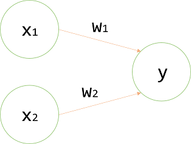
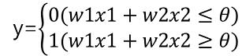
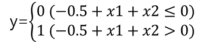
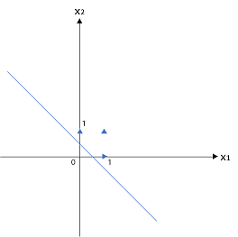
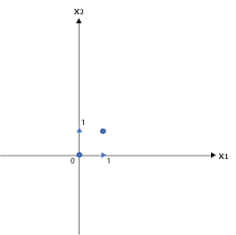
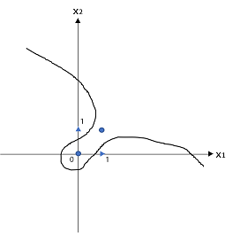
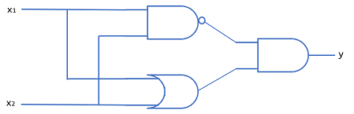
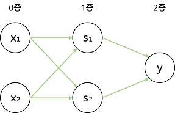

## [밑바닥부터 시작하는 딥러닝]
> ~~02/19 새로 공부할 책을 구매 했습니다.
> 
> 전 석사도 아니고 물론 학사도 정보보호학 이지만
> 
> 많은 것을 배우고, 배우는 과정에서 나만의 학습법을 찾는 즐거움이 있더라구요
> 
> 또 배운만큼 사용할 수 있는 것들이 늘고 생각의 범위가 넓혀진다고 생각합니다.
> 
> 공부 열심히...~~
---
### 목차
- [2.1 퍼셉트론이란?](https://github.com/minchan5224/TIL/blob/main/Python/Deep_Learning/01/Deep_01_02.md#21-%ED%8D%BC%EC%85%89%ED%8A%B8%EB%A1%A0%EC%9D%B4%EB%9E%80)
- [2.2 단순한 논리 회로](https://github.com/minchan5224/TIL/blob/main/Python/Deep_Learning/01/Deep_01_02.md#22-%EB%8B%A8%EC%88%9C%ED%95%9C-%EB%85%BC%EB%A6%AC-%ED%9A%8C%EB%A1%9C)
- [2.3 퍼셉트론 구현하기](https://github.com/minchan5224/TIL/blob/main/Python/Deep_Learning/01/Deep_01_02.md#23-%ED%8D%BC%EC%85%89%ED%8A%B8%EB%A1%A0-%EA%B5%AC%ED%98%84%ED%95%98%EA%B8%B0)
- [2.4 퍼셉트론의 한계](https://github.com/minchan5224/TIL/blob/main/Python/Deep_Learning/01/Deep_01_02.md#24-%ED%8D%BC%EC%85%89%ED%8A%B8%EB%A1%A0%EC%9D%98-%ED%95%9C%EA%B3%84)
- [2.5 다층 퍼셉트론을 사용한다면.](https://github.com/minchan5224/TIL/blob/main/Python/Deep_Learning/01/Deep_01_02.md#25-%EB%8B%A4%EC%B8%B5-%ED%8D%BC%EC%85%89%ED%8A%B8%EB%A1%A0%EC%9D%84-%EC%82%AC%EC%9A%A9%ED%95%9C%EB%8B%A4%EB%A9%B4)
- [2.6 NAND에서 컴퓨터 까지](https://github.com/minchan5224/TIL/blob/main/Python/Deep_Learning/01/Deep_01_02.md#26-nand%EC%97%90%EC%84%9C-%EC%BB%B4%ED%93%A8%ED%84%B0-%EA%B9%8C%EC%A7%80)
- [2.7 정리](https://github.com/minchan5224/TIL/blob/main/Python/Deep_Learning/01/Deep_01_02.md#27-%EC%A0%95%EB%A6%AC)
---
#### 2021_02_23
#### CHAPTER2_퍼셉트론
---
> 퍼셉트론은 프랑크 로젠블라트가 1957년 고안한 알고리즘이다.
> 
> 굉장히 오래된 이 알고리즘을 학습하는 이유는 신경망(딥러닝)의 기원이 되는 알고리즘이기 때문이다.
> 
> #### 2.1 퍼셉트론이란?
>> 퍼셉트론은 다수의 신로호를 입력받아 하나의 신호로 출력한다. (**신호** = 전류, 강물처럼 **흐름**이 있는것 이라 생각하라 한다.)
>> 
>> 전류가 전선을 타고 흐르는 전자를 내보내듯이 퍼셉트론 신호도 흐름을 만들고 정보를 앞으로 전달하기 때문이다.
>> - 하지만 실제 전류와 달리 퍼셉트론 신호는 "**흐른다/안흐른다(0/1)**"의 두 가지 값을 가진다.(책에서는 "1 = 흐른다", "0 = 안흐른다"로 약속)
>> 
>> 
>>
>> 위 그림은 입력으로 2개의 신호를 받은 퍼셉트론이다.
>> 
>> x1과 x2는 입력 신호, y는 출력신호, w1과 w2는 가중치를 뜻한다(weight). 그림의 원을 **뉴런** 또는 **노드**라고 부른다.
>> 
>> 입력 신호가 뉴런에 보내질 때 각각 고유한 **가중치**가 곱해진다(w1*x1, w2*x2).
>> 
>> 뉴런에서 보낸 신호의 총합이 정해진 한계를 넘어설 때만 1을 출력한다('뉴런이 활성화 한다'라고 표현하기도 한다고함)
>>  - 이 책에선 그 한계를 **임계값**이라 하며 쎄타 기호(θ)를 사용한다.
>>  
>> 
>> 
>> 수식으로 정리하면 위의 그림과 같다.
>> 
>> 퍼셉트론은 복수의 입력 신호에 각각의 고유한 가중치를 부여한다.
>> 
>> 가중치는 각 신호가 결과에 주는 영향력을 조절하는 요소로 작용한다.
>> - 가중치가 클수록 해당 신호가 그만큼 더 중요하다는 뜻이다.
---
> #### 2.2 단순한 논리 회로
> #### 2.2.1 AND 게이트
>> ```
>> x1   x2  |  y
>> ---------------
>>  0    0  |  0
>>  1    0  |  0
>>  0    1  |  0
>>  1    1  |  1
>>  ```
>> AND게이트의 진리표는 위와 같다.
>> 
>> 두 값이 모두 1일 때에만 1을 출력한다.
>> 
>> 이 AND게이트를 퍼셉트론으로 표현하기 위해선 위의 진표대로 작동하게 하는 w1, w2, θ의 값을 정해야한다.
>> 
>> 가능한 조합은 무수히 많다.(0.5, 0.5, 0.7), (0.5, 0.5, 0.8), (1.0, 1.0, 1.0) 등등
>> 
> #### 2.2.2 NAND 게이트와 OR 게이트
>> NAND 게이트는 AND의 출력을 뒤집은 것이다.
>> ```
>> x1   x2  |  y
>> ---------------
>>  0    0  |  1
>>  1    0  |  1
>>  0    1  |  1
>>  1    1  |  0
>>  ```
>> 진리표는 위와 같으며 w1, w2, θ의 값 또한 AND게이트와 부호를 모두 반전하면 구현 할 수 있다.
>> 
>> OR게이트는 입력 신호중 하나이상이 1이면 출력도 1이 되는 논리 회로다
>> ```
>> x1   x2  |  y
>> ---------------
>>  0    0  |  0
>>  1    0  |  1
>>  0    1  |  1
>>  1    1  |  1
>>  ```
>>  진리표는 위와 같으며 w1, w2, θ의 값은 무수한 조합이 있다.
>>  
>> 여기서 가장 중요한 점은 퍼셉트론으로 AND, NAND, OR 논리 회로를 표현할 수 있다는 점과
>> 
>> 3개의 게이트에서 퍼셉트론의 구조가 모두 동일하다는 점이다.
>> 
>> 3가지 게이트에서 다른점은 매개변수(가중치와 임계값)의 값이다.
>> - 똑같은 구조의 퍼셉트론이 매개변수의 값만 적절히 조정한다면 AND, NAND, OR의 기능을 수행하는 것이다.
---
#### 2021_02_28
> #### 2.3 퍼셉트론 구현하기
> 
> #### 2.3.1 간단한 구현
> ```Python
> def AND(x1, x2):
>   w1, w2, theta = 0.5, 0.5, 0.7
>   tmp = x1*w1 + x2*w2
>   if tmp  <= theta:
>     return 0
>   elif tmp > theta:
>     return 1
> ```
> 위 코드가 진리표와 같이 동작한다면 정상적으로 AND 게이트가 구현된 것이다. 
> 
> 이제 가중치와 편향을 추가해 본다.
> 
> #### 2.3.2 가중치와 편향 도입
> 
> 
> 그림에서 쎄타를 -b로 치환한다면 다음과 같다.
> 
> 
> 
> 여기서 b를 편향이라 하며 w1과 w2는 그대로 가중치다.
> 
> 그림의 퍼셉트론은 입력 신호에 가중치를 곱한 값과 편향을 합하여 그 값이 0을 넘으면 1, 아니라면 0을 출력한다.
> 
> numpy를 이용해 아래 그림의 퍼셉트론을 구현해 본다.
> ```Python
> import numpy as np # 기본제공이 아니라 import 해야함, as np는 이제부터 np로 부르겠다 그런의미임.
> x = np.array([0, 1]) # x에 numpy 배열사용, **입력**
> w = np.array([0.5, 0.5]) # w에 numpy 배열사용, **가중치**
> b = -0.7 # **편향**
> print(w*x) # array([0., 0.5]) 
> print(np.sum(w*x)) # 0.5
> print(np.sum(w*x) + b) # 부동소수점에 의해 연산 오차 발생 가능 대략 -0.2
> ```
> 넘파이 배열끼리의 곱은 두 배열의 원소 수가 같다면 각 원소끼리 곱한다.
> 
> 따라서 w*x에서는 같은 인덱스를 가진 원소끼리 곱한다.
> 
> np.sum()은 배열에 담긴 모든 원소의 총 합을 구하고 이 가중치에 편향을 더하면 계산이 끝난다.
> 
> #### 2.3.3 가중치와 편향 구현하기
> 가중치와 편향을 도입한 AND게이트는 다음과 같이 구현이 가능하다.
> ```Python
> def AND(x1, x2):
>   x = np.array([x1, x2])
>   w = np.array([0.5, 0.5])
>   b = -0.7
>   tmp = np.sum(w*x) + b
>   if tmp <= 0:
>     return 0
>   elif tmp > 0:
>    return 1
> ```
> 여기서 쎄타가 b로 치환 되었다.
> 
> 그리고 편향은 가중치와 기능이 다르다는 사실에 주의 해야한다.
> - 가중치는 입력 신호가 결과에 주는 영향력을 조절하는 매개 변수
> 
> - 편향은 뉴런이 얼마나 쉽게 활성화 하느냐를 조정하는 매개 변수
> 
> 이어서 NAND 게이트와 OR 게이트를 구현한다.
> ```Python
> def NAND(x1, x2):
>   x = np.array([x1, x2])
>   w = np.array([-0.5, -0.5]) # AND와 가중치와 편향만 다르다. (NOT AND)
>   b = 0.7
>   tmp = np.sum(w*x) + b
>   if tmp <= 0:
>     return 0
>   elif tmp > 0:
>    return 1
>    
> def OR(x1, x2)
>   x = np.array([x1, x2])
>   w = np.array([0.5, 0.5]) # AND와 편향만 다르다. 
>   b = -0.2
>   tmp = np.sum(w*x) + b
>   if tmp <= 0:
>     return 0
>   elif tmp > 0:
>    return 1
> ```
> 앞에서 AND, NAND, OR게이트는 모두 같은 구조의 퍼셉트론이며 차이는 가중치 매개변수의 값뿐이라 했었다.
> 
> 실제로 코드로 작성하는 부분에서 다른 곳은 가중치와  편향 값을 설정하는 부분이다.(값 입력부분만 다르게 사용하도록 작성하면 될것같다)
> 
---
#### 2021_02_28
> #### 2.4 퍼셉트론의 한계
> #### 2.4.1 XOR게이트
>> XOR게이트는 배타적 논리합이라는 논리 회로다.
>> ```
>> x1   x2  |  y
>> ---------------
>>  0    0  |  0
>>  1    0  |  1
>>  0    1  |  1
>>  1    1  |  0
>> ``` 
>> 위와 같이 둘중 하나만 1일 때 1을 출력하며 식은 아래와 같다.
>> 
>> 
>> 
>> XOR게이트는 지금까지 사용한 퍼셉트론으로 구현 할 수 없다.
>> 
>> 위 식의 퍼셉트론은 직선으로 나뉜 두 영역을 만든다. 직선으로 나뉜 한쪽 영역은 1을 출력하고 한쪽은 0을 출력한다.
>> 
>> 
>> 
>> 위 그래프는 OR게이트 의 그래프다 삼각형 부분이 1인 부분이고 왼쪽 아래 부분이 0인 부분이다.
>> 
>> 직선 하나로 정확히 나누는 것이 가능하다.
>> 
>> 
>> 
>> 위 그래프는 XOR을 나타낸 그래프이다 원으로 표시된 부분이 0을 삼각형으로 표시한 부분은 1을 표현한다.
>> 
>> 해당 그래프의 경우는 직선 하나로 나누는 경우를 찾을 수 없다.
>
> #### 2.4.2 선형과 비선형
>> 위에서 직선 하나로 나누는 경우를 찾을 수 없었다.
>> 
>> '직선'이라는 제약이 존재 했기 때문이다.
>> 
>>  
>> 
>> 위 그래프 같이 직선이 아닌 곡선을 이용한다면 나누는 것이 가능하다.
>> 
>> 퍼셉트론은 직선 하나로 나눈 영역만 표현이 가능하다는 한계가 있다.
>> 
>> 위 그래프와 같은 곡선의 영역을 **비선형** 영역, 직선을 **선형**영역이라 한다.
>> 
>> 선형, 비선형은 직선과 곡선의 이미지를 떠올리자.
>
> #### 2.5 다층 퍼셉트론을 사용한다면.
>> 일반적인 퍼셉트론으로는 XOR게이트를 표현 할 수 없다.
>> 
>> 하지만 퍼셉트론은 '층을 쌓은' **다층 퍼셉트론**을 만들 수 있다.
>> 
>> #### 2.5.1 기존 게이트 조합
>> XOR게이트를 만드는 방법은 다양하지만 책에선 AND, NAND, OR게이트를 조합하여 사용한다.
>> 
>>  
>> 
>> 위 기호는 각각 AND, NAND, OR게이트를 의미한다.
>> 
>> 각각의 게이트를 이용해 XOR게이트를 구성한다면 다음 그림과 같다.
>> 
>> 
> 
---
#### 2021_03_03
> #### 2.5.2 XOR 게이트 구현하기
>> 그림과 같이 앞서 코드로 구현했던 AND, NAND, OR함수를 이용해 XOR함수를 구현한다.
>> ```Python
>> def XOR(x1, x2)
>>    s1 = NAND(x1, x2)
>>    s2 = OR(x1, x2)
>>    y = AND(s1, s2)
>>    return y
>> ```
>> 위 XOR함수는 정상적으로 동작함을 알 수 있다.
>> 
>> 해당 XOR코드를 뉴런을 이용한 퍼셉트론으로 구현하면 아래의 그림과 같다.
>> 
>> 
>> 
>> 나는 해당 그림을 보니 생각 나는것이 있었다.
>> 
>> 바로 전 학습을 정리한 파일인 [Deep_01_01.md](https://github.com/minchan5224/TIL/blob/main/Python/Deep_Learning/Deep_01_01.md#3-%EB%94%A5%EB%9F%AC%EB%8B%9D%EC%9D%B4%EB%9E%80)에서 인공 신경망을 여러 겹으로 쌓은 모습과 비슷하다.
>> 
>> 또한 XOR퍼셉트론의 경우 지금까지 본 AND, OR 퍼셉트론과 형태가 다르다.
>> 
>> AND, OR퍼셉트론이 단층인 것과 달리 XOR은 2층 퍼셉트론이다.
>> 
>> 이와 같이 층이 여러 개인 퍼셉트론을 다층 퍼셉트론 이라한다.
>> - 책에서는 그림에선 3층으로 구성되지만, 가중치를 갖는 층은 2개(0층~1층, 1~2층)이기때문에 '**2층 퍼셉트론**' 이라 부르기로 한다. 문헌에 따라 구성 층의 수를 기준으로 '**3층 퍼셉트론**'이라 하는 경우도 있다고 한다.
>> 
>> 그림과 같은 2층 퍼셉트론에서는 0층에서 1층으로 신호가 전달된 뒤 1층에서 2층으로 신호가 전달된다.
>> - 0층의 두 뉴런이 입력 신호를 받아 1층의 뉴런으로 신호를 보냄
>> 
>> - 1층의 뉴런이 2층의 뉴런으로 신호를 보내고 2층의 뉴런은 y를 출력한다.
>> 
>> 해당 2층 퍼셉트론의 동작을 공장의 조립라인에 비유하기도 한다.
>>> 1단(1층)에서 부품을 다듬어 작업이 완료되면 2단(2층)의 작업으로 전달된다.
>>>
>>> 2단(2층)의 작업자는 전달 받은 부품을 완성품으로 만들어 출하한다.
>>> 
>>> 이처럼 XOR게이트 퍼셉트론에선 작업자들 사이에 부품을 전달하는 일이 이뤄진다.
>>
>
> #### 2.6 NAND에서 컴퓨터 까지
> 이 책에서는 컴퓨터를 만들지는 않지만 퍼셉트론은 층을 거듭 쌀아 비선형적인 표현도 가능하며 이론상 컴퓨터가 수행하는 처리를 모두 표현 할 수 있다.
>>
> #### 2.7 정리
> ```
> - 퍼셉트론은 입출력을 갖춘 알고리즘이다. 입력을 주면 정해진 규칙에 따른 값을 출력한다.
> - 퍼셉트론에서는 '가중치'와 '편향'을 매개변수로 설정한다.
> - 퍼셉트론으로 AND, OR 게이트 등의 논리 회로를 표현할 수 있다.
> - XOR 게이트는 단층 퍼셉트론으로는 표현할 수 없다.
> - 2층 퍼셉트론을 이용하면 XOR게이트를 표현할 수 있다.
> - 단층 퍼셉트론은 직선형 영역만 표현할 수 있고, 다층 퍼셉트론은 비선형 영역도 표현할 수 있다.
> - 다층 퍼셉트론은 (이론상) 컴퓨터를 표현할 수 있다.
> ```
> 
> 끄읏~
