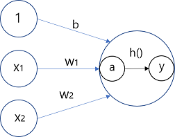

## [밑바닥부터 시작하는 딥러닝]
---
### 목차
- [3.1 퍼셉트론에서 신경망으로](https://github.com/minchan5224/TIL/blob/main/Python/Deep_Learning/01/Deep_01_02.md#21-%ED%8D%BC%EC%85%89%ED%8A%B8%EB%A1%A0%EC%9D%B4%EB%9E%80)
---
#### 2021_03_06
#### CHAPTER3_신경망
---
> #### 3.1 퍼셉트론에서 신경망으로
> #### 3.1.1 신경망의 예
>> 신경망을 그림을 나타내면 아래 그림과 같다.
>> 
>> 
>> 
>> 은닉층의 뉴런은 입력층이나 출력증과 달리 사람의 눈에 보이지 않는다.(책에서는 왼쪽부터 0층 1층 2층)
>> 
>> 지금까지 본 퍼셉트론과 크게 달라 보이지 않는다.(3층으로 구성되지만 가중치를 갖는 층은 2개뿐이라 2층 신경망이라 한다.
>> 
>> 앞에서 살펴본 [퍼셉트론](https://github.com/minchan5224/TIL/blob/main/Python/Deep_Learning/Deep_01_02.md#21-%ED%8D%BC%EC%85%89%ED%8A%B8%EB%A1%A0%EC%9D%B4%EB%9E%80)엔 편향이 없다.
>> 
>> 해당 네트워크에 편향을 명시하면 아래 그림과 같다.
>> 
>> 
>> 
>> 가중치가 b이고 입력인 1인 뉴런이 추가 되었다. 
>> 
>> 해당 퍼셉트론의 동작은 x1,x2,1이라는 3개의 신호가 뉴런에 입력되어 각 신호에 가중치를 곱한 후 다음 뉴런에 전달한다.
>> 
>> 다음 뉴런에서는 이 신호들의 값을 더해 합이 0을 넘으면 1을 출력하고 그렇지 않으면 0을 출력한다.
>> 
>> 해당 뉴런을 식으로 표현하면 다음과 같다. 
>> 
>> 
>> 
>> 1번 식은 입력 신호의 총 합이 h(x)라는 함수를 거쳐 변환되며, 그 변환된 값이 y의 출력이 됨을 보여준다.
>> 
>> 2번 식 h(x)함수는 입력이 0을 넘으면 1을 돌려주고 아니라면 0을 반환한다. 결과적으로 두 식은 같다.
>
> #### 3.1.3 활성화 함수의 등장
>> 바로전 h(x)라는 함수를 처음 봤다. 이와같이 입력 신호의 총합을 출력 신호로 변환하는 함수를 일반적으로 **활성화** **함수** 라고한다.
>> 
>> 활성화 라는 이름에서 알 수 있듯 활성화 함수는 입력 신호의 총합이 활성화를 일이키는지 정하는 역할을 한다. 위에서 사용했던 식을 아래와 같이 새로 작성했다.
>> 
>> 
>> 
>> 1번 식은 가중치가 달린 입력 신호와 편향의 총합을 계산하고 a라고 한다.
>> 
>> 2번 식은 a를 함수 h()에 넣어 출력하는 흐름이다.
>> 
>> 지금까지와 같이 뉴런을 원을 이용해 그리면 위 식은 아래 그림과 같이 나타낼 수 있다.
>> 
>> 
>> 
>> 그림과 같이 기존 뉴런의 원을 키우고 그 안에 활성화 함수의 처리과정을 명시적으로 그려 넣었다.
>> 
>> 즉 가중치 신호를 조합한 결과가 a라는 노드가 되고, 활성화 함수h()를 통과하여 y라는 노드로 변환되는 과정을 분명히 나타낸 것이다.
>> - 이 책에서는 노드 == 뉴런
> 
> #### 3.1 활성화 함수
> 활성화 함수는 임계값을 경계로 출력이 바뀐다. 이러한 함수를 **계단** **함수**라 한다.
> 그래서 퍼셉트론에서는 활성화 함수로 계단 함수를 이용한다 라고 할 수 있다.
> - 활성화 함수를 계단 함수에서 다른 함수로 변경하는 것이 신경망의 세계로 나아가는 열쇠라고 한다.
> 
> #### 3.2.1 시그모이드 함수
>> 시그모이드 함수는 신경망에서 자주 이용하는 활성화 함수이다.
>> 
>> 
>> 
>> 위 식은 시그모이드 함수의 식이며 exp(-x)는 e^(-x)를 뜻한다.
>> - 식만 본다면 어려워 보이지만 단순한 '함수'다. 입력을 주면 출력을 반환한다.
>> 
> #### 3.2.2 계단 함수 구현하기
> 파이썬을 이용해 계단 함tn를 그려본다.
> ```Python
> def step_function(x):
>     if x > 0:
>         return 1
>     else :
>         return 0
> ```
>  - 계단 함수는 입력이 0을 넘으면 1을 출력하고 그 외에는 전부 0을 출력하는 함수다.
> 위 코드는 구현하기 간단하지만 인수 x는 실수(부동소수점)만 받아들인다.
> 
> (3.0)은 가능하지만 넘파이 배열(np.array([1.0, 2.0]))을 인수로 넘길 수 없다. 
> 
> 넘파이 배열도 사용하기 위해선 아래와 같이 수정 한다.
> ```Python
> def step_function(x):
>     y = x > 0
>     return y.astype(np.int)
> ```
> 두 줄인 코드로 충분하다. 넘파이 배열에 부등호 연산을 수행하면 배열의 원소 각각에 부등호 연산을 수행한 bool배열이 생성된다.
> 
> 이 코드에선 0보다 클때 True를 반환한다. 따라서 True, False로 변환한 배열이 생성된다. [False, True, True]
> 
> 그 후 bool형 데이터를 int형으로 변환하면 False는 0, True는 1로 변환됨을 알 수 있다.  [0, 1, 1]
> 
> #### 3.2.3 계단 함수의 그래프
> 파이썬의 matplotlib라이브러리를 이용해서 그래프를 그린다.
> ```Python
> import numpy as np
> import matplotlib.pylab as plt
> 
> def step_function(x):
>     return np.array(x > 0, dtype=np.int)
> x = np.arange(-5.0, 5.0, 0.1) # -5.0~5.0 전까지 0.1 간격의 넘파이 배열 생성 [-5.0, -4.0,~,4.9]
> y = step_function(x)
> plt.plot(x, y)
> plt.plot(-0.1, 1.1) # y축 범위 지정
> plt.show()
> ```
> 해당 코드의 실행 결과는 아래 그림과 같다.
>> 
> 
> 그림과 같이 계단 함수는 0을 경계로 출력이 1과 0으로 나뉜다.
> 
> #### 3.2.4 시그모이드 함수 구현하기
> 이번엔 시그모이드 함수를 파이썬을 이용해 구현한다.
> ```Python
> def sigmoid(x):
>     return 1 / (1 + np.exp(-x)) # np.exp(-x)는 exp(-x)수식에 해당한다.
> ```
> x = np.array([-1.0, 1.0, 2.0]) 일때 sigmoid(x)를 한다면 넘파이의 브로드캐스트로 인해 정확하게 동작한다.
> - 브로드캐스트 : 넘파이 배열과 스칼라값의 연산을 넘파이 배열의 원소 각각과 스칼라 값의 연산으로 바꿔 수행하는 것
> 
> 아래 코드를 이용해 시그모이드 함수의 그래프를 그린다.
> ```Python
> def sigmoid(x):
>     return 1 / (1 + np.exp(-x)) 
>
> x = np.arange(-5.0, 5.0, 0.1)
> y = sigmoid(x)
> plt.plot(x, y)
> plt.plot(-0.1, 1.1) # y축 범위 지정
> plt.show()
> ```
> 해당 코드의 실행 결과는 아래 그림과 같다.
>
> 
> 
> #### 3.2.4 시그모이드 함수와 계단 함수 비교
> 
> 
> 
> 같이보니 확실한 차이가 보인다. 곡선과 직선의 차이라고 할 수 있는것 같다.
> 
> 시그모이드의 매끈함이 신경망 학습에서 아주 중요한 역할을 하게 된다고 한다.
> 
> 계단함수는 1과 0만 돌려주는 것에 비해 시그모이드 함수는 실수를 포함해 돌려주는 차이가 있다.
> 
> 또한 입력이 커지면 1에 가까운 혹은 1을 출력하는 점( 입력이 중요하면 큰 값을 출력하고 중요하지 않다면 작은 값을 출력한다)과 출력은 0과 1 사이라는 점이 둘의 공통점 이다.
> 
> #### 3.2.6 비선형 함수
> 계단 함수와 시그모이드 함수 모두 **비선형** **함수**이다.
> 
> 신경망에서는 활성화 함수로 비선형 함수를 사용해야 한다.
> - 선형 함수를 사용하면 신경망의 층을 깊게하는 이유가 없어지기 때문이다.
>> 선형 함수로 층을 아무리 깊게 해도 **은닉층이** **없는** **네트워크**로 똑같은 기능을 할 수 있기 때문이다.
>> 
>> h(x) = cx를 활성화 함수로 사용한 3층 네트워크를 예로 들었을 때 
>> 
>> 식으로 나타낸다면 y(x) = h(h(h(x)))이다. 이 계산은 y(x) = c * c * c * x 와 같이 곱셈을 세번 수행하지만 
>> 
>> y(x) = ax와 같은 식이다, a=c^3이라고 하면 되기 때문. 즉 은닉층이 없는 네트워크로 표현이 가능하다.
>> 
>> 따라서 층을 쌓는 혜택을 얻기 위해선 활성화 함수로 비선형 함수를 사용해야한다.
> 
> #### 3.2.7 ReLU 함수
> 최근에는 활성화 함수로 ReLU함수를 주로 이용한다.
> 
> 
> 
> [ReLU 함수](https://ko.wikipedia.org/wiki/ReLU)는 그림과 같이 입력이 0을 넘으면 그대로 출력하고 0 이하면 0을 출력한다. 식은 아래와 같다.
> 
> 
> 
> 그림과 식을 보듯이 간단한 함수이며 파이썬으로 구현한다면 코드는 아래와 같다.
> ```Python
> def relu(x):
>     return np.maximum(0, x)
> ```
> 해당 코드에서는 넘파이의 maximum()을 사용하며 두 입력중 큰 값을 선택해 반환하는 함수다.
> 
> 따라서 0보다 작을 땐 정상적으로 0, 0일때도 0을 출력한다 0보다 클때만 x를 출력한다.
> 
---
#### 2021_03_06~10
> #### 3.3 다차원 배열의 계산 
> 3.3.1 다차원 배열
> ```Python
> B = np.array([[1,2], [3,4], [5,6]]) # 행렬 생성
> print(B)
> [[1 2]
>  [3 4]
>  [5 6]]
>  
> np.ndim(B) # 배열의 차원수 확인
> 2
>  
> B.shape # 배열의 형상 확인(3X2배열)
> (3, 2)
> ```
> 기본적으로 행렬의 가로는 행 세로를 열이라고 한다 (행거는 가로 열) 
> 
> 행렬의 곱 계산 방법은 아래 그림과 같다.
> 
> 
> 
> ```Python
> A = np.array([[1,2], [3,4]])
> B = np.array([[5,6], [7,8]])
> np.dot(A, B) # 행렬의 곱 계산
> 
> array([[19, 22], # 결과
>        [43, 50]])
> ```
> 위와같이 np.dot()함수를 이용해 행렬의 곱을 계산 가능하다.
> - np.dot()는 입력이 1차원 배열이면 벡터를 2차원 배열이면 행렬의 곱을 계산한다.
> 
> - 또한 행렬의 곱 연산 특성상 A와 B의 순서가 바뀌면 결과 또한 바뀐다.
> 
> 
> 
> 
> 
> 위의 그림과 같이 행렬의 곱을 계산할 때는 대응하는 차원의 원소 수를 일치시켜야한다.
> 
> 행렬의 차원이 다르더라도 대응하는 차원의 원소수를 칠치시켜 곱을 한다.
> 
> 아래쪽 그림을 파이썬으로 구현하면 다음과 같다.
> ```Python
> A = np.array([[1,2], [3,4], [5,6]]) # A.shape -> (3,2)
> B = np.array([7,8]) # B.shape -> (2,)
> 
> np.dot(A,B) # array([23, 53, 83])
> ```
---
> #### 3.3.3 신경망에서의 행렬 곱
> 
> 
> 위 그림처럼 간단한 신경망을 가정해본다, 해당 신경망은 편향과 활성화 함수를 생략하고 가중치만 갖는 신경망이다.
> 
> 위 그림을 넘파이를 이용해 구현한다. 이 구현에서도 X,W,Y의 형상을 주의해서 봐야한다.
> 
> 특히 X와 W의 대응하는 차원의 원소 수가 같아햐 한다는 점이 가장 중요하다.
> ```Python
> X = np.array([1,2]) # X.shape -> (2,)
> W = np.array([[1,3,5],[2,4,6]]) # W.shape -> (2,3)
> Y = np.dot(X,W)
> print(Y) # [ 5 11 17]
> ```
> np.dot()연산은 다차원 배열의 스칼라 곱을 구해준다. 위 코드에서 np.dot()를 사용하였기 때문에 Y의 원소가 몇개든 상관없이 한번의 연산으로 계산이 가능하다.
> 
> np.dot()을 안쓸거면 반복문을 사용해야한다.. 그래서 np.dot()이 중요하다.
> 
> ---
> #### 3.4 3층 신경망 구현하기
> 이번엔 아래 그림과 같은 3층 신경망을 구현할 것이다.
> 
> 
> 
> 위 그림의 신경망은 맨 왼쪽부터 입력층(0층)은 2개, 첫번째 은닉층(1층, 회색)은 3개, 두번째 은닉층(2층, 갈색)은 2개, 출력층(3층)은 2개의 뉴런으로 구성된다.
> 
> #### 3.4.1 표기법 설명
> 표기법을 간단히 설명하고 넘어간다.
> 
> 
> 
> 위 그림과 같이 가중치와 은닉층 뉴런의 오른쪽 위에'(1)'이 붙어 있다.
> - 1층의 가중치, 1층의 뉴런임을 뜻하는 번호다.
>
> 가중치의 오른쪽 아래의 두 숫자
> - 차례로 다음층 뉴런과 앞 층 뉴런의 인덱스 번호다. 위의 예시에선 앞층의 두번째 뉴런에서 다음층의 1번째 뉴런으로 향할 때의 가중치 라는 뜻
> - 가중치 오른쪽 아래의 인덱스 번호는 반드시'다음 층 번호, 앞 층 번호' 순으로 적는다.
> 
> #### 3.4.2 각 층의 신호 전달 구현하기
> 일단 입력층에서 '1층의 첫 번째 뉴런'으로 가는 신호를 살펴본다.
> 
> 
> 
> 위 그림에서 편향을 뜻하는 뉴런인 ①이 추가 되었다.
> - 편향은 오른쪽 아래 인덱스가 하나밖에 없다. 앞층의 편향뉴런(뉴런 ①)이 하나뿐이라.
> 
> 지금까지 확인한 것을 바탕으로 수식으로 나타낸다.
> 
> 
>
> 이제 넘파이의 다차원 배열을 이용해 위 그림의 식을 구현한다
> - 단 입력신호, 가중치, 편향은 적당한 값으로 설정한다. 
> 
> - 그림에서 맨 처음 식의 두번째 w의 아래 인덱스는 '**1 1**'이 아닌 '**1 2**'이다. 또한 같은 위치의 x의 인덱스도 '**1**'이 아닌 '**2**'다.
> ```Python
> X = np.array([1.0, 0.5]) # X.shape -> (2, )
> W1 = np.array([[0.1, 0.3, 0.5], [0.2, 0.4, 0.6]])# W1.shape -> (2,3)
> B1 = np.array([0.1, 0.2, 0.3])# B1.shape ->(3,)
> 
> A1 = np.dot(X, W1) + B1
> ```
> 위 계산은 앞에서 한 계산과 같다. W1은 2x3행렬, X는 원소가 2개인 1차원 배열이다. 여기서도 마찬가지로 W1과 X의 대응하는 차원의 원소수를 일치 시킨다.
> 
> 1층의 활성화 함수에서 처리를 살펴보면 아래 그림과 같다.
>
> 
> 
> 은닉층에서 가중치의 합(가중 신호와 편향의 총합)을 a로 표기하고 활성화 함수 h()로 변환된 신호를 z로 표기한다.
> 
> 여기서는 활성화 함수로 시그모이드 함수를 사용하며 파이썬으로 구현하면 다음과 같다.
> ```Python
> Z1 = sigmoid(A1)
> 
> print(A1) # [0.3, 0.7, 1.1]
> print(Z1) # [0.57444252, 0.66818777, 0.75026011]
> ```
> 이 sigmoid()함수는 앞에서 정의 했던 함수다. 해당 함수의 넘파이 배열을 받아 같은 수의 원소로 구성된 넘파이 배열을 반환한다.
> 
> 아래는 1층에서 2층으로 가는 과정을 그림으로 표현한 것이다.
> 
> 
> 
> 위 그림과 같이 파이썬을 이용해 구현을 하면 아래 코드와 같이 할 수 있다.
> ```Python
> W2 = np.array([[0.1, 0.4], [0.2, 0.5], [0.3, 0.6]])# W2.shape -> (3,2)
> B2 = np.array([0.1, 0.2]) # B2.shape ->(2,)
> 
> A2 = np.dot(Z1, W2) + B2 # Z1은 바로 위에서 활성화 함수(시그모이드)를 통과한 것이다.
> Z2 = sigmoid(A2)
> ```
> 이제 마지막으로 2층에서 출력층으로 신호 전달을 살펴본다. 과정은 아래 그림과 같다.
> 
> 
> 
> 위 그림을 파이썬을 이용해 구현하면 아래와 같다.
> ```Python
> def identify_function(x):
>     return x
> 
> W3 = np.array([[0.1, 0.3], [0.2, 0.4]])# W3.shape -> (2,2)
> B3 = np.array([0.1, 0.2]) # B3.shape ->(2,)
> 
> A3 = np.dot(Z2, W3) + B3
> Y = identify_function(A3) # 혹은 Y = A3
> ```
> 여기서는 [항등 함수인](https://ko.wikipedia.org/wiki/%ED%95%AD%EB%93%B1_%ED%95%A8%EC%88%98) identify_function()을 정의하고 이를 출력층의 활성화 함수로 이용했다.
> - 항등 함수는 입력을 그대로 출력하는 함수다.
> 
> 책에서는 굳이 identify_function()를 정의할 필요는 없지만 그동안의 흐름과 통일하기 위해 정의하였다고 한다.
> 
> 또한 위의 그림에서 출력층의 활성화 함수를 σ()로 표시하여 은닉층의 활성화 함수 h()와는 다름을 명시 하였다.(σ는 시그마)
> 
> 3.4.3 구현정리 부분은 책을 보고 확인하자 p.89
---
> #### 3.5 출력층 설계하기
