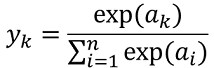
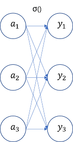
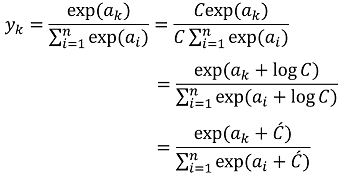
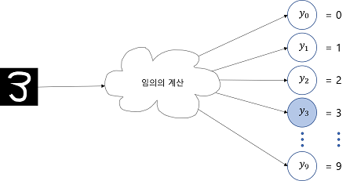
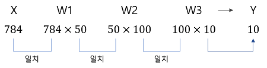
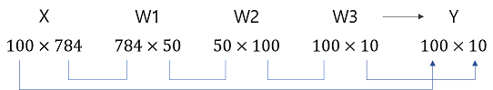

## [밑바닥부터 시작하는 딥러닝]
---
### 목차 
- [3.1 퍼셉트론에서 신경망으로](https://github.com/minchan5224/TIL/blob/main/Python/Deep_Learning/01/Deep_01_02.md#21-%ED%8D%BC%EC%85%89%ED%8A%B8%EB%A1%A0%EC%9D%B4%EB%9E%80)
- [3.2 활성화 함수](https://github.com/minchan5224/TIL/blob/main/Python/Deep_Learning/Deep_01_03.md#32-%ED%99%9C%EC%84%B1%ED%99%94-%ED%95%A8%EC%88%98)
- [3.3 다차원 배열의 계산](https://github.com/minchan5224/TIL/blob/main/Python/Deep_Learning/Deep_01_03.md#33-%EB%8B%A4%EC%B0%A8%EC%9B%90-%EB%B0%B0%EC%97%B4%EC%9D%98-%EA%B3%84%EC%82%B0)
- [3.4 3층 신경망 구현하기](https://github.com/minchan5224/TIL/blob/main/Python/Deep_Learning/Deep_01_03.md#34-3%EC%B8%B5-%EC%8B%A0%EA%B2%BD%EB%A7%9D-%EA%B5%AC%ED%98%84%ED%95%98%EA%B8%B0)
- [3.5 출력층 설계하기](https://github.com/minchan5224/TIL/blob/main/Python/Deep_Learning/Deep_01_03.md#35-%EC%B6%9C%EB%A0%A5%EC%B8%B5-%EC%84%A4%EA%B3%84%ED%95%98%EA%B8%B0)
- [3.6 손글씨 숫자 인식](https://github.com/minchan5224/TIL/blob/main/Python/Deep_Learning/Deep_01_03.md#36-%EC%86%90%EA%B8%80%EC%94%A8-%EC%88%AB%EC%9E%90-%EC%9D%B8%EC%8B%9D)
---
#### 2021_03_06
#### CHAPTER3_신경망
---
> #### 3.1 퍼셉트론에서 신경망으로
> #### 3.1.1 신경망의 예
>> 신경망을 그림을 나타내면 아래 그림과 같다.
>> 
>> 
>> 
>> 은닉층의 뉴런은 입력층이나 출력증과 달리 사람의 눈에 보이지 않는다.(책에서는 왼쪽부터 0층 1층 2층)
>> 
>> 지금까지 본 퍼셉트론과 크게 달라 보이지 않는다.(3층으로 구성되지만 가중치를 갖는 층은 2개뿐이라 2층 신경망이라 한다.
>> 
>> 앞에서 살펴본 [퍼셉트론](https://github.com/minchan5224/TIL/blob/main/Python/Deep_Learning/Deep_01_02.md#21-%ED%8D%BC%EC%85%89%ED%8A%B8%EB%A1%A0%EC%9D%B4%EB%9E%80)엔 편향이 없다.
>> 
>> 해당 네트워크에 편향을 명시하면 아래 그림과 같다.
>> 
>> 
>> 
>> 가중치가 b이고 입력인 1인 뉴런이 추가 되었다. 
>> 
>> 해당 퍼셉트론의 동작은 x1,x2,1이라는 3개의 신호가 뉴런에 입력되어 각 신호에 가중치를 곱한 후 다음 뉴런에 전달한다.
>> 
>> 다음 뉴런에서는 이 신호들의 값을 더해 합이 0을 넘으면 1을 출력하고 그렇지 않으면 0을 출력한다.
>> 
>> 해당 뉴런을 식으로 표현하면 다음과 같다. 
>> 
>> 
>> 
>> 1번 식은 입력 신호의 총 합이 h(x)라는 함수를 거쳐 변환되며, 그 변환된 값이 y의 출력이 됨을 보여준다.
>> 
>> 2번 식 h(x)함수는 입력이 0을 넘으면 1을 돌려주고 아니라면 0을 반환한다. 결과적으로 두 식은 같다.
>
> #### 3.1.3 활성화 함수의 등장
>> 바로전 h(x)라는 함수를 처음 봤다. 이와같이 입력 신호의 총합을 출력 신호로 변환하는 함수를 일반적으로 **활성화** **함수** 라고한다.
>> 
>> 활성화 라는 이름에서 알 수 있듯 활성화 함수는 입력 신호의 총합이 활성화를 일이키는지 정하는 역할을 한다. 위에서 사용했던 식을 아래와 같이 새로 작성했다.
>> 
>> 
>> 
>> 1번 식은 가중치가 달린 입력 신호와 편향의 총합을 계산하고 a라고 한다.
>> 
>> 2번 식은 a를 함수 h()에 넣어 출력하는 흐름이다.
>> 
>> 지금까지와 같이 뉴런을 원을 이용해 그리면 위 식은 아래 그림과 같이 나타낼 수 있다.
>> 
>> 
>> 
>> 그림과 같이 기존 뉴런의 원을 키우고 그 안에 활성화 함수의 처리과정을 명시적으로 그려 넣었다.
>> 
>> 즉 가중치 신호를 조합한 결과가 a라는 노드가 되고, 활성화 함수h()를 통과하여 y라는 노드로 변환되는 과정을 분명히 나타낸 것이다.
>> - 이 책에서는 노드 == 뉴런
> 
> #### 3.2 활성화 함수
> 활성화 함수는 임계값을 경계로 출력이 바뀐다. 이러한 함수를 **계단** **함수**라 한다.
> 그래서 퍼셉트론에서는 활성화 함수로 계단 함수를 이용한다 라고 할 수 있다.
> - 활성화 함수를 계단 함수에서 다른 함수로 변경하는 것이 신경망의 세계로 나아가는 열쇠라고 한다.
> 
> #### 3.2.1 시그모이드 함수
>> 시그모이드 함수는 신경망에서 자주 이용하는 활성화 함수이다.
>> 
>> 
>> 
>> 위 식은 시그모이드 함수의 식이며 exp(-x)는 e^(-x)를 뜻한다.
>> - 식만 본다면 어려워 보이지만 단순한 '함수'다. 입력을 주면 출력을 반환한다.
>> 
> #### 3.2.2 계단 함수 구현하기
> 파이썬을 이용해 계단 함tn를 그려본다.
> ```Python
> def step_function(x):
>     if x > 0:
>         return 1
>     else :
>         return 0
> ```
>  - 계단 함수는 입력이 0을 넘으면 1을 출력하고 그 외에는 전부 0을 출력하는 함수다.
> 위 코드는 구현하기 간단하지만 인수 x는 실수(부동소수점)만 받아들인다.
> 
> (3.0)은 가능하지만 넘파이 배열(np.array([1.0, 2.0]))을 인수로 넘길 수 없다. 
> 
> 넘파이 배열도 사용하기 위해선 아래와 같이 수정 한다.
> ```Python
> def step_function(x):
>     y = x > 0
>     return y.astype(np.int)
> ```
> 두 줄인 코드로 충분하다. 넘파이 배열에 부등호 연산을 수행하면 배열의 원소 각각에 부등호 연산을 수행한 bool배열이 생성된다.
> 
> 이 코드에선 0보다 클때 True를 반환한다. 따라서 True, False로 변환한 배열이 생성된다. [False, True, True]
> 
> 그 후 bool형 데이터를 int형으로 변환하면 False는 0, True는 1로 변환됨을 알 수 있다.  [0, 1, 1]
> 
> #### 3.2.3 계단 함수의 그래프
> 파이썬의 matplotlib라이브러리를 이용해서 그래프를 그린다.
> ```Python
> import numpy as np
> import matplotlib.pylab as plt
> 
> def step_function(x):
>     return np.array(x > 0, dtype=np.int)
> x = np.arange(-5.0, 5.0, 0.1) # -5.0~5.0 전까지 0.1 간격의 넘파이 배열 생성 [-5.0, -4.0,~,4.9]
> y = step_function(x)
> plt.plot(x, y)
> plt.plot(-0.1, 1.1) # y축 범위 지정
> plt.show()
> ```
> 해당 코드의 실행 결과는 아래 그림과 같다.
>> 
> 
> 그림과 같이 계단 함수는 0을 경계로 출력이 1과 0으로 나뉜다.
> 
> #### 3.2.4 시그모이드 함수 구현하기
> 이번엔 시그모이드 함수를 파이썬을 이용해 구현한다.
> ```Python
> def sigmoid(x):
>     return 1 / (1 + np.exp(-x)) # np.exp(-x)는 exp(-x)수식에 해당한다.
> ```
> x = np.array([-1.0, 1.0, 2.0]) 일때 sigmoid(x)를 한다면 넘파이의 브로드캐스트로 인해 정확하게 동작한다.
> - 브로드캐스트 : 넘파이 배열과 스칼라값의 연산을 넘파이 배열의 원소 각각과 스칼라 값의 연산으로 바꿔 수행하는 것
> 
> 아래 코드를 이용해 시그모이드 함수의 그래프를 그린다.
> ```Python
> def sigmoid(x):
>     return 1 / (1 + np.exp(-x)) 
>
> x = np.arange(-5.0, 5.0, 0.1)
> y = sigmoid(x)
> plt.plot(x, y)
> plt.plot(-0.1, 1.1) # y축 범위 지정
> plt.show()
> ```
> 해당 코드의 실행 결과는 아래 그림과 같다.
>
> 
> 
> #### 3.2.4 시그모이드 함수와 계단 함수 비교
> 
> 
> 
> 같이보니 확실한 차이가 보인다. 곡선과 직선의 차이라고 할 수 있는것 같다.
> 
> 시그모이드의 매끈함이 신경망 학습에서 아주 중요한 역할을 하게 된다고 한다.
> 
> 계단함수는 1과 0만 돌려주는 것에 비해 시그모이드 함수는 실수를 포함해 돌려주는 차이가 있다.
> 
> 또한 입력이 커지면 1에 가까운 혹은 1을 출력하는 점( 입력이 중요하면 큰 값을 출력하고 중요하지 않다면 작은 값을 출력한다)과 출력은 0과 1 사이라는 점이 둘의 공통점 이다.
> 
> #### 3.2.6 비선형 함수
> 계단 함수와 시그모이드 함수 모두 **비선형** **함수**이다.
> 
> 신경망에서는 활성화 함수로 비선형 함수를 사용해야 한다.
> - 선형 함수를 사용하면 신경망의 층을 깊게하는 이유가 없어지기 때문이다.
>> 선형 함수로 층을 아무리 깊게 해도 **은닉층이** **없는** **네트워크**로 똑같은 기능을 할 수 있기 때문이다.
>> 
>> h(x) = cx를 활성화 함수로 사용한 3층 네트워크를 예로 들었을 때 
>> 
>> 식으로 나타낸다면 y(x) = h(h(h(x)))이다. 이 계산은 y(x) = c * c * c * x 와 같이 곱셈을 세번 수행하지만 
>> 
>> y(x) = ax와 같은 식이다, a=c^3이라고 하면 되기 때문. 즉 은닉층이 없는 네트워크로 표현이 가능하다.
>> 
>> 따라서 층을 쌓는 혜택을 얻기 위해선 활성화 함수로 비선형 함수를 사용해야한다.
> 
> #### 3.2.7 ReLU 함수
> 최근에는 활성화 함수로 ReLU함수를 주로 이용한다.
> 
> 
> 
> [ReLU 함수](https://ko.wikipedia.org/wiki/ReLU)는 그림과 같이 입력이 0을 넘으면 그대로 출력하고 0 이하면 0을 출력한다. 식은 아래와 같다.
> 
> 
> 
> 그림과 식을 보듯이 간단한 함수이며 파이썬으로 구현한다면 코드는 아래와 같다.
> ```Python
> def relu(x):
>     return np.maximum(0, x)
> ```
> 해당 코드에서는 넘파이의 maximum()을 사용하며 두 입력중 큰 값을 선택해 반환하는 함수다.
> 
> 따라서 0보다 작을 땐 정상적으로 0, 0일때도 0을 출력한다 0보다 클때만 x를 출력한다.
> 
---
#### 2021_03_06~16
> #### 3.3 다차원 배열의 계산 
> 3.3.1 다차원 배열
> ```Python
> B = np.array([[1,2], [3,4], [5,6]]) # 행렬 생성
> print(B)
> [[1 2]
>  [3 4]
>  [5 6]]
>  
> np.ndim(B) # 배열의 차원수 확인
> 2
>  
> B.shape # 배열의 형상 확인(3X2배열)
> (3, 2)
> ```
> 기본적으로 행렬의 가로는 행 세로를 열이라고 한다 (행거는 가로 열) 
> 
> 행렬의 곱 계산 방법은 아래 그림과 같다.
> 
> 
> 
> ```Python
> A = np.array([[1,2], [3,4]])
> B = np.array([[5,6], [7,8]])
> np.dot(A, B) # 행렬의 곱 계산
> 
> array([[19, 22], # 결과
>        [43, 50]])
> ```
> 위와같이 np.dot()함수를 이용해 행렬의 곱을 계산 가능하다.
> - np.dot()는 입력이 1차원 배열이면 벡터를 2차원 배열이면 행렬의 곱을 계산한다.
> 
> - 또한 행렬의 곱 연산 특성상 A와 B의 순서가 바뀌면 결과 또한 바뀐다.
> 
> 
> 
> 
> 
> 위의 그림과 같이 행렬의 곱을 계산할 때는 대응하는 차원의 원소 수를 일치시켜야한다.
> 
> 행렬의 차원이 다르더라도 대응하는 차원의 원소수를 칠치시켜 곱을 한다.
> 
> 아래쪽 그림을 파이썬으로 구현하면 다음과 같다.
> ```Python
> A = np.array([[1,2], [3,4], [5,6]]) # A.shape -> (3,2)
> B = np.array([7,8]) # B.shape -> (2,)
> 
> np.dot(A,B) # array([23, 53, 83])
> ```
---
> #### 3.3.3 신경망에서의 행렬 곱
> 
> 
> 위 그림처럼 간단한 신경망을 가정해본다, 해당 신경망은 편향과 활성화 함수를 생략하고 가중치만 갖는 신경망이다.
> 
> 위 그림을 넘파이를 이용해 구현한다. 이 구현에서도 X,W,Y의 형상을 주의해서 봐야한다.
> 
> 특히 X와 W의 대응하는 차원의 원소 수가 같아햐 한다는 점이 가장 중요하다.
> ```Python
> X = np.array([1,2]) # X.shape -> (2,)
> W = np.array([[1,3,5],[2,4,6]]) # W.shape -> (2,3)
> Y = np.dot(X,W)
> print(Y) # [ 5 11 17]
> ```
> np.dot()연산은 다차원 배열의 스칼라 곱을 구해준다. 위 코드에서 np.dot()를 사용하였기 때문에 Y의 원소가 몇개든 상관없이 한번의 연산으로 계산이 가능하다.
> 
> np.dot()을 안쓸거면 반복문을 사용해야한다.. 그래서 np.dot()이 중요하다.
> 
> ---
> #### 3.4 3층 신경망 구현하기
> 이번엔 아래 그림과 같은 3층 신경망을 구현할 것이다.
> 
> 
> 
> 위 그림의 신경망은 맨 왼쪽부터 입력층(0층)은 2개, 첫번째 은닉층(1층, 회색)은 3개, 두번째 은닉층(2층, 갈색)은 2개, 출력층(3층)은 2개의 뉴런으로 구성된다.
> 
> #### 3.4.1 표기법 설명
> 표기법을 간단히 설명하고 넘어간다.
> 
> 
> 
> 위 그림과 같이 가중치와 은닉층 뉴런의 오른쪽 위에'(1)'이 붙어 있다.
> - 1층의 가중치, 1층의 뉴런임을 뜻하는 번호다.
>
> 가중치의 오른쪽 아래의 두 숫자
> - 차례로 다음층 뉴런과 앞 층 뉴런의 인덱스 번호다. 위의 예시에선 앞층의 두번째 뉴런에서 다음층의 1번째 뉴런으로 향할 때의 가중치 라는 뜻
> - 가중치 오른쪽 아래의 인덱스 번호는 반드시'다음 층 번호, 앞 층 번호' 순으로 적는다.
> 
> #### 3.4.2 각 층의 신호 전달 구현하기
> 일단 입력층에서 '1층의 첫 번째 뉴런'으로 가는 신호를 살펴본다.
> 
> 
> 
> 위 그림에서 편향을 뜻하는 뉴런인 ①이 추가 되었다.
> - 편향은 오른쪽 아래 인덱스가 하나밖에 없다. 앞층의 편향뉴런(뉴런 ①)이 하나뿐이라.
> 
> 지금까지 확인한 것을 바탕으로 수식으로 나타낸다.
> 
> 
>
> 이제 넘파이의 다차원 배열을 이용해 위 그림의 식을 구현한다
> - 단 입력신호, 가중치, 편향은 적당한 값으로 설정한다. 
> 
> - 그림에서 맨 처음 식의 두번째 w의 아래 인덱스는 '**1 1**'이 아닌 '**1 2**'이다. 또한 같은 위치의 x의 인덱스도 '**1**'이 아닌 '**2**'다.
> ```Python
> X = np.array([1.0, 0.5]) # X.shape -> (2, )
> W1 = np.array([[0.1, 0.3, 0.5], [0.2, 0.4, 0.6]])# W1.shape -> (2,3)
> B1 = np.array([0.1, 0.2, 0.3])# B1.shape ->(3,)
> 
> A1 = np.dot(X, W1) + B1
> ```
> 위 계산은 앞에서 한 계산과 같다. W1은 2x3행렬, X는 원소가 2개인 1차원 배열이다. 여기서도 마찬가지로 W1과 X의 대응하는 차원의 원소수를 일치 시킨다.
> 
> 1층의 활성화 함수에서 처리를 살펴보면 아래 그림과 같다.
>
> 
> 
> 은닉층에서 가중치의 합(가중 신호와 편향의 총합)을 a로 표기하고 활성화 함수 h()로 변환된 신호를 z로 표기한다.
> 
> 여기서는 활성화 함수로 시그모이드 함수를 사용하며 파이썬으로 구현하면 다음과 같다.
> ```Python
> Z1 = sigmoid(A1)
> 
> print(A1) # [0.3, 0.7, 1.1]
> print(Z1) # [0.57444252, 0.66818777, 0.75026011]
> ```
> 이 sigmoid()함수는 앞에서 정의 했던 함수다. 해당 함수의 넘파이 배열을 받아 같은 수의 원소로 구성된 넘파이 배열을 반환한다.
> 
> 아래는 1층에서 2층으로 가는 과정을 그림으로 표현한 것이다.
> 
> 
> 
> 위 그림과 같이 파이썬을 이용해 구현을 하면 아래 코드와 같이 할 수 있다.
> ```Python
> W2 = np.array([[0.1, 0.4], [0.2, 0.5], [0.3, 0.6]])# W2.shape -> (3,2)
> B2 = np.array([0.1, 0.2]) # B2.shape ->(2,)
> 
> A2 = np.dot(Z1, W2) + B2 # Z1은 바로 위에서 활성화 함수(시그모이드)를 통과한 것이다.
> Z2 = sigmoid(A2)
> ```
> 이제 마지막으로 2층에서 출력층으로 신호 전달을 살펴본다. 과정은 아래 그림과 같다.
> 
> 
> 
> 위 그림을 파이썬을 이용해 구현하면 아래와 같다.
> ```Python
> def identify_function(x):
>     return x
> 
> W3 = np.array([[0.1, 0.3], [0.2, 0.4]])# W3.shape -> (2,2)
> B3 = np.array([0.1, 0.2]) # B3.shape ->(2,)
> 
> A3 = np.dot(Z2, W3) + B3
> Y = identify_function(A3) # 혹은 Y = A3
> ```
> 여기서는 [항등 함수인](https://ko.wikipedia.org/wiki/%ED%95%AD%EB%93%B1_%ED%95%A8%EC%88%98) identify_function()을 정의하고 이를 출력층의 활성화 함수로 이용했다.
> - 항등 함수는 입력을 그대로 출력하는 함수다.
> 
> 책에서는 굳이 identify_function()를 정의할 필요는 없지만 그동안의 흐름과 통일하기 위해 정의하였다고 한다.
> 
> 또한 위의 그림에서 출력층의 활성화 함수를 σ()로 표시하여 은닉층의 활성화 함수 h()와는 다름을 명시 하였다.(σ는 시그마)
> 
> 3.4.3 구현정리 부분은 책을 보고 확인하자 p.89
---
> #### 3.5 출력층 설계하기
> 신경망은 분류와 회귀 모두에 이용이 가능하다, 둘 중 어떤 문제냐에 따라 출력층에서 사용하는 활성화 함수가 달라질 뿐이다.
> - 일반적으로 회귀에는 항등 함수를, 분류에는 소프트맥스 함수를 사용한다.
> 
> #### 3.5.1 항등 함수와 소프트맥스 함수 구현하기
>  항등 함수는 입력을 그대로 출력한다(입력 = 출력), 항등 함수에 의한 변환은 은닉층에서 활성화 함수와 마찬가지로 화살표로 그린다.
>  
> 분류에서 사용하는 소프트맥스 함수의 식은 아래와 같다.
> 
> 
> 
> exp(x)는 e^x를 뜻하는 지수함수, n은 출력층의 뉴런 수, Yk는 그중 k번째 출력임을 표현, 소프트맥스 함수의 분자는 입력신호 ak의 지수함수, 분모는 모든 입력 신호의 지수 함수의 합으로 구성
> 
> 소프트맥스 함수를 그림으로 나타내면 아래 그림과 같다.
> 
> 
> 
> 또한 파이썬 코드로 구현을 하면 아래와 같다.
> ```Python
> def softmax(a):
> 
>     exp_a = np.exp(a)
>     sum_exp_a = np.sum(exp_a)
>     y = exp_a / sum_exp_a
>     
>     return y
> ```
> 
> #### 3.5.2 소프트맥스 함수 구현 시 주의점
> 앞에서 구현한 소프트맥스 함수의 코드는 컴퓨터로 계산할 때 오버플로 문제가 있다.
> 
> 소프트맥스 함수는 지수 함수를 사용한다. 지수 함수는 매우 큰 값을 사용하는 경우가 많다. e^10은 20,000이 넘으며 e^100은 0이 40개 이상인 큰값이며 e^1000은 무한대를 뜻하는 inf가 반환된다.
> 
> 이러한 큰 값인 문제도 있지만 큰 값을 나눗셈하면 결과 수치가 불안정 해지는 문제가 발생한다.
> 
> 해당 문제를 해결하기 위해 수식을 개선한다.
> 
> 
> 
> 첫 변형에서 C라는 임의의 정수를 분자와 분모 양쪽에 곱한다, 다음으로 C를 지수 함수 안으로 옮겨 logC로 만든다. 마지막으로 logC를 C'라는 새로운 기호로 바꾼다.
> 
> 위의 식이 말하는 것은 소프트맥수의 지수 함수를 계산할 때 어떤 정수를 더하거나 빼더라도 결과는 바뀌지 않는다는 것이다.
> 
> C'에 어떤 값을 대입해도 상관없지만 오버플로를 막는 목적으로 사용하기 위해선 입력 신호중 최댓값을 이용하는것이 일반적이다.
> 
> ```Python
> a = np.array([1010, 1000, 990])
> print(np.exp(a) / np.sum(np.exp(a))) # array([nan, nan, nan])
>  
> c = np.max(a)
> new_a = a - c # array([0, -10, -20])
> 
> print(np.exp(new_a) / np.sum(np.exp(new_a))) # array([9.99954600e-01, 4.53978686e-05, 2.06106005e-09])
> ```
> 위의 예시처럼 아무 조치 없이 계산하면 nan이 출력된다. 하지만 입력 신호중 최댓값을 빼주면 정확히 계산이 가능하다. 예시와 같이 소프트맥스 함수를 다시 구현하면 아래와 같다.
> ```Python
> def softmax(a):
>     c = np.max(a)
>     exp_a = np.exp(a - c)
>     sum_exp_a = np.sum(exp_a)
>     y = exp_a / sum_exp_a
>     
>     return y
> ```
> 
> #### 3.5.3 소프트맥스 함수의 특징
> softmax()함수를 사용하면 신경망의 출력은 다음과 같이 계산할 수 있다.
> ```Python
> a = np.array([0.3, 2.9, 4.0])
> y = softmax(a)
> print(y) # [ 0.01821127 0.24519181 0.73659691])
> np.sum(y) # 1.0
> ```
> 위에서 보듯 소프트맥스 함수의 출력은 0에서 1.0 사이의 실수다 또한 소프트맥스 함수 출력의 총 합은 1이다.
> - 출력의 합이 1인 것은 소프트맥스 함수의 중요한 성질이다. 이 성질을 통해 소프트맥스 함수의 출력을 **확률**로 해석할 수 있다.
> 
> 위의 예에서 y[0]의 확률은 0.018(1.8%), y[2]의 확률은 0.245(24.5%), y[2]의 확률은 0.736(73.7%)로 해석할 수 있다. 
> 
> 또한 이 결과 확률들로부터 "2번째 원소의 확률이 가장 높으므로 답은 2번 째 클래스다"라고 할 수 있다.
> - 다르게는 "74%확률로 2번째 클래스, 25%확률로 1번째 클래스, 1%확률로 0번째 클래스다" 와 같은 확률적인 결론도 도출할 수 있다.
> 
> 즉 소프트맥스 함수를 이용함으로 문제를 확률적(통계적)으로 대응할 수 있게 되는 것이다.
> 
> 주의할점은 소프트맥스 함수를 적용해도 각 원소의 대소 관계는 변하지 않는다는 점이다. 
> - 지수 함수 y = exp(x)가 [단조 증가 함수](https://www.scienceall.com/%EB%8B%A8%EC%A1%B0%EC%A6%9D%EA%B0%80monotone-increasing/)이기 때문이다. 실제로 앞의 예시에선 a의 원소들 사이의 대소 관계가 y의 원소들 사이의 대소 관계로 이어진다.
> 
> 신경망을 이용한 분류에서는 일반적으로 가장 큰 출력을 내는 뉴런에 해당하는클래스로만 인식한다. 
> 
> 그리고 소프트맥스 함수를 적용해도 출력이 가장 큰 뉴런의 위치는 달라지지 않는다.
> 
> 결과적으로 신경망으로 분류할 때는 출력층의 소프트맥스 함수를 생략해도 된다.
> - 책에서는 현업에서도 지수 함수 계산에 드는 자원 낭비를 줄이고자 출력층의 소프트맥스 함수는 생략하는것이 일반적이라고 한다.
> 
> #### 3.5.4 출력층의 뉴런 수 정하기
> 출력층의 뉴런 수는 풀려는 문제에 맞게 적절히 정해야한다.
> 
> 분류에서는 분류하고 싶은 클래스 수로 설정하는 것이 일반적이다
> - 입력 이미지를 숫자 0부터 9중 하나로 분류하는 문제라면 아래 그림처럼 출력층의 뉴런을 10개로 설정한다.
> 
> 
> 
> 각 뉴런은 차례로 숫자 0~9에 대응하며 뉴런의 파란색 농도가 해당 뉴런의 출력 값의 크기를 의미한다.
> 
> 위의 예시에선 색이 가장 진한 Y3뉴런이 가장 큰 값을 출력하는 것이다. 따라서 이 신경망이 선택한 클래스는 Y3클래스며 입력 이미지를 숫자 3으로 판단했음을 의미한다.
> ---
> #### 3.6 손글씨 숫자 인식
> 이번에 사용할 데이터셋은 MNIST라는 손글씨 숫자 이미지 집합이다. (출판사의 자료실에서 다운받을 수 있다.)
> 
> 0~9의 숫자 이미지로 구성되며 훈련이미지는 6만, 시험 이미지는 1만장 준비 되어있다.
> 
> MNIST의 이미지 데이터는 28 X 28 크기의 회색조 이미지(1채널, 흑백)이며, 각 픽셀은 0에서 255까지의 값을 가진다.
> 
> 각 이미지에는 '7', '2', '1'과 같이 해당 이미지가 실제로 의미하는 숫자가 레이블로 붙어있다.
> 
> 이 책에서 제공하는 데이터셋을 다운받아 이미지를 넘파이 배열로 변환하는 파이썬 스크립트를 사용한다.
> ```Python
> import sys, os
> sys.path.append(os.pardir) # 부모 디렉터리의 파일을 가져올 수 있도록
> from dataset.mnist import load_mnist # 책에서 제공하는 파이썬 스크립트.
> 
> (x_train, t_train), (x_test, t_test) = load_mnist(flatten=True, normalize=False) # 훈련이미지와 시험이미지를 분배.
> 
> print(x_train.shape) # (60000,784)
> print(t_train.shape) # (60000,)
> print(x_test.shape) # (10000,784)
> print(t_test.shape) # (10000,)
> ```
> 위 코드가 실행될때 첫번재 실행에는 인터넷 연결이 필수다. 웹에서 MNIST데이터 셋을 읽어와야 하기 때문이다.
> 
> 만약 이 과정에서 오류가 발생한다면 출판사 자료실에 있는 github로 들어가서 다운받으면 된다.
> 
> 두 번째부터는 로컬에 저장된 pickle파일을 읽기때문에 빠르게 끝난다.
> - 첫 번째 실행시 pickle파일이 생성된다. pickle는 프로그램 실행중 특정 객체를 파일로 저장하는 기능이며 이 기능을 통해 실행 당시의 객체를 즉시 복원 가능하다.
> 
> load_mnist()함수를 통해 읽은 MNIST데이터를 "(훈련 이미지, 훈련 레이블), (시험 이미지, 시험 레이블)"형식으로 반환한다.
> 
> 인수로는 normalize, flatten, one_hot_label 세 가지를 설정할 수 있다
> - 세 인수 모두 bool값이다.
> 
> - normalize는 입력 이미지의 픽셀 값을 0.0 ↔ 1.0 사이의 값으로 정규화할지 결정한다. False로 설적하면 원래 값(0 ↔ 255)으로 유지한다.
> 
> - flatten는 입력 이미지를 평탄하게, 즉 1차원 배열로 만들지 결정한다. False로 설정하면 입력 이미지를 1 X 28 X 28의 3차원 배열로, True로 설정하면 784개의 원소로 이루어진 1차원 배열로 저장한다.
> 
> - one_hot_label은 레이블을 원-핫 인코딩 형태로 저장할지 결정한다. 정답을 뜻하는 원소만 1이고 나머지는 전부 0인 배열이다. False면 '7'이나 '2'와 같이 숫자 형태의 레이블을 지정하고 True면 레이블을 원-핫 인코딩하여 저장한다.
> 
> ```Python
> import sys, os
> sys.path.append(os.pardir)
> import numpy as np
> from dataset.mnist import load_mnist
> from PIL import Image
>
> def img_show(img):
>     pil_img = Image.fromarray(np.uint8(img))
>     pil_img.show()
> 
> (x_train, t_train), (x_test, t_test) = load_mnist(flatten=True, normalize=False)
> 
> img = x_train[0]
> label = t_train[0]
> print(label)  # 5
> 
> print(img.shape)  # (784,)
> img = img.reshape(28, 28)  # 형상을 원래 이미지의 크기로 변형
> print(img.shape)  # (28, 28)
> 
> img_show(img)
> ```
> flatten=True로 설정해 읽어 들인 이미지는 1차원 넘파이 배열로 저장되었으므로 reshape()매서드를 이용해 원하는 형상을 인수로 지정하여 넘파이 배열의 형상을 바꿔 사용한다.
> 
> 넘파이로 저장된 이미지 데이터를 PIL용 데이터 객체로 변환해야 하며 Image.fromarray()가 해당 변환을 수행한다.
> 
> #### 3.6.2 신경망의 추론 처리
> MNIST데이터 셋을 이용해 추론을 수행하는 신경망을 구현한다.
> 
> 해당 신경망은 입력층 뉴런을 784개, 출력층 뉴런을 10개로 구성한다.
> - 입력층 뉴런이 784개 => 이미지 크기가 28 X 28 = 784, 출력층 뉴련이 10개 => 0~9까지 숫자 구분
> 
> 은닉층은 2개
> - 첫 번째 은닉층에 50개의 뉴런, 두번째 은닉층에 100개의 뉴런을 배치 (50과 100은 임의로 정한 값이다)
> 
> 순서대로 작업을 처리할 get_data(), init_network(), predict()를 정의한다.
> ```Python
> import sys, os
> sys.path.append(os.pardir)
> import numpy as np
> import pickle
> from dataset.mnist import load_mnist
> from common.functions import sigmoid, softmax
> 
> def get_data():
>     (x_train, t_train), (x_test, t_test) = load_mnist(normalize=True, flatten=True, one_hot_label=False)
>     return x_test, t_test
> 
> def init_network():
>     with open("sample_weight.pkl", 'rb') as f:
>         network = pickle.load(f)
>     return network
> 
> def predict(network, x):
>     W1, W2, W3 = network['W1'], network['W2'], network['W3']
>     b1, b2, b3 = network['b1'], network['b2'], network['b3']
> 
>     a1 = np.dot(x, W1) + b1
>     z1 = sigmoid(a1)
>     a2 = np.dot(z1, W2) + b2
>     z2 = sigmoid(a2)
>     a3 = np.dot(z2, W3) + b3
>     y = softmax(a3)
> 
>     return y
> 
> x, t = get_data()
> network = init_network()
> accuracy_cnt = 0
> for i in range(len(x)):
>     y = predict(network, x[i])
>     p= np.argmax(y) # 확률이 가장 높은 원소의 인덱스 획득
>     if p == t[i]:
>         accuracy_cnt += 1
> 
> print("Accuracy:" + str(float(accuracy_cnt) / len(x)))
> ```
> init_network()는 pickel파일인 sample_weight.pkl에 저장된 '학습된 가중치 매개변수'를 익는다.
> - 이 파일엔 가중치와 편향 매개변수가 딕셔너리 변수로 저장되어 있다.
> 
> get_data()는 MNIST데이터 셋을 읽고 predict()는 신경망의 작업을 수행한다.
> 
> 전체적인 과정은 MNIST데이터셋을 얻고 네트워크를 생성한다
> 
> for문을 돌며 x에 저장된 이미지 데이터를 1장씩 꺼내 predict() 함수로 분류한다
> - predict()함수는 각 레이블의 확률을 넘파이 배열로 반환한다. ([0.1, 0.3, 0.2, ... 0.04]같은 배열이 반환되며 '0'일 확률이 0.1, '1'일 확률이 0.3과 같이 해석한다.)
> 
> np,argmax()함수로 배열에서 가장 큰 값의 인덱스를 얻는다. 이것이 예측결과다. 
> 
> 마지막으로 신경망이 예측한 답변과 정답 레이블을 비교하여 맞힌 숫자(accuracy_cnt)를 세고 전체 이미지 숫자로 나누어 정확도를 구한다.
> 
> 위 코드를 실행하면 "Accuracy:0.9352" 가 출력된다 이는 정확도가 93.52%라는 뜻이다.
> 
> 또한 위 코드에선 ```load_mnist()함수의 인수인 normalize를 True로 설정했다.``` 이는 각 픽셀의 값(0~255)을 0.0~1.0의 범위로 변환한다(단순하게 픽셀의 값을 255로 나눈다)는 뜻이다.
> 
> 이와같이 데이터를 특정 범위로 변환하는 처리를 **정규화**라고 하며 신경망의 입력 데이터에 특정 변환을 가하는 것을 **전처리**라고한다.
> - 여기선 입력 이미지 데이터에 대한 전처리 작업으로 정규화를 수행한 것이다.
> 
> #### 3.6.3 배치 처리
> ```Python
> x, _ = get_data()
> network = init_network()
> W1, W2, W3 = network['W1'], network['W2'], network['W3']
> 
> x.shape # (10000, 784)
> x[0].shape # (784,)
> W1.shape # (784,50)
> W2.shape # (50, 100)
> W3.shape # (100, 10)
> ```
> 위의 결과에서 다차원 배열의 대응하는 차원의 원소 수가 일치함을 확인할 수 있다.(편향 생략)
>
> 그림으로는 아래 그림과 같으며. 최종 결과로는 원소가 10개인 1차원 배열 y가 출력되는 것도 확인 했다.
> 
> 
> 
> 위 그림을 전체적으로 보면 원소 784개로 구성된 1차원 배열(원래는 28X28인 2차원 배열이다)이 입력되어 마지막에는 원소가 10개인 1차원 배열이 출력되는 흐름이며 이미지 데이터 1장을 입력했을 때의 처리 흐름이다.
> 
> 이미지 여러장을 한번에 입력하는 경우는 x의 형상을 n X 784로 바꾸어 표현하면 된다.(아래 그림에선 n = 100)
> 
> 
> 
> 위 그림과 같이 입력 데이터의 형상은 100 X 784, 출력 데이터의 형상은 100 X 10이 된다.
> - 이는 100장 분량의 입력 데이터의 결과가 한 번에 출력됨을 나타낸다.
> 
> - x[0], y[0]엔 0번재 이미지와 그 추론 결과, x[n], y[n]엔 n번째 이미지와 그 결과가 저장되는 방식이다.
> 
> 이와같이 하나로 묶은 입력 데이터를 **배치**라고 한다
> - 배치가 곧 묶음이란 의미다.
>
> 위의 코드를 수정해 배치 처리를 구현한다.
> ```Python
> x, t = get_data()
> network = init_network()
> 
> batch_size = 100 # 배치 크기, 
> accuracy_cnt = 0
> 
> for i in range(0, len(x), batch_size): # 배치 처리 구현으로 인해 수정함.
>     x_batch = x[i:i+batch_size]
>     y_batch = predict(network, x_batch)
>     p = np.argmax(y_batch, axis=1)
>     accuracy_cnt += np.sum(p == t[i:i+batch_size])
> 
> print("Accuracy:" + str(float(accuracy_cnt) / len(x)))
> ```
> batch_size가 추가된 점과 for문의 수정만 이루어 졌다.
> 
> for문의 조건에서 range부분은 0부터 x의 길이 -1 까지 batch_size단위로 증가함을 의미하며 이는
> 
> x_batch = x[i:i+batch_size]가 x[0:100], x[100:200] 와 같이 사용된다는 뜻이다.
> 
> np.argmax(y_batch, axis=1)에서 axis=1는 100 X 10의 배열중 1번째 차원을 구성하는 각 원소에서(1번재 차원을 축으로) 최댓값의 인덱스를 찾도록 하는 것이다.
> - 아래의 예시와 같이 동작한다.
>> ```Python
>> x = np.array([[0.1, 0.8, 0.1], [0.3, 0.1, 0.6], [0.2, 0.5, 0.3], [0.8, 0.1, 0.1]])
>> y = np.argmax(x, axis=1)
>> print(y) # [1 2 1 0], 각 배열에서 가장 큰 원소의 인덱스
>> ```
> 마지막으로 배치 단위로 분류한 결과를 실제 답과 비교한다. 이를 위해 ==연산자를 사용해 넘파이 배결끼리 비교하여 bool배열을 생성하고 
> 
> 이 결과 배열에서 True가 몇개인지 센다. 아래는 예시다.
> ```Python
> y = np.array([1, 2, 1, 0])
> t = np.array([1, 2, 0, 0])
> print(y==t) # [True True False True]
> np.sum(y==t) # 3
> ```
> 이와같이 데이터를 배치로 처리하여 효율적이면서 빠르게 처리가 가능하다.
> 
> 3장 끝..
> 
> 04/21
