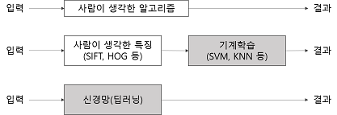
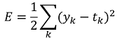
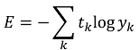

## [밑바닥부터 시작하는 딥러닝]
---
### 목차
- [4.1 제목](https://github.com/minchan5224/TIL/blob/main/Python/Deep_Learning/01/Deep_01_02.md#21-%ED%8D%BC%EC%85%89%ED%8A%B8%EB%A1%A0%EC%9D%B4%EB%9E%80)
- [4.2 손실 함수](https://github.com/minchan5224/TIL/blob/main/Python/Deep_Learning/01/Deep_01_02.md#21-%ED%8D%BC%EC%85%89%ED%8A%B8%EB%A1%A0%EC%9D%B4%EB%9E%80)
---
#### 2021_3_18~
#### CHAPTER4_신경망 학습
##### 2021_3_18
---
> #### 4.1 데이터에서 학습한다.
> 신경망의 특징은 데이터를 보고 학습할 수 있다는 점이다.
> 
> 데이터에서 학습한다는 것은 **가중치** **매개변수의** **값을** **데이터를** **보고** **자동으로** **결정한다**는 뜻이다.
> - 실제 신경망에서 매개변수는 수천에서 수만개다. 층을 깊게한 딥러닝의 경우는 수억개다. 자동으로 결정한다니 희소식이다.
> 
> [퍼셉트론 수렴 정리](https://nbviewer.jupyter.org/github/metamath1/ml-simple-works/blob/master/perceptron/perceptron.ipynb)
> 
> #### 4.1.1 데이터 주도 학습
> 기계학습은 데이터가 생명이다
> - 데이터가 없으면 아무것도 시작되지 않기때문이다.
> 
> - 데이터가 이끄는 접근 방식 덕에 사람 중심 접근에서 벗어날 수 있다.
> 
> 보통은 문제를 해결할 때, 특히 어떤 패턴을 찾아야 할 때는 사람이 주도하는것이 대부분이지만 기계학습에선 사람의 개입을 최소화하고 수집한 데이터로부터 패턴을 찾으려 시도한다.
> 
> 또한 신경망과 딥러닝은 기존 기계학습에서 사용하던 방법보다 사람의 개입을 더욱 배제할 수 있게 해주는 중요한 특성을 지녔다.
> - 이미지에서 **특징**을 추출하고 그 특징의 패턴을 기계학습 기술로 학습하는 방법이 있다.
> 
> - 여기서 말하는 **특징**은 입력 데이터(이미지)에서 본질적인 데이터를 정확하게 추출할 수 있도록 설계된 변환기를 가리킨다.
>> 이미지의 특징은 보톡 벡터로 기술하고, 컴퓨터 비전 분야에서는 [SIFT](https://ballentain.tistory.com/47), [SURF](https://hello-stella.tistory.com/23), [HOG](http://blog.naver.com/PostView.nhn?blogId=tommybee&logNo=221173056260&parentCategoryNo=&categoryNo=57&viewDate=&isShowPopularPosts=true&from=search) 등의 특징을 많이 사룔한다.
>> 
>> 이런 특징을 사용해 이미지 데이터를 벡터로 변환하고 변환된 벡터를 가지고 지도 학습의 대표 분류 기법인 [SVM](https://ko.wikipedia.org/wiki/%EC%84%9C%ED%8F%AC%ED%8A%B8_%EB%B2%A1%ED%84%B0_%EB%A8%B8%EC%8B%A0), [KNN](https://ko.wikipedia.org/wiki/K-%EC%B5%9C%EA%B7%BC%EC%A0%91_%EC%9D%B4%EC%9B%83_%EC%95%8C%EA%B3%A0%EB%A6%AC%EC%A6%98) 등으로 학습할 수 있다.
>
> 이와 같이 기계학습에선 모아진 데이터로부터 규칙을 찾아내는 역할을 기계가 담당한다.
> 
> 다만 이미지를 벡터로 변환할 때 사용하는 특징은 여전히 사람이 만든다. 
> 
> 좋은 결과를 얻기 위해선 문제에 적합한 특징을 잘 정해서 사용해야 한다는 것이다. 
> 
> 
> - 회색 블록은 사람이 개입하지 않는 것을 뜻함
> 
> 위 그림과 같이 신경망은 이미지를 있는 그래로 학습한다.
> 
> 두 번째 접근방식(특징, 기계학습 방식) 에서는 특징을 사람이 설계했지만 신경망은 이미지에 포함된 중요한 특징까지도 '기계'가 스스로 학습할 것이다.
> - 딥러닝을 **종단간** **기계학습**이라고도 한다, 종단간은 처음부터 끝까지를 의미하며 데이터 입력에서 부터 목표로한 결과 출력 까지를 사람의 개입 없이 진행한다는 뜻을 가진다.
> 
> 신경망의 이점은 모든 문제를 같은 맥락에서 풀 수 있다는 점에 있다.
> - 세부사항과 관계없이 신경망은 주어진 데이터를 온전히 학습하고, 주어진 문제의 패턴을 발견하려 시도한다. 즉, 신경망은 모든 문제를 주어진 데이터 그대로 입력 데이터로 활용해 'end-to-end'로 학습할 수 있다
> 
> #### 4.1.2 훈련 데이터와 시험 데이터
> 기계학습 문제는 데이터를 **훈련 데이터**와 **시험 데이터**로 나누어 학습과 실험을 수행하는 것이 일반적이다.
> 
> 우선 훈련 데이터만 이용해 학습하며 최적의 매개변수를 찾는다. 그 다음 시험 데이터를 이용해 앞서 훈련한 모델의 실력을 평가한다.
> 
> 범용적으로 사용할 수 있는 모델을 원하기 때문에 데이터를 훈련과 시험으로 나누어 사용한다.
>> 범용 능력은 아직 보지 못한 데이터(훈련 데이터에 포함되지 않는 데이터)로도 문제를 올바르게 풀어내는 능력이다.
>> 
>> 또한 범용 능력을 획득하는 것이 기계학습의 최종 목표다.
>> 
>> 데이터셋 하나로만 매개변수의 학습과 평가를 수행하면 올바른 평가가 될 수 없다
>> - 훈련 데이터와 시험 데이터가 같다면 해당 데이터에 포함된 자료들만 학습한 것이다. 제대로된 평가를 할 수 없다.(다른 데이터셋에서 엉망일 가능성이 생긴다)
>> 
>> 또한 하나의 데이터셋에만 지나치게 최적화된 상태를 **오버피팅**이라 하며 오버피팅을 피하는 것은 기계학습의 중요한 과제이기도 하다.
>
> #### 4.2 손실 함수
> 신경망에서는 '하나의 지표'를 기준으로 최적의 매개변수 값을 탐색한다.
> 
> 신경망 학습에서 사용하는 지표는 **손실 함수** 라고 하며, 손실 함수는 임의의 함수를 사용할 수도 있지만 일반적으로는 오차제곱합과 교차 엔트로피 오차를 사용한다.
> 
> #### 4.2.1 오차제곱합
>  
> 
> 위 식은 오차제곱합의 수식이다.
> 
> 여기서 Yk는 신경망의 출력(신경망이 추정한 값), Tk는 정답 레이블, k는 데이터의 차원 수를 나타낸다.
> 
> ```Python
> y = [ 0.1, 0.05, 0.6, 0.0, 0.05, 0.1, 0.0, 0.1, 0.0, 0.0]
> t = [ 0, 0, 1, 0, 0, 0, 0, 0, 0, 0]
> ```
> 위 배열들의 원소는 첫 번째 인덱스부터 순서대로 0~9일 때의 값이다.
> 
> 여기서 신경망의 출력 y는 소프트맥스 함수의 출력이다. 소프트맥스 함수의 출력은 확률로 해석이 가능하다(전체 합이 1이다.)
> 
> 위의 예에선 2번 인덱스이 값이 0.6 즉 2일 확률이 60%라고 해석 할 수 있다
> 
> 또한 정답 레이블인 t는 정답을 기리키는 원소는 1, 나머지는 0으로 표시한다(one_hot_label), 2에 해당하는 인덱스에 있는 원소의 값이 1이므로 정답이 2인 것을 알 수 있다.
> 
> 위 과정은 오차제곱합을 구하기 위해 복습한 것이다
> 
> 오차제곱합은 바로 위의 그림의 식과 같이 각 원소의 출력(추정 값)과 정답 에이블(참 값)의 차(Yk-Tk)를 제곱한 후 그 총합을 구한다.
> ```Python
> def sum_squares_error(y, t):
>     return 0.5 * np.sum((y-t)**2)
> ```
> 위 코드는 파이썬을 이용해 오차제곱합을 구현한 것이다.
> 
> 여기서 인수 y와 t는 넘파이 배열바로 사용해 본다.
> ```Python
> t = [ 0, 0, 1, 0, 0, 0, 0, 0, 0, 0] # 정답 2
> y = [ 0.1, 0.05, 0.6, 0.0, 0.05, 0.1, 0.0, 0.1, 0.0, 0.0] # 2의 확률이 가장 높게 추정하였다.
> 
> sum_squares_error(np.array(y), np.array(t)) # 0.097500000000000031
> 
> y = [ 0.1, 0.05, 0.1, 0.0, 0.05, 0.1, 0.0, 0.6, 0.0, 0.0]# 7의 확률이 가장 높게 추정하였다.
> sum_squares_error(np.array(y), np.array(t)) # 0.59750000000000003
> ```
> 두가지 예시를 봤다 첫 번째 예시는 정답과 신경망 출력이 모두 2에서 가장 높은 경우다.
> 
> 두 번째 예시는 정답은 마찬가지로 2이지만 신경망 출력이 7에서 가장 높을 때다.
> 
> 첫 번째 예의 손실 함수 쪽 출력이 작그며 정답 레이블과의 오차 또한 작은 것을 알 수 있다. 즉 오차제곱합 기준으로는 첫 번째 추정 결과가(오차가 더 작으므로) 정답에 가까울 것으로 판단할 수 있다.
> 
---
##### 2021_3_19
---
> #### 4.2.2 교차 엔트로피 오차
>  
> 위 식은 교차 엔트로피 오차의 식이다.
> 
> 여기서log는 밑이 e인 자연로그이다. Yk는 신경망의 출력. Tk는 정답 레이블(원-핫 인코딩된)이다.
> 
> 그래서 위 식은 실질적으로 정답일 때의 추정(Tk가 1일때의 Yk)의 자연로그를 계산하는 식이 된다.(정답이 아닌 나머지는 모두 0이기 때문에 곱하여도 0이되거 결과에 영향을 주지 않는다.)
> 
> 위 그림은 자연로그의 그래프다
> 
> 그림에서 보듯 x가 1일 때 y는 0, x가 0에 가까워질수록 y의 값은 점점 작아진다.
> 
> 위에서 본 식 또한 정답에 해당하는 출력이 커질수록 0에 다가가다 해당 출력이 1일때 0이 된다. 반대로 정답일 때의 출력이 작아질수록 오차가 커진다.
> 
> ```Python
> def cross_entropy_error(y, t)
>     delta = 1e-7
>     return -np.sum(t * np.log(y + delta))
> ```
> 위 식은 교차 엔트로피 오차를 코드로 구현한 것이다. 여기서 y와 t는 넘파이 배열이다.
> 
> 코드 마지막 부분을 보면 np.log계산할 때 아주 작은 값인 delta를 더했다. 이는 np.log()함수에 0을 입력하면 마이너스 무한대를 뜻하는 -inf가 되어 더이상 계산이 불가능 하기 때문이다.
> - 아주 작은 값을 더해 절대로 0이 되지 않도록 => 마이너스 무한대 발생 방지
> 
> 이제 위의 코드를 테스트 해본다.
> ```Python
> t = [ 0, 0, 1, 0, 0, 0, 0, 0, 0, 0] # 정답 2
> y = [ 0.1, 0.05, 0.6, 0.0, 0.05, 0.1, 0.0, 0.1, 0.0, 0.0]
> cross_entropy_error(np.array(y), np.array(t)) # 0.51082545709933802
> 
> y = [0.1, 0.05, 0.1, 0.0, 0.05, 0.1, 0.0, 0.6, 0.0, 0.0]
> cross_entropy_error(np.array(y), np.array(t)) # 2.3025840929945458
> ```
> 첫 번째 예시는 정답일 때의 출력이 0.6 인 경우로 이때의 교차 엔트로피 오차는 약 0.51이다.
> 
> 두 번째 예시는 정답일 때의 출력이 더 낮은(0.1)인 경우로 교차 엔트로피 오차는 2.3 으로 더 크다.
> 
> 즉 결과(오차 값)가 더 작은 첫 번째 추정이 정답일 가능성이 더 높다고 판단한 것이며 앞선 오차제곱합의 판단과 일지한다.
> 
> 4.2.3 미니배치 학습
> 지금 까지는 데이터 하나에 대한 손실 함수만 생각했지만 지금 부터는 훈련 데이터 모두에 대한 손실 함수의 합을 구하는 방법을 생각해본다.
> 
> 위 식은 교차 엔트로피 오차에 적용한 식이다.
> 
> 이때 데이터가 N개라면 t_(nk)는 n번째 데이터의 k번째 값을 의미한다.(y_(nk)는 신경망의 출력, t_(nk)는 정답 레이블이다.)
> 
> 식이 복잡해 보이지만 사실 단순히 데이터 하나에 대한 손실 함수인 교차 엔트로피 오차의 식을 N개의 데이터로 확장했을 뿐이다.
> 
> 다만 마지막에 N으로 나누어 정규화 하고 있다. N으로 나눔으로써 '평균 손실 함수'를 구하는 것이다.
> 
> 이렇게 평균을 구해 사용하면 훈련 데이터 개수와 관계없이 언제든 통일된 지표를 얻을 수 있다.
> - 훈련 데이터가 1,000개든 10,000개든 상관없이 평균 손실 함수를 구할 수 있다.
> 
> 하지만 모든 데이터를 대상으로 손실함수의 합을 구하기는 시간이 오래 걸린다.
> - 데이터의 양이 많아지기 때문.(ex. 빅데이터)
>
> 이런 경우 데이터를 일부분 추려 전체의 근사치로 이용할 수 있다.
> 
> 신경망 학습에서도 훈련 데이터로부터 일부만 골라 학습을 수행한다. 이 일부를 **미니배치**라고 한다.
> - 60,000장의 훈련 데이터 중 100장을 무작위로 뽑아 해당 100장만 사용하여 학습한다. => 미니배치 학습
> 
> ```Python
> import sys, os
> sys.path.append(os.pardir) # 부모 디렉터리의 파일을 가져올 수 있도록
> from dataset.mnist import load_mnist
> 
> (x_train, t_train), (x_test, t_test) = load_mnist(normalize=False, one_hot_label=True)
> 
> print(x_train.shape) # (60000, 784)
> print(t_train.shape) # (60000, 10) # 원-핫 인코딩했으니까 (0~9중 정답에만 1 나머지 0이니까 뒤에 10이 생긴거)
> ```
> 위 코드는 실습을 진행하기 위해 MNIST데이터 셋을 읽어오는 코드다 3장에서도 사용을 했다.
> 
> ```Python
> train_size = x_train.shape[0]
> batch_size = 10
> batch_mask = np.random.choice(train_size, batch_size)
> x_batch = x_train[batch_mask]
> t_batch = t_train[batch_mask]
> ```
> 위 코드는 batch_size에 입력한 값 만큼 무작위로 빼내는 코드다.
> 
> np.random.choice()로 지정한 범우의 수 중 무작위로 원하는 개수를 획득 할 수 있다.
> - np.random.choice(60000, 10) 은 0이상60000미만의 수 중 무작위로 10개를 획득한다.
> 
> 이제 무작위로 선택한 인덱스를 이용해 미니배치를 뽑아낼 것이다. 손실 함수 또한 미니배치로 계산한다.
> 
> #### 4.2.4 (배치용)교차 엔트로피 오차 구현하기
> 미니배치와 같은 배치 데이터를 지원하는 교차 엔트로피 오차를 구현하기 위해선 위에서 하나씩 처리하는 교차 엔트로피 오차를 구현한 것에서 아래와 같이 수정하면 된다.
> ```Python
> def cross_entropy_error(y, t)
>     if y.ndim == 1:
>         t = t.reshape(1, t.size)
>         y = y.reshape(1, y.size)
> 
>     batch_size = y.shape[0]
>     return -np.sum(t * np.log(y + 1e-7))/batch_size
> ```
> 데이터가 하나인 경우와 데이터가 배치로 묶여 입력된 경우 모두 처리 가능하도록 하였다.
> 
> y는 신경망의 출력, t는 정답 레이블이다. y가 1차원 이라면(데이터 하나당 교차 엔트로피 오차를 구하는 경우) reshape함수로 데이터의 형상을 바꿔준다.
> 
> 그리고 배치의 크기를 나눠 정규화 하고 이미지 1장당 평균 교차 엔트로피 오차를 계산한다.
> 
> 정답 레이블이 원-핫 인코딩이 아닌 '2' 또는 '7'등의 숫자 레이블로 주어졌을 때의 교차 엔트로피 오차는 아래 코드와 같이 구현할 수 있다.
> ```Python
> def cross_entropy_error(y, t)
>     if y.ndim == 1:
>         t = t.reshape(1, t.size)
>         y = y.reshape(1, y.size)
> 
>     batch_size = y.shape[0]
>     return -np.sum(np.log(y[np.arange(batch_size), t] + 1e-7)) / batch_size
> ```
> 위의 구현에서는 원-핫 인코딩일 때 t가 0인 원소는 교차 엔트로피 오차 또한 0이므로 해당 계산은 무시해도 좋다는 것이 핵심이다.
> - 정답에 해당하는 신경망의 출력만 교차 엔트로피 오차를 계산할 수 있다 그래서 원-핫 인코딩 시 ```t * np.log(y)```였던 부분을 레이블 표현일 때는 ```np.log(y[np.arange(batch_size), t]```로 구현한다.
> 
> ```np.log(y[np.arange(batch_size), t]```중 ```np.arange(batch_size)```는 0부터 batch_size-1까지의 배열을 생성한다.
> - batch_size가 5라면 [0, 1, 2, 3, 4]라는 넘파이 배열을 생성하는 것이다.
> 
> t에는 레이블이 [2, 7, 0, 9, 4]의 형식으로 저장되어 있다
> - 즉 ```np.log(y[np.arange(batch_size), t]```는 각 데이터의 정답 레이블에 해당하는 신경망의 출력을 추출한다.[y[0,2], y[1,7], y[2,0], y[3,9], y[4,4]] 인 넘파이 배열을 생성하는 것이다.
> --- 
> #### 4.2.5 왜 손실 함수를 설정하는가?
