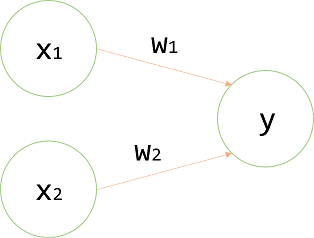

## [밑바닥부터 시작하는 딥러닝]
---
### 목차
- [3.1 제목](https://github.com/minchan5224/TIL/blob/main/Python/Deep_Learning/01/Deep_01_02.md#21-%ED%8D%BC%EC%85%89%ED%8A%B8%EB%A1%A0%EC%9D%B4%EB%9E%80)
---
#### 년_월_일
#### CHAPTER3_신경망(쳅터_쳅터명)
---
> #### 3.1 퍼셉트론이란?
>> 퍼셉트론은 다수의 신로호를 입력받아 하나의 신호로 출력한다. (**신호** = 전류, 강물처럼 **흐름**이 있는것 이라 생각하라 한다.)
>> 
>> 전류가 전선을 타고 흐르는 전자를 내보내듯이 퍼셉트론 신호도 흐름을 만들고 정보를 앞으로 전달하기 때문이다.
>> - 하지만 실제 전류와 달리 퍼셉트론 신호는 "**흐른다/안흐른다(0/1)**"의 두 가지 값을 가진다.(책에서는 "1 = 흐른다", "0 = 안흐른다"로 약속)
>> 
>> 
>>
>> 위 그림은 입력으로 2개의 신호를 받은 퍼셉트론이다.
>> 
>> x1과 x2는 입력 신호, y는 출력신호, w1과 w2는 가중치를 뜻한다(weight). 그림의 원을 **뉴런** 또는 **노드**라고 부른다.
>> 
>> 입력 신호가 뉴런에 보내질 때 각각 고유한 **가중치**가 곱해진다(w1*x1, w2*x2).
>> 
>> 뉴런에서 보낸 신호의 총합이 정해진 한계를 넘어설 때만 1을 출력한다('뉴런이 활성화 한다'라고 표현하기도 한다고함)
>>  - 이 책에선 그 한계를 **임계값**이라 하며 쎄타 기호(θ)를 사용한다.
>>  
>> 
>> 
>> 수식으로 정리하면 위의 그림과 같다.
>> 
>> 퍼셉트론은 복수의 입력 신호에 각각의 고유한 가중치를 부여한다.
>> 
>> 가중치는 각 신호가 결과에 주는 영향력을 조절하는 요소로 작용한다.
>> - 가중치가 클수록 해당 신호가 그만큼 더 중요하다는 뜻이다.
---
> #### 2.2 단순한 논리 회로
> #### 2.2.1 AND 게이트
>> ```
>> x1   x2  |  y
>> ---------------
>>  0    0  |  0
>>  1    0  |  0
>>  0    1  |  0
>>  1    1  |  1
>>  ```
>> AND게이트의 진리표는 위와 같다.
>> 
>> 두 값이 모두 1일 때에만 1을 출력한다.
>> 
>> 이 AND게이트를 퍼셉트론으로 표현하기 위해선 위의 진표대로 작동하게 하는 w1, w2, θ의 값을 정해야한다.
>> 
>> 가능한 조합은 무수히 많다.(0.5, 0.5, 0.7), (0.5, 0.5, 0.8), (1.0, 1.0, 1.0) 등등
>> 
> #### 2.2.2 NAND 게이트와 OR 게이트
>> NAND 게이트는 AND의 출력을 뒤집은 것이다.
>> ```
>> x1   x2  |  y
>> ---------------
>>  0    0  |  1
>>  1    0  |  1
>>  0    1  |  1
>>  1    1  |  0
>>  ```
>> 진리표는 위와 같으며 w1, w2, θ의 값 또한 AND게이트와 부호를 모두 반전하면 구현 할 수 있다.
>> 
>> OR게이트는 입력 신호중 하나이상이 1이면 출력도 1이 되는 논리 회로다
>> ```
>> x1   x2  |  y
>> ---------------
>>  0    0  |  0
>>  1    0  |  1
>>  0    1  |  1
>>  1    1  |  1
>>  ```
>>  진리표는 위와 같으며 w1, w2, θ의 값은 무수한 조합이 있다.
>>  
>> 여기서 가장 중요한 점은 퍼셉트론으로 AND, NAND, OR 논리 회로를 표현할 수 있다는 점과
>> 
>> 3개의 게이트에서 퍼셉트론의 구조가 모두 동일하다는 점이다.
>> 
>> 3가지 게이트에서 다른점은 매개변수(가중치와 임계값)의 값이다.
>> - 똑같은 구조의 퍼셉트론이 매개변수의 값만 적절히 조정한다면 AND, NAND, OR의 기능을 수행하는 것이다.
---
