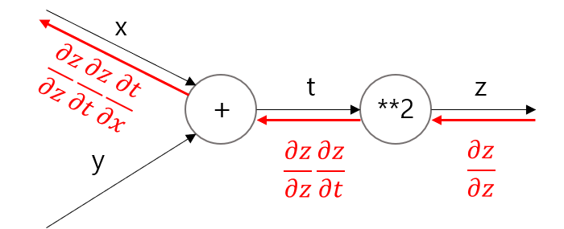

## [밑바닥부터 시작하는 딥러닝]
---
### 목차
-[]()
---
#### CHAPTER5_오차역전파법
#### 2021_4_03
---
#### 5.1 계산그래프
> 계산 그래프는 계산 과정을 그래프로 나타낸 것이다.
> 
> 그래프 자료구조로 복수의 노드와 엣지(edge, 노드사이의 직선)로 표현한다.
> 
#### 5.1.1 계산 그래프로 풀다.
> 문제 1 : 슈퍼에서 1개에 100원인 사과를 2개 샀다. 이때 지불할 금액을 구하라(소비세는 10% 부과)
> 
> 
> 
> 위와 같이 2개의 그림이 있다. 첫번째 그림은 사과의 100 원이 'x2' 노드로 흐르고 200원이 되어 다음 노드로 전달된다.
> 
> 그 다음 200원이 'x1.1'노드를 거쳐 220원이 된다. 따라서 최종 금액은 220원이 된다.
> 
> 두번째 그림은 첫번째 그림과 달리 'x'만을 연산으로 생각한다. 즉 '사과의 개수'와 '소비세'가 변수다 되어 원 밖에 표기하게 된다.
> 
> 문제 2 : 슈퍼에서 사과 2개 귤 3개 구매했다 사과는 개당 100원 귤은 150원이다. 소비세가 10%일때 지불 금액을 구하라.
> 
> 
> 
> 위 그림에선 '+'로 표기된 덧셈 노드가 새로 등장한다.
> 
> 계산그래프는 왼쪽에서 오른쪽으로 계산을 진행한다.
> 
> 따라서 결과는 715이다.
> 
> 지금까지 살펴본 바로 계산 그래프는 아래와 같은 흐름으로 진행된다.
> 
>> 1. 계산 그래프를 구성한다.
>> 
>> 2. 그래프에서 계산을 왼쪽에서 오른쪽으로 진행한다.
> 
> 여기서 2번 항목인 '그래프에서 계산을 왼쪽에서 오른쪽으로 진행한다.'인 단계를 **순전파** 라고 한다.
> - 순전파는 계산 그래프의 출발점 부터 종착점으로의 전파다.
> 
> - 순전파의 반대방향(오른쪽에서 왼쪽으로)의 전파는 **역전파** 라고하며 역전파는 미분을 계산할 때 중요한 역할을 한다.
> 
> #### 5.1.2 국소적 계산 
> 계산 그래프의 특징은 '국소적 계산'을 전파함으로써 최종 결과를 얻는다는 점에있다.
> - 국소적이란 '자신과 직접 관계된 작은 범위'라는 뜻이며 전체에서 어떤 일이 벌어지든 상관없이 자신과 관련된 정보만으로 결과를 출력할 수 있다는 것.
> 
>> 여러가지 상품을 구매할 때 사과 2개를 포함 하는 경우 여러 식품을 구매(복잡한 여러 가지 계산)하여 금액이 6,000원이 되었다.
>> 
>> 해당 금액에 사과 2개의 금액을 추가하는 계산(6000 + 200)은 6000이라는 금액이 어떤 계산을 통해 나왓는지 상관 없이 두 숫자(6000, 200)를 더하면 된다는 것이다.
>> 
>> 각 노드는 자신과 관련된 계산 이외에는 아무 신경쓸 필요가 없다.
>
> 이와같이 계산 그래프는 국소적 계산에 집중한다.
> 
> 전체 계산이 아무리 복합하더라도 각 단계에서 하는 일은 해당 노드의 국소적 계산이다.
> - 국소적 계산은 간단하지만 그 결과를 전달 함으로써 전체를 구성하는 복잡한 계산을 해낼 수 있다.
> 
> #### 5.1.3 왜 계산 그래프로 푸는가?
> 계산그래프의 이점은 국소적 계산 때문이다.
> - 전체가 아무리 복잡해도 각 노드에선 단순한 계산에 집중해 문제를 단순화 할 수 있기 때문
> 
> 또한 계산 그래프는 중간 계산 결과를 모두 보관할 수 있다.
> - ex. 사과 2개 까지 계산 했을대 금액 = 200, 소비세를 더하기 전의 금액 = 650
> 
> 계산 그래프를 사용하는 가장 큰 이유는 '**역전파를 통해 미분을 효율적으로 계산 할 수 있다**'는 점에 있다.
> 
> 
> 
> 결과만 나타낸다면 위 그림과 같이 계산 그래프 상의 역전파에 의해 미분을 구할 수 있다.
> 
> 위 그림의 빨간 선과 같이 역전파는 순전파와 반대 방향으로 흘러간다. 이 전파는 '국소적 미분'을 전달하고 그 미분 값은 화살표 아래 적는다.
>> 위 예에서 역전파는 오른쪽에서 왼쪽으로 '1 → 1.1 → 2.2' 순으로 미분 값을 전달한다.
>>
>> 이 결과로 부터 사과 가격에 대한 지불 금액의 미분 값은 2.2 라 할 수 있다.
>> 
>> 사과가 1원 오르면 최종 금액은 2.2원 오른다는 뜻(정확힌 사과 값이 아주 조금 오르면 최종 금액은 아주 작은 값의 2.2배 만큼 오른다.)
> 
> 위 예에선 사과 가격에 대한 미분만 구했지만 **소비세에 대한 지불 금액의 미분**, **사과 개수에 대한 지불 금액의 미분** 또한 같은 순서로 구할 수 있다.
> 
> 또한 중간까지 구한 미분 결과를 공유할 수 있어서 다수의 미분을 효율적으로 계산할 수 있다.
> 
> 이와같이 계산 그래프의 이점은 순전파와 역전파를 활용해 각변수의 미분을 효율적으로 구할 수 있다는 것이다.
> 
> #### 5.2 연쇄법칙
> 국소적 미분을 전달하는 원리는 **연쇄법칙**에 따른 것이다.
> 
> #### 5.2.1 계산 그래프의 역전파
> y = f(x)라는 계산의 역전파를 아래와 같이 그렸다.
> 
> 
> 
> 위 그림과 같이 역전파의 계산 절차는 신호 E에 노드의 국소적 미분을 곱한 후 다음 노드로 전달하는 것이다.
> - 여기서 말하는 국소적 미분은 순전파 때의 y = f(x)계산의 미분을 구한다는 것.(x에 대한 y의 미분)
> 
>> y = f(x) = x^2 이라면 국소적 미분 = 2x가 된다. 그리고 국소적인 미분을 상류에서 전달된 값(여기선 E)에 곱해 앞쪽 노드로 전달하는 것이다.
>
> #### 5.2.2 연쇄법칙이란?
> 연쇄법칙을 설명하기 전 합성함수 부터 시작한다.
> 
> 
> 
> 연쇄법칙은 합성 함수의 미분에 대한 성질이며 아래와 같이 정의된다.
> 
> **합성 함수의 미분은 합성 함수를 구성하는 각 함수의 미분의 곱으로 나타낼 수 있다**.
> 
> 이것이 연쇄법칙의 원리다.
> 
> 위의 식을 예로 설명한다. 
> 
> 
> 
> #### 5.2.3 연쇄법칙과 계산 그래프
> 위 연쇄법칙 계산을 계산그래프로 그려본다. 2제곱 계산을 ```**2```노드로 나타내면 아래와 같이 그릴 수 있다. **
> 
> 
>
> 위 그림과 같이 계산 그래프의 역전파는 오른쪽에서 왼족으로 신호를 전파한다. 역전파의 계산 절차에서는 노드로 들어온 입력 신호에 그 노드의 국소적 미분(편미분)을 곱한 후 다음 노드로 전달한다.
> 
> 예를들어 ```**2``` 노드에서 역전파를 본다.
> 
> 

---
