## [밑바닥부터 시작하는 딥러닝]
---
### 목차
- [5.1 계산그래프](https://github.com/minchan5224/TIL/blob/main/Python/Deep_Learning/Deep_01_05.md#51-%EA%B3%84%EC%82%B0%EA%B7%B8%EB%9E%98%ED%94%84)
- [5.2 연쇄법칙](https://github.com/minchan5224/TIL/blob/main/Python/Deep_Learning/Deep_01_05.md#52-%EC%97%B0%EC%87%84%EB%B2%95%EC%B9%99)
- [5.3 역전파](https://github.com/minchan5224/TIL/blob/main/Python/Deep_Learning/Deep_01_05.md#53-%EC%97%AD%EC%A0%84%ED%8C%8C)
- [5.4 단순한 계층 구현하기](https://github.com/minchan5224/TIL/blob/main/Python/Deep_Learning/Deep_01_05.md#54-%EB%8B%A8%EC%88%9C%ED%95%9C-%EA%B3%84%EC%B8%B5-%EA%B5%AC%ED%98%84%ED%95%98%EA%B8%B0)
- [5.5 활성화 함수 계층 구현하기](https://github.com/minchan5224/TIL/blob/main/Python/Deep_Learning/Deep_01_05.md#55-%ED%99%9C%EC%84%B1%ED%99%94-%ED%95%A8%EC%88%98-%EA%B3%84%EC%B8%B5-%EA%B5%AC%ED%98%84%ED%95%98%EA%B8%B0)
- [5.6 Affine/softmax 계층 구현하기](https://github.com/minchan5224/TIL/blob/main/Python/Deep_Learning/Deep_01_05.md#56-affinesoftmax-%EA%B3%84%EC%B8%B5-%EA%B5%AC%ED%98%84%ED%95%98%EA%B8%B0)
---
#### CHAPTER5_오차역전파법
#### 2021_4_03~
---
#### 5.1 계산그래프
> 계산 그래프는 계산 과정을 그래프로 나타낸 것이다.
> 
> 그래프 자료구조로 복수의 노드와 엣지(edge, 노드사이의 직선)로 표현한다.
> 
#### 5.1.1 계산 그래프로 풀다.
> 문제 1 : 슈퍼에서 1개에 100원인 사과를 2개 샀다. 이때 지불할 금액을 구하라(소비세는 10% 부과)
> 
> 
> 
> 위와 같이 2개의 그림이 있다. 첫번째 그림은 사과의 100 원이 'x2' 노드로 흐르고 200원이 되어 다음 노드로 전달된다.
> 
> 그 다음 200원이 'x1.1'노드를 거쳐 220원이 된다. 따라서 최종 금액은 220원이 된다.
> 
> 두번째 그림은 첫번째 그림과 달리 'x'만을 연산으로 생각한다. 즉 '사과의 개수'와 '소비세'가 변수다 되어 원 밖에 표기하게 된다.
> 
> 문제 2 : 슈퍼에서 사과 2개 귤 3개 구매했다 사과는 개당 100원 귤은 150원이다. 소비세가 10%일때 지불 금액을 구하라.
> 
> 
> 
> 위 그림에선 '+'로 표기된 덧셈 노드가 새로 등장한다.
> 
> 계산그래프는 왼쪽에서 오른쪽으로 계산을 진행한다.
> 
> 따라서 결과는 715이다.
> 
> 지금까지 살펴본 바로 계산 그래프는 아래와 같은 흐름으로 진행된다.
> 
>> 1. 계산 그래프를 구성한다.
>> 
>> 2. 그래프에서 계산을 왼쪽에서 오른쪽으로 진행한다.
> 
> 여기서 2번 항목인 '그래프에서 계산을 왼쪽에서 오른쪽으로 진행한다.'인 단계를 **순전파** 라고 한다.
> - 순전파는 계산 그래프의 출발점 부터 종착점으로의 전파다.
> 
> - 순전파의 반대방향(오른쪽에서 왼쪽으로)의 전파는 **역전파** 라고하며 역전파는 미분을 계산할 때 중요한 역할을 한다.
> 
> #### 5.1.2 국소적 계산 
> 계산 그래프의 특징은 '국소적 계산'을 전파함으로써 최종 결과를 얻는다는 점에있다.
> - 국소적이란 '자신과 직접 관계된 작은 범위'라는 뜻이며 전체에서 어떤 일이 벌어지든 상관없이 자신과 관련된 정보만으로 결과를 출력할 수 있다는 것.
> 
>> 여러가지 상품을 구매할 때 사과 2개를 포함 하는 경우 여러 식품을 구매(복잡한 여러 가지 계산)하여 금액이 6,000원이 되었다.
>> 
>> 해당 금액에 사과 2개의 금액을 추가하는 계산(6000 + 200)은 6000이라는 금액이 어떤 계산을 통해 나왓는지 상관 없이 두 숫자(6000, 200)를 더하면 된다는 것이다.
>> 
>> 각 노드는 자신과 관련된 계산 이외에는 아무 신경쓸 필요가 없다.
>
> 이와같이 계산 그래프는 국소적 계산에 집중한다.
> 
> 전체 계산이 아무리 복합하더라도 각 단계에서 하는 일은 해당 노드의 국소적 계산이다.
> - 국소적 계산은 간단하지만 그 결과를 전달 함으로써 전체를 구성하는 복잡한 계산을 해낼 수 있다.
> 
> #### 5.1.3 왜 계산 그래프로 푸는가?
> 계산그래프의 이점은 국소적 계산 때문이다.
> - 전체가 아무리 복잡해도 각 노드에선 단순한 계산에 집중해 문제를 단순화 할 수 있기 때문
> 
> 또한 계산 그래프는 중간 계산 결과를 모두 보관할 수 있다.
> - ex. 사과 2개 까지 계산 했을대 금액 = 200, 소비세를 더하기 전의 금액 = 650
> 
> 계산 그래프를 사용하는 가장 큰 이유는 '**역전파를 통해 미분을 효율적으로 계산 할 수 있다**'는 점에 있다.
> 
> 
> 
> 결과만 나타낸다면 위 그림과 같이 계산 그래프 상의 역전파에 의해 미분을 구할 수 있다.
> 
> 위 그림의 빨간 선과 같이 역전파는 순전파와 반대 방향으로 흘러간다. 이 전파는 '국소적 미분'을 전달하고 그 미분 값은 화살표 아래 적는다.
>> 위 예에서 역전파는 오른쪽에서 왼쪽으로 '1 → 1.1 → 2.2' 순으로 미분 값을 전달한다.
>>
>> 이 결과로 부터 사과 가격에 대한 지불 금액의 미분 값은 2.2 라 할 수 있다.
>> 
>> 사과가 1원 오르면 최종 금액은 2.2원 오른다는 뜻(정확힌 사과 값이 아주 조금 오르면 최종 금액은 아주 작은 값의 2.2배 만큼 오른다.)
> 
> 위 예에선 사과 가격에 대한 미분만 구했지만 **소비세에 대한 지불 금액의 미분**, **사과 개수에 대한 지불 금액의 미분** 또한 같은 순서로 구할 수 있다.
> 
> 또한 중간까지 구한 미분 결과를 공유할 수 있어서 다수의 미분을 효율적으로 계산할 수 있다.
> 
> 이와같이 계산 그래프의 이점은 순전파와 역전파를 활용해 각변수의 미분을 효율적으로 구할 수 있다는 것이다.
> 
> #### 5.2 연쇄법칙
> 국소적 미분을 전달하는 원리는 **연쇄법칙**에 따른 것이다.
> 
> #### 5.2.1 계산 그래프의 역전파
> y = f(x)라는 계산의 역전파를 아래와 같이 그렸다.
> 
> 
> 
> 위 그림과 같이 역전파의 계산 절차는 신호 E에 노드의 국소적 미분을 곱한 후 다음 노드로 전달하는 것이다.
> - 여기서 말하는 국소적 미분은 순전파 때의 y = f(x)계산의 미분을 구한다는 것.(x에 대한 y의 미분)
> 
>> y = f(x) = x^2 이라면 국소적 미분 = 2x가 된다. 그리고 국소적인 미분을 상류에서 전달된 값(여기선 E)에 곱해 앞쪽 노드로 전달하는 것이다.
>
> #### 5.2.2 연쇄법칙이란?
> 연쇄법칙을 설명하기 전 합성함수 부터 시작한다.
> 
> 
> 
> 연쇄법칙은 합성 함수의 미분에 대한 성질이며 아래와 같이 정의된다.
> 
> **합성 함수의 미분은 합성 함수를 구성하는 각 함수의 미분의 곱으로 나타낼 수 있다**.
> 
> 이것이 연쇄법칙의 원리다.
> 
> 위의 식을 예로 설명한다. 
> 
> 
> 
> #### 5.2.3 연쇄법칙과 계산 그래프
> 위 연쇄법칙 계산을 계산그래프로 그려본다. 2제곱 계산을 ```**2```노드로 나타내면 아래와 같이 그릴 수 있다. **
> 
> 
>
> 위 그림과 같이 계산 그래프의 역전파는 오른쪽에서 왼족으로 신호를 전파한다. 역전파의 계산 절차에서는 노드로 들어온 입력 신호에 그 노드의 국소적 미분(편미분)을 곱한 후 다음 노드로 전달한다.
> 
> 예를들어 ```**2``` 노드에서 역전파를 본다.
> 
> 
>
> #### 5.3 역전파
> 지금까진 계산 그래프의 역전파가 연쇄법칙에 따라 진행되는 모습을 설명했다.
> - 이제부턴 +, X등의 연산을 예로 들어 역전파의 구조를 설명한다.
>
> #### 5.3.1. 덧셈 노드의 역전파
> 여기선 z = x+y라는 식을 대항으로 역전파를 살펴본다.
> 
> z=x+y의 미분은 다음과 같이 해석적으로 계산할 수 있다.
> 
> 
> 
> 
> 
> #### 5.3.2 곱셈 노드의 역전파
> 곱셈 노드의 역전파는 z = xy라는 식을 예로 든다.
> - 이 식의 미분은 아래그림과 같다.
> 
> 
> 
> 위 식을 이용해 계산 그래프를 그리면 아래와 같이 그릴 수 있다.
> - 왼쪽 : 순전파, 오른쪽 : 역전파
> 
> 
> 
> 곱셈 노드 역전파는 상류의 값에 순전파 때의 입력 신호들을 '**서로 바꾼값**'을 곱해 하류로 보낸다.
> 
> - 서로 바꾼 값이란 위의 그림과 같이 순전파 때 x였다면 역전파 때는 y, 순전파 때 y였다면 역전파 때 x로 바꾼다는 것이다.
> 
> 10 x 5 = 50 이라는 계산을 구체적인 예로 들어 설명한다.
> - 역전파 때 상류에서 1.3 값이 흘러나온다.
> 
> 
> 
> 곱셈의 역전파는 입력 신호를 바꾼 값을 곱한다.
> - 하나는 13 하나는 6.5
> 
> 곱셈의 역전파는 덧셈의 역전파와 달리 순방향 입력 신호의 값이 필요하다.
> - 곱셈 노드를 구현할 때 순전파의 입력 신호를 변수에 저장해둔다.
> 
> #### 5.3.3 사과 쇼핑의 예
> 이 문제에선 사과의 가격, 사과의 개수, 소비세라는 세 변수 각각이 최종 금액에 어떻게 영향을 주느냐 풀어본다.
> - 사과 가격에 대한 지불 금액의 미분, 사과 개수에 대한 지불 금액의 미분, 소비세에 대한 지불 금액의 미분을 구하는 것에 해당.
> 
> 이를 계산 그래프의 역전파를 사용해 풀면 아래와 같다.
> 
> 
> 
> 위 그림을 통해 사과 가격의 미분, 사과 개수의 미분, 소비세의 미분을 구하였다.
> - 소비세와 사과 가격이 같은 양만큼 증가한다면 최종 금액에서는 소비세가 200의 크기, 사과 가격이 2,2의 크기로 영향을 준다고 해석할 수 있다.(소비세 1은 100%, 사과 가격 1은 1원)
> 
> #### 5.4 단순한 계층 구현하기
> - 신경망을 구성하는 '계층'각각을 하나의 클래스로 구현, '계층'이란 신경망의 기능 단위
> 
> 사과 쇼핑의 예를 파이썬으로 구현한다.
> - 곱셈 노드 : MulLayer , 덧셈 노드 : AddLayer
> 
> #### 5.4.1 곱셈 계층
> 모든 계층은 forward()와 backward()라는 공통의 메서드(인터페이스)를 갖도록 구현할 것이다.
> - forward()는 순전파,.backward()는 역전파를 처리
> 
> 곱셈 계층을 아래와 같이 구현한다.
> ```Python
> class MulLayer:
>     def __init__(self):
>         self.x = None
>         self.y = None
>     
>     def forward(self, x, y):
>         self.x = x
>         self.y = y
>         out = x * y
>         
>         return out
>         
>     def backward(self, dout):
>         dx = dout * self.y # x와 y스왑
>         dy = dout * self.x
>         
>         return dx, dy
> ```
> __init__()에선 인스턴스 변수인 x와 y를 초기화 한다.
> - 이 두 변수는 순전파 시의 입력 값을 유지하기 위해 사용한다.
> 
> forward()에서는 x와 y를 인수로 받고 두 값을 곱해서 반환한다.
> 
> backward()에서는 상류에서 넘어온 미분(dout)에 순전파 때의 값을 '서로 바꿔'곱한 후 하류로 흘린다.
> 
> 이제 MulLayer를 사용해 사과 쇼핑을 구현해본다.
> ```Python
> apple = 100
> apple_num = 2
> tax = 1.1
> 
> # 계층들
> mul_apple_layer = MulLayer()
> mul_tax_layer = MulLayer()
> 
> # 순전파
> apple_price = mul_apple_layer.forward(apple, apple_num)
> price = mul_apple_layer.forward(apple_price, tax)
> 
> print(price) # 220
> 
> # 역전파
> dprice=1
> dapple_price, dtax = mul_tax_layer(dprice)
> dapple, dapple_num = mul_apple_layer(dapple_price)
> 
> print(dapple, dapple_num, dtax) # 2.2 110 200
> ```
> backward() 호출 순서는 forward()와는 반대다. 또 backward()가 받는 인수는 '순전파의 출력에 대한 미분'임에 주의 해야한다.
> - mul_apple_layer라는 곱셈 계층은 순전파 때 apple_price를 출력하지만 역전파 때는 apple_price의 미분값인 dapple_price를 인수로 받는다.
> 
> 위 코드를 실행한 결과는 아래 그림의 결과와 일치하는 것을 확인할 수 있다.
> 
> 
>
> #### 5.4.2 덧셈 계층
> ```Python
> class AddLayer:
>     def __init__(self):
>         pass
> 
>     def forward(self, x, y):
>         out = x + y
> 
>         return out
> 
>     def backward(self, dout):
>         dx = dout * 1
>         dy = dout * 1
> 
>         return dx, dy
> ```
> 덧셈 계층에는 초기화가 필요없다
> - __init__()에서 아무일도 하지 않는다.
> 
> 덧셈 계층의 forward()에서는 입력받은 두 인수 x, y를 더해서 반환한다.
> 
> backward()에서는 상류에서 내려온 미분(dout)을 그대로 하류로 전달한다.
> 
> 덧셈 계층과 곱셈 계층을 사용해 사과 2개와 귤 3개를 사는 상황을 구현한다.
> 
> 
> 
> ```Python
> apple = 100
> apple_num = 2
> orange = 150
> orange_num = 3
> tax = 1.1
> 
> # layer
> mul_apple_layer = MulLayer()
> mul_orange_layer = MulLayer()
> add_apple_orange_layer = AddLayer()
> mul_tax_layer = MulLayer()
> 
> # forward
> apple_price = mul_apple_layer.forward(apple, apple_num)  # (1)
> orange_price = mul_orange_layer.forward(orange, orange_num)  # (2)
> all_price = add_apple_orange_layer.forward(apple_price, orange_price)  # (3)
> price = mul_tax_layer.forward(all_price, tax)  # (4)
> 
> # backward
> dprice = 1
> dall_price, dtax = mul_tax_layer.backward(dprice)  # (4)
> dapple_price, dorange_price = add_apple_orange_layer.backward(dall_price)  # (3)
> dorange, dorange_num = mul_orange_layer.backward(dorange_price)  # (2)
> dapple, dapple_num = mul_apple_layer.backward(dapple_price)  # (1)
> 
> print(price) # 715
> print(dapple_num, dapple, dorange, dorange_num, dtax) # 110 2.2 3.3 165 650
> ```
> 코드가 길어졌지만 각각의 명령은 단순하다.
> 
> 필요한 계층을 만들어 순전파 메서드인 forward()를 적절한 순서로 호출한다
> 
> 그 다음 순전파와 반대 순서로 역전파 메서드인 backward()를 호출하면 원하는 미분이 나온다.
> 
> 이와같이 계산 그래프에서 계층은 쉽게 구현할 수 있으며 이를 사용해 복잡한 미분도 계산할 수 있다.
> 
> #### 5.5 활성화 함수 계층 구현하기
> 신경망을 구성하는 층(계층) 각각을 클래스 하나로 구현한다.
> - 우선 활성화 함수인 ReLU와 Sigmoid 계층을 구현한다.
> 
> #### 5.5.1 ReLU계층
> 활성화 함수로 사용되는 ReLU의 수식은 다음과 같다.
> 
> 
> 
> 위 식에서 x에 대한 y의 미분은 아래 식과 같이 구한다.
> 
> 
> 
> 위 식 에서와 같이 순전파 때의 입력인 x가 0보다 크면 역전파는 상류의 값을 그대로 하류로 흘린다.
> 
> 반면 순전파 때 x가 0이하면 역전파 때는 하류로 신호를 보내지 않는다.(0을 보낸다.)
> 
> 계산 그래프로 그리면 아래와 같이 그릴 수 있다.
> 
> 
> 
> 이제 ReLU계층을 구현한다.
> - 신경망 계층의 forward(), backward()함수는 넘파이 배열을 인수로 받는다고 가한다.
> ```Python
> class Relu:
>     def __init__(self):
>         self.mask = None
> 
>     def forward(self, x):
>         self.mask = (x <= 0)
>         out = x.copy()
>         out[self.mask] = 0
> 
>         return out
> 
>     def backward(self, dout):
>         dout[self.mask] = 0
>         dx = dout
> 
>         return dx
> ```
> ReLU클래스는 mask라는 인스턴스 변수를 가진다.
> - mask는 True/False로 구성된 넘파이 배열로 순전파의 입력인 x의 원소 값이 0이하인 인덱스는 True, 그 외의 경우는 False로 유지한다
> 
> mask 변수는 아래의 예와 같이 True/False로 구성된 넘파이 배열을 유지한다.
> ```Python
> x = np.array( [[1.0, -0.5], [-2.0, 3.0]] )
> mask = (x <= 0)
> print(mask)
> '''
> [[False  True]
>  [ True False]]
> '''
> ```
> 위와 같이 순전파 때의 입력이 0이하면 역전파 때의 값은 0이 돼어야 한다.
> 
> 그래서 역전파 때는 순전파 때 만들어둔 mask를 사용해 원소가 True인 곳에서는 상류에서 전파된 dout를 0으로 설정한다.
> 
> #### 5.5.2 Sigmoid 계층
> 시그모이드 함수는 다음 식을 의미하는 함수다.
> 
> 
> 
> 이 식을 계산 그래프로 그리면 아래 그림과 같다.
> 
> 
> 
> 위 계산 그래프에선 'x'와 '+'노드 뿐 아니라 'exp', '/'노드가 추가 되었다.
> - exp 노드 : y = exp(x) 계산 수행, / 노드 : y = 1/x 계산 수행
>
> 위 계산 그래프와 같이 위의 식의 계산은 국소적 계산의 전파로 이뤄진다.
> 
> 이제부터 역전파를 오른쪽에서 왼쪽으로 한 단계씩 짚어본다.
>
>> **1 단계**
>> 
>> '/' 노드, 즉 y = 1/x을 미분하면 다음 식이 된다.
>> 
>> 
>> 
>> **2 단계**
>> 
>> '+'노드는 상류의 값을 여과 없이 하류로 내보내는 게 전부다. 계산 그래프에선 아래와 같다.
>> 
>> 
>> **3 단계**
>> 
>> 'exp'노드는 y = exp(x)연산을 수행하며 그 미분은 아래와 같다.
>> 
>> 
>> 
>> **4 단계**
>> 
>> 'x'노드는 순전파 때의 값을 '서로 바꿔'곱한다. 이 예에서는 -1을 곱한다.
>> 
>> 
>> 
> 간소화 하지 않은 계산 그래프와 간소화 한 계산 그래프의 결과는 똑같다.
> - 간소화 한 계산 그래프가 역전파 과정의 중간 계산들을 생략할 수 있어 더 효율적인 계산이라 할 수 있다.
> 
> - 노드를 그룹화 하여 Sigmoid계층의 세세한 내용을 노출하지 않고 입력과 출력에만 집중 할 수 있다는 것도 중요한 포인트다.
> 
> 
> 
> 이처럼 Sigmoid 계층의 역전파는 순전파의 출력(y)만으로 계산할 수 있다.
> 
> 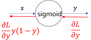
> 
> Sigmoid 계층을 파이썬 코드를 이용해 구현하면 아래와 같다.
> ```Python
> class Sigmoid:
>     def __init__(self):
>         self.out = None
> 
>     def forward(self, x):
>         out = 1 / (1 + np.exp(-x))
>         self.out = out
>         
>         return out
> 
>     def backward(self, dout):
>         dx = dout * (1.0 - self.out) * self.out
> 
>         return dx
> ```
> 위 구현에선 순전파의 출력을 인스턴스 변수 out에 보관했다가 역전파 계산때 그 값을 사용한다.
---
> #### 5.6 Affine/softmax 계층 구현하기
> #### 5.6.1 Affine 계층
> 신경망의 순전파 때 수행하는 행렬의 곱은 기하학에선 **어파인 변환** 이라고 한다. 그래서 이 책에서 어파인 변환을 수행하는 처리를  'Affine 계층'이라는 이름으로 구현한다.
> 
> 신경망의 순전파에선 가중치 신호의 총합을 계산하기 때문에 행렬의 곱(numpy에선 np.dot(). [3.3](https://github.com/minchan5224/TIL/blob/main/Python/Deep_Learning/Deep_01_03.md#33-%EB%8B%A4%EC%B0%A8%EC%9B%90-%EB%B0%B0%EC%97%B4%EC%9D%98-%EA%B3%84%EC%82%B0))을 사용했다.
> 
> 파이썬으론 아래와 같이 구현했었다.
> ``` Python
> X = np.random.rand(2) # 입력 
> W = np.random.rand(2,3) # 가중치
> B = np.random.rand(3) # 편향 
> 
> X.shape # (2,) 
> W.shape # (2, 3) 
> B.shape # (3,) 
> 
> Y = np.dot(X, W) + B
> ```
> 여기선 X, W, B의 형상이 각각 (2,), (2,3), (3,)인 다차원 배열이다.
> - 이때 뉴런의 가중치 합은 Y = np.dot(X,W) + B 처럼 계산한다.
> 
> 그리고 Y를 활성화 함수로 변환해 다음 층으로 전파하는 것이 신경망 순전파의 흐름이다.
> 
> 행렬의 곱 계산은 대응하는 차원의 원소 수를 일치시키는게 핵심이다.
> - X와 W의 곱은 아래 그림과 같이 대응하는 차원의 원소 수를 일치시켜야 한다.
> 
> 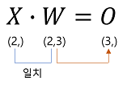
> 
> 앞에서 수행한 계산(행렬의 곱과 편향의 합)을 계산 그래프로 그려본다.
> - 곱을 계산하는 노드를 'dot'라고 하면 np.dot(X, W) + B 계산은 아래 그림과 같이 그려진다. 
> 
> - 또한, 각 변수의 이름 위에 그 변수의 형상을 표시한다.(아래 그림에서 X의 형상은(2,), 𝑋∙𝑊의 형상은 (3,)임을 표기함
> 
> 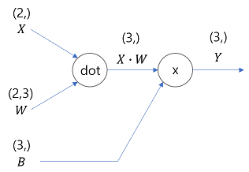
> 
> 비교적 단순한 계산 그래프다. 단, X, W, B가 행렬(다차원 배열)이라는 점에 주의해야한다.
> 
> 지금까지 계산 그래프는 노드 사이에 '[스칼라값](https://wikidocs.net/22383)' 이 흐른것에 반해 위 예에서는 '행렬'이 흐르고 있다.
> 
> 이제 위 계산 그래프의 역전파에 대해 생각해본다.
> 
> 행렬을 사용한 역전파도 행렬의 원소마다 전개해보면 스칼라값을 사용한 계산 그래프와 같은 순서로 생각할 수 있다.
> - 실제로 전개해보면 아래의 식이 도출된다.
> 
> #### 1
> 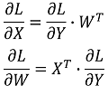
> 
> 위 식에서 W^T의 T는 전치행렬을 뜻한다. 
> - 전치행렬은 W의 (i,j)위치의 원소를 (j, i)위치로 바꾼것을 말한다. 수식으로는 아래와 같이 쓸 수 있다.
> 
> 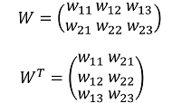
> 
> W의 형상이 (2,3)이었다면 전치행렬 W^T의 형상은(3,2)가 된다.
> - 식을 바탕으로 계산그래프의 역전파를 구하면 결과는 아래와 같다.
> 
> 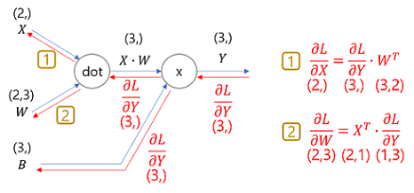
> 
> 위 계산 그래프에서 각 변수의 형상에 주의해서 살펴본다.
> - 특히 X와 𝜕L/𝜕X은 같은 형상이고 W와 𝜕L/𝜕W도 같은 형상이다. 아래 식을 통해 확인한다.
> 
> 
> 
> 행렬의 곱에선 대응하는 차원의 원소 수를 일치시켜야 하는데 [앞에서 본 식](https://github.com/minchan5224/TIL/blob/main/Python/Deep_Learning/Deep_01_05.md#1)을 동원해야 할 수도 있기 때문이다.
> 
> 예를 들어 𝜕L/𝜕W의 형상이 (3,)이고 W의 형상이 (2,3) 일때 𝜕L/𝜕X의 형상이 (2,)가 되는 𝜕L/𝜕Y과 W을 곱을 생각해 보면 [앞에서 본 식](https://github.com/minchan5224/TIL/blob/main/Python/Deep_Learning/Deep_01_05.md#1) 이 유도 될 것이라 한다.
> - 아래와 같이 그려질 것이다.
> 
> 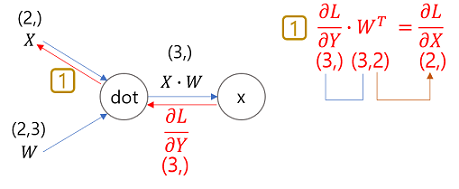
> 
> #### 5.6.2 배치용 Affine 계층
> 이번엔 데이터 N개를 묶어 순전파 하는 경우, 즉 배치용 Affine계층을 생각해 본다(묶은 데이터 = 배치)
> 
> 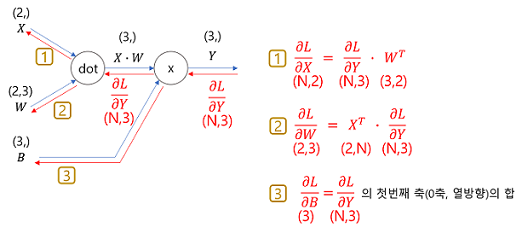
>
> 배치용 Affine 계층의 계산 그래프를 그리면 위 그림과 같다. 
>
> 기존과 다른 부분은 입력인 X의 형상이 (N,2)가 된 것뿐이다. 다른 것은 지금까지와 같이 계산 그래프의 순서를 따라 행렬 계산을 하게 된다.
> 
> 또한 역전파 때는 행렬의 형상에 주의하면 𝜕L/𝜕X과 𝜕L/𝜕W은 이전과 같이 도출할 수 있다.
> 
> 편향을 더할 때에도 주의해야한다.
> - 순전파 때의 편향 덧셈은 **X ∙ W**에 대한 편향이 각 데이터에 더해진다.
> 
>> N=2(데이터가 2개)로 한 경으 편향은 그 두 데이터 각각에(각각의 계산 결과에)더해진다.
>> ```Python
>> X_dot_W = np.array([[0, 0, 0], [10, 10, 10]])
>> B = np.array([1, 2, 3])
>> 
>> print(X_dot_W)
>> # array([[ 0, 0, 0], [ 10, 10, 10]])
>> print(X_dot_W + B)
>> # array([[ 1, 2, 3], [ 11, 12, 13]])
>> ```
>
> 순전파의 편향의 덧셈은 각각의 데이터(1번째, 2번째, ...)에 더해진다. 그래서 역전파 때는 각 데이터의 역전파 값이 편향의 원소에 모여야 한다. 코드로 구현하면 아래와 같다.
> 
> ```Python
> dY = np.array([[1, 2, 3], [4, 5, 6]])
> print(dY)
> # array([[1, 2, 3], [4, 5, 6]]) 
> 
> dB = np.sum(dY, axis=0)
> print(dB)
> # array([5, 7, 9])
> ```
> 위 예에선 데이터가 2개(N=2)라고 가정한다. 편향의 역전파는 그 두 데이터에 대한 미분을 데이터마다 더하여 구한다.
> - np.sum()에서 0번째 축(데이터를 단위로 한 축)에 대해 (axis=0)의 총합을 구하는 것이다.
> 
> 이상의 Affine구현은 다음과 같다.
> ```Python
> class Affine:
>     def __init__(self, W, b):
>         self.W = W
>         self.b = b
>         self.x = None
>         self.dW = None
>         self.db = None
> 
>     def forward(self, x):
>         self.x = x
>         out = np.dot(x, self.W) + self.b
>         
>         return out
>     
>     def backward(self, dout):
>         dx = np.dot(dout, self.W.T)
>         self.dW = np.dot(self.x.T, dout)
>         self.db = np.sum(dout, axis=0)
>         
>         return dx
> ```
> 
> #### 5.6.3 Softmax-with-Loss 계층
> 출력층에서 사용하는 소프트맥스 함수에 관해 설명한다.
> 
> 소프트맥스 함수는 입력 값을 정규화하여 출력한다.
> - 손글씨 숫자 인식에서 softmax 계층의 출력은 아래 그림과 같다.
> 
> 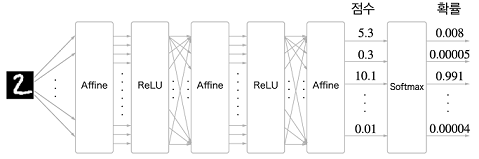
> 
> - 출처 [밑바닥부터 시작하는 딥러닝, 파이썬으로 익히는 딥러닝 이론과 구현](https://www.hanbit.co.kr/store/books/look.php?p_code=B8475831198)
> 
> 위 그림과 같이 Softmax 계층은 입력 값을 정규화(출력의 합이 1이 되도록 변형)하여 출력한다.
> 
> 또한 손글시 숫자는 가짓수가 10개(10클래스 분류)이므로 Softmax 계층의 입력은 10개가 된다.
> 
>> 신경망에서 수행하는 작업은 **학습**과 **추론** 두 가지다. 추론할 때는 일반적으로 Softmax계층을 사용하지 않는다.
>> 
>> 위 그림의 신경망은 추론할 때 마지막 Affine계층의 출력을 인식 결과로 이용한다. 또한 신경망에서 정규화하지 않는 출력 결과(위 그림에서는 Softmax 앞의 Affine 계층의 출력)를 **점수**라 한다.
>> 
>> 즉 신경망 추론에서 답을 하나만 내는 경우에는 가장 높은 점수만 알면 되는 것이므로 Softmax계층은 필요가 없다는 것이다. 반면 신경망을 학습할 땐 Softmax계층이 필요하다. 
>
> 이제 소프트맥스 계층을 구현한다. 손실 함수인 교차 엔트로피 오차도 포함하여 '**Softmax-with-Loss 계층**'이란 이름으로 구현한다.
> - 먼저 아래의 Softmax-with-Loss 계층의 계산 그래프를 살펴본다.
> 
> 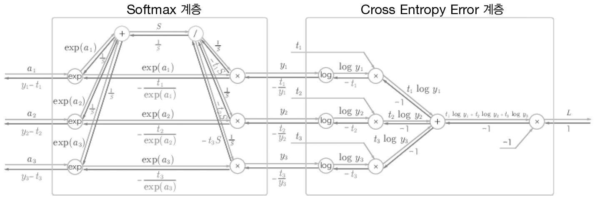
> 
> - 출처 [밑바닥부터 시작하는 딥러닝, 파이썬으로 익히는 딥러닝 이론과 구현](https://www.hanbit.co.kr/store/books/look.php?p_code=B8475831198)
> 
> Softmax-with-Loss 계층은 다소 복잡한 것을 확인할 수 있다. 위 계산 그래프는 아래와 같이 간소화 할 수 있다.
> 
> 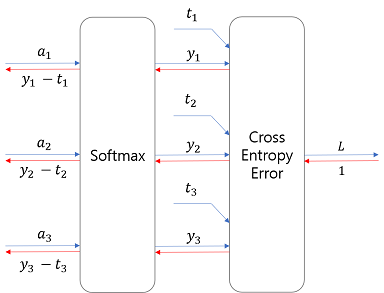
> 
> 위 그림의 계산그래프에서 소프트맥스 함수는 'Softmax'계층으로, 교차 엔트로피 오차는 'Cross Entropy Error'계층으로 표기 했다.
> 
> 여기선 3클래스 분류를 가정하고 이전 계층에서 3개의 입력(점수)을 받는다. 그림과 같이 Softmax계층은 입력(a_1, a_2, a_3)를 정규화 하여 (y_1, y_2, y_3)를 출력한다.
> 
> Cross Entropy Error 계층은 Softmax의 출력(y_1, y_2, y_3)와 정답 레이블(t_1, t_2, t_3)를 받고 이 데이터들로 부터 손실 L을 출력한다.
> 
> 위 그림에서 가장 주목할 점은 역전파의 결과하고 한다. 
> 
> Softmax 계층의 역전파는 (y_1-t_1, y_2-t_2, y_3-t_3)라는 말끔한 결과를 내놓는다. (y_1~3)은 Softmax계층의 출력이고 (t_1~3)은 정답 레이블이므로 (y_1-t_1, y_2-t_2, y_3-t_3)는 Softmax계층의 출력과 정답 레이블의 차분인 것이다.
> 
> 신경망의 역전파에선 이 차이인 오차가 앞 계층에 전해지는 것이다. 
> - 이 것은 신경망 학습의 중요한 성질이다.
> 
> 그런데 신경망 학습의 목적은 출력(Softmax의 출력)이 정답 레이블과 가까워지도록 매개변수의 값을 조정하는 것이였다.
> - 그래서 신경망의 출력과 정답 레이블의 오차를 효율적으로 앞 계층에 전달해야 한다.
> 
> 앞의 (y_1-t_1, y_2-t_2, y_3-t_3)라는 결과는 바로 Softmax계층의 출력과 정답 레이블의 차이로, 신경망의 현재 출력과 정답 레이블의 오차를 있는 그대로 드러내는 것이다.
> 
>> '소프트맥스 함수'의 손실 함소로 '교차 엔트로피 오차'를 사용하니 역전파가 (y_1-t_1, y_2-t_2, y_3-t_3) 로 말끔히 떨어진다. 이런 말끔함은 우연이 아니라 교차 엔트로피 오차라는 함수가 그렇게 설계되어있기 때문이다.
>> 
>> 또 회귀의 출력층에서 사용하는 '항등 함수'의 손실 함수로 '오차제곱합'을 이용([3.5 출력층 설계하기](https://github.com/minchan5224/TIL/blob/main/Python/Deep_Learning/Deep_01_03.md#35-%EC%B6%9C%EB%A0%A5%EC%B8%B5-%EC%84%A4%EA%B3%84%ED%95%98%EA%B8%B0))하는 이유도 이와 같다.
>> 
>> 즉 '항등 함수'의 손실 함수로 '오차제곱합'을 사용하면 역전파의 결과가 (y_1-t_1, y_2-t_2, y_3-t_3)로 말끔히 떨어진다.
>> 
>
> ```Python
> class SoftmaxWithLoss:
>     def __init__(self):
>         self.loss = None # 손실
>         self.y = None # softmax의 출력
>         self.t = None # 정답 레이블(원-핫 벡터)
>         
>     def forward(self, x, t):
>         self.t = t
>         self.y = softmax(x)
>         self.loss = cross_entropy_error(self.y, self.t)
>         return self.loss
>         
>     def backward(self, dout=1):
>         batch_size = self.t.shape[0]
>         dx = (self.y - self.t) / batch_size
>         return dx
> ```
> 위 코드는 파이선 코드를 이용해 Softmax-with-Loss 계층을 구현한 것이다.
> 
> [3.5.2](https://github.com/minchan5224/TIL/blob/main/Python/Deep_Learning/Deep_01_03.md#352-%EC%86%8C%ED%94%84%ED%8A%B8%EB%A7%A5%EC%8A%A4-%ED%95%A8%EC%88%98-%EA%B5%AC%ED%98%84-%EC%8B%9C-%EC%A3%BC%EC%9D%98%EC%A0%90)의 내용과 [4.2.4](https://github.com/minchan5224/TIL/blob/main/Python/Deep_Learning/Deep_01_04.md#424-%EB%B0%B0%EC%B9%98%EC%9A%A9%EA%B5%90%EC%B0%A8-%EC%97%94%ED%8A%B8%EB%A1%9C%ED%94%BC-%EC%98%A4%EC%B0%A8-%EA%B5%AC%ED%98%84%ED%95%98%EA%B8%B0)에서 구현한 내용을 토대로 구현하였다.
> - 역전파 때는 전파하는 값을 배치의 수(batch_size)로 나누어 데이터 1개당 오차를 앞 계층으로 전파하는 점에 주의해야한다.
> 
> #### 5.7 오차역전파법 구현하기
> 이제 지금까지 구현한 계층을 조합해 신경망을 구축한다.
> 
> #### 5.7.1 신경망 학습의 전체 그림
> 
> 4.5에서 본 것과 같은 순서로 신경망 학습을 진행한다.
> 
> **전제**
>> 신경망에는 적응 가능한 가중치와 편향이 있고, 이 가중치와 편향을 훈련 데이터에 적응하도록 조정하는 과정을 '학습'이라 한다. 
>>
>> 신경망 학습은 아래와 같이 4단계로 수행한다.
>>
>> **1단계-미니배치**
>>> 훈련 데이터 중 일부를 무작위로 가져온다. 이렇게 선별한 데이터를 미니배치라 하며 미니배치의 손실 함수 값을 줄이는 것이 목표다.
>>
>> **2단계-기울기 산출**
>>> 미니배치의 손실 함수 값을 줄이기 위해 각 가중치 매개변수의 기울기를 구한가. 기울기는 손실 함수의 값을 가장 작게 하는 방향을 제시한다.
>>
>> **3단계-매개변수 갱신**
>>> 가중치 매개변수를 기울기 방향으로 아주 조금 갱신한다.
>>
>> **4단계-반복**
>>> 1~3단계를 반복한다.
>>
> 지금까지 학습한 오차역전파법이 등장하는 단계는 두 번째인 '기울기 산출'단계다.
> - 앞장(4장)에선 기울기를 구하기 위해 수치 미분을 사용했지만 계산이 오래걸린다는 단점이 있다. 
> 
> - 오차역전파법을 이용해 수치 미분과 달리 기울기를 효율적이고 빠르게 구할 수 있다.
> 
> #### 5.7.2 오차역전파법을 적용한 신경망 구현하기
> 2층 신경망을 TwoLayerNet 클래스로 구현한다.
> 
> 아래 그림은 클래스 인스턴스 변수와 메서드를 정리한 표다.
> 
> 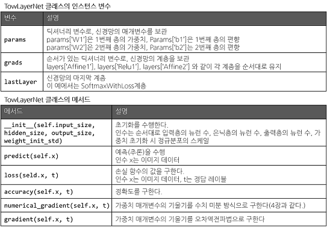
> 
> 4장에서 학습한 것과 공통되는 부분이 많다.
> - 크게 다른 부분은 계층을 사용하는 점이다. 
> 
> 계층을 사용함으로써 인식 결과를 얻는 처리(predict())와 기울기를 구하는 처리(gradient()) 계층의 전파만으로 동작이 이루어지는 것이다.
> 
> ```Python
> import sys, os
> sys.path.append(os.pardir)  # 부모 디렉터리의 파일을 가져올 수 있도록 설정
> import numpy as np
> from common.layers import *
> from common.gradient import numerical_gradient
> from collections import OrderedDict
> 
> 
> class TwoLayerNet:
> 
>     def __init__(self, input_size, hidden_size, output_size, weight_init_std = 0.01):
>         # 가중치 초기화
>         self.params = {}
>         self.params['W1'] = weight_init_std * np.random.randn(input_size, hidden_size)
>         self.params['b1'] = np.zeros(hidden_size)
>         self.params['W2'] = weight_init_std * np.random.randn(hidden_size, output_size) 
>         self.params['b2'] = np.zeros(output_size)
> 
>         # 계층 생성
>         self.layers = OrderedDict() # 순서가 있는 딕셔너리.(추가한 순서 기억)
>         self.layers['Affine1'] = Affine(self.params['W1'], self.params['b1']) # 1번 Affine
>         self.layers['Relu1'] = Relu() # 1번 Relu
>         self.layers['Affine2'] = Affine(self.params['W2'], self.params['b2']) # 2번 Affine
> 
>         self.lastLayer = SoftmaxWithLoss()
>         
>     def predict(self, x):
>         for layer in self.layers.values():
>             x = layer.forward(x) # 순전파 실행
>         
>         return x
>         
>     # x : 입력 데이터, t : 정답 레이블
>     def loss(self, x, t):
>         y = self.predict(x) 
>         return self.lastLayer.forward(y, t) # 일반 계층 순전파 끝나고 마지막 층 순전파 실행(오른쪽 → 왼쪽)
>     
>     def accuracy(self, x, t):
>         y = self.predict(x)
>         y = np.argmax(y, axis=1)
>         if t.ndim != 1 : t = np.argmax(t, axis=1)
>         
>         accuracy = np.sum(y == t) / float(x.shape[0])
>         return accuracy
>         
>     # x : 입력 데이터, t : 정답 레이블
>     def numerical_gradient(self, x, t):
>         loss_W = lambda W: self.loss(x, t)
>         
>         grads = {}
>         grads['W1'] = numerical_gradient(loss_W, self.params['W1'])
>         grads['b1'] = numerical_gradient(loss_W, self.params['b1'])
>         grads['W2'] = numerical_gradient(loss_W, self.params['W2'])
>         grads['b2'] = numerical_gradient(loss_W, self.params['b2'])
>         
>         return grads
>         
>     def gradient(self, x, t):
>         # forward
>         self.loss(x, t)
> 
>         # backward
>         dout = 1
>         dout = self.lastLayer.backward(dout) # 마지막 층부터 역전파 시작 (왼쪽 → 오른쪽)
>         
>         layers = list(self.layers.values())
>         layers.reverse() # 순전파와 반대 순서로 역전파 진행
>         for layer in layers:
>             dout = layer.backward(dout) # 순전파와 반대 순서로 역전파 진행
> 
>         # 결과 저장
>         grads = {}
>         grads['W1'], grads['b1'] = self.layers['Affine1'].dW, self.layers['Affine1'].db
>         grads['W2'], grads['b2'] = self.layers['Affine2'].dW, self.layers['Affine2'].db
> 
>         return grads
> ```
> 신경망의 계층을 OrderedDict()에 저장하는 점이 중요하다.
> 
> 순서가 있는 딕셔너리이며 값을 저장한 순서를 기억한다. 따라서 순전파 때엔 forward()를 호출하면 되는 것이고 역전파 때에는 반대순서 대로 호출하면 된다.
> 
> Affine 계층과 ReLU 계층이 각자의 내부에서 순전파와 역전파를 제대로 처리하고 있으니 여기선 계층을 올바른 순서대로 연결하고 순서대로(역순으로) 호출하면 된다.
> 
> 이와같이 신경망의 구성 요소를 '계층'으로 구현해 더 쉽게 구축할 수 있다.
> 
> '계층'으로 모듈화 하여 구현한다면 더 깊은 신경망을 만들고 싶을 때 필요한 만큼 계층을 추가하기만 하면 된다.
> 
> #### 5.7.3 오차역전파법으로 구한 기울기 검증하기
> 수치 미분의 이점은 구현하기 쉽다는 점이다 그만큼 구현에 버그가 숨어 있기 어렵다 하지만 오차역전파법은 빠르지만 구현이 어렵다 그만큼 실수가 발생 하곤 한다.
> 
> 이러한 특성으로 인해 수치 미분의 결과와 오차역전파법의 결과를 비교해 오차역전파법이 제대로 구현되었는지 검증한다고 한다.
> 
> 이와같이 두 방식으로 구한 기울기가 일치함(거의 같음)을 확인하는 작업을 **기울기 확인**이라고 하며 아래와 같이 구현한다.
> ```Python
> import sys, os
> sys.path.append(os.pardir)  # 부모 디렉터리의 파일을 가져올 수 있도록 설정
> import numpy as np
> from dataset.mnist import load_mnist
> from two_layer_net import TwoLayerNet
> 
> # 데이터 읽기
> (x_train, t_train), (x_test, t_test) = load_mnist(normalize=True, one_hot_label=True)
> 
> network = TwoLayerNet(input_size=784, hidden_size=50, output_size=10)
> 
> x_batch = x_train[:3]
> t_batch = t_train[:3]
> 
> grad_numerical = network.numerical_gradient(x_batch, t_batch)
> grad_backprop = network.gradient(x_batch, t_batch)
> 
> # 각 가중치의 차이의 절댓값을 구한 후, 그 절댓값들의 평균을 낸다.
> for key in grad_numerical.keys():
>     diff = np.average( np.abs(grad_backprop[key] - grad_numerical[key]) )
>     print(key + ":" + str(diff))
> ```
> 가장 먼저 MNIST데이터 셋을 읽은 다음 훈련 데이터 일부를 수치 미분으로 구한 기울기와 오차역전파법으로 구한 기울기의 오차를 확인한다. 
> - 여기에선 각 가중치 매개변수의 차이의 절댓값을 구하고 이를 평균한 값이 오차가 된다. 코드의 실행 결과는 아래와 같다.
> ```
> W1:4.049500550844403e-10
> b1:2.0780410401016312e-09
> W2:5.170073971086342e-09
> b2:1.397147032775048e-07
> ```
> 1번재 층의 편향 오차는 4.0e-10(0.00000000004)이다. 오차역전파법으로 구한 기울기도 올바름이 확인되어 실수 없이 구현했다 할 수 있다.
>
>> 수치 미분과 오차역전파법의 결과 오차가 0이 되는 일은 드물다.(컴퓨터가 할 수 있는 계산의 정밀도가 유한하기 때문, 32비트 부동소수점) 
>> 
>> 이러한 정밀도의 한계로 인해 오차는 대부분 0이 되지는 않지만 올바르게 구현했다면 0에 아주 근접한 작은 값이 된다. 
>> - 만약 값이 크다면 오차역전파법을 잘못 구현한 것이라 의심 해봐야 한다.
>> 
> #### 5.7.4 오차역전파법을 사용한 학습 구현하기
> 마지막으로 오차역전파법을 사용한 신경망 학습을 구현해본다.
> - 지금까지와 다른점은 기울기를 오차역전파법으로 구하는 점뿐이다.
> ```Python
> import sys, os
> sys.path.append(os.pardir)
> 
> import numpy as np
> from dataset.mnist import load_mnist
> from two_layer_net import TwoLayerNet # 위에서 구현한 2층 신경망
> 
> # 데이터 읽기
> (x_train, t_train), (x_test, t_test) = load_mnist(normalize=True, one_hot_label=True)
> 
> network = TwoLayerNet(input_size=784, hidden_size=50, output_size=10)
> 
> iters_num = 10000 # 반복 횟수를 적절히 설정한다.
> train_size = x_train.shape[0]
> batch_size = 100 # 미니배치 크기
> learning_rate = 0.1
> 
> train_loss_list = []
> train_acc_list = []
> test_acc_list = []
> 
> # 1에폭당 반복 수
> iter_per_epoch = max(train_size / batch_size, 1)
> 
> for i in range(iters_num):
>     # 미니배치 획득
>     batch_mask = np.random.choice(train_size, batch_size)
>     x_batch = x_train[batch_mask]
>     t_batch = t_train[batch_mask]
>     
>     # 기울기 계산
>     # grad = network.numerical_gradient(x_batch, t_batch) # 수치 미분 방식
>     grad = network.gradient(x_batch, t_batch) # 오차역전파법 방식(훨씬 빠르다)
>     
>     # 매개변수 갱신
>     for key in ('W1', 'b1', 'W2', 'b2'):
>         network.params[key] -= learning_rate * grad[key]
>     
>     # 학습 경과 기록
>     loss = network.loss(x_batch, t_batch)
>     train_loss_list.append(loss)
>     
>     # 1에폭당 정확도 계산
>     if i % iter_per_epoch == 0:
>         train_acc = network.accuracy(x_train, t_train)
>         test_acc = network.accuracy(x_test, t_test)
>         train_acc_list.append(train_acc)
>         test_acc_list.append(test_acc)
>         print(train_acc, test_acc)
> ```
> 
> #### 5.8 정리
> 계산 그래프를 학습하고 오차역전파법에 대해 학습 하였다(계층 : ReLU 계층, Softmax-with-Loss 계층, Affine 계층, Softmax 계층)
> 
> 모든 계층에서 forward와 backward 메서드를 구현하며 전자는 데이터 순방향 전파, 후자는 역방향 전파함으로써 가중치 매개변수의 기울기를 효율적으로 구할수 있다.
> 
> 이와같이 계층으로 모듈화 하여 신경망의 계층을 자유롭게 조합해 원하는 신경망을 쉽게 구현할 수 있다.
> 
> **이번 장에서 배운 내용**
> - 계산 그래프를 이용하면 계산 과정을 시각적으로 파악할 수 있다.
> 
> - 계산 그래프의 노드는 국소적 계산으로 구성된다. 국소적 계산을 조합해 전체 계산을 구성한다.
> 
> - 계산 그래프의 순전파는 통상의 계산을 수행한다. 한편, 계산 그래프의 역전파로는 각 노드의 미분을 구할 수 있다.
> 
> - 신경망의 구성 요소를 계층으로 구현하여 기울기를 효율적으로 계산할 수 있다(오차역전파법)
> 
> - 수치 미분과 오차역전파법의 결과를 비교하면 오차역전파법의 구현에 잘못이 없는지 확인할 수 있다(기울기 확인)
>  
4/15
