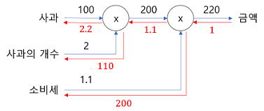

## [밑바닥부터 시작하는 딥러닝]
---
### 목차
-[]()
---
#### CHAPTER5_오차역전파법
#### 2021_4_03~7
---
#### 5.1 계산그래프
> 계산 그래프는 계산 과정을 그래프로 나타낸 것이다.
> 
> 그래프 자료구조로 복수의 노드와 엣지(edge, 노드사이의 직선)로 표현한다.
> 
#### 5.1.1 계산 그래프로 풀다.
> 문제 1 : 슈퍼에서 1개에 100원인 사과를 2개 샀다. 이때 지불할 금액을 구하라(소비세는 10% 부과)
> 
> 
> 
> 위와 같이 2개의 그림이 있다. 첫번째 그림은 사과의 100 원이 'x2' 노드로 흐르고 200원이 되어 다음 노드로 전달된다.
> 
> 그 다음 200원이 'x1.1'노드를 거쳐 220원이 된다. 따라서 최종 금액은 220원이 된다.
> 
> 두번째 그림은 첫번째 그림과 달리 'x'만을 연산으로 생각한다. 즉 '사과의 개수'와 '소비세'가 변수다 되어 원 밖에 표기하게 된다.
> 
> 문제 2 : 슈퍼에서 사과 2개 귤 3개 구매했다 사과는 개당 100원 귤은 150원이다. 소비세가 10%일때 지불 금액을 구하라.
> 
> 
> 
> 위 그림에선 '+'로 표기된 덧셈 노드가 새로 등장한다.
> 
> 계산그래프는 왼쪽에서 오른쪽으로 계산을 진행한다.
> 
> 따라서 결과는 715이다.
> 
> 지금까지 살펴본 바로 계산 그래프는 아래와 같은 흐름으로 진행된다.
> 
>> 1. 계산 그래프를 구성한다.
>> 
>> 2. 그래프에서 계산을 왼쪽에서 오른쪽으로 진행한다.
> 
> 여기서 2번 항목인 '그래프에서 계산을 왼쪽에서 오른쪽으로 진행한다.'인 단계를 **순전파** 라고 한다.
> - 순전파는 계산 그래프의 출발점 부터 종착점으로의 전파다.
> 
> - 순전파의 반대방향(오른쪽에서 왼쪽으로)의 전파는 **역전파** 라고하며 역전파는 미분을 계산할 때 중요한 역할을 한다.
> 
> #### 5.1.2 국소적 계산 
> 계산 그래프의 특징은 '국소적 계산'을 전파함으로써 최종 결과를 얻는다는 점에있다.
> - 국소적이란 '자신과 직접 관계된 작은 범위'라는 뜻이며 전체에서 어떤 일이 벌어지든 상관없이 자신과 관련된 정보만으로 결과를 출력할 수 있다는 것.
> 
>> 여러가지 상품을 구매할 때 사과 2개를 포함 하는 경우 여러 식품을 구매(복잡한 여러 가지 계산)하여 금액이 6,000원이 되었다.
>> 
>> 해당 금액에 사과 2개의 금액을 추가하는 계산(6000 + 200)은 6000이라는 금액이 어떤 계산을 통해 나왓는지 상관 없이 두 숫자(6000, 200)를 더하면 된다는 것이다.
>> 
>> 각 노드는 자신과 관련된 계산 이외에는 아무 신경쓸 필요가 없다.
>
> 이와같이 계산 그래프는 국소적 계산에 집중한다.
> 
> 전체 계산이 아무리 복합하더라도 각 단계에서 하는 일은 해당 노드의 국소적 계산이다.
> - 국소적 계산은 간단하지만 그 결과를 전달 함으로써 전체를 구성하는 복잡한 계산을 해낼 수 있다.
> 
> #### 5.1.3 왜 계산 그래프로 푸는가?
> 계산그래프의 이점은 국소적 계산 때문이다.
> - 전체가 아무리 복잡해도 각 노드에선 단순한 계산에 집중해 문제를 단순화 할 수 있기 때문
> 
> 또한 계산 그래프는 중간 계산 결과를 모두 보관할 수 있다.
> - ex. 사과 2개 까지 계산 했을대 금액 = 200, 소비세를 더하기 전의 금액 = 650
> 
> 계산 그래프를 사용하는 가장 큰 이유는 '**역전파를 통해 미분을 효율적으로 계산 할 수 있다**'는 점에 있다.
> 
> 
> 
> 결과만 나타낸다면 위 그림과 같이 계산 그래프 상의 역전파에 의해 미분을 구할 수 있다.
> 
> 위 그림의 빨간 선과 같이 역전파는 순전파와 반대 방향으로 흘러간다. 이 전파는 '국소적 미분'을 전달하고 그 미분 값은 화살표 아래 적는다.
>> 위 예에서 역전파는 오른쪽에서 왼쪽으로 '1 → 1.1 → 2.2' 순으로 미분 값을 전달한다.
>>
>> 이 결과로 부터 사과 가격에 대한 지불 금액의 미분 값은 2.2 라 할 수 있다.
>> 
>> 사과가 1원 오르면 최종 금액은 2.2원 오른다는 뜻(정확힌 사과 값이 아주 조금 오르면 최종 금액은 아주 작은 값의 2.2배 만큼 오른다.)
> 
> 위 예에선 사과 가격에 대한 미분만 구했지만 **소비세에 대한 지불 금액의 미분**, **사과 개수에 대한 지불 금액의 미분** 또한 같은 순서로 구할 수 있다.
> 
> 또한 중간까지 구한 미분 결과를 공유할 수 있어서 다수의 미분을 효율적으로 계산할 수 있다.
> 
> 이와같이 계산 그래프의 이점은 순전파와 역전파를 활용해 각변수의 미분을 효율적으로 구할 수 있다는 것이다.
> 
> #### 5.2 연쇄법칙
> 국소적 미분을 전달하는 원리는 **연쇄법칙**에 따른 것이다.
> 
> #### 5.2.1 계산 그래프의 역전파
> y = f(x)라는 계산의 역전파를 아래와 같이 그렸다.
> 
> 
> 
> 위 그림과 같이 역전파의 계산 절차는 신호 E에 노드의 국소적 미분을 곱한 후 다음 노드로 전달하는 것이다.
> - 여기서 말하는 국소적 미분은 순전파 때의 y = f(x)계산의 미분을 구한다는 것.(x에 대한 y의 미분)
> 
>> y = f(x) = x^2 이라면 국소적 미분 = 2x가 된다. 그리고 국소적인 미분을 상류에서 전달된 값(여기선 E)에 곱해 앞쪽 노드로 전달하는 것이다.
>
> #### 5.2.2 연쇄법칙이란?
> 연쇄법칙을 설명하기 전 합성함수 부터 시작한다.
> 
> 
> 
> 연쇄법칙은 합성 함수의 미분에 대한 성질이며 아래와 같이 정의된다.
> 
> **합성 함수의 미분은 합성 함수를 구성하는 각 함수의 미분의 곱으로 나타낼 수 있다**.
> 
> 이것이 연쇄법칙의 원리다.
> 
> 위의 식을 예로 설명한다. 
> 
> 
> 
> #### 5.2.3 연쇄법칙과 계산 그래프
> 위 연쇄법칙 계산을 계산그래프로 그려본다. 2제곱 계산을 ```**2```노드로 나타내면 아래와 같이 그릴 수 있다. **
> 
> 
>
> 위 그림과 같이 계산 그래프의 역전파는 오른쪽에서 왼족으로 신호를 전파한다. 역전파의 계산 절차에서는 노드로 들어온 입력 신호에 그 노드의 국소적 미분(편미분)을 곱한 후 다음 노드로 전달한다.
> 
> 예를들어 ```**2``` 노드에서 역전파를 본다.
> 
> 
>
> #### 5.3 역전파
> 지금까진 계산 그래프의 역전파가 연쇄법칙에 따라 진행되는 모습을 설명했다.
> - 이제부턴 +, X등의 연산을 예로 들어 역전파의 구조를 설명한다.
>
> #### 5.3.1. 덧셈 노드의 역전파
> 여기선 z = x+y라는 식을 대항으로 역전파를 살펴본다.
> 
> z=x+y의 미분은 다음과 같이 해석적으로 계산할 수 있다.
> 
> 
> 
> 
> 
> #### 5.3.2 곱셈 노드의 역전파
> 곱셈 노드의 역전파는 z = xy라는 식을 예로 든다.
> - 이 식의 미분은 아래그림과 같다.
> 
> 
> 
> 위 식을 이용해 계산 그래프를 그리면 아래와 같이 그릴 수 있다.
> - 왼쪽 : 순전파, 오른쪽 : 역전파
> 
> 
> 
> 곱셈 노드 역전파는 상류의 값에 순전파 때의 입력 신호들을 '**서로 바꾼값**'을 곱해 하류로 보낸다.
> 
> - 서로 바꾼 값이란 위의 그림과 같이 순전파 때 x였다면 역전파 때는 y, 순전파 때 y였다면 역전파 때 x로 바꾼다는 것이다.
> 
> 10 x 5 = 50 이라는 계산을 구체적인 예로 들어 설명한다.
> - 역전파 때 상류에서 1.3 값이 흘러나온다.
> 
> 
> 
> 곱셈의 역전파는 입력 신호를 바꾼 값을 곱한다.
> - 하나는 13 하나는 6.5
> 
> 곱셈의 역전파는 덧셈의 역전파와 달리 순방향 입력 신호의 값이 필요하다.
> - 곱셈 노드를 구현할 때 순전파의 입력 신호를 변수에 저장해둔다.
> 
> #### 5.3.3 사과 쇼핑의 예
> 이 문제에선 사과의 가격, 사과의 개수, 소비세라는 세 변수 각각이 최종 금액에 어떻게 영향을 주느냐 풀어본다.
> - 사과 가격에 대한 지불 금액의 미분, 사과 개수에 대한 지불 금액의 미분, 소비세에 대한 지불 금액의 미분을 구하는 것에 해당.
> 
> 이를 계산 그래프의 역전파를 사용해 풀면 아래와 같다.
> 
> 
> 
> 위 그림을 통해 사과 가격의 미분, 사과 개수의 미분, 소비세의 미분을 구하였다.
> - 소비세와 사과 가격이 같은 양만큼 증가한다면 최종 금액에서는 소비세가 200의 크기, 사과 가격이 2,2의 크기로 영향을 준다고 해석할 수 있다.(소비세 1은 100%, 사과 가격 1은 1원)
> 
> #### 5.4 단순한 계층 구현하기
> - 신경망을 구성하는 '계층'각각을 하나의 클래스로 구현, '계층'이란 신경망의 기능 단위
> 
> 사과 쇼핑의 예를 파이썬으로 구현한다.
> - 곱셈 노드 : MulLayer , 덧셈 노드 : AddLayer
> 
> #### 5.4.1 곱셈 계층
> 모든 계층은 forward()와 backward()라는 공통의 메서드(인터페이스)를 갖도록 구현할 것이다.
> - forward()는 순전파,.backward()는 역전파를 처리
> 
> 곱셈 계층을 아래와 같이 구현한다.
> ```Python
> class MulLayer:
>     def __init__(self):
>         self.x = None
>         self.y = None
>     
>     def forward(self, x, y):
>         self.x = x
>         self.y = y
>         out = x * y
>         
>         return out
>         
>     def backward(self, dout):
>         dx = dout * self.y # x와 y스왑
>         dy = dout * self.x
>         
>         return dx, dy
> ```
> __init__()에선 인스턴스 변수인 x와 y를 초기화 한다.
> - 이 두 변수는 순전파 시의 입력 값을 유지하기 위해 사용한다.
> 
> forward()에서는 x와 y를 인수로 받고 두 값을 곱해서 반환한다.
> 
> backward()에서는 상류에서 넘어온 미분(dout)에 순전파 때의 값을 '서로 바꿔'곱한 후 하류로 흘린다.
> 
> 이제 MulLayer를 사용해 사과 쇼핑을 구현해본다.
> ```Python
> apple = 100
> apple_num = 2
> tax = 1.1
> 
> # 계층들
> mul_apple_layer = MulLayer()
> mul_tax_layer = MulLayer()
> 
> # 순전파
> apple_price = mul_apple_layer.forward(apple, apple_num)
> price = mul_apple_layer.forward(apple_price, tax)
> 
> print(price) # 220
> 
> # 역전파
> dprice=1
> dapple_price, dtax = mul_tax_layer(dprice)
> dapple, dapple_num = mul_apple_layer(dapple_price)
> 
> print(dapple, dapple_num, dtax) # 2.2 110 200
> ```
> backward() 호출 순서는 forward()와는 반대다. 또 backward()가 받는 인수는 '순전파의 출력에 대한 미분'임에 주의 해야한다.
> - mul_apple_layer라는 곱셈 계층은 순전파 때 apple_price를 출력하지만 역전파 때는 apple_price의 미분값인 dapple_price를 인수로 받는다.
> 
> 위 코드를 실행한 결과는 아래 그림의 결과와 일치하는 것을 확인할 수 있다.
> 
> 
>
> #### 5.4.2 덧셈 계층
> ```Python
> class AddLayer:
>     def __init__(self):
>         pass
> 
>     def forward(self, x, y):
>         out = x + y
> 
>         return out
> 
>     def backward(self, dout):
>         dx = dout * 1
>         dy = dout * 1
> 
>         return dx, dy
> ```
> 덧셈 계층에는 초기화가 필요없다
> - __init__()에서 아무일도 하지 않는다.
> 
> 덧셈 계층의 forward()에서는 입력받은 두 인수 x, y를 더해서 반환한다.
> 
> backward()에서는 상류에서 내려온 미분(dout)을 그대로 하류로 전달한다.
> 
> 덧셈 계층과 곱셈 계층을 사용해 사과 2개와 귤 3개를 사는 상황을 구현한다.
> 
> 
> 
> ```Python
> apple = 100
> apple_num = 2
> orange = 150
> orange_num = 3
> tax = 1.1
> 
> # layer
> mul_apple_layer = MulLayer()
> mul_orange_layer = MulLayer()
> add_apple_orange_layer = AddLayer()
> mul_tax_layer = MulLayer()
> 
> # forward
> apple_price = mul_apple_layer.forward(apple, apple_num)  # (1)
> orange_price = mul_orange_layer.forward(orange, orange_num)  # (2)
> all_price = add_apple_orange_layer.forward(apple_price, orange_price)  # (3)
> price = mul_tax_layer.forward(all_price, tax)  # (4)
> 
> # backward
> dprice = 1
> dall_price, dtax = mul_tax_layer.backward(dprice)  # (4)
> dapple_price, dorange_price = add_apple_orange_layer.backward(dall_price)  # (3)
> dorange, dorange_num = mul_orange_layer.backward(dorange_price)  # (2)
> dapple, dapple_num = mul_apple_layer.backward(dapple_price)  # (1)
> 
> print(price) # 715
> print(dapple_num, dapple, dorange, dorange_num, dtax) # 110 2.2 3.3 165 650
> ```
> 코드가 길어졌지만 각각의 명령은 단순하다.
> 
> 필요한 계층을 만들어 순전파 메서드인 forward()를 적절한 순서로 호출한다
> 
> 그 다음 순전파와 반대 순서로 역전파 메서드인 backward()를 호출하면 원하는 미분이 나온다.
> 
> 이와같이 계산 그래프에서 계층은 쉽게 구현할 수 있으며 이를 사용해 복잡한 미분도 계산할 수 있다.
> 
> #### 5.5 활성화 함수 계층 구현하기
> 신경망을 구성하는 층(계층) 각각을 클래스 하나로 구현한다.
> - 우선 활성화 함수인 ReLU와 Sigmoid 계층을 구현한다.
> 
> #### 5.5.1 ReLU계층
> 활성화 함수로 사용되는 ReLU의 수식은 다음과 같다.
> 
> 
> 
> 위 식에서 x에 대한 y의 미분은 아래 식과 같이 구한다.
> 
> 
> 
> 위 식 에서와 같이 순전파 때의 입력인 x가 0보다 크면 역전파는 상류의 값을 그대로 하류로 흘린다.
> 
> 반면 순전파 때 x가 0이하면 역전파 때는 하류로 신호를 보내지 않는다.(0을 보낸다.)
> 
> 계산 그래프로 그리면 아래와 같이 그릴 수 있다.
> 
> 
> 
> 이제 ReLU계층을 구현한다.
> - 신경망 계층의 forward(), backward()함수는 넘파이 배열을 인수로 받는다고 가한다.
> ```Python
> class Relu:
>     def __init__(self):
>         self.mask = None
> 
>     def forward(self, x):
>         self.mask = (x <= 0)
>         out = x.copy()
>         out[self.mask] = 0
> 
>         return out
> 
>     def backward(self, dout):
>         dout[self.mask] = 0
>         dx = dout
> 
>         return dx
> ```
> ReLU클래스는 mask라는 인스턴스 변수를 가진다.
> - mask는 True/False로 구성된 넘파이 배열로 순전파의 입력인 x의 원소 값이 0이하인 인덱스는 True, 그 외의 경우는 False로 유지한다
> 
> mask 변수는 아래의 예와 같이 True/False로 구성된 넘파이 배열을 유지한다.
> ```Python
> x = np.array( [[1.0, -0.5], [-2.0, 3.0]] )
> mask = (x <= 0)
> print(mask)
> '''
> [[False  True]
>  [ True False]]
> '''
> ```
> 위와 같이 순전파 때의 입력이 0이하면 역전파 때의 값은 0이 돼어야 한다.
> 
> 그래서 역전파 때는 순전파 때 만들어둔 mask를 사용해 원소가 True인 곳에서는 상류에서 전파된 dout를 0으로 설정한다.
> 
> #### 5.5.2 Sigmoid 계층
> 시그모이드 함수는 다음 식을 의미하는 함수다.
> 
> 
> 
> 이 식을 계산 그래프로 그리면 아래 그림과 같다.
> 
> 
> 
> 위 계산 그래프에선 'x'와 '+'노드 뿐 아니라 'exp', '/'노드가 추가 되었다.
> - exp 노드 : y = exp(x) 계산 수행, / 노드 : y = 1/x 계산 수행
>
> 위 계산 그래프와 같이 위의 식의 계산은 국소적 계산의 전파로 이뤄진다.
> 
> 이제부터 역전파를 오른쪽에서 왼쪽으로 한 단계씩 짚어본다.
>
>> **1 단계**
>> 
>> '/' 노드, 즉 y = 1/x을 미분하면 다음 식이 된다.
>> 
>> 
>> 
>> **2 단계**
>> 
>> '+'노드는 상류의 값을 여과 없이 하류로 내보내는 게 전부다. 계산 그래프에선 아래와 같다.
>> 
>> 
>> **3 단계**
>> 
>> 'exp'노드는 y = exp(x)연산을 수행하며 그 미분은 아래와 같다.
>> 
>> 
>> 
>> **4 단계**
>> 
>> 'x'노드는 순전파 때의 값을 '서로 바꿔'곱한다. 이 예에서는 -1을 곱한다.
>> 
>> 
>> 
>> 간소화 하지 않은 계산 그래프와 간소화 한 계산 그래프의 결과는 똑같다.
>> - 간소화 한 계산 그래프가 역전파 과정의 중간 계산들을 생략할 수 있어 더 효율적인 계산이라 할 수 있다.
>> 
>> - 노드를 그룹화 하여 Sigmoid계층의 세세한 내용을 노출하지 않고 입력과 출력에만 집중 할 수 있다는 것도 중요한 포인트다.
---
