## [밑바닥부터 시작하는 딥러닝]
---
### 목차
- [4.1 제목](https://github.com/minchan5224/TIL/blob/main/Python/Deep_Learning/01/Deep_01_02.md#21-%ED%8D%BC%EC%85%89%ED%8A%B8%EB%A1%A0%EC%9D%B4%EB%9E%80)
- [4.2 손실 함수](https://github.com/minchan5224/TIL/blob/main/Python/Deep_Learning/Deep_01_04.md#42-%EC%86%90%EC%8B%A4-%ED%95%A8%EC%88%98)
- [4.3 수치 미분](https://github.com/minchan5224/TIL/blob/main/Python/Deep_Learning/Deep_01_04.md#43-%EC%88%98%EC%B9%98-%EB%AF%B8%EB%B6%84)
- [4.4 기울기](https://github.com/minchan5224/TIL/blob/main/Python/Deep_Learning/Deep_01_04.md#44-%EA%B8%B0%EC%9A%B8%EA%B8%B0)
- [4.5 학습 알고리즘 구현하기](https://github.com/minchan5224/TIL/blob/main/Python/Deep_Learning/Deep_01_04.md#45-%ED%95%99%EC%8A%B5-%EC%95%8C%EA%B3%A0%EB%A6%AC%EC%A6%98-%EA%B5%AC%ED%98%84%ED%95%98%EA%B8%B0)
---
#### CHAPTER4_신경망 학습
##### 2021_3_18
---
> #### 4.1 데이터에서 학습한다.
> 신경망의 특징은 데이터를 보고 학습할 수 있다는 점이다.
> 
> 데이터에서 학습한다는 것은 **가중치** **매개변수의** **값을** **데이터를** **보고** **자동으로** **결정한다**는 뜻이다.
> - 실제 신경망에서 매개변수는 수천에서 수만개다. 층을 깊게한 딥러닝의 경우는 수억개다. 자동으로 결정한다니 희소식이다.
> 
> [퍼셉트론 수렴 정리](https://nbviewer.jupyter.org/github/metamath1/ml-simple-works/blob/master/perceptron/perceptron.ipynb)
> 
> #### 4.1.1 데이터 주도 학습
> 기계학습은 데이터가 생명이다
> - 데이터가 없으면 아무것도 시작되지 않기때문이다.
> 
> - 데이터가 이끄는 접근 방식 덕에 사람 중심 접근에서 벗어날 수 있다.
> 
> 보통은 문제를 해결할 때, 특히 어떤 패턴을 찾아야 할 때는 사람이 주도하는것이 대부분이지만 기계학습에선 사람의 개입을 최소화하고 수집한 데이터로부터 패턴을 찾으려 시도한다.
> 
> 또한 신경망과 딥러닝은 기존 기계학습에서 사용하던 방법보다 사람의 개입을 더욱 배제할 수 있게 해주는 중요한 특성을 지녔다.
> - 이미지에서 **특징**을 추출하고 그 특징의 패턴을 기계학습 기술로 학습하는 방법이 있다.
> 
> - 여기서 말하는 **특징**은 입력 데이터(이미지)에서 본질적인 데이터를 정확하게 추출할 수 있도록 설계된 변환기를 가리킨다.
>> 이미지의 특징은 보톡 벡터로 기술하고, 컴퓨터 비전 분야에서는 [SIFT](https://ballentain.tistory.com/47), [SURF](https://hello-stella.tistory.com/23), [HOG](http://blog.naver.com/PostView.nhn?blogId=tommybee&logNo=221173056260&parentCategoryNo=&categoryNo=57&viewDate=&isShowPopularPosts=true&from=search) 등의 특징을 많이 사룔한다.
>> 
>> 이런 특징을 사용해 이미지 데이터를 벡터로 변환하고 변환된 벡터를 가지고 지도 학습의 대표 분류 기법인 [SVM](https://ko.wikipedia.org/wiki/%EC%84%9C%ED%8F%AC%ED%8A%B8_%EB%B2%A1%ED%84%B0_%EB%A8%B8%EC%8B%A0), [KNN](https://ko.wikipedia.org/wiki/K-%EC%B5%9C%EA%B7%BC%EC%A0%91_%EC%9D%B4%EC%9B%83_%EC%95%8C%EA%B3%A0%EB%A6%AC%EC%A6%98) 등으로 학습할 수 있다.
>
> 이와 같이 기계학습에선 모아진 데이터로부터 규칙을 찾아내는 역할을 기계가 담당한다.
> 
> 다만 이미지를 벡터로 변환할 때 사용하는 특징은 여전히 사람이 만든다. 
> 
> 좋은 결과를 얻기 위해선 문제에 적합한 특징을 잘 정해서 사용해야 한다는 것이다. 
> 
> 
> - 회색 블록은 사람이 개입하지 않는 것을 뜻함
> 
> 위 그림과 같이 신경망은 이미지를 있는 그래로 학습한다.
> 
> 두 번째 접근방식(특징, 기계학습 방식) 에서는 특징을 사람이 설계했지만 신경망은 이미지에 포함된 중요한 특징까지도 '기계'가 스스로 학습할 것이다.
> - 딥러닝을 **종단간** **기계학습**이라고도 한다, 종단간은 처음부터 끝까지를 의미하며 데이터 입력에서 부터 목표로한 결과 출력 까지를 사람의 개입 없이 진행한다는 뜻을 가진다.
> 
> 신경망의 이점은 모든 문제를 같은 맥락에서 풀 수 있다는 점에 있다.
> - 세부사항과 관계없이 신경망은 주어진 데이터를 온전히 학습하고, 주어진 문제의 패턴을 발견하려 시도한다. 즉, 신경망은 모든 문제를 주어진 데이터 그대로 입력 데이터로 활용해 'end-to-end'로 학습할 수 있다
> 
> #### 4.1.2 훈련 데이터와 시험 데이터
> 기계학습 문제는 데이터를 **훈련 데이터**와 **시험 데이터**로 나누어 학습과 실험을 수행하는 것이 일반적이다.
> 
> 우선 훈련 데이터만 이용해 학습하며 최적의 매개변수를 찾는다. 그 다음 시험 데이터를 이용해 앞서 훈련한 모델의 실력을 평가한다.
> 
> 범용적으로 사용할 수 있는 모델을 원하기 때문에 데이터를 훈련과 시험으로 나누어 사용한다.
>> 범용 능력은 아직 보지 못한 데이터(훈련 데이터에 포함되지 않는 데이터)로도 문제를 올바르게 풀어내는 능력이다.
>> 
>> 또한 범용 능력을 획득하는 것이 기계학습의 최종 목표다.
>> 
>> 데이터셋 하나로만 매개변수의 학습과 평가를 수행하면 올바른 평가가 될 수 없다
>> - 훈련 데이터와 시험 데이터가 같다면 해당 데이터에 포함된 자료들만 학습한 것이다. 제대로된 평가를 할 수 없다.(다른 데이터셋에서 엉망일 가능성이 생긴다)
>> 
>> 또한 하나의 데이터셋에만 지나치게 최적화된 상태를 **오버피팅**이라 하며 오버피팅을 피하는 것은 기계학습의 중요한 과제이기도 하다.
>
> #### 4.2 손실 함수
> 신경망에서는 '하나의 지표'를 기준으로 최적의 매개변수 값을 탐색한다.
> 
> 신경망 학습에서 사용하는 지표는 **손실 함수** 라고 하며, 손실 함수는 임의의 함수를 사용할 수도 있지만 일반적으로는 오차제곱합과 교차 엔트로피 오차를 사용한다.
> 
> #### 4.2.1 오차제곱합
> 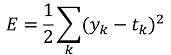 
> 
> 위 식은 오차제곱합의 수식이다.
> 
> 여기서 Yk는 신경망의 출력(신경망이 추정한 값), Tk는 정답 레이블, k는 데이터의 차원 수를 나타낸다.
> 
> ```Python
> y = [ 0.1, 0.05, 0.6, 0.0, 0.05, 0.1, 0.0, 0.1, 0.0, 0.0]
> t = [ 0, 0, 1, 0, 0, 0, 0, 0, 0, 0]
> ```
> 위 배열들의 원소는 첫 번째 인덱스부터 순서대로 0~9일 때의 값이다.
> 
> 여기서 신경망의 출력 y는 소프트맥스 함수의 출력이다. 소프트맥스 함수의 출력은 확률로 해석이 가능하다(전체 합이 1이다.)
> 
> 위의 예에선 2번 인덱스이 값이 0.6 즉 2일 확률이 60%라고 해석 할 수 있다
> 
> 또한 정답 레이블인 t는 정답을 기리키는 원소는 1, 나머지는 0으로 표시한다(one_hot_label), 2에 해당하는 인덱스에 있는 원소의 값이 1이므로 정답이 2인 것을 알 수 있다.
> 
> 위 과정은 오차제곱합을 구하기 위해 복습한 것이다
> 
> 오차제곱합은 바로 위의 그림의 식과 같이 각 원소의 출력(추정 값)과 정답 에이블(참 값)의 차(Yk-Tk)를 제곱한 후 그 총합을 구한다.
> ```Python
> def sum_squares_error(y, t):
>     return 0.5 * np.sum((y-t)**2)
> ```
> 위 코드는 파이썬을 이용해 오차제곱합을 구현한 것이다.
> 
> 여기서 인수 y와 t는 넘파이 배열바로 사용해 본다.
> ```Python
> t = [ 0, 0, 1, 0, 0, 0, 0, 0, 0, 0] # 정답 2
> y = [ 0.1, 0.05, 0.6, 0.0, 0.05, 0.1, 0.0, 0.1, 0.0, 0.0] # 2의 확률이 가장 높게 추정하였다.
> 
> sum_squares_error(np.array(y), np.array(t)) # 0.097500000000000031
> 
> y = [ 0.1, 0.05, 0.1, 0.0, 0.05, 0.1, 0.0, 0.6, 0.0, 0.0]# 7의 확률이 가장 높게 추정하였다.
> sum_squares_error(np.array(y), np.array(t)) # 0.59750000000000003
> ```
> 두가지 예시를 봤다 첫 번째 예시는 정답과 신경망 출력이 모두 2에서 가장 높은 경우다.
> 
> 두 번째 예시는 정답은 마찬가지로 2이지만 신경망 출력이 7에서 가장 높을 때다.
> 
> 첫 번째 예의 손실 함수 쪽 출력이 작그며 정답 레이블과의 오차 또한 작은 것을 알 수 있다. 즉 오차제곱합 기준으로는 첫 번째 추정 결과가(오차가 더 작으므로) 정답에 가까울 것으로 판단할 수 있다.
> 
---
##### 2021_3_19
---
> #### 4.2.2 교차 엔트로피 오차
> 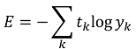 
> 위 식은 교차 엔트로피 오차의 식이다.
> 
> 여기서log는 밑이 e인 자연로그이다. Yk는 신경망의 출력. Tk는 정답 레이블(원-핫 인코딩된)이다.
> 
> 그래서 위 식은 실질적으로 정답일 때의 추정(Tk가 1일때의 Yk)의 자연로그를 계산하는 식이 된다.(정답이 아닌 나머지는 모두 0이기 때문에 곱하여도 0이되거 결과에 영향을 주지 않는다.)
> 
> 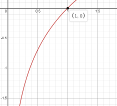 
>
> 위 그림은 자연로그의 그래프다
> 
> 그림에서 보듯 x가 1일 때 y는 0, x가 0에 가까워질수록 y의 값은 점점 작아진다.
> 
> 위에서 본 식 또한 정답에 해당하는 출력이 커질수록 0에 다가가다 해당 출력이 1일때 0이 된다. 반대로 정답일 때의 출력이 작아질수록 오차가 커진다.
> 
> ```Python
> def cross_entropy_error(y, t)
>     delta = 1e-7
>     return -np.sum(t * np.log(y + delta))
> ```
> 위 식은 교차 엔트로피 오차를 코드로 구현한 것이다. 여기서 y와 t는 넘파이 배열이다.
> 
> 코드 마지막 부분을 보면 np.log계산할 때 아주 작은 값인 delta를 더했다. 이는 np.log()함수에 0을 입력하면 마이너스 무한대를 뜻하는 -inf가 되어 더이상 계산이 불가능 하기 때문이다.
> - 아주 작은 값을 더해 절대로 0이 되지 않도록 => 마이너스 무한대 발생 방지
> 
> 이제 위의 코드를 테스트 해본다.
> ```Python
> t = [ 0, 0, 1, 0, 0, 0, 0, 0, 0, 0] # 정답 2
> y = [ 0.1, 0.05, 0.6, 0.0, 0.05, 0.1, 0.0, 0.1, 0.0, 0.0]
> cross_entropy_error(np.array(y), np.array(t)) # 0.51082545709933802
> 
> y = [0.1, 0.05, 0.1, 0.0, 0.05, 0.1, 0.0, 0.6, 0.0, 0.0]
> cross_entropy_error(np.array(y), np.array(t)) # 2.3025840929945458
> ```
> 첫 번째 예시는 정답일 때의 출력이 0.6 인 경우로 이때의 교차 엔트로피 오차는 약 0.51이다.
> 
> 두 번째 예시는 정답일 때의 출력이 더 낮은(0.1)인 경우로 교차 엔트로피 오차는 2.3 으로 더 크다.
> 
> 즉 결과(오차 값)가 더 작은 첫 번째 추정이 정답일 가능성이 더 높다고 판단한 것이며 앞선 오차제곱합의 판단과 일지한다.
> 
> #### 4.2.3 미니배치 학습
> 
> 지금 까지는 데이터 하나에 대한 손실 함수만 생각했지만 지금 부터는 훈련 데이터 모두에 대한 손실 함수의 합을 구하는 방법을 생각해본다.
> 
> 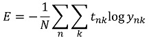
>
> 위 식은 교차 엔트로피 오차에 적용한 식이다.
> 
> 이때 데이터가 N개라면 t_(nk)는 n번째 데이터의 k번째 값을 의미한다.(y_(nk)는 신경망의 출력, t_(nk)는 정답 레이블이다.)
> 
> 식이 복잡해 보이지만 사실 단순히 데이터 하나에 대한 손실 함수인 교차 엔트로피 오차의 식을 N개의 데이터로 확장했을 뿐이다.
> 
> 다만 마지막에 N으로 나누어 정규화 하고 있다. N으로 나눔으로써 '평균 손실 함수'를 구하는 것이다.
> 
> 이렇게 평균을 구해 사용하면 훈련 데이터 개수와 관계없이 언제든 통일된 지표를 얻을 수 있다.
> - 훈련 데이터가 1,000개든 10,000개든 상관없이 평균 손실 함수를 구할 수 있다.
> 
> 하지만 모든 데이터를 대상으로 손실함수의 합을 구하기는 시간이 오래 걸린다.
> - 데이터의 양이 많아지기 때문.(ex. 빅데이터)
>
> 이런 경우 데이터를 일부분 추려 전체의 근사치로 이용할 수 있다.
> 
> 신경망 학습에서도 훈련 데이터로부터 일부만 골라 학습을 수행한다. 이 일부를 **미니배치**라고 한다.
> - 60,000장의 훈련 데이터 중 100장을 무작위로 뽑아 해당 100장만 사용하여 학습한다. => 미니배치 학습
> 
> ```Python
> import sys, os
> sys.path.append(os.pardir) # 부모 디렉터리의 파일을 가져올 수 있도록
> from dataset.mnist import load_mnist
> 
> (x_train, t_train), (x_test, t_test) = load_mnist(normalize=False, one_hot_label=True)
> 
> print(x_train.shape) # (60000, 784)
> print(t_train.shape) # (60000, 10) # 원-핫 인코딩했으니까 (0~9중 정답에만 1 나머지 0이니까 뒤에 10이 생긴거)
> ```
> 위 코드는 실습을 진행하기 위해 MNIST데이터 셋을 읽어오는 코드다 3장에서도 사용을 했다.
> 
> ```Python
> train_size = x_train.shape[0]
> batch_size = 10
> batch_mask = np.random.choice(train_size, batch_size)
> x_batch = x_train[batch_mask]
> t_batch = t_train[batch_mask]
> ```
> 위 코드는 batch_size에 입력한 값 만큼 무작위로 빼내는 코드다.
> 
> np.random.choice()로 지정한 범우의 수 중 무작위로 원하는 개수를 획득 할 수 있다.
> - np.random.choice(60000, 10) 은 0이상60000미만의 수 중 무작위로 10개를 획득한다.
> 
> 이제 무작위로 선택한 인덱스를 이용해 미니배치를 뽑아낼 것이다. 손실 함수 또한 미니배치로 계산한다.
> 
> #### 4.2.4 (배치용)교차 엔트로피 오차 구현하기
> 미니배치와 같은 배치 데이터를 지원하는 교차 엔트로피 오차를 구현하기 위해선 위에서 하나씩 처리하는 교차 엔트로피 오차를 구현한 것에서 아래와 같이 수정하면 된다.
> ```Python
> def cross_entropy_error(y, t)
>     if y.ndim == 1:
>         t = t.reshape(1, t.size)
>         y = y.reshape(1, y.size)
> 
>     batch_size = y.shape[0]
>     return -np.sum(t * np.log(y + 1e-7))/batch_size
> ```
> 데이터가 하나인 경우와 데이터가 배치로 묶여 입력된 경우 모두 처리 가능하도록 하였다.
> 
> y는 신경망의 출력, t는 정답 레이블이다. y가 1차원 이라면(데이터 하나당 교차 엔트로피 오차를 구하는 경우) reshape함수로 데이터의 형상을 바꿔준다.
> 
> 그리고 배치의 크기를 나눠 정규화 하고 이미지 1장당 평균 교차 엔트로피 오차를 계산한다.
> 
> 정답 레이블이 원-핫 인코딩이 아닌 '2' 또는 '7'등의 숫자 레이블로 주어졌을 때의 교차 엔트로피 오차는 아래 코드와 같이 구현할 수 있다.
> ```Python
> def cross_entropy_error(y, t)
>     if y.ndim == 1:
>         t = t.reshape(1, t.size)
>         y = y.reshape(1, y.size)
> 
>     batch_size = y.shape[0]
>     return -np.sum(np.log(y[np.arange(batch_size), t] + 1e-7)) / batch_size
> ```
> 위의 구현에서는 원-핫 인코딩일 때 t가 0인 원소는 교차 엔트로피 오차 또한 0이므로 해당 계산은 무시해도 좋다는 것이 핵심이다.
> - 정답에 해당하는 신경망의 출력만 교차 엔트로피 오차를 계산할 수 있다 그래서 원-핫 인코딩 시 ```t * np.log(y)```였던 부분을 레이블 표현일 때는 ```np.log(y[np.arange(batch_size), t]```로 구현한다.
> 
> ```np.log(y[np.arange(batch_size), t]```중 ```np.arange(batch_size)```는 0부터 batch_size-1까지의 배열을 생성한다.
> - batch_size가 5라면 [0, 1, 2, 3, 4]라는 넘파이 배열을 생성하는 것이다.
> 
> t에는 레이블이 [2, 7, 0, 9, 4]의 형식으로 저장되어 있다
> - 즉 ```np.log(y[np.arange(batch_size), t]```는 각 데이터의 정답 레이블에 해당하는 신경망의 출력을 추출한다.[y[0,2], y[1,7], y[2,0], y[3,9], y[4,4]] 인 넘파이 배열을 생성하는 것이다.
> 
--- 
##### 2021_3_23
---
> #### 4.2.5 왜 손실 함수를 설정하는가?
> 정확도를 지표로 하면 매개변수의 미분이 대부분의 장소에서 0이 되어 매개변수를 갱신할 수 없기 때문에 손실함수를 사용한다.
> 
> 
> 
> 계단 함수의 미분은 위 그림에서 직선으로 구성된 그래프와 같이 대부분의 구간에서 0이다. 그로인해 계단 함수를 이용하면 손실 함수를 지표로 삼는 게 아무 의미가 없다.
> - 매개변수의 작은 변화가 주는 파장을 계단 함수가 말살하여 손실 함수의 값에는 아무변화가 나타나지 않기 때문이다.
> 
> 계단 함수가 한순간만 변화를 일이키는 것에 비해 위 그림에서 곡선으로 구성된 그래프인 시그모이드 함수의 미분은 출력(세로축)이 연속적으로 변화하고 곡선의 기울기 또한 연속적으로 변화한다.
> 
> 또한 시그모이드 함수의 미분은 어느 장소라고 0이 되지 않으며 이 성질은 신경망 학습에서 중요한 성질히며 기울기가 0이 되지 않기 때문에 신경망이 올바로 학습이 가능하다.
> 
> #### 4.3 수치 미분
> 경사법에서는 기울기(경사) 값을 기준으로 나아갈 방향을 정한다.
> 
> #### 4.3.1 미분
> 
> 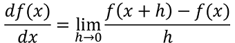
>
> 위 식은 함수의 미분을 나타낸 것이다. 좌변은 f(x)의 x에 대한 미분(x에 대한f(x)의 변화량)을 나타내는 기호다.
> - 즉 x의 '작은 변화'가 함수 f(x)를 얼마나 변화시키느냐를 의미함
> 
> - 이 때 시간의 작은 변화는 시간을 뜻하는 h를 한없이 0에 가깝게 한다는 의미로 lim_(h->0)을 사용
> 
> ```Python
> def numerical_diff(f, x):
>     h = 10e-50
>     return (f(x + h) - f(x)) / h
> ```
> 위의 식과 같이 h에 작은 값을 대입해 계산할 수도 있다.
> 
> 하지만 위 식은 2가지 문제가 있다
> 
>> 첫 번째로 'h = 10e-50' 는 소수점 아래 0이49개 라는 뜻이다 0.00..1 하지만 이 방식은 반올림 오차를 발생시킨다.
>> 
>> 너무 작은 값이기 때문에 np.float32(1e-50)의 값이 0.0이되어 올바로 표현할 수가 없다.
>> - 너무 작은 값을 이용하면 컴퓨터로 계산하는데 문제가 생긴다.
>> 
>> 이를 위해 10^(-4)정도의 값을 사용하는것이 가장 좋은 결과를 얻는다고 알려져 있다.
>> 
>> 두 번째 문제는 함수 f의 차분(임의 두 점에서 함수 값들의 차이)관련 문제다.
>>  
>> 진정한 미분은 x위치의 함수의 기울기(접선)에 해당하지만 지금 구현에서 미분은 (x+h)와 x사이의 기울기에 해당하기 때문이다.
>> 
>> 이 차이는 h를 무한히 0으로 좁히는 것이 불가능해 생기는 한계다.
>> 
>> 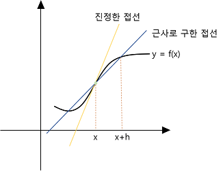
>>
>> 위 그림과 같이 수치 미분에는 오차가 포함된다. 그 오차를 줄이기 위해(x+h)와 (x-h)일 때의 함수 f의 차분을 계산하는 방법을 쓰기도 한다.
>> 
>> 이 차분은 x를 중심으로 그 전후의 차분을 계산한다는 의미에서 중심 차분 혹은 중앙 차분이라 한다
>> -  (x + h)와 x의 차분은 전방 차분이라한다.
>
> 위 두가지 문제점을 개선해 아래와 같이 수치미분을 다시 구현한다.
> ```Python
> def numerical_diff(f, x):
>     h = 1e-4
>     return (f(x + h) - f(x - h)) / (2*h)
> ```
> 
> #### 4.3.2 수치 미분의 예
> 앞의 수치 미분을 사용하여 간단한 함수를 미분해본다.
> 
> 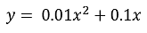
> 
> 위 식을 아래와 같이 파이썬을 이용해 구현하고 그래프를 그려본다.
> ```Python
> import numpy as np
> import matplotlib.pylab as plt
> def function_1(x):
>     return 0.01*x**2 + 0.1*x
> 
> x = np.arange(0.0, 20.0, 0.1)
> y = function_1(x)
> plt.xlabel("x")
> plt.ylabel("f(x)")
> plt.plot(x, y)
> plt.show()
> ```
> 
> 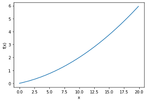
> 
> 위와 같이 그래프가 그려지는 것을 확인할 수 있다.
> 
> 위에서 사용한 식의 해석적 해는 0.02x+0.1이다 또한 위 코드를 이용해 x=5, x=10일때 계산해 본다면 0.1999999999990898, 0.2999999999986347이다. 
> - 진정한 미분은 해석적 해를 이용해 계산하면 차례로 0.2, 0.3이다 오차가 매우 작음을 알 수 있다.
> 
> 이제 앞에서 구한 수치 미분 값을 기울기로 하는 직선을 그린다 결과는 아래 그림과 같다.
>
> 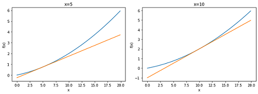
> 
> 위 그림을 통해 함수의 접선애 해당하는 것을 확인할 수 있다.
> 
> #### 4.3.3 편미분
> 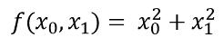
> 
> 위 식은 인수들의 제곱 합을 계산하는 단순한 식이지만 앞의 예와 달리 변수가 2개라는 점에 주의해야한다.
> 
> 코드로 구현한다면 아래와 같다.
> ```Python
> def function_2(x):
>     return x[0]**2 + x[1]**2 # 또는 np.sum(x**2)
> ```
> 인수 x는 넘파이 배열이라고 가정한다. 위 코드는 넘파이 배열의 각 원소를 제곱하고 그 합을 구하는 간단한 구현이다. 그래프로 그린다면 아래와 같다.
> 
> 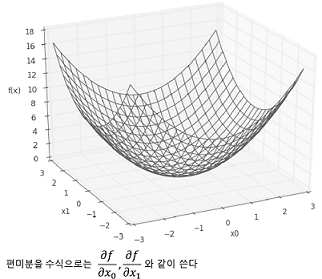
> 
> 이제 미분을 해야한다 하지만 변수가 2개이기 때문에 어느 변수에 대한 미분인지 구별해야한다.
> - 이처럼 변수가 여럿인 함수에 대한 미분을 편미분이라 한다.
> 
>> 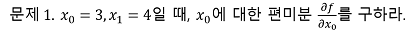
>> 
>> ```Python
>> def function_tmp1(x0):
>>     return x0*x0 + 4.0**2.0
>> 
>> numerical_diff(function_tmp1, 3.0) # 6.00000000000378
>> ````
>> 
>> 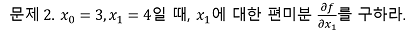
>> 
>> ```Python
>> def function_tmp2(x1):
>>     return 3.0**2.0 + x1*x1
>> 
>> numerical_diff(function_tmp2, 4.0) # 7.999999999999119
>> ````
>> 
>> 위 문제들은 변수가 하나인 함수를 저으이하고 그함수를 미분하는 형채로 구현하여 풀었다.
>> - 문제 1에서 x_1=4로 고정된 새로운 함수를 정의하고 변수가 x_0하나 뿐인 함수에 대해 수치 미분 함수를 적용하였다.
>> 
>> 그리고 각각의 결과는 해석적 미분의 결과와 거의 같은것을 확인할 수 있다.
>> 
>> 이와같이 편미분은 변수가 하나인 미분과 마찬가지로 특정 장소릐 기울기를 구한다.
>> - 단 여러 변수 중 목표 변수 하나에 초점을 맞추고 다른 변수는 값을 고정한다
>> 
>> 앞의 예에서 목표 변수를 제외한 나머지를 특정 값에 고정시키기 위해 새로운 함수를 정의했다 그리고 그 새로 정의한 함수에 대해 그동안 사용한 수치 미분 함수를 적용해 편미분을 구한 것이다.
>
---
##### 2021_3_24
---
> #### 4.4 기울기
> 모든변수의 편미분을 벡터로 정리한 것을 기울기 라고 하며 아래와 같이 구현할 수 있다.
> ```Python
> def numerical_gradient(f, x)
>     h = 1e-4 # 0.0001
>     grad = np.zeros_like(x) # x와 형상이 같은 배열을 생성
>     
>     for iddx in range(x.size):
>         tmp_val = x[idx]
>         
>         # f(x+h)계산
>         x[idx] = tmp_val + h
>         fxh1 = f(x)
>         
>         # f(x-h)계산
>         x[idx] = tmp_val - h
>         fxh2 = f(x)
>
>         grad[idx] = (fxh1 - fxh2) / (2*h)
>         x[idx] = tmp_val # 값 복원
>     
>     return grad
> ```
> numerical_gradient(f, x)함수의 구현은 복잡하게 보이지만 동작방식은 변수가 하나일 때의 수치 미분과 거의 유사하다.
> - np.zeros_like(x)는 x와 형상이 같고 그 원소가 모두 0인 배열을 생성한다.
> 
> numerical_gradient(f, x) 함수의 인수인 f는 함수이고 x는 넘파이 배열이다
> 
> 넘파이 배열 x의 각 원소에 대해 수치 미분을 구한다.
> - 위에서 작성한 함수를 이용해 실제 기울기를 계산해 본다(세 점 (3,4), (0,2), (3,0))
> ```Python
> numerical_gradient(function_2, np.array([3.0, 4.0])) # array([ 6., 8.]) *
> numerical_gradient(function_2, np.array([0.0, 2.0])) # array([ 0., 4.])
> numerical_gradient(function_2, np.array([3.0, 0.0])) # array([ 6., 0.])
> ```
> 위와같이 각 점에서의 기울기를 계산할 수 있다.
> 
> 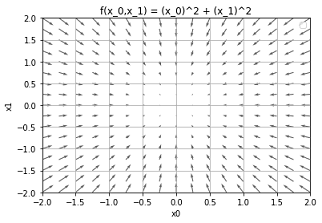
>
> 기울기 그림은 위 그림처럼 방향을 가진 벡터(화살표)로 그려진다. 위 그림을 보면 기울기는 함수의 '가장 낮은 장소(최솟값)'를 가리키는 것으로 보인다.
> - 화살표들이 한 점을 향하고 있다.
> 
> 또한 '가장 낮은 곳'에서 멀어질수록 화살표의 크기가 커지는 것을 알 수 있다.
> 
> 기울기는 가장 낮은 장소를 가리키지만 실제로는 반드시 그렇다고 할 수는 없다고 한다.
> 
> 사실 기울기는 각 지넘에서 낮아지는 방향을 가리킨다 정확히 말하면 
> 
> **기울기가 가리키는 쪽은 각 장소에서 함수의 출력 값을 가장 크게 줄이는 방향**이다.
> 
> #### 4.4.1 경사법(경사 하강법)
> 기계학습 문제 대부분은 학습 단계에서 최적의 매개변수를 찾아낸다.
> 
> 신경망 또한 최적의 매개변수(가중치, 편향)을 찾아햐한다.
> - 최적이란 손실 함수가 최솟값이 될 때의 매개변수 값이다.
> 
> - 일반적인 문제의 손실 함수는 매우 복잡하다. 매개변수 공간이 광대해 어디가 최솟값이 되는 곳인지 짐작하기 힘들기 때문
> 
> 이러한 상황에서 기울기를 잘 이용해 함수의 최솟값(또는 가능한 가장 작은 값)을 찾으려는 것이 **경사법**이다.
> 
> 여기서 주의할 점은 각 지점에서 한수의 값을 낮추는 방안을 제시하는 지표가 기울기라는 점이다.
> - 기울기가 가리키는 곳에 정말 함수의 최솟값이 있는지(그쪽이 정말로 나아갈 방향인지) 보장할 수 없다.
> 
> - 실제로 복잡한 함수에서는 기울기가 가리키는 방향에 최솟값이 없는 경우가 대부분이라고 한다.
> 
>> 함수가 극솟값, 최솟값, 또 [**안장점**](https://ko.wikipedia.org/wiki/%EC%95%88%EC%9E%A5%EC%A0%90)이 되는 장소에서는 기울기가 0이다. 극솟값은 국소적인 최솟값. 즉 한정된 범위에서의 최솟값인 점이다.
>> 
>> 안장점은 보는 방향에 따라 극댓값과 극솟값이 되는 점이다. 경사법은 기울기가 0인 장소를 찾지만 그것이 반드시 최솟값이라고 할 수는 없다.(극솟값이나 안장점일 가능성이 있다.)
>> 
>> 또, 복잡하고 찌그러진 모양의 함수(대부분)라면 평평한 곳으로 파고들며 **고원**(plateeu)이라 하는 학습이 진행되지 않는 정체기에 빠질 수 있다.
>
> 기울어진 방향이 꼭 최솟값을 가리키는 것은 아니지만 그 방향으로 가야 함수의 값을 줄일 수 있다.
> - 그래서 최솟값이 되는 장소를 찾는 문제(아니면 가능한 한 작은 값이 되는 장소를 찾는 문제)에서는 기울기 정보를 단서로 나아갈 방향을 정해야 한다.
> 
> 이를 위해 **경사법**을 사용한다.
>> 경사법은 현 위치에서 기울어진 방향으로 일정 거리만큼 이동한다.
>> 
>> 그 다음 이동한 곳에서도 마찬가지로 기울기를 구하고 다시 기울어진 방향으로 나아가는 것을 반복한다.
>> 
>> 이 과정을 통해 함수의 값을 점차 줄여나간다.
>>
> 위 과정과 같이 함수의 값을 점차 줄이는 것이 **경사법**이며 경사법은 기계학습을 최적화하는 데 흔히 쓰는 방법이다.
> - 특히 신경망 학습에는 경사법을 많이 사용한다.
> 
>> 경사법은 최솟값을 찾는경우 **경사 하강법** 최댓값을 찾는경우 **경사 상승법**이라한다.
>> 
>> 손실 함수의 부호를 반천시키면 최솟값을 찾는 문제와 최댓값을 찾는 문제는 같다.
>> 
>> 일반적으로 신경망(딥러닝) 분야에서의 경사법은 '경사 하강법'으로 등장하는 경우가 많다.
>> 
> 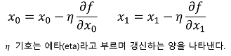
>
> 위 식은 경사법의 식이다, 에타를 신경망 학습에서는 **학습률**이라한다.
> - 한번의 학습으로 얼마만큼 학습해야 할지(매개변수 값을 얼마나 갱신해야는지) 정하는 것이 학습률이다.
> 
> 위 식은 1회에 해당하는 갱신이고 이 단계를 반복한다, 즉 위 식처럼 변수의 값을 생신하는 단계를 여러 번 반복하면서 서서히 함수의 값을 줄이는 것이다.
> - 여기선 2개의 변수인 경우지만 변수의 수가 늘어도 같은 식(각 변수의 편미분 값)으로 갱신하게 된다.
> 
> 또한 학습률은 0.01이나 0.001등 미리 특정 값으로 정해두어야 한다.
> 
> 일반적으로 값이 너무 크거나 작으면 '좋은 장소'를 찾아갈 수 없기때문에 신경망 학습에선 이 학습률 값을 변경하며 올바르게 학습하고 있는지 확인하며 진행한다.
> 
> 경사 하강법은 아래와 같이 구현할 수 있다.
> ```Python
> def gradient_descent(f, init_x, lr=0.01, step_num=100):
>     x = init_x
>     
>     for i in range(step_num):
>         grad = numerical_gradient(f,x)
>         x -= lr * grad
>     return x
> ```
> 인수f는 최적화하려는 함수, init_x는 초깃값, lr은 [learning rate](https://bioinformaticsandme.tistory.com/130)를 의미하는 학습률, step_num은 경사법에 따른 반복 횟수를 뜻한다.
> 
> 함수의 기울기는 numerical_gradient(f,x)로 구하고 그 기울기에 학습률을 곱한 값으로 갱신하는 처리를 step_num번 반복한다.
> 
> 위 코드를 이용해 함수의 극솟값을 구할 수 있고 잘하면 최솟값을 구할 수도 있다.
> 
> 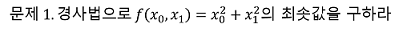
> 
> ```Python
> def function_2(x):
>     return x[0]**2 + x[1]**2
> 
> init_x = np.array([-3.0, 4.0])
> def gradient_descent(function_2, init_x=init_x, lr=0.1, step_num=100)
> # array([ -6.11110793e-10, 8.14814391e-10])
> ```
> 여기선 초기값을 (-3.0, 4.0)로 설정한 후 경사법을 사용해 최솟값을 탐색한다.
> 
> 최종 결과는 거의 (0, 0)에 가가운 결과다. 실제로 진행항 최솟값은 (0, 0)이므로 경사법은 거의 정확한 결과를 얻은 것이다.
> 
> 경사법을 사용한 이 갱신 과정을 그림으로 나타내면 아래 그림 처럼 된다.
> 
> 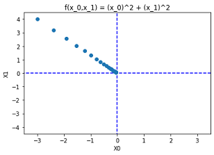
>
> 값이 가장 낮은 장소인 원점에 점차 가까워 지고 있다.
> 
>> 학습률이 너무 크거나 낮은 경우는 좋은 결과를 얻을 수 없다.
>> 
>> 큰 경우는 큰 값으로 발산하고 작은 경우는 거의 갱신되지 않은체 종료하게 된다.
>
---
#### 3/27
---
> #### 4.4.2 신경망에서 기울기
> 신경망 학습에서도 기울기를 구해야한다.
> - 여기서 말하는 기울기는 가중치 매개변수에 대한 손실 함수의 기울기다.
>> 예시로 형상이 2X3, 가중치가 W, 손실 함수가 L인 신경망을 생각해 볼 때 𝜕L/𝜕W로 나태날 수 있으며 수식으로는 아래와 같다.
> 
> 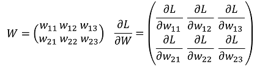
> 
> 𝜕L/𝜕W의 각 원소는 각각의 원소에 관한 편미분이다. 
> - 예를 들어 1행 1번째 원소의 w_11을 변경 하였을 때 손실 함수 L이 얼마나 변화하는지 나타낸다.
> 
> - 여기서 중요한 점은 𝜕L/𝜕W의 형상이 W와 같다는 점이다.(실제로 위 식에서 W와 𝜕L/𝜕W의 형상은 모두 2X3이다.)
> 
> 아래는 간단한 신경망을 예로들어 실제로 기울기를 구하는 코드를 구현한 것이다.
> ```Python
> import sys, os
> sys.path.append(os.pardir)
> import numpy as np
> from common.functions import softmax, cross_entropy_error
> from common.gradient import numerical_gradient
> 
> class simpleNet:
>     def __init__(self):
>         self.W = np.random.randn(2,3) # 정규분포로 초기화
> 
>     def predict(self, x):
>         return np.dot(x, self.W)
> 
>     def loss(self, x, t):
>         z = self.predict(x)
>         y = softmax(z)
>         loss = cross_entropy_error(y, t)
> 
>         return loss
> ```
> 위 코드에선 예제 폴더에 있는 common/functions.py에 정의한 softmax와 cross_entropy_error 메서드를 사용한다.
> 
> 또한 common/gradient.py에 정의한 numerical_gradient 메서드도 이용한다.
> 
> simpleNet 클래스는 형상이 2X3인 가중치 매개변수 하나를 [인스턴스 변수](https://wikidocs.net/1744)로 갖는다.
> 
> 메서드는 2개다.
> - predict(x) 는 예측을 수행한다.
> 
> - loss(x,t) 는 손실 함수의 값을 구한다.
> 
> 인수 x는 입력 데이터, t는 정답 레이블이다.
> ```Python
> x = np.array([0.6, 0.9]) # 입력 데이터
> t = np.array([0, 0, 1]) # 정답 레이블
> 
> net = simpleNet()
> 
> f = lambda w: net.loss(x, t)
> dW = numerical_gradient(f, net.W) # 기울기
> 
> print(net.W) # 가중치 매개변수
> print(dW) 
> p = net.predict(x) # 예측
> print(p)
> print(np.argmax(p)) # 최댓값의 인덱스
> print(net.loss(x,t)) # 손실 함수의 값
> 
> ''' 실행결과
> [[ 1.318572   -2.09024228 -1.05120929] => print(net.W)
> [ 0.40789182  1.11277335 -0.46496514]]
> [[ 0.01129628  0.36169778 -0.37299406] => print(dW)
>  [ 0.01694443  0.54254667 -0.55949109]]
> [-1.61301654  1.8533186   1.38748507] => print(p)
> 1 => print(np.argmax(p))
> 0.9719536539973302 => print(net.loss(x,t))
> '''
> ```
> 위와같이 임의의 값을 이용해 simpleNet클래스에 대한 테스트를 해보았다.
> 
> 기울기를 구하는것은 지금까지 처럼 numerical_gradient(f,x)를 사용해 구라면 된다.
> - 여기서 정의한 f(W)함수의 인수 W는 더미로 만든 것이다. numerical_gradient(f,x)내부에서 f(x)를 실행하는데 일관성을 위해 f(W)를 정의한 것.
> 
> 신경망의 기울기를 구한 다음에는 경사법에 따라 가중치 매개변수를 갱신하기만 하면 된다.
> 
---
3/30
---
> #### 4.5 학습 알고리즘 구현하기
> 신경망 학습의 절차는 아래와 같다.
> 
> **전제**
>> 신경망에는 적응 가능한 가중치와 편향이 있고, 이 가중치와 편향을 훈련 데이터에 적응하도록 조정하는 과정을 '학습'이라 한다. 
>>
>> 신경망 학습은 아래와 같이 4단계로 수행한다.
>>
>> **1단계-미니배치**
>>> 훈련 데이터 중 일부를 무작위로 가져온다. 이렇게 선별한 데이터를 미니배치라 하며 미니배치의 손실 함수 값을 줄이는 것이 목표다.
>>
>> **2단계-기울기 산출**
>>> 미니배치의 손실 함수 값을 줄이기 위해 각 가중치 매개변수의 기울기를 구한가. 기울기는 손실 함수의 값을 가장 작게 하는 방향을 제시한다.
>>
>> **3단계-매개변수 갱신**
>>> 가중치 매개변수를 기울기 방향으로 아주 조금 갱신한다.
>>
>> **4단계-반복**
>>> 1~3단계를 반복한다.
>>
> 위 단계가 신경망 학습이 이뤄지는 순서다. 이는 경사 하강법으로 매개변수를 갱신하는 방법이며, 이때 데이터를 미니배치로 무작위로 선정하기 때문에 [**확률적 경사 하강법**](https://go-hard.tistory.com/11)이라 부른다.
> - '확률적으로 무작위로 골라낸 데이터'에 대해 수행하는 경사 하강법이라는 의미
> 
> -  대부분의 딥러닝 프레임워크에선 확률적 경사 하강법(Stochastic Gradient Descent)의 영어 머리 글자를 따서 SGD라는 함수로 해당 기능을 구현하고 있다.
>
> #### 4.5.1 2층 신경망 클래스 구현하기
> 손글씨 숫자를 학습하는 신경망을 구현해 본다. 2층 신경망(은닉층이 1개인 네트워크)을 대상으로 MNIST데이터 셋을 사용해 학습을 수행한다.
> 
> 처음엔 2층 신경망을 하나의 클래스로 구현하는 것 부터 시작한다.
> ```Python
> import sys, os
> sys.path.append(os.pardir)  # 부모 디렉터리의 파일을 가져올 수 있도록 설정
> from common.functions import *
> from common.gradient import numerical_gradient
> import numpy as np
> 
> class TwoLayerNet:
> 
>     def __init__(self, input_size, hidden_size, output_size, weight_init_std=0.01):
>         # 가중치 초기화
>         self.params = {}
>         self.params['W1'] = weight_init_std * np.random.randn(input_size, hidden_size)
>         self.params['b1'] = np.zeros(hidden_size)
>         self.params['W2'] = weight_init_std * np.random.randn(hidden_size, output_size)
>         self.params['b2'] = np.zeros(output_size)
> 
>     def predict(self, x):
>         W1, W2 = self.params['W1'], self.params['W2']
>         b1, b2 = self.params['b1'], self.params['b2']
>     
>         a1 = np.dot(x, W1) + b1
>         z1 = sigmoid(a1)
>         a2 = np.dot(z1, W2) + b2
>         y = softmax(a2)
>         
>         return y
>         
>     # x : 입력 데이터, t : 정답 레이블
>     def loss(self, x, t):
>         y = self.predict(x)
>         
>         return cross_entropy_error(y, t)
>     
>     def accuracy(self, x, t):
>         y = self.predict(x)
>         y = np.argmax(y, axis=1)
>         t = np.argmax(t, axis=1)
>         
>         accuracy = np.sum(y == t) / float(x.shape[0])
>         return accuracy
>         
>     # x : 입력 데이터, t : 정답 레이블
>     def numerical_gradient(self, x, t):
>         loss_W = lambda W: self.loss(x, t)
>         
>         grads = {}
>         grads['W1'] = numerical_gradient(loss_W, self.params['W1'])
>         grads['b1'] = numerical_gradient(loss_W, self.params['b1'])
>         grads['W2'] = numerical_gradient(loss_W, self.params['W2'])
>         grads['b2'] = numerical_gradient(loss_W, self.params['b2'])
>         
>         return grads
>         
>     def gradient(self, x, t):
>         W1, W2 = self.params['W1'], self.params['W2']
>         b1, b2 = self.params['b1'], self.params['b2']
>         grads = {}
>         
>         batch_num = x.shape[0]
>         
>         # forward
>         a1 = np.dot(x, W1) + b1
>         z1 = sigmoid(a1)
>         a2 = np.dot(z1, W2) + b2
>         y = softmax(a2)
>         
>         # backward
>         dy = (y - t) / batch_num
>         grads['W2'] = np.dot(z1.T, dy)
>         grads['b2'] = np.sum(dy, axis=0)
>         
>         da1 = np.dot(dy, W2.T)
>         dz1 = sigmoid_grad(a1) * da1
>         grads['W1'] = np.dot(x.T, dz1)
>         grads['b1'] = np.sum(dz1, axis=0)
> 
>         return grads
> ```
> 코드는 위와 같다. 각각의 메서드 설명은 아래 그림과 같다.
> 
> 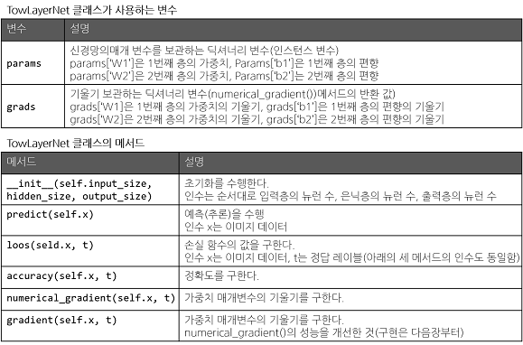
> 
> TowLayerNet 클래스는 딕셔너리인 params와 grads를 인스턴스 변수로 갖는다.
> 
> params 변수엔 가중치 매개 변수가 저장된다.
> - 예 : params[‘W1’]은 1번째 층의 가중치, Params[‘b1’]은 1번째 층의 편향이 저장된다.
> ```Python
> net = TowLayerNet(input_size = 784, hidden_size = 100, output_size = 10)
> net.params['W1'].shape # (784, 100)
> net.params['b1'].shape # (100,)
> net.params['W2'].shape # (100, 10)
> net.params['b2'].shape # (10,)
> ```
> 위와 같이 params변수엔 신경망에 필요한 매개변수가 모두 저장된다.
> 
> params 변수에 저장된 가중치 매개변수가 예측 처리(순방향 처리)에서 사용된다.
>
> ```Python
> x = np.random.rand(100, 784) # 더미 입력 데이터(100장 분량)
> y = net.predict(x)
> ```
> 예측처리는 위와 같이 실행할 수 있다.
> 
> grads 변수엔 params 변수에 대응하는 각 매개변수의 기울기가 저장된다.
> - 예 : 아래와 같이 numerical_gradient() 메서드를 사용해 기울기를 계산하면 grads변수에 기울기 정보가 저장된다.
>> ```Python
>> x = np.random.rand(100, 784) # 더미 입력 데이터(100장 분량)
>> t = np.random.rand(100, 10) # 더미 정답 레이블(100장 분량)
>> 
>> grads = net.numerical_gradient(x, t)
>> 
>> grads['W1'].shape # (784, 100) 
>> grads['b1'].shape # (100,)
>> grads['W2'].shape # (100, 10)
>> grads['b2'].shape # (10,)
>> ```
> 이어서 TowLayerNet메서드를 살펴본다.
> 
> ```__init__(self.input_size, hidden_size, output_size)``` 메서드
>> 클래스를 초기화 한다.
>> 
>> 초기화 메서드는 TowLayerNet을 생성할 때 불리는 메서드다.
>> 
>> 인수는 순서대로 입력층의 뉴런 수, 은닉층의 뉴런 수, 출력 층의 뉴런 수
>> - 예 : 손글씨 숫자 인식에서는 크기가 28X28인 입력 이미지가 총 784개 이고 출력은 10개가 된다 따라서 input_size=784, output_ size=10으로 지정하고 은닉층의개수인 hidden_size는 적당한 값으로 설정한다.
>> 
>> 해당 초기화 메서드에서는 가중치 매개변수도 초기화한다. 
>> - 가중치 매개변수의 초깃값을 무엇으로 설정하냐가 신경망 학습의 성공을 좌우하기도 한다.
>
> ```predict(self.x, t)```와 ```accuracy(self.x, t)```의 구현은 앞서 본 신경망의 추론 처리와 거의 비슷하다. [(3.6.2절)](https://github.com/minchan5224/TIL/blob/main/Python/Deep_Learning/Deep_01_03.md#362-%EC%8B%A0%EA%B2%BD%EB%A7%9D%EC%9D%98-%EC%B6%94%EB%A1%A0-%EC%B2%98%EB%A6%AC)
> 
> ```loss(self.s, t)```는 손실 함수의 값을 계산하는 메서드다.
> - 이 메서드는 predict()의 결과와 정답 레이블을 바탕으로 교차 엔트로피 오파를 구하도록 구현되었다.
> 
> ```numerical_gradient(self.x, t)```메서드는 각 매개변수의 기울기를 계산한다.
> - 수치 미분 방식으로 각 매개변수의 손실 함수에 대한 기울기를 계산.
> 
> ```gradient(self.x, t)```는 다음장에서 구현.
> - 오차역전파법을 사용해 기울기를 효율적이고 빠르게 계산한다.
> 
> #### 4.5.2 ~ 3 미니배치 학습 구현하기 ~ 시험 데이터로 평가하기
> 신경망 학습 구현에 미니배치 학습을 활용한다.
> - 훈련 데이터 중 일부를 무작위로 꺼내고(미니배치) 그 미니배치에 대해 경사법으로 매개변수를 갱신한다.
> ```Python
> import sys, os
> sys.path.append(os.pardir)  # 부모 디렉터리의 파일을 가져올 수 있도록 설정
> import numpy as np
> import matplotlib.pyplot as plt
> from dataset.mnist import load_mnist
> from two_layer_net import TwoLayerNet
> 
> # 데이터 읽기
> (x_train, t_train), (x_test, t_test) = load_mnist(normalize=True, one_hot_label=True)
> 
> network = TwoLayerNet(input_size=784, hidden_size=50, output_size=10)
> 
> # 하이퍼파라미터
> iters_num = 10000  # 반복 횟수를 적절히 설정한다.
> train_size = x_train.shape[0]
> batch_size = 100   # 미니배치 크기
> learning_rate = 0.1
> 
> train_loss_list = []
> train_acc_list = []
> test_acc_list = []
> 
> # 1에폭당 반복 수
> iter_per_epoch = max(train_size / batch_size, 1)
> 
> for i in range(iters_num):
>     # 미니배치 획득
>     batch_mask = np.random.choice(train_size, batch_size)
>     x_batch = x_train[batch_mask]
>     t_batch = t_train[batch_mask]
>     
>     # 기울기 계산
>     #grad = network.numerical_gradient(x_batch, t_batch)
>     grad = network.gradient(x_batch, t_batch)
>     
>     # 매개변수 갱신
>     for key in ('W1', 'b1', 'W2', 'b2'):
>         network.params[key] -= learning_rate * grad[key]
>     
>     # 학습 경과 기록
>     loss = network.loss(x_batch, t_batch)
>     train_loss_list.append(loss)
>     
>     # 1에폭당 정확도 계산
>     if i % iter_per_epoch == 0:
>         train_acc = network.accuracy(x_train, t_train)
>         test_acc = network.accuracy(x_test, t_test)
>         train_acc_list.append(train_acc)
>         test_acc_list.append(test_acc)
>         print("train acc, test acc | " + str(train_acc) + ", " + str(test_acc))
> print(len(train_loss_list))
> # 그래프 그리기
> 
> markers = {'train': 'o', 'test': 's'}
> x = np.arange(len(train_acc_list))
> plt.plot(x, train_acc_list, label='train acc')
> plt.plot(x, test_acc_list, label='test acc', linestyle='--')
> plt.xlabel("epochs")
> plt.ylabel("accuracy")
> plt.ylim(0, 1.0)
> plt.legend(loc='lower right')
> plt.show()
> 
> # 손실함수 그래프 그리기
> '''
> x = np.arange(len(train_loss_list))
> plt.plot(x, train_loss_list, label='train acc')
> plt.xlabel("iteration")
> plt.ylabel("loss")
> plt.ylim(0, 5)
> plt.show()
> '''
> ```
> TwoLayerNet클래스와 MNIST 데이터셋을 사용하도록 하였다.
> 
> 미니배치의 크기를 100으로 하였다.
> - 60000개의 훈련 데이터에서 임의로 100개의 데이터(이미지, 정답 레이블)를 추려낸 뒤 100개의 미니배치를 대상으로 확률적 경사하강법을 수행해 매개변수를 생신한다.
> 
> 경사법에 의한 갱신 횟수(반복 횟수)를 10,000번 으로 설정, 갱신시마다 훈련 데이터에 대한 손실함수 계산후 배열(리스트)에 저장
> 
> 아래 그림은 손실 함수 값을 이용해 그래프로 나타낸 것이다.
> 
> 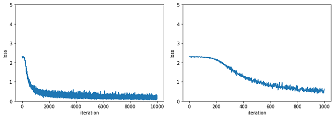
> 
> 위 그림을 보면 학습 횟수가 증가함에 따라 손실 함수의 값이 줄어드는 것을 확인할 수 있다.
> 
> 학습이 정상적으로 이루어지고 있음을 뜻하며 신경망의 가중치 매개변수가 서서히 데이터에 적응함을 의미한다.
> - 신경망이 학습하고 있다, 데이터를 반복 학습해 최적 가중치 매개변수로 다가서고 있다.
> 
> 신경망 학습에선 훈련 데이터 외의 데이터를 올바르게 인식하는지 확인해야 한다.
> - [오버피팅](https://nittaku.tistory.com/289)을 일으키지 않는지 확인해 한다. (훈련한 데이터만 올바로 인식한다)
> 
> 따라서 범용적인 능력을 가지고 있는지 평가해야한다.
> - 훈련 데이터에 포함되지 않은 데이터를 사용
> 
> 이를 위해 학습 도중 정기적으로 훈련 데이터와 시험 데이터를 대상으로 정확도를 기록하며 여기선 1에폭별로 훈련, 시험 데이터에 대한 정확도를 기록한다.
> - 1에폭은 학습에서 훈련 데이터를 모두 소진했을 때의 횟수에 해당
> 
> - 10000개의 훈련 데이터를 100개의 미니배치로 학습할 경우, 확률적 경사 하강법 100회 반복시 모든 훈련 데이터를 소진한 것이 된다. => 100회가 1에폭
> 
> ```Python
> iters_num = 10000  # 반복 횟수를 적절히 설정한다.
> train_size = x_train.shape[0]
> batch_size = 100   # 미니배치 크기
> iter_per_epoch = max(train_size / batch_size, 1) # 1에폭당 반복 수
> ```
> max(a,b)는 a와 b중 더 큰 값 반환한다. 즉 위에선 (10000/100, 1) = (100, 1) = 100
> 
> 정확도를 1에폭 마다 계산하는 이유는 for문 안에서 매번 계산하기엔 시간이 오래 걸리며 매번 기록할 필요도 없기 때문이다.
> 
> 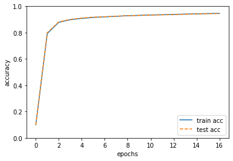
> 
> 위 그림은 훈련 데이터와 시험 데이터에 대한 정확도를 바탕으로 그린 그래프다.
> 
> 훈련 데이터에 대한 정확도는 실선, 시험 데이터에 대한 정확도를 점선으로 나타냈다.
> 
> 에폭(학습)이 진행될수록 훈련 데이터와 시험 데이터를 사용하고 평가한 정확도가 모두 좋아지고 있으며 두 정확도 사이의 차이가 없음을 확인할 수 있다.
> 
> 따라서 이번엔 오버피팅이 발생하지 않았음을 알 수 있다.(시험 데이터에 대한 정확도가 떨어지지 않았다.)
> 
> #### 4.6 정리
> **이번 장에서 배운 내용**
> - 기계학습에서 사용하는 데이터셋은 훈련 데이터와 시험 데이터로 나눠 사용한다.
> 
> - 훈련 데이터로 학습한 모델의 범용 능력을 시험 데이터로 평가한다.
> 
> - 신경망 학습은 손실 함수를 지표로, 손실 함수의 값이 작아지는 방향으로 가중치 매개변수를 갱신한다.
> 
> - 가중치 매개변수를 갱신할 때는 가중치 매개변수의 기울기를 이용하고, 기울어진 방향으로 가중치의 값을 갱신하는 작업을 반복한다.
> 
> - 아주 작은 값을 주었을 때의 차분으로 미분하는 것을 수치 미분이라 한다.
> 
> - 수치 미분을 이용해 가중치 매개변수의 기울기를 구할 수 있다.
> 
> - 수치 미분을 이용한 계산에는 시간이 걸리지만, 그 구현은 간단하다. 다음 장에서 구현하는 오차역전파법(좀 더 복잡함)은 기울기를 고속으로 구할 수 있다.
> 
> 이번 장도 끝. ####  4/1 복습
