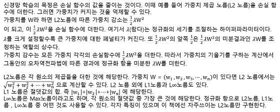
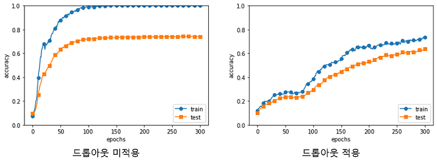

## [밑바닥부터 시작하는 딥러닝]
---
### 목차
- []()
---
#### CHAPTER6_학습 관련 기술들
---
> #### 6.1 매개변수 갱신
> 확률적 경사 하강법(SGD)
> - 매개변수의 기울기(미분)을 구해 기울어진 방향으로 매개변수 값을 갱신하는 일을 반복하여 점점 최적의 값에 다가가는 방법
> 
> 지금까지는 SGD를 이용했지만 이제 SGD의 단점을 알아보고 SGD와 다른 최적화 기법을 학습한다.
> 
> #### 6.1.1 모험가 이야기
> 최적화 해야하는 상황을 모험가에 비유한다.
> 
>> 세상에서 가장 깊고 낮은 골짜기인 '깊은 곳'을 찾아 가려한다 하지만 2가지의 제약이 있다. '지도를 보지 않는것' 과 '눈가리개를 쓰는 것' 이다.
>> 
>> 이러한 제약 조건이 있을 때 이 모험가는 어떻게 '깊은 곳'을 찾아 갈 수 있을까 어떨게 걸음을 옮겨야 효율적으로 '깊은 곳'을 찾아 낼 수 있을 것인가?
>
> 위 상황과 우리의 상황은 비슷하다 또한 위의 상황에서 가장 중요한 단서가 되는 것은 '기울기'다.
> 
> 주위의 시각적인 정보를 습득 할 수 없지만 서있는 땅의 기울기는 알 수 있다.
> 
> 이때 지금 서있는 장소에서 가장 크게 기울어진 방향으로 가는 것이 SGD의 전략이다.
> 
> #### 6.1.2 확률적 경사 하강법(SGD)
> SGD는 수식으로는 아래와 같다. 
>
> 
> 
> 실제로 학습률은 0.01이나 0.001과 같은 값을 미리 정해서 사용하며 '←' 는 우변의 값을 좌변의 값으로 갱신한다는 뜻이다.
> 
> 위 식에서 보듯 SGD는 기울어진 방향으로 일정 거리만 가겠다는 단순한 방법이다.
> 
> 아래는 파이썬을 이용해 SGD를 구현한 코드다.
> 
> ```Python
> class SGD:
>     def __init__(self, lr = 0.01):
>         self.lr = lr
>     
>     def update(self, params, grads):
>         for key in params.keys():
>             params[key] -= self.lr * grads[key]
> ```
> 초기화 때 받는 인수인 lr은 learning rate(학습률)을 뜻한다. 이 학습률은 인스턴스 변수로 유지한다.
> 
> update(params, grads)메서드는 SDG과정에서 반복해서 호출된다. 인스턴스 변수인 params, grads는 딕셔너리 변수다.
> 
> params['W1'], grads['W1']과 같이 각각의 가중치 매개변수와 기울기를 저장하고 있다.
> 
> SGD클래스를 이용하면 신경망 매개 변수의 진행을 아래와 같이 수행할 수 있다.
> ```Python
> network = TwoLayerNet(...)
> optimizer = SGD() #SGD 사용
> for i in range(10000):
>     ...
>     x_batch, t_batch = get_mini_batch(...) #미니배치
>     grads = network.gradient(x_batch, t_batch)
>     params = network.parmas
>     optimizer.update(params, grads)
>     ...
> ```
> optimizer는 '최적화를 행하는 자'라는 뜻의 단어이며 위 코드에선 SGD가 그 역할을 한다.
> 
> 매개변수 갱신은 optimizer가 수행하므로 optimizer에 매개변수 기울기 정보만 넘겨주면 된다.
> 
> 이와같이 최적화를 담당하는 클래스를 분리해 구현하면 기능을 모듈화 하기 좋다.
> - 선언할때만 ```optimizer = SGD()```에서 ```optimizer = 사용할 클래스``` 의 방식으로 바꿔 사용이 가능하다. 
> 
> #### 6.1.3 SGD의 단점
> 다음 함수의 최솟값을 구하는 문제를 푼다.
> 
> 
> 
>  SGD를 이용한다면 결과는 아래와 같이 심하게 굽어진(지그재그가 심한)모습을 보인다.
>
>  
>
> SGD함수의 가장 큰 단점은 위 그림과 같이 비등방성 함수(방향에 따라 성질, 여기선 기울기가 달라지는 함수)에서는 탐색 경로가 비효율적이기 때문이다.
> 
> 이럴 때에는 SGD같이 무작정 기울어진 방향으로 진행하는 단순한 방식말고 다른 방식이 필요해진다.
> - 모멘텀, AdaGrad, Adam등
> 
> #### 6.1.4 모멘텀
> 모멘텀은 운동량을 뜻하는 단어로 물리와 관계가 있으며 식으로 표현하면 아래와 같다.
> 
> 
> 
> 위 식은 기울기 방향으로 힘을 받아 물체가 가속된다는 물리 법칙을 나타내며 공이 그릇의 바닷을 구르는 듯한 움직임을 보여준다.
> 
> 
> 
> 또한 위 식에서 𝛼v항은 물제가 아무런 힘을 받지 않을 때 서서히 하강시키는 역할을 한다(𝛼는 0.9등의 값으로 설정한다). 물리에서 지면의 마찰이나 공기의 저항에 해당한다.
> 
> 아래 코드는 모멘텀의 구현이다. 
> ```Python
> class Momentum:
>     def __init__(self, lr=0.01, momentum=0.9):
>         self.lr = lr
>         self.momentum = momentum
>         self.v = None # 물체의 속도
>         
>     def update(self, params, grads):
>         if self.v is None:
>             self.v = {} # 초기화 시엔 None로 초기화 한 뒤 처음 호출될 때 매개 변수와 같은 구조의 데이터를 딕셔너리 변수로 저장한다.
>             for key, val in params.items():                                
>                 self.v[key] = np.zeros_like(val)
>                 
>         for key in params.keys():
>             self.v[key] = self.momentum*self.v[key] - self.lr*grads[key] 
>             params[key] += self.v[key]
> ```
> 이제 모멘텀을 이용해 풀면 아래와 같은 결과가 나온다.
> 
> 
> 
> 그림에서 보듯 모멘텀의 갱신 경로는 SGD에 비해 지그재그 정도가 덜하며 그릇 바닥을 구르듯 움직이는 것을 볼 수 있다.
> 
> 이는 x축의 힘은 아주 작지만 방향은 변하지 않아서 한 방향으로 일정하게 가속하기 때문이다. 
> 
> 그 반대로 y축의 힘은 크지만 위아래로 번갈아 받아 상충하여 y축 방향의 속도는 안정적이지 않다.
> 
> 전체적으로는 SGD보다 x축 방향으로 빠르게 다가가 지그재그 움직임이 줄어든다.
> 
> #### 6.1.5 AdaGrad
> 신경망 학습에선 학습률 값이 중요하다. 값이 너무 작으면 학습 시간이 매우 길어지고 너무 크면 학습이 제대로 이루어지지 않는다.
> 
> 학습률을 정하는 효과적 기술로 **학습률 감소**가 있다. 
> 
> 학습을 진행하면서 학습률을 점차 줄여가는 방법이다
> - 처음엔 크게 학습하다 조금식 작게 학습하는 방식이며 실제 신경망 학습에 자주 사용된다.
> 
> 학습률을 서서히 낮추는 가장 간단한 방법은 매개변수'전체'의 학습률 값을 일괄적으로 낮추는 것이며 이를 더욱 발전시킨 것이 AdaGrad이다.
> - AdaGrad 는 '각각의' 매개변수에 '맞춤형' 값을 만들어 준다.
> 
> AdaGrad 는 개별 매개변수에 적응적으로 학습률을 조정하면서 학습을 진행한다. AdaGrad의 갱신 방법은 수식으로는 아래와 같다.
> 
> 
> 
> 1/√ℎ 곱하는 것은 매개변수의 원소 중에서 많이 움직인(크게 갱신된) 원소는 학습률이 낮아진다는 뜻
> - 학습률 감소가 매개 변수의 원소마다 다르게 적용됨
> 
>> AdaGrad는 과거의 기울기를 제곱하여 계속 더해간다. 그로인해 학습을 진행할 수록 갱신 강도가 약해지며 무한히 학습한다면 어느 순간 갱신량이 0이 되어 갱신되지 않게 된다.
>> 
>> 이러한 문제를 개선한 기법으로 RMSProp이라는 방법이 있으며 이 방법은 과저의 모든 기울기를 균일하게 더해가는 것이 아닌 먼 과거의 기울기는 서서히 잊고 새로운 기울기 정보를 크게 반영하는 방법이다.
>> 
>> 또한 이를 **지수이동평균**이라 하여 과거 기울기 반영 규모를 기하급수적으로 감소 시킨다.
>
> 이제 AdaGrad의 코드를 살펴본다.
> ```Python
> class AdaGrad:
>   def __init__(self, lr=0.01):
>       self.lr = lr
>       self.h = None
>       
>   def update(self, params, grads):
>       if self.h is None:
>           self.h = {}
>           for key, val in params.items():
>               self.h[key] = np.zeros_like(val)
>           
>       for key in params.keys():
>           self.h[key] += grads[key] * grads[key]
>           params[key] -= self.lr * grads[key] / (np.sqrt(self.h[key]) + 1e-7)
> ```
> 위 코드에서 주의할 점은 마지막 줄에서 1e-7이라는 작은 값을 더하는 부분이다.
> 
> 이 작은 값은 self.h[key]에 0이 담겨잇다 해도 0으로 나누는 사태를 막아준다. 대부분의 딥러닝 프레임워크에서는 이 값도 인수로 설정할 수 있다.
> 
> AdaGrad를 이용해 풀면 아래와 같은 결과가 나온다.
> 
> 
> 
> 위 그림을 보면 최솟값을 향해 효율적으로 움직이는 것을 확인 할 수 있다. y축 방향은 기울기가 커서 처음엔 크게 움직이지만 큰 움직임에 비례해 갱신 정도도 큰 폭으로 작아지도록 조정된다.
> 
> 그래서 y축 방향으로 갱신의 강도가 빠르게 약해지고 크그재그 움직임이 줄어든다.
> 
> #### 6.1.6 Adam
> 간단히 말하면 모멘텀과 AdaGrad 두 기법을 융합한 것이라 생각하면 된다.
> 
> 이론은 다소 복잡하지만 직관적으로는 모멘텀과 AdaGrad를 융합한 듯한 방법이다. 매개변수 공간을 효율적으로 탐색해줄 것으로 기대해도 좋을 것이라 한다.
> 
> 또한 하이퍼파라미터의 '편향 보정'이 진행된다는 점도 Adam의 특징이며 책에서는 더 깊게 파고들지는 않는다.
> 
> Adam을 이용해 문제를 풀면 아래 그림과 같다.
> 
> 
> 
> Adam의 갱신 과정도 그릇 바닥을 구르듯 움직인다. 모멘텀과 비슷하지만 좌우 흔들림이 적다.
> - 이는 학습의 갱신 강도를 적응적으로 조정해서 얻는 혜택이다.
> 
> #### 6.1.7 어느 갱신 방법을 이용할 것인가?
> 지금까지 확인한 갱신 방법 4개를 비교해본다.
> 
> 
> 
> 위 그림과 같이 사용한 기법에 따라 갱신 경로가 다르다.
> - 그림만 봤을땐 AdaGrad가 가장 효율적으로 보이지만 풀어야할 문제의 종류와 (학습률 등의)하이퍼파라미터를 어떻게 설정하느냐에 따라 결과가 달라진다.
> 
> 각각의 상황을 고려해 선택하는 것이 좋다.
> 
> #### 6.1.8 MINST 데이터셋으로 본 갱신 방법 비교
> 손글씨 숫자 인식을 대상으로 지금까지 설명한 네 기법을 비교해 본다.
> 
> 각 층이 100개의 뉴런으로 구성된 5층 신경망에서 ReLU를 활성화 함수로 사용해 측정한 것이다.
> 
> 
> 
> SGD의 학습 진도가 가장 느리며 나머지의 진도는 비슷하다(AdaGrad가 조금 더 빨라보인다)
> 
> 이 실험 또한 하이퍼파라미터인 학습률과 신경망의 구조(층, 깊이 등)에 따라 결과가 달라진다는 점이다.
> 
> 일반적으론 SGD보다 다른 3기법이 빠르게 학습하며 때론 최종 정확도도 높게 나타난다.
> 
> #### 6.2 가중치의 초깃값
> 신경망 학습에서 특히 중요한 것이 가중치의 초기값이다.
> 
> 권장 초깃값에 대해 학습한다.
> 
> #### 6.2.1 초기값을 0으로 하면?
> 오버피팅을 억제해 범용성능을 높이는 기술인 **가중치 감소**기법을 학습한다.
> 
> 가중치 감소는 가중치 매개변수의 값이 작아지도록 학습하는 방법이다.
> - 가중치 값을 작게하여 오버피팅이 일어나지 않게 하는 것.
> 
> 가중치를 작게 만들고 싶으면 초깃값도 최대한 작은 값에서 시작하는 것이 정공법이지만 지금까지 가중치 초깃값은 ```0.01 * np.random.randn(10, 100)```과 같이 정규분포에서 생성되는 값을 0.01배 한 작은값(표준편차가 0.01인 정규분포)를 사용했다.
> 
> 가중치의 초깃값을 모두 0으로 설정하면 학습이 올바로 이뤄지지 않기 때문이다.
> - 오차역전파법에서 모든 가중치의 값이 똑같이 갱신되기 때문
> 
>> 2층 신경망에서 첫 번째와 두 번째 층의 가중치가 0이라고 가정했을 때
>> 
>> 순전파 때는 입력층의 가중치가 0이기 때문에 두 번째 층의 뉴런에 모두 같은 값이 전달 된다. 두 번째 층의 모든 뉴런에 같은 값이 입력된다는 것은 역전파 때 두 번째 층의 가중치가 모두 똑같이 갱신 된다는 말이된다.
>> 
>> 따라서 가중치 들은 같은 초깃값에서 시작하고 갱신을 거쳐도 여전히 같은 값을 유지한다. 이는 가중치를 여러 개 갖는 의미를 사라지게 한다.
>> 
>> 즉 '가중치가 고르게 되어버리는 상황'을 막으려면(가중치의 대칭적인 구조를 무너뜨리려면) 초깃값을 무작위로 설정해야 한다.
>
> #### 6.2.2 은닉층의 활성화값 분포
> 은닉층의 활설화값(활성화 함수의 출력 데이터)의 분포를 관찰해 중요한 정보를 얻을 수 있다.
> 
> 가중치 초깃값에 다라 은닉층 활성화값들이 어떻게 변화하는지 확인해 본다
> - 활성화 함수로 시그모이드 함수를 사용하는 5층 신경망에 무작위로 생성한 입력 데이터를 흘려 각 층의 활성화값 분포를 히스토그램으로 그려본다.
> 
> ```Python
> import numpy as np
> import matplotlib.pyplot as plt
> 
> def sigmoid(x):
>     return 1 / (1 + np.exp(-x))
> 
> input_data = np.random.randn(1000, 100)  # 1000개의 데이터
> x = input_data
> node_num = 100  # 각 은닉층의 노드(뉴런) 수
> hidden_layer_size = 5  # 은닉층이 5개
> activations = {}  # 이곳에 활성화 결과를 저장
> 
> 
> 
> for i in range(hidden_layer_size):
>     if i != 0:
>         x = activations[i-1]
>         
>     w = np.random.randn(node_num, node_num) * 1 # 표준 편차를 1로한 정규 분포
>     # w = np.random.randn(node_num, node_num) * 0.01 # 표준 편차를 0.01로한 정규 분포
>     # w = np.random.randn(node_num, node_num) * np.sqrt(1.0 / node_num) # 표준 편차를 1로한 정규 분포
>     # w = np.random.randn(node_num, node_num) * np.sqrt(2.0 / node_num) # 표준 편차를 1로한 정규 분포
> ```
> 층은 5개가 있으며 각 층의 뉴런은 100개씩이다. 1000개의 데이터를 정규분포를 이용해 무작위 생성하여 입력하여 5층 신경망에 흘린다.
> 
> 활성화 함수로는 시그모이드 함수를 사용했고 각 층의 활성화 결과를 activations변수에 저장한다.
> 
> 이 코드에선 가중치의 분포에 주의해야 한다.
> 
> 분포된 정도(표준편차)를 바꿔가며 어떻게 변화하는지 히스토그램으로 그려본다.
> 
> ```Python
> for i, a in activations.items():
>     plt.subplot(1, len(activations), i+1)
>     plt.title(str(i+1) + "-layer")
>     if i != 0: plt.yticks([], [])
>     # plt.xlim(0.1, 1)
>     # plt.ylim(0, 7000)
>     plt.hist(a.flatten(), 30, range=(0,1))
> plt.show()
> ```
> w의 값만 바꿔가며 위 코드를 이용해 히스토그램을 출력한다.
> 
> 아래의 히스토그램은 ```w = np.random.randn(node_num, node_num) * 1```일때 (표준편차가 1인 정규분포)의 히스토그램이다.
> 
> 
> 
> 각 층의 활성화 값들이 0과 1에 치우쳐 분포되어 있다. 
> 
> 시그모이드 함수는 출력이 0에 가까워지자(또는 1에 가까워지자)그 미분은 0에 다가간다 그로인해 데이터가 0과 1에 치우쳐 분포하게 되면 역전파의 기울가 값이 점점 작아지다가 사라진다.
> - 이를 **기울기 소실**이라 한다. 층을 깊게하는 딥러닝에선 기울기 소실은 더 심각한 문제가 될 수 있다.
> 
> 아래의 히스토그램은 ```w = np.random.randn(node_num, node_num) * 0.01```일때, 표준편차가 0.01인 정규분포일(std = 0.01)의 히스토그램이다.
> 
> 
> 
> 이번엔 0.5 부근에 집중되어 있다. 기울기 소실 문제는 발생하지 않았지만 활성화값들이 치우쳤다는 것은 표현력 관점에서 큰 문제가 있다.
> - 다수의 뉴런이 거의 같은 값을 출력하면 뉴런을 여러개 둔 의미가 없어진다는 뜻이다.
> 
> 활성화 값들이 치우치면 **표현력을 제한**한다는 관점에서 문제가 된다.
> 
>> 각 층의 활성화 값들은 적절히 분포되어야 한다. 층과 층 사이에 적당하게 다양한 데이터가 흐르게 해야 신경망 학습이 효율적으로 이뤄지기 때문이다.
>> 
>> 반대로 치우친 데이터가 흐르면 기울기 소실이나 표현력 제한 문제에 빠져 학습이 잘 이뤄지지 않는 경우가 생긴다.
>> 
> 이번엔 사비에르 글로로트와 요슈아 벤지오의 논문에서 권장하는 **Xavier 초깃값**을 사용해 본다.
> - 현재 일반적인 딥러닝 프레임워크들이 표준적으로 사용하고 있다.
>
>> 해당 논문은 각 층의 활성화 값들을 광범위 하게 분포시킬 목적으로 가중치의 적절한 분포를 찾고자 했으며 앞 계층의 노드가 n개라면 표준편차가 1/√n인 분포를 사용하면 된다는 결론을 이끌었다.
>> 
>> 
>> 
>> Xavier초깃값을 사용하면 앞 층에 노드가 많을수록 대상 노드의 초깃값으로 설정하는 가중치가 좁게 퍼진다.
>
> 아래의 히스토그램은 ```w = np.random.randn(node_num, node_num) * np.sqrt(1.0 / node_num)``` Xavier초깃값을 이용할 때의 히스토그램이다.
> - ```w = np.random.randn(node_num, node_num) / np.sqrt(node_num)``` 같은 식이다.
> 
> 
> 
> 결과를 보면 층이 깊어지면서 형태가 다소 일그러지지만 앞에서 본 방식들 보다 넓게 분포됨을 알 수 있다.
> 
> 각 층에 흐르는 데이터는 적당히 퍼져 있으므로, 시그모이드 함수의 표현력도 제한받지 않고 학습이 효율적으로 이뤄질 것으로 기대된다.
> 
>> 오른쪽으로 갈수록 일그러지는 현상은 시그모이드 함수 대신 tanh 함수(쌍곡선 함수)를 사용하면 개선된다. 
>> 
>> tanh함수도 시그모이드 함수와 같이 S자 모양의 곡선 함수다 tanh함수는 원점에서 대칭인 S곡선이지만 시그모이드 함수는 (0, 0.5)에서 대칭인 S곡선이다.
>> 
>> 활성화 함수용으론 원점에서 대칭인 함수가 바람직하다고 한다.
>> 
> #### 6.2.3 ReLU를 사용할 때의 가중치 초깃값.
> Xavier초깃값은 활성화 함수가 선형인 것을 전제로 이끈 결과다.
> - 시그모이드 함수와 tanh 함수는 좌우 대칭이라 중앙 부근이 선형인 함수로 볼 수 있으므로 Xavier초깃값이 적당하다.
> 
> 하지만 ReLU 함수를 이용할 땐 ReLU함수에 특화된 초깃값을 이용하라고 권장한다.
> - **He 초깃값**
> 
> He 초깃값은 앞 계층의 노드가 n개일 때 표준편차가 √(2/n)인 정규분포를 사용한다(Xavier는 √(1/n)이였다.)
> - ReLU는 음의 영역이 0이 아니라 더 넓게 분포시키기 위해 2배의 계수가 필요하다고 해석할 수 있다.
> 
> 아래는 활성화 함수로 ReLU를 사용했을 때 표준편차가 0.01인 정규분포, Xavier 초깃값, He 초깃값일때의 결과다.
> 
>  ```w = np.random.randn(node_num, node_num) * 0.01```일때, 표준편차가 0.01인 정규분포일(std = 0.01)의 히스토그램이다.
>  
> 
> 
> ```w = np.random.randn(node_num, node_num) * np.sqrt(1.0 / node_num)``` Xavier초깃값을 이용할 때의 히스토그램이다.
> - ```w = np.random.randn(node_num, node_num) / np.sqrt(node_num)``` 같은 식이다.
> 
> 
>
> ```w = np.random.randn(node_num, node_num) * np.sqrt(2.0 / node_num)``` He초깃값을 이용할 때의 히스토그램이다.
> - ```w = np.random.randn(node_num, node_num) / np.sqrt(node_num)``` 같은 식이다. 
> 
> 
> 
> 결과를 보면 표준편차가 0.01인 정규분포일(std = 0.01)때 각 층의 활성화값들은 아주 작은 값들이다.
> 
> 신경망에서 아주 작은 데이터가 흐른다는 것은 역전파 때 가중치 기울기 역시 작아진다는 뜻이다.
> - 실제로 학습이 거의 이뤄지지 않을 것
> 
> Xavier 초깃값의 결과는 층이 깊어지며 치우침이 커진다. 실제로 층이 깊어지면 활성화 값들의 치우침도 커지고 학습할 때 '기울기 소실'문제를 일으킨다.
> 
> He 초깃값은 모든 층에서 균일하게 분포 되었다. 층이 깊어져도 분포가 균일하게 유지되어 역전파 때에도 적절한 값이 나올 것으로 보인다.
> 
> 활성화 함수로 ReLU를 사용할 땐 He초깃값을, 시그모이드 함수 또는 tanh 등의 S자 모양 곡선일 때는 Xavier 초깃값을 사용하는것이 좋다고 생각된다.
> 
> #### 6.2.4 MNIST 데이터 셋으로 본 가중치 초깃값 비교
> MNIST데이터 셋을 이용해 신경망 학습에 얼마나 영향을 주는지 확인해 본다. 결과는 아래 그림과 같다.
> - std = 0.01, Xavier 초깃값, He 초깃값
> 
> 
> 
> 층별 뉴런 수가 100개인 5층 신경망에서 ReLU함수를 활성화 함수로 사용하였다.
> 
> std = 0.01일 때는 학습이 전혀 이뤄지지 않는다. 순전파 때 너무 작은 값(0의 근처로 밀집한 데이터)가 흐르기 때문이다
> - 역전파 때의 기울기도 작아져 가중치가 거의 갱신되지 않는다.
> 
> Xavier와 He 초깃값의 경우는 학습이 정상적으로 이뤄진다 하지만 학습의 진도는 He초깃값쪽이 더 빠르다.
> 
> 지금까지 학습한 것과 같이 가중치 초깃값은 신경망 학습에 중요한 포인트다. 
> 
> 가중치 초깃값에 따라 학습의 성패가 갈리는 경우가 많기 때문이다.
> 
> #### 6.3 배치 정규화
> 가중치 초깃값을 적절히 설정하면 각 층의 활성화값 분포가 적당히 퍼지면서 학습이 원활하게 수행됨을 학습했다.
> 
> 이번엔 각 층이 활성화를 적당히 퍼뜨리도록 '강제'해본다.
> 
> **배치 정규화**를 학습한다.
> 
> #### 6.3.1 배치 정규화 알고리즘
> 배치 정규화는 2015년에 제안된 얼마 안된 방법이지만 많은 사람들이 사용한다.
> - 실제로 배치 정규화를 이용해 뛰어난 결과를 달성한 예가 많다.
> 
> 배치 정규화는 아래의 특성으로 인해 주목받는다.
>> - **학습을 빨리 진행할 수 있다(학습 속도 개선)**
>> 
>> - **초깃값에 크게 의존하지 않는다(초깃값 선택 고민 X)**
>> 
>> - **오버피팅을 억제한다(드롭아웃 등의 필요성 감소)**
> 
> 배치 정규화의 기본 아이디어는 각 층에서 활성화값이 적당히 분포되도록 조정 하는 것이다.
> 
> 아래 그림과 같이 데이터 분포를 정규화하는 '배치 정규화 계층'을 신경망에 삽입한다. 
> 
> 
> 
> 배치 정규화는 학습 시 미니배치를 단위로 정규화한다.
> 
> 구체적으론 데이터 분포가 평균이 0, 분산이 1이 되도록 정규화 한다. 수식은 아래와 같다.
> 
> 
> 
> 또 배치 정규화 계층마다 이 정규화된 데이터에 고유한 확대(scale)와 이동(shift)변환을 수행한다. 수식으로는 아래와 같다.
>
> 
> 
> 이상이 배치 정규화의 알고리즘이며 이 알고리즘이 신경망 순전파때 적용된다.
> 
> 이를 계산그래프로 그린다면 아래와 같이 그릴 수 있다.
>
>  
>
> #### 6.3.2 배치 정규화의 효과
> MNIST데이터 셋을 사용해 배치 정규화 계층을 사용할 때와 사용하지 않을 때의 학습 진도가 어떻게 달라지는지 확인한다.
> 
>  
>
> 위 그림과 같이 배치 정규화가 학습을 빨리 진전 시킨다.
> 
> 계속해서 초깃값 분포를 다양하게 설정하며 학습 진행이 어떻게 달라지는지 확인한다.
> 
> 아래 그림은 가중치 초깃값의 표준편차를 다양하게 바꿔가며 학습 경과를 관찰한 그래프다.
> 
>  
> 
> 거의 모든 경우에서 배치 정규화를 사용할 때 학습 진도가 빠른 것으로 나타난다.
> 
> 실제로 배치 정규화를 이용하지 않는 경우엔 초깃값이 잘 분포되어 있지 않으면 학습이 진행되지 않는 모습도 있다.
> 
> 지금까지 본 것과 같이 배치 정규화를 사용하면 학습이 빨라지고 가중치 초깃값에 크게 의존하지 않아도 된다.
>
> #### 6.4 바른 학습을 위해
> 기계학습에선 **오버피팅**이 문제가 되는 경우가 많다.
> - 오버피팅 : 신경망이 훈련 데이터에만 지나치게 적응되어 그 외의 데이터에는 제대로 대응하지 못하는 문제
> 
> 기계학습은 범용 성능을 지향하기때문에 오버피팅을 억제하는 기술이 중요해진다.
> 
> #### 6.4.1 오버피팅
> 오버피팅은 주로 다음의 두 경우에 발생한다.
>> 매개변수가 많고 표현력이 높은 모델
>> 
>> 훈련 데이터가 적음
> 
> 이번엔 위의 두 요건을 일부러 충족해 오버피팅을 발생시켜 본다.
> - 60000개인 MNIST데이터셋의 훈련 데이터 중 300개 사용하고 7층 네트워크를 사용해 복잡성을 높인다.
> 
> - 각 층의 뉴런은 100개 활성화 함수는 ReLU를 사용한다.
> ```Python
> # 데이터를 읽어오는 코드
> (x_train, t_train), (x_test, t_test) = load_mnist(normalize = True)
> # 오버피팅을 제한하기 위해 학습 데이터 수를 줄인다.
> x_train = x_train[:300]
> t_train = t_train[:300]
> ```
> 
> ```Python
> # 훈련을 수행하는 코드
> # 모든 훈련데이터와 모든 시험데이터 각각에서 정확도를 산출한다.
> network = MultilayerNet(input_size=784, hidden_size_list=[100, 100, 100, 100, 100, 100], output_size=10)
> optimizer = SGD(lr=0.01) # 학습률이 0.01인 SGD로 매개변수 갱신
> max_epochs = 021
> train_size = x_train.shape[0]
> batch_size = 100
> 
> train_loss_list = []
> train_acc_list = []
> test_acc_list = []
> 
> iter_per_epoch = max(train_size / batchsize, 1)
> epoch_cnt = 0
> 
> for i in range(1000000000):
>     batch_mask = np.random.choice(train_size, batch_size)
>     x_batch = x_train[batch_mask]:
>     t_batch = t_train[batch_mask]:
>     
>     grads = network.gradient(x_batch, t_batch)
>     optimizer.update(network.params, grads)
>     
>     if i % iter_per_epoch == 0:
>         train_acc = network.accuracy(x_train, t_train)
>         test_acc = network.accuracy(x_test, t_test)
>         train_acc_list.append(train_acc)
>         test_acc_list.append(test_acc)
>         
>         epoch_cnt += 1
>         if epoch_cnt >= max_epochs:
>             break
> ```
> train_acc_list와 test_acc_list에는 에폭 단위(모든 훈련 데이터를 한 번 씩 본 단위)의 정확도를 저장한다.
> 
> 해당 두 리스트를 그래프로 출력한다면 아래 그림과 같다.
> 
> 
> 
> 훈련 데이터를 사용하여 측정한 정확도는 100 에폭을 지나는 무렵부터 거의 100%이다.
> 
> 그러나 시험 데이터에 대해선 차이가 큰 것을 확인 할 수 있다. 
> 
> 이와 같이 정확도가 크게 벌어지는 것은 훈련데이터에만 적응해버렸기 때문이다.
> - 훈련에 사용하지 않은 범용 데이터(시험 데이터)에는 제대로 대응하지 못하는 것이다.
> 
> #### 6.4.2 가중치 감소
> 오버피팅 억제용으로 전부터 많이 이용한 방법중 **가중치 감소**라는 것이 있다.
>>
>> 학습과정에서 큰 가중치에 대해선 그에 상응하는 큰 페널티를 부과하여 오버피팅을 억제하는 방법이다. 
>> 
>> 원래 오버피팅은 가중치 매개변수의 값이 커서 발생하는 경우가 많기 때문이다.
>>
> 
>
> 방금 수행한 실험에서 λ =  0.1 로 가중치 감소를 적용한다. 결과는 아래 그림과 같다.
> 
> 
> 
> 위 그림과 같이 훈련 데이터에 대한 정확도와 시험 데이터에 대한 정확도에는 여전히 차이가 있지만 가중치 감소를 이용하지 않은 결과와 비교하면 차이가 줄었다.
> 
> 오버피팅이 억제됐다는 뜻이다.
> - 정확도가 100%에 도달하지 못한 점도 주목할 점이다.
> 
> #### 6.4.3. 드롭아웃 
> 앞에선 오버피팅을 억제하는 방식으로 손실 함수에 가중의 L2노름을 더한 가중치 감소 방법을 봤다.
> 
> 가중치 감소는 간단하게 구현할 수 있고 어느 정도 지나친 학습을 억제 할 수 있다.
> 
> 그러니 신경망 모델이 복잡해지면 가중치 감소만으로 대응하기 어려워진다. 이럴 때는 흔히 **드롭아웃**기법을 이용한다.
> 
> 드롭아웃은 뉴런을 임의로 삭제하며 학습하는 방법이다. 
>>
>> 훈련 때 은닉층의 뉴런을 무작위로 골라 삭제한다. 삭제된 뉴런은 아래 그림과 같이 신호를 전달하지 않게 된다. 
>> 
>> 훈련 때는 데이터를 흘릴 때마다 삭제할 뉴런을 무작위로 선택하고, 시험 때는 모든 뉴런에 신호를 전달한다.
>> - 단, 시험 때는 각 뉴런의 출력에 훈련 때 삭제 안 한 비율을 곱하여 출력한다.
> 
> 아래 그림은 일반 신경망과 드롭아웃을 적용한 신경망의 예시다.
> 
> 
> 이제 드롭아웃을 구현해 본다.
> 
> 전파를 담당하는 forward 메서드에서는 훈련 때 (train)flg = True 일 때) 만 잘 계산해두면 시험 때는 단순히 데이터를 흘리기만 하면 된다.
> 
> 삭제 안 한 비율은 곱하지 않아도 좋다. 실제 딥러닝 프레임워크들도 비율을 곱하지 않는다.
>> ``` Python 
>> class Dropout:
>>     def __init__(self, dropout_ratio=0.5):
>>     self.dropout_ratio = dropout_ratio
>>     self.mask = None
>>     
>>     def forward(self, x, train_flg=True):
>>         if train_flg:
>>             self.mask = np.random.rand(*x.shape) > self.dropout_ratio
>>             return x * self.mask
>>         else:
>>             retrun x * (1.0 - self.dropout_ratio)
>>             
>>     def backward(self,dout):
>>         return dout * self.mask
>> ```
> 위 코드에서 핵심은 훈련 시에는 순전파 때마다 self.mask에 삭제할 뉴런을 False로 표시한다는 것이다.
> 
> slef.mask는 x와 형상이 같은 배열을 무작위로 생성하고, 그 값이 dropout_ratio보다 큰 원소만 True로 설정한다.
> 
> 역전파 때의 동작은 ReLU와 같다. 
> 
> 즉, 순전파 때 신호를 통과시키는 뉴런은 역전파 때도 신호를 그대로 통과시키고, 순전파 때 통과시키지 않은 뉴런은 역전파 때도 신호를 차단한다.
> 
> 이제 드롭아웃의 효과를 MNIST데이터 셋을 이용해 확인해 본다.
> - 소스코드는  git로 제공하며 소스 코드에서는 Trainer 라는 클래스를 이용해 구현을 간소화 했다.
> 
> 드롭아웃 실험은 앞의 실험과 마찬가지로 7층 네트워크(각 층의 뉴런 수는 100개, 활성화 함수는 ReLU)를 써서 진행 했다.
> 
> 결과는 아래 그림과 같다.
> 
> 
> 
> 위 그림과 같이 드롭아웃을 적용하니 훈련 데이터와 시험 데이터에 대한 정확도 차이가 줄었다. 
> 
> 또한 훈련 데이터에 대한 정확도가 100%에 도달하지도 않게 되었다. 이와같이 드롭아웃을 이용하면 표현력을 높이면서도 오버피팅을 억제할 수 있다.
> 
>> 기계학습에서는 **앙상블 학습** 을 애용한다. 앙상블 학습은 개별적으로 학습시킨 여러 모델의 출력을 평균내에 추론하는 방식이다. 
>> 
>> 신경망의 맥락에서 이야기하면 가령 같은(비슷한) 구조의 네트워크를 5개 준비해 따로 학습시키고 시험 떄는 5개의 출력을 평균내어 답하는 것이다.
>> 
>> 앙상블 학습을 수행하면 신경망의 정확도가 몇% 정도 개선된다는 것이 실험적으로 알려져 있다.
>> 
>> 앙상블 학습은 드롭아웃과 밀접하다. 드롭아웃이 학습 때 뉴런을 무작위로 삭제하는 행위를 매번 다른 모델을 학습시키는 것으로 해석할 수 있기 때문이다
>> 
>> 그리고 추론 때는 뉴런의 출력에 삭제한 비율(예를 들어 0.5 등)을 곱함으로써 앙상블 학습에서 여러 모델의 평균을 내는 것과 같은 효과를 얻는 것이다.
>> 
>> 즉 드롭아웃은 앙상블 학습과 같은 효과를 (대략)하나의 네트워크로 구현했다고 생각할 수 있다.
>> 
> #### 6.5 적절한 하이퍼파라미터 찾기
