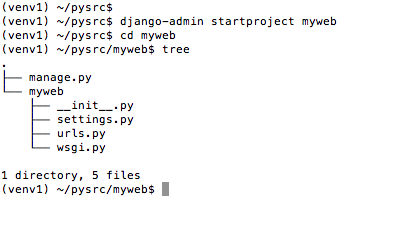
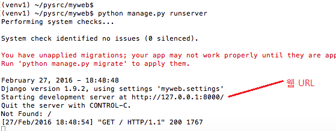
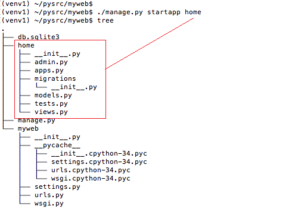
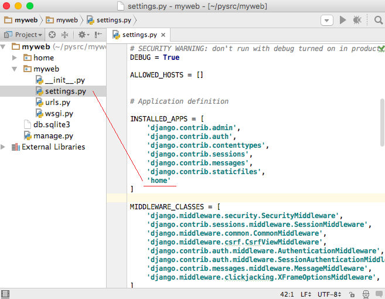
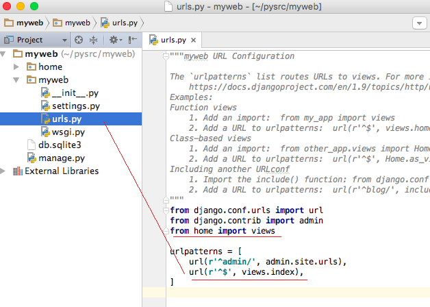
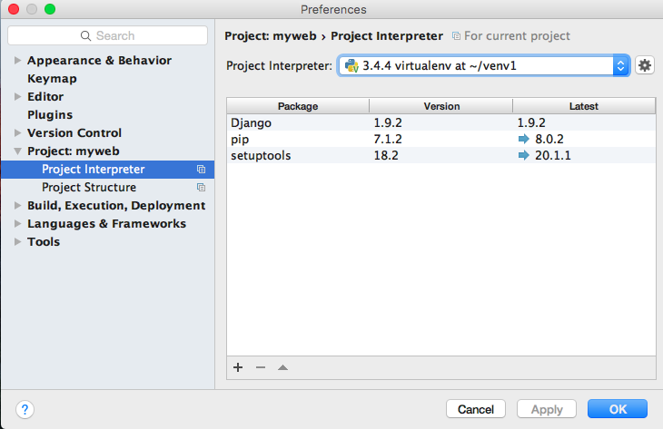
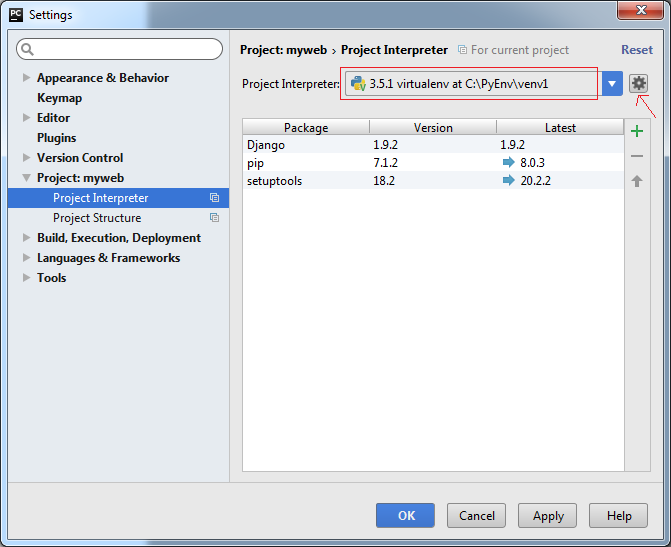

# [Django 프로젝트](http://pythonstudy.xyz/python/article/304-Django-%ED%94%84%EB%A1%9C%EC%A0%9D%ED%8A%B8)
##### Date 2020_11_12
---
 ### 1. Django 프로젝트
> Django에서 새로운 웹 프로젝트를 만들기 위해서는 django-admin.py라는 Django 관리자 모듈을 사용한다.
>
> 가상환경을 활성화 하고, 프로젝트를 만들 디렉토리로 이동한다.
>
> 아래 예제와 같이 "django-admin startproject [프로젝트명]"을 실행해 새 프로젝트를 생성한다.
>
> 예제에서는 "~/pysrc/myweb"폴더에 새 웹 프로젝트를 만든다.
>
>> ```
>> (venv1) ~$ cd ~/pysrc
>> (venv1) ~/pysrc $ django-admin startproject myweb
>>
>> # Windows일때
>> # (venv1) C:\PySrc> C:\PyEnv\venv1\Scripts\django-admin.exe startproject myweb
>> ```
>
> 위 예제의 명령은 새 프로젝트를 myweb 라는 서브폴더에 생성하고, myweb안에 아래 그림과 같이 몇개의 파일들을 생성한다.
>
> 
>
> manage.py 는 웹 프로젝트를 개발, 관리하는데 필요한 여러 기능을 제공한다.
>
> myweb 라는 서브폴더 하위에 4개의 파이썬 파일이 존재한다.
> - settings.py : 웹 프로젝트의 셋팅을 설정하는 파일
> - urls.py : URL 매핑을 위한 파일
>
### 2. Django 서버 실행
> 기본적으로 생성된 웹 프로젝트(myweb)를 먼저 실행해 본다.
>
> 웹 프로젝트로 부터 웹 서비스를 시작하기 위해선 **python manage.py runserver**를 실행하면 된다.
> - 리눅스 혹은 Mac의 경우
>> ```
>> (venv1) ~/pysrc/myweb $ python3 manage.py runserver
>> 혹은
>> (venv1) ~/pysrc/myweb $ ./manage.py runserver
>> ```
> - Windows의 경우
>> ```
>> (venv1) C:\PySrc\myweb> python manage.py runserver
>> ```
>
> 명령들로 Django Development Server가 시작되면 아래와 같은 메시지가 풀력된다.
>
> 메시지의 중간에서 웹 서버의 URL주소(```"http://127.0.0.1:8000"```)를 찾을 수 있으며 웹 브라우저에 해당 주소(localhost)를 이용해 접속하면 웹 페이지를 볼 수 있다.
>
> 웹 브라우저에 표시되는 웹페이지는 Django프레임워크 에서 기본적으로 보여주는 웹 페이지다.
>
> 
>
> 혹시라도 8000번 포트가 사용중이면 runserver 뒤에 원하는 [다른 포트 번호](https://webdir.tistory.com/124)를 지정하여 사용하여도 된다.
>> ```
>> python manage.py runserver [원하는 포트 번호]
>> ```
> 웹서버를 정지 하기 위해선 "**manage.py runserver**" 하였던 **터미널** 혹은 **CMD** 창에서 **Ctrl + C**를 누른다.
>
---
# [Django App](http://pythonstudy.xyz/python/article/305-Django-App)
---
### 1. Django App이란?
> Django App은 Django에서 사용하는 파이썬 패키지 이다.
>
> Django App 패키지는 내부에 자신의 모델, 뷰, 템플릿, URL매핑등을 독자적으로 가지고 있다.
>
> 일반적으로 하나의 Django프로젝트는 하나 이상의 Django App으로 구성되어 있다.
>
> 규모가 큰 Django프로젝트는 보통 여러 개의 Django App들을 모듈화 하여 구성한다.
> - 모듈화된 App들로 구성하면 개발, 유지 보수가 효율적이다.
> - 잘 모듈화된 App는 여러 웹 프로젝트에서 쉽게 재사용 할 수도 있다.
>
### 2. Django App생성
> Django App을 생성하기 위해서는 "**manage.py startapp App명**" 를 실행하면 된다.
> 아래 예제는 아래는 **home** 이라는 **App명**을 사용하여 새로운 **Django App을 생성**하는 명령이다.
>> ```
>> (venv1) ~/pysrc/myweb $ ./manage.py startapp home
>> ```
> 위의 명령을 실행하면 home라는 서브폴더가 생성되고 내부에 Django App에 필요한 기본 파일이 생성된다.
> 
>
### 3. Django App 사용
> 간단한 웹페이지를 만들어 보기 위해 home/views.py 파일에 다음과 같은 index 함수를 추가한다.
>> ```Python
>> from django.shortcuts import render
>> from django.http import HttpResponse
>> 
>> # Create your views here.
>> def index(request):
>>     return HttpResponse("Hello, World!")
>> ```
>
> 웹 브라우저에서 http://127.0.0.1:8000 를 실행하면 위의 index 함수를 호출하게 만들기 위해 웹 프로젝트의 (myweb 폴더 안의) settings.py와 urls.py에 아래와 같은 두 가지 셋팅을 추가해 주어야 한다.
> 01. settings.py : INSTALLED_APPS 리스트에 Django App명 (home) 추가
> 
>
> 02. urls.py : urlpatterns 리스트에 사용할 URL 패턴 추가. url()의 첫번째 파라미터는 [정규표현식(Regular Expression 혹은 RegEx)](http://pythonstudy.xyz/python/article/401)으로 ^$ 은 빈 문자열 즉 루트를 가리킨다.
> 
>
>위의 셋팅들을 변경하고 웹 서버를 시작하여 접속하면 Hello World 가 정상적으로 표시될 것이다.
>
### 4. PyCharm에서 가상환경 사용하기
> PyCharm에서 위의 Django 프로젝트를 오픈했을 때, 처음에는 django 패키지들을 인식하지 못할 수 있다.
> PyCharm 프로젝트가 가상환경을 사용하고 있지 않기 때문인데, 셋팅을 변경하면 정상적으로 인식한다.
>> #### Mac OS X
>> PyCharm에서 해당 Django 프로젝트를 오픈하고, PyCharm 메뉴 - Preferences 를 선택
>>
>> Project - Project Interpreter에서 콤보 박스 안에서 가상환경 venv1 을 찾아 선택하고 OK를 누른다.
>>
>> 만약 해당 가상환경이 보이지 않으면, 콤보 박스 뒤의 설정 아이콘을 누르고 Add Local을 선택하여 추가
> 
>
>> #### Windows
>> PyCharm에서 해당 Django 프로젝트를 오픈하고, File - Settings 메뉴를 선택
>>
>> Project - Project Interpreter에서 콤보 박스 뒤의 설정 아이콘을 누르고 Add Local을 선택
>>
>> 가상환경 venv1 디렉토리 밑의 scripts/python.exe 을 찾아 선택하고 OK를 누른다.
> 
>
> # 끝!

