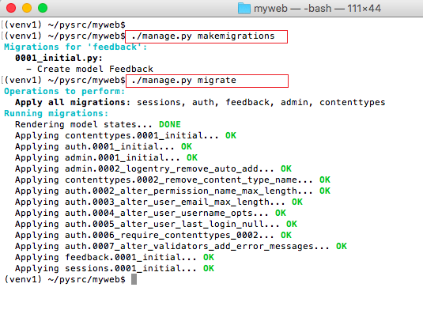
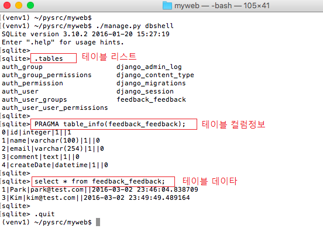

# [DB 설정과 Migration](http://pythonstudy.xyz/python/article/309-DB-%EC%84%A4%EC%A0%95%EA%B3%BC-Migration)
##### Date 2020_11_16
---
 ### 1. DB Migration
> DJango에서 Model 클래스를 생성하고 난 뒤 해당 모델에 상응하는 테이블을 DB에서 생성할 수 있다.
>
> Migration : Python 모델 클래스의 수정 및 생성을 DB에 적용하는 과정
>
> - Django가 기본적으로 제공하는 [ORM](https://gmlwjd9405.github.io/2019/02/01/orm.html)서비스를 통해 진행된다.
>
> Django Model 클래스로부터 테이블을 생성하기 위해서 Migration을 준비하는 과정과 적용하는 과정으로 나뉜다.
>
>> **1.** settings.py 파일 안의 INSTALLED_APPS 리스트에(이미 추가되지 않았다면.) 해당 Django App을 추가한다(ex:feedback)
>>
>> **2.** 모델 클래스로부터 테이블 스키마를 생성 or 수정하기 위해 ```$ ./manage.py makemigrations``` 명령을 실행한다. 명령이 실행되면 해당 Django App안에 migrations라는 서브폴더를 생성하고 테이블의 생성 및 수정을 위한 Python migration파일들을 생성한다.
>>
>> **3.** 모델 클래스로부터 실제 DB에 테이블을 생성하거나 수정하기 위해 ```$ ./manage.py migrate``` 명령을 실행한다. 실제 Migration을 DB에 적용하는 명령이다.
>
> **Feedback 모델을 DB로 Migration하는 과정 -그림**
>
>> 
>>
>> Migration에 의해 생성되는 테이블은 "App명_ModelClass명" 형식으로 생성된다.
>>
>> ###### ex : feedback app의 모델 Feedback의 경우 feedback_feedback 테이블 생성
>>
> ~~이전 버전(1.6이하의 Django 버전)에선 Django 모델 수정에 따른 테이블을 변경하는 Migration기능을 제공하지 않았다.~~
>
> ~~- Alter Table기능이 없었다.~~
>
> ~~- 모델이 수정된 경우 테이블을 Drop한뒤 새로 Create해야 했다.~~🤮
>
### 2. DB 관리 Shell
> DB관리를 위해 ```manage.py dbshell``` 명령을 사용할 수 있다.
>
> Migration이 완료되면 dbshell을 사용하여 생성된 테이블과 테이블의 컬럼 정보 혹은 테이블 내용 등을 확인할 수 있다.
>>
>> 
>
### 3. DB 설정
> Django 에서 사용하는 DB정보는 Django프로젝트의 settings.py파일에 설정되어 있다.
>
> Django 프로젝트가 생성되면 기본적으로 설정되어 있는 셋팅
>>
>> DB는 기본적으로 sqlit3를 사용하고 파일명은 ```/db.sqlite3```로 지정되어 있다.
>>
>> ```Python
>> # Database
>> # https://docs.djangoproject.com/en/1.9/ref/settings/#databases
>> 
>> DATABASES = {
>>     'default': {
>>         'ENGINE': 'django.db.backends.sqlite3',
>>         'NAME': os.path.join(BASE_DIR, 'db.sqlite3'),
>>     }
>> }
>> ```
>>
>> DATABASES 에는 반드시 "default"가 설정되어야 하고 뒤에 다른 DB설정 또한 추가 가능하다.
>>
>> Django프레임 워크는 기본적으로 다음과 같은 DB엔진을 지원하며 DB설정의 "ENGINE"키에 해당 DB 엔진 값을 지정할 수 있다.
>>
>> - **django.db.backends.postgresql**
>>
>> - **django.db.backends.mysql**
>>
>> - **django.db.backends.sqlite3**
>>
>> - **django.db.backends.oracle**
>>
>> **이 외에 서드파티에서 지원하는 DB엔진인 DB2, SQL Server, Firebird 등도 사용 가능하다.**
>
> DB 설정은 각 DB엔진마다 서로 다른 옵션을 지정한다.
>
> MySQL에 대한 연결 정보를 담은 DB설정의 예시.
>
>> ```Python
>> DATABASES = {
>>     'default': {
>>         'ENGINE': 'django.db.backends.mysql',
>>         'NAME': 'MyDB',
>>         'USER': 'user1',
>>         'PASSWORD': 'pwd',
>>         'HOST': 'localhost',
>>         'PORT': '3306',
>>     }
>> }
>> ```
>
> # 끝!
> # 참고한 블로그 : [예제로 배우는 파이썬 프로그래밍](http://pythonstudy.xyz/)
