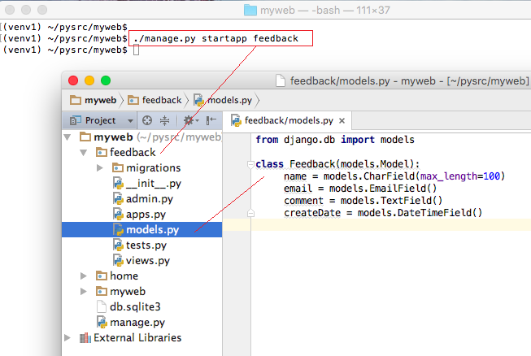

# [Django Model](http://pythonstudy.xyz/python/article/308-Django-%EB%AA%A8%EB%8D%B8-Model)
##### Date 2020_11_14
---
 ### 1. Django Model
> Django에서의 Model은 데이터 서비스를 제공하는 Layer이다.
> - Model은 각 Django App안에 기본적으로 생성되는 models.py 모듈 안에 정의한다.
>
> - models.py 모듈 안에 하나 이상의 모델 클래스를 정의할 수 있다.
>
> - 하나의 오델 클래스는 DB에서 하나의 테이블에 해당된다.
>
> 아래의 그림에선 feedback라는 새로운 Django App을 생성 하였다.
>>
>> feedback App 폴더 안에 있는 models.py 파일에 새로운 모델 클래스를 추가 하였다.
>>
>> 
>>
>> Django 모델은 "django.db.models.Model"에서 파생된 클래스이며 모델의 필드는 클래스의 Attribute로 표현되며 테이블의 컬럼에 해당한다.
>>
>> 위의 그림에서 Feedback라는 클래스가 models.Model의 파생클래스 이며 클래스 안에 4개의 클래스 변수(혹 Class Attribute)가 있다.
>>
>> 만약 Primary Key가 지정되지 않는다면 모델에 Primary Key 역할을 하는 id필드가 자동으로 추가되고 DB테이블 생성시 자동으로 id 컬럼이 생성된다.
>
> 모델 클래스는 필드를 정의하기 위해 인스턴스 변수가 아닌 클래스 변수를 사용한다.
>
> - 변수가 테이블 컬럼의 내용을 갖는 것이 아닌 테이블의 컬럼 메타 데이터를 정의하기 떄문에
>
> 필드를 정의하는 각각의 클래스 변수
>>
>> - **models.CharField()**
>>
>> - **models.IntegerField()**
>>
>> - **models.DateTimeField()**
>>
>> - **models.TextField()**
>>
>> **각 필드 타입에 맞는 Field 클래스 객체를 생성하여 할당한다.**
>
> Field 클래스는 여러 종류가 있으며 생성자 호출시 필요한 옵션을 지정할 수 있다.
>
> 각 Field 클래스 마다 반드시 지정해야하는 옵션또한 존재한다.
>
> - **예** : CharField와 서브클래스들은 필드의 최대 길이를 나타내는 max_length를 항상 지정해야 한다.
>
### 2. 필드 타입
> 모델의 필드에는 [다양한 타입](https://docs.djangoproject.com/en/1.11/ref/models/fields/#field-types)들이 있다.
>
> 모든 필드 타입 클래스들은 추상 클래스인 Field클래스의 파생클래스다.
>
> #### 주요 필드 타입
>
>>|Field Type|설명|
>> |:---|:---|
>> |CharField|제한된 문자열 필드 타입. 최대 길이를 max_length 옵션에 지정해야 한다. 문자열의 특별한 용도에 따라 CharField의 파생클래스로서, 이메일 주소를 체크를 하는 EmailField, IP 주소를 체크를 하는 GenericIPAddressField, 콤마로 정수를 분리한 CommaSeparatedIntegerField, 특정 폴더의 파일 패스를 표현하는 FilePathField, URL을 표현하는 URLField 등이 있다.|
>> |TextField|대용량 문자열을 갖는 필드|
>> |Integer Field|32비트 정수형 필드. 정수 사이즈에 따라 BigIntegerField혹은 SmallIntegerField를 사용할 수 있다.|
>> |BooleanField|true/false필드, Null을 허용하기 위해선 NullBooleanField를 사용한다.|
>> |DateTimeField|날짜와 시간을 갖는 필드. 날짜만 가질 경우 DateField, 시간만 가질 경우 TimeField를 사용한다.|
>> |DecimalField|소숫점을 갖는 Decimal필드|
>> |BinaryField|바이너리(이진)데이터를 저장하는 필드|
>> |FileField|파일을 업로드 하는 필드|
>> |ImageField|FileField의 파생 필드이며 이미지 파일을 체크하고 업로드하는 필드|
>> |UUIDField|GUID(UUID)를 저장하는 필드|
> 
> 위와 같은 필드 타입 클래스외에 Django 프레임워크는 테이블 간 혹은 필드 간 관계를 표현하기 위해 외래키(ForeignKey), ManyToManyField, OneToOneField 클래스를 또한 제공한다.
>
> - [외래키(ForeignKey)는 모델 클래스간 (혹은 Underlying 테이블 간) Many-To-One (혹은 One-To-Many) 관계를 표현](https://docs.djangoproject.com/es/1.11/ref/models/fields/#module-django.db.models.fields.related)하기 위해 주로 사용한다.
>
### 3. 필드 옵션
> 모델의 필드는 필드 타입에 따라 여러 옵션(혹 [Argument](https://wayhome25.github.io/etc/2017/12/31/parameter-argument/))을 가질 수 있다.
>
> - **예** : CharField는 문자열 최대 길이를 의미하는 max_lenght 옵션을 가진다.
>
> 필드 옵션은 일반적으로 생성자에서 Argument로 지정한다.
>
> #### 주로 사용하는 옵션
>
>> |필드 옵션|설명|
>> |:---|:---|
>> |null(Field.null)|null=True 이면 Empty 값을 DB에 NULL로 저장한다. DB에서 Null이 허용된다. **예 : models.IntegerField(null=True)**|
>> |blank(Field.blank)|blank=False 이면 필드가 Required 필드이다. blank=True 이면 Optional 필드이다. **예 : models.DateTimeField(blank=True)**|
>> |primary_key (Field.primary_key)|해당 필드가 Primary Key임을 표시한다. **예 : models.CharField(max_length=10, primary_key=True)**|
>> |unique (Field.unique)|해당 필드가 테이블에서 Unique함을 표시한다. 해당 컬럼에 대해 Unique Index를 생성한다. **예: models.IntegerField(unique=True)**|
>> |default (Field.default)|필드의 디폴트값을 지정한다. **예: models.CharField(max_length=2, default="WA")**|
>> |db_column (Field.db_column)|컬럼명은 디폴트로 필드명을 사용하지만 다르게 쓸 경우 지정한다.|
>
> # 끝!
> # 참고한 블로그 : [예제로 배우는 파이썬 프로그래밍](http://pythonstudy.xyz/)
