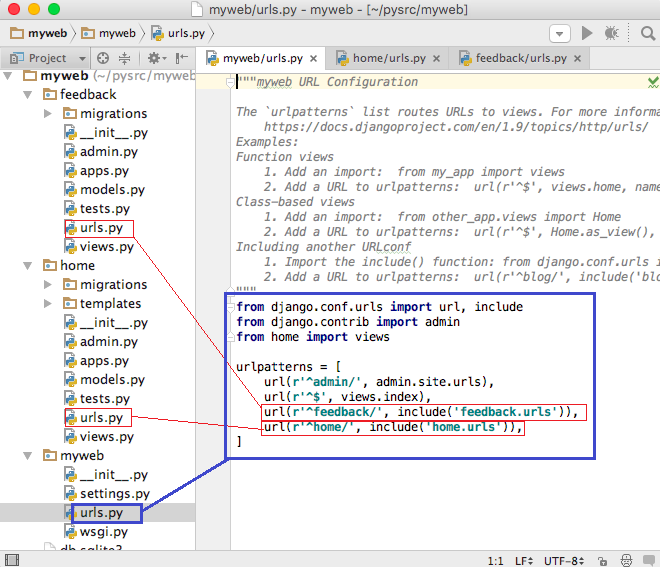

# [URL 매핑](http://pythonstudy.xyz/python/article/311-URL-%EB%A7%A4%ED%95%91)
##### Date 2020_11_18
---
### 1. Django App URL 매핑
> 하나의 프로젝트 내에 여러 Django App이 있다면
> - ~~프로젝트 폴더 내의 urls.py 파일 하나로 모든 URL매핑한다.~~ **(X)**
>
> 각각의 Django App안에 urls.py 파일을 만들고 메인 urls.py 파일에서 각각의 Django App의 urls.py 파일로 URL 매핑을 위탁하게 할 수 있다.
>
> - 다수의 App들을 포함하는 큰 프로젝트의 경우 편리하다.
>
> 메인 URL 파일 (myweb/urls.py)에서 2개의 Django App URL 파일을 include 하여 사용하는 예
>>
>> 
>>
>> "feedback/" 으로 시작되는 URL들을 feedback.urls 즉 feedback App 안의 urls.py 에 있는 매핑을 사용
>>
>> "home/" 로 시작되는 URL들을 home.urls 즉 home 폴더 안의 urls.py 에 있는 매핑을 사용
>
> 각 Django App에 있는 urls.py는 메인과 동일한 방식으로 매핑을 정의함
> - 웹 루트(/)가 아닌 현재 App의 상대적 위치를 기준으로 URL경로를 지정
>
> 아래 코드는 각각 home/urls.py와 feedback/urls.py 의 내용이다.
>> ```Python
>> # home/urls.py
>> from django.conf.urls import url
>> from home import views
>> 
>> urlpatterns = [
>>     url(r'^contact', views.contact),
>>     url(r'^about', views.about),
>> ]
>> ```
>> home/urls.py 의 contact 패턴은 실제 메인에서의 home 패턴과 결합하여 "/home/contact" 를 가리킨다.
>> - /home/contact URL은 home.views.contact 함수를 호출하는 것
>>
>> ```Python
>> # feedback/urls.py
>> from django.conf.urls import url
>> from feedback import views
>> 
>> urlpatterns = [
>>     url(r'^list', views.list),
>>     url(r'^add', views.add),
>>     url(r'^update', views.update),
>> ]
>> ```
>> feedback 역시 "/feedback/list" 는 feedback.views.list 함수와 매핑되어 있음을 알 수 있다.
>
### 2. URL 패턴
> Django 2.0 이상 버전에서는 일반적인 URL 패턴 지정을 위해 django.urls.path() 함수를 사용하되, path()에서 지정하지 못하는 복잡한 패턴의 경우 정규표현식을 사용하는 django.urls.re_path() 함수를 사용한다.
> 
> **path() 함수**
> django.urls.path() 함수는 Django 2.0 에서부터 지원된다.
> - path(route, view, kwargs=None, name=None) 와 같이 4개의 파라미터를 받아들일 수 있다.
>
> - 처음 2개의 파라미터는 필수적이며 뒤의 2개는 옵션이다.
>
> - 첫번째 파라미터에는 URL route에서 사용된 경로를 지정, 두번째 파라미터는 해당 URL에 상응하는 View를 지정한다.
>
> - 두번째 파라미터에서 View를 지정하는 방식으로는 function view의 이름을 지정하거나 클래스에 기반한 View (class based view)의 경우 "클래스명.as_view()"와 같이 지정한다.
>
> - 세번째 파라미터에는 Dictionary 형식의 아큐먼트를 옵션으로 지정, 네번째 파라미터에는 path 이름을 지정(path명으로부터 URL 패턴 정보를 찾는 URL Reversing 을 위해 사용
>
>> ```Python
>> from django.urls import path 
>> from home import views
>>  
>> urlpatterns = [
>>     path('', views.index),
>>     path('ads.txt', views.ads),
>> ]
>> ```
>> 첫번째 path() 함수는 공백 즉 디폴트 웹페이지 URL인 경우 home/views.py 에 있는 index() 함수를 호출하도록 표현한 것
>>
>> 두번째 path() 함수는 웹 클라이언트가 "/ads.txt"를 요구했을 때, home/views.py 에 있는 ads() 함수를 호출할 것을 지정한 것
>
> path() 함수의 첫번째 파라미터인 URL 패턴은 완전한 경로를 표시
> - **Ex** : 글로벌 URLconf 파일 (ex: /myweb/urls.py) 에 'accout/login'으로 경로를 지정하면, 이는 '/accout/login/' 경로를 의미
>
> ```/myweb/urls.py from django.urls import path, include import home.views urlpatterns = [ path('accout/login', home.views.login, name='login') ]``` 에서 name='login'은 해당 path() 함수의 경로 데이타에 대한 정보를 나중에 사용하기 위해 임의의 path명을 명명한 것이다.
>
> URL 파라미터로부터 특정 정보를 읽어내는 방법
>> ```Python
>> # myweb/urls.py
>> from django.urls import path
>> import feedback.views
>>  
>> urlpatterns = [
>>     path('feedback/<int:id>/', feedback.views.display)
>> ]
>> </int:id>
>> ```
>> 피드백 Id가 URL 상에 있다고 했을 때, 이 Id를 알아내기 위해 URL 패턴을 "feedback/<id>" 혹은 Id가 숫자인 경우 명시적으로 "feedback/<int:id>"와 같이 지정할 수 있다.
>> - "id" 는 feedback.views.display(request, id) 함수(feedback/views.py)에 전달되는 파라미터명
>
> ```Pytohon
> # feedback/views.py 
> def display(request, id):
>     s = "ID = " + str(id)
>     return HttpResponse(s)
> ```
> <int:id> 표현은 URL에서 파라미터를 캡쳐(Capture)하는 표현으로 콜론(:) 뒤에 있는 id는 View에 전달되는 파라미터명, 콜론 앞에 있는 것(int)은 Path Converter라고 부르는 것이며 View에 값을 전달하기 전에 콜론 앞의 타입으로 적절하게 변환한 후 파라미터로 전달한다.
> |Converter|설명|정규표현식 표현|
> |:---|:---|:---|
> |str|문자열을 리턴, 빈 문자열과 경로를 표시하는 "/" 문자는 포함되지 않는다. 만약 별도의 path converter를 지정하지 않으면, 이 str 컨버터를 디폴트로 사용한다.|[^/]+|
> |int|0 이상의 정수. Integer를 리턴한다|[0-9]+|
> |slug|영문 대소문자와 숫자, 그리고 하이폰(-)과 밑줄(_)을 갖는 문자열을 리턴한다.|[-a-zA-Z0-9_]+|
> |uuid|UUID를 가리키며 모든 문자가 소문자이어야 하고 대시(-)가 포함되어야 한다. 이 Converter는 uuid.UUID 객체를 리턴한다.|[0-9a-f]{8}-[0-9a-f]{4}-[0-9a-f]{4}-[0-9a-f]{4}-[0-9a-f]{12}|
> |path|경로에 사용되는 슬래쉬(/)를 포함하는 문자열을 리턴한다.|'.+'|
> 
> 내장된 Converter가 부족한 경우, 커스텀 Converter를 등록하여 사용할 수 있으며! 혹은 re_path() 함수를 사용하여 정규표현식을 사용하면 된다!
>
> re_path() 함수는 첫번째 파라미터에 정규표현식(RegEx)을 받아들인다.
> - 0이 들어가면 안된다고 가정하면, 다음과 같이 re_path()를 사용할 수 있다. ```re_path(r'feedback/(?P<id>[1-9]+)/$', feedback.views.display)```
>
> - 이 경우 Id에 0을 포함하면, URL 매칭을 하지 못해 에러가 발생..
>
>> 복수 개의 파라미터를 넣은 패턴의 예시
>> ```Python
>> urlpatterns = [
>>   path('articles/<slug:title>/<int:section>/', views.section),
>> ] 
>> ```
>> title과 section 이라는 2개의 파라미터가 View에 전달되는데, title은 영문/숫자를 갖는 문자열이고, section은 숫자를 갖는 파라미터다.
>
> **url() 함수**
>
> Django 2.0 이전까지는 URL 라우팅을 위해 정규표현식(RegEx)을 사용하는 django.conf.urls.url() 함수를 사용했다.
>
> url() 함수의 첫번째 파라미터는 매핑 URL 패턴을 가리킨다.
>
> - 매핑 URL 패턴은 Regular Expression (RegEx)을 사용하며, r'정규표현식'과 같이 앞에 r (raw) Prefix를 붙인다.(RegEx는 매우 다양한 기능을 가진다.)
>  
>  
> - **RegEx에서 ^은 시작을 나타내고, $은 마지막을 나타낸다. 따라서 ^$ 은 Empty string을 표현하는데, / 혹은 현재위치에 해당된다. ```url(r'^$', views.index)```**
>  
>> ```Pytonh
>> url(r'^$', views.index)
>> ```
>  
>  
> - **URL 중 일부 문자열을 뽑아내기 (이를 Capture라 부른다) 위해서 괄호 ( )를 사용**
>>  
>> 아래 예제는 4자리의 숫자와 2 자리의 숫자 두개를 Capture하는 표현 (모든 Capture는 문자열 이므로 결과는 실제는 숫자로 된 문자열)
>>  
>> ```Python
>> url(r'^blogs/([0-9]{4})/([0-9]{2})/$', views.blogs_month),
>> ```
>>  
>> [0-9]는 0부터 9까지 숫자를 의미하며 {4}는 숫자가 네자리라는 의미이다. 만약 입력 URL이 "/blogs/2015/12" 이면, 이 URL은 views.blogs_month(request, '2015', '12') 과 같이 함수를 호출
>  
>  
> - **위의 예처럼 괄호를 통해 일부 문자열을 뽑아내는 것을 RegEx에서 Group이라 부르는데, Group에 이름을 붙여 사용하는 것을 Named Group이라 부른다.**
>>  
>> (?P<그룹이름>pattern) 와 같이 패턴 앞에 Group이름을 붙일 수 있다.
>>   
>>  
>> Capture된 데이타를 파라미터로 전달할 때, 이름이 없는 Group의 경우 위치에 따라 순서대로 전달되며, Named Group의 경우는 이름과 함께 값이 전달된다.
>>  
>>  
>> 아래와 같은 패턴의 경우 입력 URL이 "/blogs/2015/12" 이면, 이 URL은 views.blogs_month(request, year='2015', month='12') 과 같이 함수를 호출된다.
>>  
>> ```Python
>> url(r'^blogs/(?P<year>[0-9]{4})/(?P<month>[0-9]{2})/$', views.blogs_month),
>> ```
>>  
>  
> [RegEx 아티클](http://pythonstudy.xyz/python/article/401)
>  
> # 끝	
> # 참고한 블로그 : [예제로 배우는 파이썬 프로그래밍](http://pythonstudy.xyz/)
