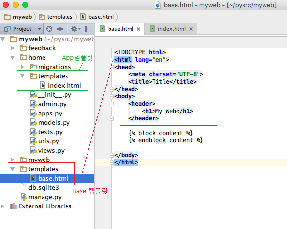

# [Django 템플릿 확장](http://pythonstudy.xyz/python/article/312-Django-%ED%85%9C%ED%94%8C%EB%A6%BF-%ED%99%95%EC%9E%A5)
##### Date 2020_11_19
---
 ### 1. 템플릿 확장
>  웹 페이지마다 공통적으로 들어가는 HTML 코드가 있으며 각 웹페이지마다 공통 코드를 중복해서 넣어 주는 것은 효율적이지 않다.
>
> Django는 공통 부분을 기본 템플릿으로 만들고, 각 웹페이지 마다 변경이 필요한 부분만 코드를 작성하게 하는 템플릿 확장기능을 제공한다.
> - 템플릿 확장은 또한 템플릿 상속(Template Inheritance)라고도 한다
>
> **"Base 템플릿을 어디에 만드는가?"** **=** **"개발자가 템플릿을 어떻게 체계화하는가?"**
>
> 
>> 모든 Django App에 공통적으로 적용되는 Base템플릿을 (manage.py가 있는) Base Directory 밑의 templates폴더에 만들었다.
>> - /templates/base.html
>>
>>  Base 템플릿안에 각 웹페이지에서 변경 혹은 삽입할 영역을  으로 지정한다.
>>
>> 위 사진에선 블럭명을 content로 정하여 `````` 으로 표시
>>
> Base 템플릿을 **사용/확장**하는 각각의 Django App템플릿들은 각각 App폴더의 templates폴더에 저장
>>  **./home/templates/index.html에서 base.html을 확장해서 사용한다고 가정**
>> ```html
>> 
>>  
>> 
>>     <h1>{{message}}</h1>
>> 
>> ```
>> 먼저  확장 템플릿 태그를 사용하여 어떤 Base 템플릿을 사용하는지 지정해야한다.
>> - extends 태그는 항상 템플릿의 처음에 와야한다.
>>
>>  블럭에 삽입하고자 하는 웹 페이지 내용을 작성한다.
>> - 위의 예시에선 간단한 h1태그를 추가함.
>>
>> 만약 Base 템플릿에 여러  블럭이 있다면 확장 템플릿에서 각 블럭의 이름별로 여러 블럭들을 추가할 수 있다.
>
> Base템플릿이 정상적으로 동작하기 위해선 [템플릿 위치]()와 관련된 셋팅을 추가로 해야한다.
>
### 2. 템플릿 위치 셋팅
> 기본적으로 생성된 웹 프로젝트(myweb)를 먼저 실행해 본다.
>
>
> # 끝!
> # 참고한 블로그 : [예제로 배우는 파이썬 프로그래밍](http://pythonstudy.xyz/)
