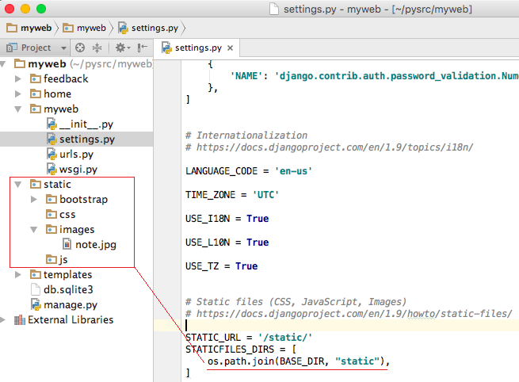

# [Static 파일](http://pythonstudy.xyz/python/article/314-Static-%ED%8C%8C%EC%9D%BC)
##### Date 2020_11_22
---
 ### 1. Static 파일
> 웹 사이트는 일반적으로 자바스크립트, CSS, 이미지등 다양한 파일을 사용한다.
>
> 이러한 파일들을 Django에선 Static파일 이라 부르며 이 파일들을 체계적으로 관리하기 위해 일반적으로는 Django 프로젝트 홈 디렉토리(settings.py에서의 BASE_DIR) 밑에 "static"이라는 서브 폴더를 생성하여 그곳에 static파일을 넣는다.
>
> ```/static``` 폴더에 리소스별로 서브 폴더를 생성하여 static 파일을 관리하는 예.  
> 
> static 폴더에 파일들을 넣고 사용하기 위해선 ```settings.py```파일에서 static 파일들을 찾는 경로를 나타내는 STATICFILES_DIRS라는 변수를 설정해야한다.
>
> BASE_DIR/static 폴더 하나를 지정한 예시(경로는 여러 개일 수도 있다.)
> ```Python
> STATIC_URL = '/static/'
> STATICFILES_DIRS = [
>     os.path.join(BASE_DIR, 'static'),
> ]
> 
> # 또는
> 
> STATIC_URL = '/static/'
> STATICFILES_DIRS = ( os.path.join('static'), )
> ```
>
### 2. Django App의 Static 폴더
> 필요에 따라 각각의 Django App 별 static 파일을 담는 별도의 "static" 폴더를 둘 수도 있다.
> - settings.py파일 안에 STATICFILES_FINDERS을 설정하고 그 값으로 AppDirectoriesFinder을 추가해야 한다.
>
> - 각 App의 static폴더는 그 폴더명으로 "static"으로 지정해야 한다.
>
> App명/static/App명 과 같이 각 App의 static 폴더 안에 다시 "App명" 서브폴더를 둘 것을 권장한다.
> - Deployment 시 collectstatic 을 실행할 때, 각 static 폴더 밑의 내용을 그대로 복사하기 때문에 같은 이름을 가진 파일들이 충돌하는 것을 방지하기 위해서.
>
> ```Python
> STATICFILES_FINDERS = (
>     'django.contrib.staticfiles.finders.FileSystemFinder',
>     'django.contrib.staticfiles.finders.AppDirectoriesFinder',
> )
> ```
> FileSystemFinder는 STATICFILES_DIRS 에 있는 경로들로부터 정적 파일을 찾을 수 있게 한다.
> 
### 3. Static 파일 사용
> Static 파일들은 주로 템플릿에서 사용된다.
>
> settings.py 설정을 마친 후 static 파일들을 사용하기 위해선.
> - 템플릿 상단에  태그를 먼저 명시해야 한다.
>
> - 실제 static 파일을 가리키기 위해서는 "" 와 같이 static 템플릿 태그를 사용하여 해당 리소스를 지정해야한다.
>
> - **이때 리소스명에는 "static/" 폴더명 다음의 경로만 지정한다.**
>
> ```html
> 
>
> <html lang="en">
> <head>
>     <link rel="stylesheet" href=""> #중요.
> </head>
> <body>
> </body>
> </html>
> ```
>
### 4. collectstatic
>
> # 끝!
> # 참고한 블로그 : [예제로 배우는 파이썬 프로그래밍](http://pythonstudy.xyz/)
