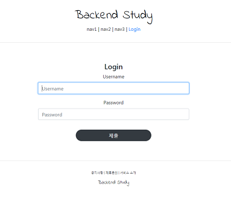
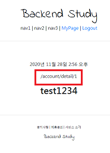

# Django 실습
##### Date 2020_11_28
---
### 1. [Class Based View, 장고의 CRUD](https://www.youtube.com/watch?v=6P74EFfGdJE&list=PLQFurmxCuZ2RVfilzQB5rCGWuODBf4Qjo&index=20)
> 20강의 내용은 영상을 통해 반복학습을 하자.
>
> 장고는 CRUD의 생산성이 탁월하다.
>> - C reate 만들고
>>
>> - R ead 읽고
>>
>> - U pdate 수정하고
>>
>> - D elete 삭제하고.
>
> why?. 장고는 CRUD에 각각의 view(class)를 지원해줘서.
>
> 또한 이 작업들에 최적화 되어있는 도구들을 지원해준다.
> - Class Based View(CBV = 클래스 기반.) (반대 -> Function Based View(FBV = 함수기반.))
>
> CRUD는 거의 모든것에 적용가능(여러 종류의 게시판, 회원가입 등등.)
>> 즉 CBV와 CRUD를 적극적으로 사용해야한다.
>
### 2. CreateView를 통한 회원가입 구현
> 1. views.py 파일 작성.
>> ```from django,views.generic import CreateView```를 통해 CreateView를 상속받는다.
>> 
>> - 대부분의 CRUD View는 다 generic 안에 있다.
>> 
>> 그 뒤 accountapp의 views.py 맨 아래에 ```class AccountCreateView(CreateView)``` 생성 
>> 
>> ```Python
>> class AccountCreateView(CreateView):
>>         # 주요한 파라미터 입력.
>>     model = User
>>         # 장고에서 기본 제공하는 모델.
>>         # from django,contrib.auth.models import User
>>     form_class = UserCreationForm
>>         # 장고가 기본적으로 제공해주는 회원가입 form
>>         # from django.contrib.auth.forms import UserCreationForm
>>     success_url = reverse_lazy('accountapp:hello_world')
>>         # 회원가입 성공시 어느 경로를 재연결 할것인가.
>>         # from django.urls import reverse_lazy
>>         # reverse는 함수형 뷰에서 사용하고 reverse_lazy는 클래스형 뷰에서 사용한다.
>>     template_name = 'accountapp/create.html'
>>         # 어떤 템플릿을 사용할 것인가.(어느 html파일을 사용할 것인가.)
>> ```
>> 사실상 4줄 만으로 끝난다.
>
> 2. 경로 지정을 위한 urls.py 작성
>> 경로를 지정해 주기 위해 accountapp의 urls.py의 내용을 수정한다.
>> 
>> 수정한 내용만 아래에 첨부 하였다.
>> ```Python
>> from accountapp.views import hello_world, AccountCreateView # class를 import한다.
>> 
>> #...
>> 
>> urlpatterns = [
>>     path('hello_world/', hello_world, name='hello_world'),
>> 
>>     path('create/', AccountCreateView.as_view(), name='create'), #함수형 뷰와 달리 클래스 내임 뒤에 .as_view()를 붙여줘야한다.
>> ]
>> ```
>
> 3. create.html파일 생성 및 작성
>> accountapp의 templates안의 accountapp폴더에 create.html 파일을 생성하고 작성한다.
>> 
>> ```html
>> 
>> 
>> 
>> 
>>     <div style="text-align: center">
>>         <form action="" method="post">
>>             <!--action 내부엔 요청을 보내는 url이 필요하다. 여기서는 일원화(어떤 앱에서:어떤 라우팅으로 가라.) 할것이다.-->
>>             
>>             {{ form }}<!-- views.py 에서 이용한 form_class = UserCreationForm 을 통해 자동으로 만들어준다. -->
>>               <input type="submit" class="btn btn-primary">
>>         </form>
>>     </div>
>> 
>> 
>> ```
> 
### 3. Login / Logout 구현
> Login view, Logout View를 이용해 구현을 진행한다.
>
> 1. urls.py에 경로 추가.
>> ```Python
>> 
>> ...
>> 
>> from django.contrib.auth.views import LoginView, LogoutView
>> # LoginView와 LogoutView사용하기 위해
>> 
>> ...
>> 
>> urlpatterns = [
>> 
>>     ...
>>     
>>     path('login/', LoginView.as_view(template_name='accountapp/login.html'), name='login'),
>>     # LoginView 같은 경우는 템플릿을 지정해줘야 한다.(직접 만들것임.)
>>     path('logout/', LogoutView.as_view(), name='logout'),
>>     # LoginView와 LogoutView 둘다 import 필요.
>> ]
>> ```
>
> 2.  login.html 파일 생성 및 작성
>>
>> accountapp의 templates안의 accountapp폴더에 login.html 파일을 생성하고 작성한다.
>> 
>> ```html
>> 
>> 
>> 
>> 
>>     <div style="text-align: center;">
>>         <div>
>>             <h4>Login</h4>
>>         </div>
>>         <form action="" method="post">
>>             
>>             
>>               <input type="submit" class="btn btn-primary">
>>             
>>         </form>
>>     </div>
>> 
>> 
>> ```
>
> 3. header.html파일을 수정하여 로그인 버튼과 로그아웃 버튼 생성한다.
>>
>> 가장 외부의 templates폴더의 header.html파일 수정
>> ```html
>>         <div>
>>             <span>nav1</span> | 
>>             <span>nav2</span> | 
>>             <span>nav3</span> | 
>>             <!--이 유저가 로그인이 되어있지 않다면. Login을 보여준다.-->
>>             <a href="?next={{ request.path }}">
>>                 <span>Login</span>
>>             </a>
>>             
>>             <a href="?next={{ request.path }}">
>>                 <span>Logout</span>
>>             </a>
>>             
>>         </div>
>> ```
>> 
>> 중간의 ```<div>```부분만 위와 같이 수정하였다.
>
> 4. Redirect의 메커니즘
>> 1. next
>> 
>> 2. Login_Redirect_URL
>> 
>> 3. Default
>> 
>> 순서이며 각각 지정된 값이 없다면 다음 값으로 간다.
>> 
>> - next 설정.
>>> header.html파일에서 ```<a href="?next={{ request.path }}">```의
>>> 
>>> ```?next={{ request.path }}```를 통해 next값을 지정해 주었다 (원래 있던 위치로 돌아오도록)
>>> 
>> - Login_Redirect_URL설정.
>>> 메인인 폴더(backend_study)내부의 settings.py파일을 수정한다. 
>>> 
>>> ```Python
>>> LOGIN_REDIRECT_URL = reverse_lazy('accountapp:hello_world')
>>> LOGOUT_REDIRECT_URL = reverse_lazy('accountapp:login')
>>> ```
>>> 
>>> 위의 코드를 맨 아래에 추가한 뒤 reverse_lazy를 사용하기 위해 import 해준다.
>>
>
### 4. Bootstrap 을 이용한 Form 디자인 정리
>>
>> [django-bootstrap4](https://django-bootstrap4.readthedocs.io/en/latest/installation.html)를 이용해 form들을 일괄적으로 부트스트랩을 적용시킨 디자인을 만들수 있다.
>> 
>> 1. 설치및 셋팅
>> 
>> pip install django-bootstrap4 를 통해 설치
>> 
>> 설치후 settings.py파일의 INSTALLED_APPS부분에 아래와 같이 추가해준다.
>> 
>> ```Python
>> INSTALLED_APPS = [
>>     '...',
>>     'bootstrap4',
>>     '...',
>> ]
>> ```
>> 
>> 2. [사용하기](https://django-bootstrap4.readthedocs.io/en/latest/quickstart.html)
>> 
>>
>> login.html에 먼저 사용하겠다.
>>
>> 맨 위의 `````` 바로 아래에 ``````를 추가하여 사용한다.
>>
>> 또한 중간의 ```{{ form }}``` 대신 부트스트랩은 ``````를 통하여 사용한다.
>>
>> 이후 세부적인 너비, 마진 등을 설정한다. (login.html, create.html를 수정했음.)
>>
>> rounded-pill는 버튼의 외형을 동글동글한 걸로 바꿈(클래스)
>>
>> col-6 은 부모의 크기의 절반(12가 최대이며 100%를 뜻함)
>>
>> mt-3은 margin-top의 3배라는 뜻
>>
>> mb-4는 margin-bottom의 4배.
>> 
>> 
>>
> #### ps.
>>
>> settings.py 수정..
>>
>> ```Pythom
>> # LANGUAGE_CODE = 'en-us'
>> LANGUAGE_CODE = 'ko-KR'
>> # TIME_ZONE = 'UTC'
>> TIME_ZONE = 'Asia/Seoul'
>> ```
>>
>> 를 통해 각각 영어에서 한국어 협정세계시에서 한국표준시로 변경하였다.
>
### 5. DetailView를 이용한 개인 페이지 구현
>>
>> 이번엔 Read view쪽을 다룬다.
>>
>> but. 장고에서 정확하게 제공하는 이름은 Read가 아닌 Detail View이다.
>>
>> 1. Views.py AccountDetailView 클래스 생성
>> ```Python
>> class AccountDetailView(DetailView):
>>     model = User
>>     template_name = 'accountapp/detail.html'
>> ```
>>
>> 2. detail.html파일 생성 및 작성.
>>
>> 경로 : accountapp/templates/accountapp/detail.html
>>
>> ```html
>> 
>> 
>> 
>> 
>>
>>     <div>
>>         <div style="text-align: center; max-width: 500px; margin: 4rem auto;">
>>             <p>
>>                 {{ user.date_joiner }}<!--언제 가입했는지.-->
>>             </p>
>>             <p>
>>                 {{ request.get_full_path }}<!--현재 url 주소 반환. detail에서 로그아웃했을때 처리 위해-->
>>             </p>
>>             <h2>
>>                 {{ user.username }}
>>             </h2>
>>         </div>
>>     </div>
>>
>> 
>> ```
>>
>> 3. urls.py에 경로 등록
>>
>> ```Python
>> urlpatterns = [
>>     
>>     ...
>>     
>>     path('detail/<int:pk>', AccountDetailView.as_view(), name='detail'),
>>     # detail은 특정 유저의 정보를 보는것 이다. 따라서 parmary_key(ID)가 필요해서 <int:pk> 사용
>>     # AccountDetailView 꼭 import해야함.
>> ]
>> ```
>>
>> 4. header.html 수정.
>>
>> 22강에서 수정한 내용에 추가로 수정 하였다.
>>
>> 실습과 내용이 조금 다르다.
>>
>> MyPage에서 로그아웃을 하면 ?next={{ request.path }} 구문으로 인해 MyPage를 계속해서 반환하는 모습을 보인다.
>>
>> 이를 막기위해 사용해 url에 detail이 포함되어있을때 로그아웃을 한다면 login으로 이동하게 하였다.
>> 
>> ```
>> <!--이 유저가 로그인이 되어있지 않다면. Login을 보여준다.-->
>>             <a href="?next={{ request.path }}">
>>                 <span>Login</span>
>>             </a>
>>             
>>             <a href="">
>>                 <!--urls.py에서 detail/<int:pk> 하였기 때문에 pk=user.pk를 통해 pk를 넘겨준다.-->
>>                 <span>MyPage</span>
>>             </a>
>>              | 
>>                 <!--현재 url에 detail이 있을때 -->
>>                 <a href="?next="><!--로그아웃을 하면 로그인 창으로 이동 시키고-->
>>                     <span>Logout</span>
>>                 </a>
>>                 <!--현재 url에 detail이 없다면 -->
>>                 <a href="?next={{ request.path }}"><!--그대로-->
>>                     <span>Logout</span>
>>                 </a>
>>                 
>>             
>> ```
>>
>>
>> 
>>
>> 그림의 빨간 사각형에 있는 text는 ```{{ request.get_full_path }}```를 이용해 출력했다.
>>
>> 여러 곳에 응용할 수 있을것같다
>
> # 끝! 
> 오늘은 [24강](https://www.youtube.com/watch?v=D3DMvHsn9Ss&list=PLQFurmxCuZ2RVfilzQB5rCGWuODBf4Qjo&index=24) 까지 학습을 진행 하였다.
> # 참고한 영상 : [실용주의 프로그래머의 작정하고 장고](https://www.youtube.com/playlist?list=PLQFurmxCuZ2RVfilzQB5rCGWuODBf4Qjo)
