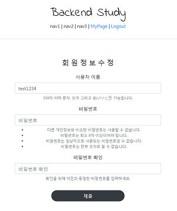
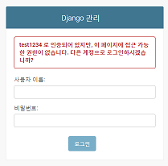
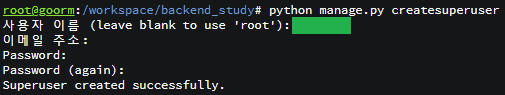

# Django 실습
##### Date 2020_11_29
---
### 1. UpdateView를 이용한 비밀번호 변경 구현
> 1. Views.py에 AccountUpdateView 생성
>> ```Python
>> class AccountUpdateView(UpdateView):
>>     model = User
>>     form_class = UserCreationForm
>>     success_url = reverse_lazy('accountapp:hello_world')
>>     template_name = 'accountapp/create.html'
>> ```
> 2. urls.py에 경로(라우팅) 추가
>> ```Python
>> from accountapp.views import AccountUpdateView
>> urlpatterns = [
>> 
>>     ...
>>     
>>     path('update/<int:pk>', AccountUpdateView.as_view(), name='update'),
>> ]
>> ```
>> 
> 3. update.html생성
>> ```html
>> 
>> 
>> 
>> 
>> 
>>     <div style="text-align: center; max-width: 500px; margin: 4rem auto;">
>>         <div class="mb-4">
>>             <h4>회 원 정 보 수 정</h4>
>>         </div>
>>         <form action="" method="post">
>>             <!--지금 로그인 되어있는 회원의 정보를 수정할 것임 pk=user.pk 사용. -->
>>             
>>             
>>               <input type="submit" class="btn btn-dark rounded-pill col-6 mt-3">
>>         </form>
>>     </div>
>> 
>> 
>> ```
>> 
> 4. detail.html수정
>> 회원정보를 보는 창에서 로그인중인 회원과 열람하는 회원이 같을경우 회원정보를 수정하는 버튼을 제공한다.
>> ```html
>> 
>> 
>> 
>> 
>> 
>>     <div>
>>         <div style="text-align: center; max-width: 500px; margin: 4rem auto;">
>>             <p>
>>                 {{ target_user.date_joined }}<!--언제 가입했는지.-->
>>             </p>
>>             <h2>
>>                 {{ target_user.username }}
>>             </h2>
>>             
>>             
>>             <a href="">
>>                 <p>
>>                     정보 수정
>>                 </p>
>>             </a>
>>             
>>         </div>
>>     </div>
>> 
>> 
>> ```
> 5. ```self.fields['username'].disabled = True``` 'username' 비활성
>> 
>> 
>> 사진과 같이 지금은 아이디와 비밀번호 둘다 수정이 가능하다. 
>> 
>> 이는 원하지 않는 상황이다 그러므로 수정하기 위해 다음 과정을 진행한다.
>> 
>> accountapp내부에 forms.py파일을 생성한다.
>> 
>> 그리고 그 파일은 views.py의 AccountUpdateView클래스에서 사용한
>> 
>> UserCreationForm을 상속받아 살짝 커스터마이징을 할 것이다.
>> 
>> ```Python
>> from django.contrib.auth.forms import UserCreationForm
>> 
>> class AccountUpdateForm(UserCreationForm):
>>     def __init__(self, *args, **kwargs):
>>         super().__init__(*args, **kwargs)
>> 
>>         self.fields['username'].disabled = True
>>         # 위의 코드가 없다면 AccountUpdateForm와 UserCreationForm 가 같다.
>>         # 하지만 위의 코드가 있다면 초기화 이후 'username'의 값을 비활성시킨다.
>>         # 또한 누군가가 임의로 값을 바꾸어 보내더라도 비활성화 되어있기 때문에 서버에 적용되지 않는다.
>> ```
>> 위와 같이 파일을 작성 하였다.
>> 
>> 이후 viwes.py에서 아래와 같이 적용 시킨다.            ~~```* ``````**```~~
>> 
>> ```Python
>> from accountapp.forms import AccountUpdateForm
>> 
>> class AccountUpdateView(UpdateView):
>>     ...
>>     form_class = AccountUpdateForm
>>     ...
>> ```
>> 아래 그림과 같이 아이디 부분이 비활성화 된것을 확인할 수 있다.
>> 
>> 
> 
### 2. DeleteView기반 회원탈퇴 구현
> 1.Views.py에 AccountDeleteView 생성
>> ```Python
>> from django.views.generic import DeleteView
>> 
>> ...
>> 
>> class AccountDeleteView(DeleteView):
>>     model = User
>>     success_url = reverse_lazy('accountapp:login')
>>     template_name = 'accountapp/delete.html'
>> ```
>> 
> 2. urls.py에 경로(라우팅) 추가
>> ```Python
>> from accountapp.views import AccountDeleteView
>> 
>> ...
>> 
>> urlpatterns = [
>>     ...
>>     path('delete/<int:pk>', AccountDeleteView.as_view(), name='delete'),
>> ]
>> ```
> 3. delete.html 작성
>> ```html
>> 
>> 
>> 
>> 
>> 
>>     <div style="text-align: center; max-width: 500px; margin: 4rem auto;">
>>         <div class="mb-4"><!--margin-bottom-->
>>             <h4>회 원 탈 퇴</h4>
>>         </div>
>>         <form action="" method="post">
>>             
>>               <input type="submit" class="btn btn-danger rounded-pill col-6 mt-3">
>>         </form>
>>     </div>
>> 
>> 
>> ```
> 4. detail.html에 delete버튼 추가.
>> ```html
>>             <a href="">
>>                 <p>
>>                     탈 퇴
>>                 </p>
>>             </a>
>> ```
>> 정보수정 버튼 아래에 추가.
### 3. Authentication 인증시스템 구축
> - [시작하기 전 bug fix](https://www.youtube.com/watch?v=MVAUAjI6vaI&list=PLQFurmxCuZ2RVfilzQB5rCGWuODBf4Qjo&index=28) 00:00 ~1:30
> 
> 1. views.py의  def hello_world에 인증하는 과정 추가.
>> 기존의 내용을 ```if request.user.is_authenticated:``` 내부에 넣어주고
>> 
>> else의 내용은 ```return HttpResponseRedirect(reverse('accountapp:login'))```로 작성한다.
>> 
>> 사용자가 로그인한 상태라면 if 의 내용을 로그인 하지 않았다면 로그인으로 보낸다.
>> 
>> 또한
>> ```Python
>> def get(self, *args, **kwargs):
>>     # get의 내용을 수정한다.
>>     if self.request.user.is_authenticated:
>>         #로그인 되어있는 상태라면 그대로 진행
>>         return super().get(*args, **kwargs)
>>     else:
>>         #로그아웃 되어있다면 Forbidden error을 출력해준다(권한없음 창.)
>>         return HttpResponseForbidden()
>> 
>> def post(self, *args, **kwargs):
>>     # post의 내용을 수정한다.
>>     if self.request.user.is_authenticated:
>>         #로그인 되어있는 상태라면 그대로 진행
>>         return super().post(*args, **kwargs)
>>     else:
>>         #로그아웃 되어있다면 Forbidden error을 출력해준다(권한없음 창.)
>>         return HttpResponseForbidden()
>> ```
>> 위 두 함수(get, post)를 사용해 AccountUpdateView와 AccountDeleteView에서 인증과정을 구현한다.
>> 
>> 하지만 아직 다른 사용자의 pk를 이용해 다른사용자의 회원정보 수정과 삭제가 가능하다.
>> ```Python
>> if self.request.user.is_authenticated and self.get_object() == self.request.user:
>>     # self.get_object() self는 자체 뷰(여기선 AccountUpdateView)를 가리킴
>>     # UpdateView는 url에서 int:pk를 받는다 즉 pk에 해당하는 object를 가져온다
>>     # 따라서 self.get_object() 는 user객체를 가져온다 
>>     # 가져온 user을 지금 리퀘스트를 보내고 있는 user(self.request.user와 같은지 확인하는것
>> ```
>> if 구절의 코드를 위의 코드와 같이 수정하여 문제를 해결할 수 있다.
>> 
>> 지금 코드는 뭔가 가독성이 떨어진다 따라서 다음강의의 Decorator를 이용해 코드 간소화를 진행하고 예고하심.
>> 
### 4. Decorator를 이용한 코드 간소화
> Decorator는 Python에서 제공하는 기능이라고 볼 수 있다. [영상](https://www.youtube.com/watch?v=JhDnRJxeVhg&list=PLQFurmxCuZ2RVfilzQB5rCGWuODBf4Qjo&index=29)을 통해 반복학습하자.
>
> views.py 에서 ```from django.contrib.auth.decorators import login_required```를 작성한 뒤
>
> ```def hello_world(request):``` 를 이전 상태로 되돌린 후 바로 위에 ```@login_required```를 사용하면
>
> 27강에서 작성했던 것과 같은 기능을 제공한다. 즉, 데코레이터가 정상적으로 작동함을 알 수 있다.
>
> 하지만 클래스 내부의 함수(메서드)는 같이 사용하더라도 적용이 되지 않는다.
>
> 사용하기 위해선 ```from django.utils.decorators import method_decorator```를 맨위에 추가한뒤
> ```Python
> @method_decorator(login_required, 'get')
> @method_decorator(login_required, 'post')
> ```
> 를 Update, Delete의 위에 각각 추가하면 된다. 물론 27강에서 작성한 내용은 삭제하고 쓴다.
> 
> 아직까지 본인인지 확인하는 과정은 없다
> 
> 해당 과정을 추가하기 위해 커스텀 데코레이터를 작성한다.
> 
> accoutapp 내부에 decorators.py파일을 생성하고 내용을 작성한다.
> ```Python
> from django.http import HttpResponseForbidden
> from django.contrib.auth.models import User
> 
> def account_ownership_required(func):
>     def decorated(request, *args, **kwargs):
>         user = User.objects.get(pk=kwargs['pk'])
>         # 요청을 받으며 pk로 받은 값을 가지고 있는 User.objects가 user이 된다.
>         if not user == request.user: #그 user이 request의 abs()이 아니라면
>             return HttpResponseForbidden() #권한없음 창 띄움.
>         return func(request, *args, **kwargs)
> 
>     return decorated
> ```
> 작성이 끝나면 views.py로 돌아와 
> ```from accountapp.decorators import account_ownership_required```
> 를 통해 작성한 커스텀 데코레이터를 import한 뒤
> ```Python
> @method_decorator(account_ownership_required, 'get')
> @method_decorator(account_ownership_required, 'post')
> ```
> 를 Update, Delete의 위에 각각 추가한다.
> 
> 하지만 4줄이나 된다 이걸 더 줄이는 방법이 있다
> 
> views.py의 import 구문들 과 hello_world 사이에
> 
> ```has_ownership = [account_ownership_required, login_required]``` 를 작성하여 사용하는 것이다
> 리스트에 담아서 사용도 가능하다. 따라서 
> ```
> @method_decorator(login_required, 'get')
> @method_decorator(login_required, 'post')
> @method_decorator(account_ownership_required, 'get')
> @method_decorator(account_ownership_required, 'post')
> ```
> 과 
> ```
> @method_decorator(has_ownership, 'get')
> @method_decorator(has_ownership, 'post')
> ```
> 가 같은 기능을 하는 것이다. 편하다. 깔끔하다.
> 
### 5. superuser, media 관련 설정
> 이번 강의는 코딩은 따로 안한다고 하신다.
> 
> 이 다음 강의에서 진행할 profileapp만들기 전에 사전 setting할 내용들을 간단하게 만져주고 넘어간다고 하심
> 
> 젤 처음엔 main이 되는 폴더(난 backend_study)의 urls.py을 본다
> 
> 'admin/'이라는 경로가 있다 한번 들어가 보자
> 
> 
> 
> 위의 사진과 같은 결과가 나온다.
> 
> why? superuser계정이 있어야 접속이 가능하기 때문이다.
> 
> 1. superuser생성
>> ```python manage.py createsuperuser```를 터미널에 타이핑한다.
>> 
>> 
>> 
>> 위의 사진과 같은 결과를 볼 수 있다. ~~아이디 안알랴줌~~
>> 
>> id입력후 엔터 이메일은 입력할꺼면 하고 안할꺼면 공백 상태로 엔터 PW작성후 엔터 하면 끝.
>> 
>> 그 후 'admin/'경로로 로그인하구 접속하면 관리창이 뜬다. [강의 영상보기](https://www.youtube.com/watch?v=bh57RDikHNI&list=PLQFurmxCuZ2RVfilzQB5rCGWuODBf4Qjo&index=30&t=138)
>> 
> 2. media
>> image도 들어갈 것이기 때문에 추가 설정을 미리 한다.
>> 
>> main이 되는 폴더(난 backend_study)의 settings.py로 들어간다.
>> 
>> 우린 이전에 아래와 같이 static 관련 설정을 했다.
>> ```Python
>> STATIC_URL = '/static/'
>> STATIC_ROOT = os.path.join(BASE_DIR, 'staticfiles')
>> ```
>> 이번에도 같은 설정을 할 것이지만 이번엔 media설정이다.[강의 영상보기](https://www.youtube.com/watch?v=bh57RDikHNI&list=PLQFurmxCuZ2RVfilzQB5rCGWuODBf4Qjo&index=30&t=301)
>> ```Python
>> MEDIA_URL = '/maida/'
>> # 주소창에 maida 이하의 경로로 접근을 해야지 실제 media 파일에 접근이 가능하다
>> MEDIA_ROOT = os.path.join(BASE_DIR, 'media')
>> # media 파일을 서버에 올렸을 때 어느 경로에 지정이 될것인지
>> # 그 경로의 root(바닥)에 있는 경로가 어디가 될것인지에 대한 정보.
>> ```
>> 
>> Django에서 이미지 관리할때 필요한 라이브러리가 있다. 
>> 
>> 그 이름은 pillow이다★ ```pip install pillow```명령을 통해 설치하자
>> 
>> ```pip list```를 통해 조회하니 구름IDE엔 이미 깔려있다.
>> 
>> 오늘은 이만 안녕.
>
# 끝! 
오늘은 [29강](https://www.youtube.com/watch?v=bh57RDikHNI&list=PLQFurmxCuZ2RVfilzQB5rCGWuODBf4Qjo&index=30) 까지 학습을 진행 하였다.
## 참고한 영상 : [실용주의 프로그래머의 작정하고 장고! Django로 Pinterest 따라하기](https://www.youtube.com/playlist?list=PLQFurmxCuZ2RVfilzQB5rCGWuODBf4Qjo)
