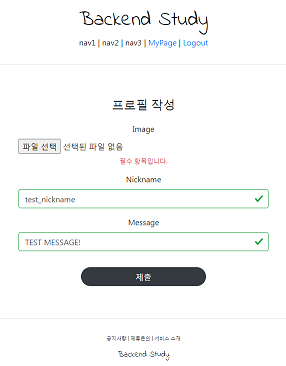
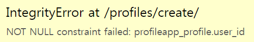
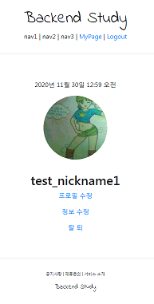

# Django 실습
##### Date 2020_11_30
---
### 1. Profileapp 시작 그리고 ModelForm
> 지금은 detail로 들어가면 사용자의 ID가 노출이 된다.
> 
> 이를 닉네임으로 바꾸어 줄것이다.
> 
> account객체와 profile객체를 1:1 매칭 시킬 것이다.(1개의 account에 1개의 profile)
> 
> profile의 내용은 3가지로 구성할 것이다. ~~'image', 'nickname', 'message'~~
> 
> ```python manage.py startapp profileapp```명령어를 이용해 profileapp 생성.
> 
> settings.py의 INSTALLED_APP 에 'profileapp' 추가.
> 
> urls.py 의 urlpatterns 에 ```path('profiles/', include('profileapp.urls'))``` 추가
> 
> profileapp내부에 urls.py생성한뒤 아래 내용 작성
> 
> ```Python
> from django.urls import path
> 
> app_name = 'profileapp'
> 
> urlpatterns = [
>     
> ]
> ```
> 
> 같은 위치에 models.py 수정
> 
> ```Python
> class Profile(models.Model):
>     user = models.OneToOneField(User, on_delete=models.CASCADE, related_name='profile')
>     # OneToOneField는 1:1관계를 의미한다.
>     # on_delete=model.CASCADE 탈퇴하면 프로필도 함께 삭제되도록 하는것.
>     # related_name='profile' 이건 requset.user.profile를 통해 바로 연결 가능하도록 설정 해주는것
>     # 따로 프로필 객체를 찾을 필요가 없다.
>     image = models.ImageField(upload_to='profile/', null=True)
>     # 이미지를 받아서 서버 내부의 어느곳에 저장될 것인지 경로를 정해주는것.
>     # null=True 는 프로필 사진이 없어도 된다는 뜻.
>     nickname = models.CharField(max_length=20, unique=True, null=True)
>     # unique=True 닉네임 중복 불허
>     message = models.CharField(max_length=100, null=True)
>     # 대화명
> ```
> profile은 form을 작성해야한다.
> 
> 영상에서는 [Model Form](https://www.youtube.com/watch?v=HHWqPI0zpY0&list=PLQFurmxCuZ2RVfilzQB5rCGWuODBf4Qjo&index=31&t=710) 을 사용한다. 영상을 통해 이해하자!
> 
> forms.py파일 생성 아래 내용을 작성한다.
> 
> ```Python
> from django.forms import Modelform
> from profileapp.models import Profile
> 
> class ProfileCreationForm(ModelForm):
>     class Meta:
>         model = Profile
>         fields = ['image', 'nickname', 'message']
> ```
> 
### 2. Profileapp Createview 구현
> 
> 30강~~(바로위)~~에서 models.py를 작성 하였기 때문에
> 
> ```python manage.py makemigrations```명령어를 통해 migration파일을 생성하고
> 
> ```python manage.py migrate```migrate한다.
> 
> 이제 views.py 를 작성한다.
> ```
> #필요한 라이브러리들 import
> 
> class ProfileCreateView(CreateView):
>     model = Profile
>     context_object_name = 'target_profile'
>     form_class = ProfileCreationForm
>     success_url = reverse_lazy('accountapp:hello_world')
>     template_name = 'profileapp/create.html'
> ```
> 그 후 create.html을 작성한다.
> 
> 내용은 accountapp의 create.html과 같지만 
> 
> ```<form action="" method="post">```이 부분의 내용을 달리 하였다. 
> 
> post를 보낼 주소를 수정해야 하기 때문이다.
> 
> 그후 urls.py에서 경로(라우팅)설정을 해준다.
> ```Python
> from django.urls import path
> 
> from profileapp.views import ProfileCreateView
> 
> app_name = 'profileapp'
> 
> urlpatterns = [
>     path('create/', ProfileCreateView.as_view(), name='create'),
> ]
> ```
> 그 후 accountapp의 detail.html에 profile을 볼 수 있는 버튼을 추가해 준다.
> ```html
> 
> 
> 
> 
> 
>     <div>
>         <div style="text-align: center; max-width: 500px; margin: 4rem auto;">
>             <p>
>                 {{ target_user.date_joined }}<!--언제 가입했는지.-->
>             </p>
>             
>             
>             <h2>
>                 {{ target_user.profile.nickname }}
>             </h2>
>             
>              <a href="">
>                 <p>
>                     프로필 작성
>                 </p>
>             </a>
>             
>             
>             
>             <a href="">
>                 <p>
>                     정보 수정
>                 </p>
>             </a>
>             <a href="">
>                 <p>
>                     탈 퇴
>                 </p>
>             </a>
>             
>         </div>
>     </div>
> 
> 
> ```
> 
> 지금 profile생성에서 이미지를 첨부하여 생성하려하면 오류가 발생한다.
> 
> 
> 
> 이는 form(```templates/profileapp/create.html```)에 문제가 있기 때문이다.
> 
> 따라서 아래와 같이 수정한다
> ```html
> <form action="" method="post" enctype="multipart/form-data">
> <!--image 파일과 같은 파일을 post할땐 enctype="multipart/form-data" 를 명시해 주어야 한다.-->
> ```
> 
> 
> 
> 이번에는 위의 사진과 같은 오류가 발생한다.
> 
> model에는 user이라는 필드가 존재(user, image, nickname, message)하지만 form엔(image, nickname, message)3가지의 필드만 존재하기 때문에 발생한 오류이다.
> 
> form 에서 user을 받게 된다면 자신의 profile이 아닌 다른 사람의 profile을 작성할 가능성이 있기때문에 넣지 않았다
> 
> 따라서 서버에서 직접 구현한다.
> views.py의 ```class ProfileCreateView(CreateView):```에 아래 내용을 추가한다.
> ```Python
>     def form_valid(self, form):
>         temp_profile = form.save(commit=False)
>         # 임시로 저장할것이다. commit=False를 통해 임시 저장용도로 사용이 가능하다.
>         # 지금은 form에서 받은 값.('image', 'nickname', 'message')만 있다
>         temp_profile.user = self.request.user
>         # user도 필요하기때문에 로그인한 사람의 profile만 수정 가능하도록 request를 보낸 사람의 user을 합쳐준다
>         temp_profile.save()
>         # 필요한 정보가 완성 되었으니 저장한다.
>         return super().form_valid(form)
> ```
> 정상적으로 동작한다.
> 
### 3. Profileapp 마무리
> views.py에 ```class ProfileUpdateView(UpdateView):```작성
> 
> 내용은 ProfileCreateView와 같지만 ```template_name = 'profileapp/update.html'```만 수정한다. 
> 
> urls.py에 경로 추가 ```path('update/<int:pk>', ProfileUpdateView.as_view(), name='update'),```
> 
> update.html생성 및 작성
> ```html
> 
> 
> 
> 
> 
>     <div style="text-align: center; max-width: 500px; margin: 4rem auto;">
>         <div class="mb-4">
>             <h4>프로필 수정</h4>
>         </div>
>         <form action="" method="post" enctype="multipart/form-data">
>             <!--image 파일과 같은 파일을 post할땐 enctype="multipart/form-data" 를 명시해 주어야 한다.-->
>             
>             
>               <input type="submit" class="btn btn-dark rounded-pill col-6 mt-3">
>         </form>
>     </div>
> 
> 
> ```
> 
> detail.html수정
> 
> 닉네임이 있을때 닉네임을 바꾸고 싶을때 버튼을 만들어준다.
> 
> 중간에 위치하던 if문의 내용을 다음과 같이 수정한다.
> ```html
>             
>             
>             ...
>             
>             <a href="">
>                 <!--타겟 유저의 프로파일의 pk를 pk로 넘겨준다.-->
>                 <p>
>                     프로필 수정
>                 </p>
>             </a>
>             
> ```
> 이미지 출력
> ```html
> 
> <!--위 내용을 추가하여 이미지를 출력하려 했지만 아직 라우팅을 하지 않았기 때문에 안나온다.-->
> <!--높이, 너비 = 8rem 모서리는 둥글둥글하게(border-radius)-->
> ```
> 
> backend_study의 urls.py에서 설정을 추가한다.
> 
> ```Python
> from django.conf.urls.static import static
> from django.conf import settings
> # 필요한것 import
> urlpatterns = [
> ...
> ] + static(settings.MEDIA_URL, document_root=settings.MEDIA_ROOT)
> ```
> 위의 내용을 추가하면 아래 사진과 같이 정상적으로 동작한다.
> 
> 
> 
> 마지막으로 profileapp에도 decorators.py를 아래와 같이 작성한다.
> ```Python
> from django.http import HttpResponseForbidden
> from profileapp.models import Profile
> 
> def profile_ownership_required(func):
>     def decorated(request, *args, **kwargs):
>         profile = Profile.objects.get(pk=kwargs['pk'])
>         # 요청을 받으며 pk로 받은 값을 가지고 있는 User.objects가 profile이 된다.
>         if not profile.user == request.user: #그 profile이 request의 profile이 아니라면
>             return HttpResponseForbidden() #권한없음 창 띄움.
>         return func(request, *args, **kwargs)
> 
>     return decorated
> ```
> 
> views.py에서 decorators.py 를 import하고 적용시킨다.
> ```
> @method_decorator(profile_ownership_required, 'get')
> @method_decorator(profile_ownership_required, 'post')
> class ProfileUpdateView(UpdateView):
> ```
---
이번 영상까지 수정이 끝난 detail.html
```html





    <div>
        <div style="text-align: center; max-width: 500px; margin: 4rem auto;">
            
            
            
            <!--proifle이 있다면-->
            <h2>
                {{ target_user.profile.nickname }}<!--닉네임을 보여줌-->
                <a href="">
                    <!--타겟 유저의 프로파일의 pk를 pk로 넘겨준다.-->
                    📝
                </a>
            </h2>
            <!--proifle이 없다면-->
            <a href=""><!--프로필 작성 버튼 보여줌-->
                <p>
                    프로필 작성
                </p>
            </a>
            
            
            <h5 style="margin-bottom: 3rem;">
                {{ target_user.profile.message }}
            </h5>
            
            
            <a href="">
                <p>
                    정보 수정
                </p>
            </a>
            <a href="">
                <p>
                    탈 퇴
                </p>
            </a>
            
        </div>
    </div>


```

# 끝! 
오늘은 [32강](https://www.youtube.com/watch?v=t8dQY7E7I9s&list=PLQFurmxCuZ2RVfilzQB5rCGWuODBf4Qjo&index=33) 까지 학습을 진행 하였다.
## 참고한 영상 : [실용주의 프로그래머의 작정하고 장고! Django로 Pinterest 따라하기](https://www.youtube.com/playlist?list=PLQFurmxCuZ2RVfilzQB5rCGWuODBf4Qjo)
