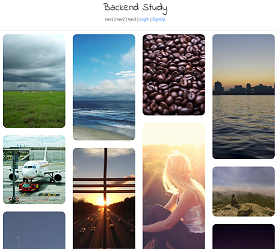
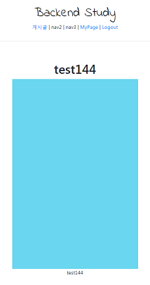

# Django 실습
##### Date 2020_12_1
뭐했다고 벌써 12월..
---
### 1. get_success_url 그리고 리팩토링
> 어제 했던 30~32강 profileapp에서 고칠것 수정할거임
> 
> ```class ProfileCreateView(CreateView):```의 ```success_url = reverse_lazy('accountapp:hello_world')```가 이상태이다
> 
> 이것보다는 ```success_url = reverse_lazy('accountapp:detail')``` 자연스러울 것이라고 말한다.
> 
> 하지만 이렇게 사용하면 적용이 안된다고 말한다.
> 
> why? detail페이지는 pk라는 추가적인 데이터를 받아야 볼 수 있기 때문이다.
> 
> 이를 동작하게 하기 위해선 get_success_url(내부 메서드)를 수정해줘야한다.
> 
> 필요한 클래스 내부에 아래와 같이 작성하고 ```success_url```은 삭제하도록 한다.
> ```Python
>     def get_success_url(self):
>         return reverse('accountapp:detail', kwargs={'pk': self.object.user.pk})
>         # reverse 혹은 reverse_lazy 둘다 사용 가능하다.
>         # self.object 는 Profile를 가리킨다. 그 Profile의 user의 pk를 찾아 넘겨주는것.
> ```
> 이제 프로필을 수정하면 detail로 정상적으로 넘어가는 것을 확인할 수 있다.
> 
> 또한 아직은 프로필 수정(profile:update)에 로그인을 안하더라도 url주소를 통해 접속이 가능하다.
> 
> 이를 해결하기 위해 다음 내용을 수정하여 반영한다.
> ```
> 
> 
> 
> 
> 
>     <div>
>         <div style="text-align: center; max-width: 500px; margin: 4rem auto;">
>             
>             <!--프로필이 존재 할때 하는 작업 시작-->
>             <!--proifle이 있다면 시작-->
>             
>             
>             
>             <h2>
>                 {{ target_user.profile.nickname }}<!--닉네임을 보여줌-->
>                 <!--로그인한 사람과 프로필 소유자가 같은지 검증 시작-->
>                 <a href="">
>                     <!--타겟 유저의 프로파일의 pk를 pk로 넘겨준다.-->
>                     📝
>                 </a>
>                 <!--로그인한 사람과 프로필 소유자가 같은지 검증 끝-->
>             </h2>
>             <h5 style="margin-bottom: 3rem;">
>                 {{ target_user.profile.message }}
>             </h5>
>             <!--proifle이 없다면-->
>              <!--로그인한 사람과 프로필 소유자가 같은지 검증 시작-->
>             <a href=""><!--프로필 작성 버튼 보여줌-->
>                 <p>
>                     프로필 작성
>                 </p>
>             </a>
>             <!--프로필 설정하지 않은 사람의 프로필을 볼때.-->
>             <h2>
>                 닉네임 미설정
>             </h2>
>             <!--로그인한 사람과 프로필 소유자가 같은지 검증 끝-->
>             <!--proifle확인 끝-->
>             <!--프로필이 존재 할때 하는 작업 끝-->
>             
>             
>             <a href="">
>                 <p>
>                     정보 수정
>                 </p>
>             </a>
>             <a href="">
>                 <p>
>                     탈 퇴
>                 </p>
>             </a>
>             
>         </div>
>     </div>
> 
> 
> ```
> accountapp의 detail을 전체적으로 위와 같이 수정하고 반영 하였다.
> 
### 2. MagicGrid 소개 및 Articleapp 시작
> card형 layout를 사용하기 위한 자바스크립드 라이브러리인 MagicGrid 사용할 것이다.
> 
> 가장 처음으로는 articleapp을 생성한다.
> 
> ```python manage.py startapp articleapp``` 명령어를 통해 생성 가능하다.
> 
> 다음으로는 main이 되는 app의 settings.py의 ```INSTALLED_APPS```에 ```'articleapp',```을 추가하고
> 
> urls.py의 ```urlpatterns``` 에도 ```path('articles/', include('articleapp.urls')),```를 추가한다.
> 
> 다음으로 articleapp에 urls.py를 생성하고 아래와 같이 작성한다.
> ```Python
> from django.urls import path
> 
> from django.view.generic import TemplateView
> # LoginView와 LogoutView사용하기 위해
> 
> app_name = 'articleapp'
> 
> urlpatterns = [
>     path('list/', TemplateView.as_view(template_name='articleapp/list.html'), name='list'),
>     # TemplateView는 장고에서 제공하며 템플릿만 지정하면 나머지는 자동으로 만들어준다.
> ]
> ```
> 그 다음엔 articleapp/templates/articleapp 폴더를 생성한 뒤 내부에 list.html파일을 작성한다.
> 
> list.html의 내용은 ```https://jsfiddle.net/eolaojo/4pov0rdf/```를 이용해 작성 하였다.
> 
> 전체 내용은 조금 아래에 첨부하겠다.
> 
> 필요한 js파일은 ```https://github.com/e-oj/Magic-Grid/blob/master/dist/magic-grid.cjs.js```를 이용하였으며 약간의 수정을 하였다.
> 
> js의 저장 경로는 ```backend_study/static/js/magicgrid.js```이다.
> ```js
> let magicGrid = new MagicGrid({
>   container: '.container',
>   animate: true,
>   gutter: 30,
>   static: true,
>   useMin: true
> });
> 
> var masonrys = document.getElementsByTagName("img");
> 
> for (let i = 0; i < masonrys.length; i++){
>     masonrys[i].addEventListener('load', function(){
>         magicGrid.positionItems();
>     }, false);
> }
> // html테그 내부에 있는 이미지에 대해 이미지가 로드가 되었을때 매직그리드릴 다시 포지셔닝 하라
> // 라는 이벤트 리스너를 추가한것
> 
> magicGrid.listen();
> ```
> 맨 아래의 ```module.exports = MagicGrid;```를 삭제 하였으며 
> 
> 해당 위치에 magicGrid의 js 코드를 삽입하였다 
> 
> 마지막으로는 이미지가 로드되었을때 자리를 재배치 하는 코드를 ```magicGrid.listen();```위에 작성 하였다.
> 
> [자세한 설명은 영상을 보자.](https://www.youtube.com/watch?v=uGoRBR9kivA&list=PLQFurmxCuZ2RVfilzQB5rCGWuODBf4Qjo&index=35&t=660)
> 
> 마지막의 list.html의 코드는 다음과 같이 작성 하였다.
> ```html
> 
> 
> 
> 
> <style>
>     .container div {
>         width: 250px;
>         background-color: antiquewhite;
>         display: flex;
>         justify-content: center;
>         align-items: center;
>         border-radius: 1rem;
>     }
>     
>     .container img {
>         width: 100%;
>         border-radius: 1rem;
>     }
> 
> </style>
> 
>     <div class="container">
>         <div class="item1">
>             
>             <!--```https://picsum.photos/200/300```는 파라미터로 너비 200 높이 300의 이미지를 요청한 것-->
>             <!--위와같이 요청하면 랜덤한 사진을 제공해준다.-->
>         </div>
>         <!-- 높이만 다르게 조절한 13개의 이미지이다. 반복이라 여기선 지움 -->
>     </div>
> 
>     <script src=""></script>
> 
> ```
> 
> 
> 
### 3. Articleapp CRUD 마무리
> create view만들것이다 그 전에 models.py부터 수정한다.
> ```Python
> from django.contrib.auth.models import User
> from django.db import models
> 
> class Aricle(models.Model):
>     writer = models.ForeignKey(User, on_delete=models.SET_NULL, related_name='article', null=True)
>     # on_delete=models.SET_NULL 회원 탈퇴시 게시글이 사라지는 것이 아닌 주인이 없는 게시글로 되도록
>     # related_name='article'  user.article로 사용하는 것이 더 직관적이기 때문에.
>     title = models.CharField(max_length=200, null=True)
>     # 제목없음 가능
>     image = models.ImageField(upload_to='article/', null=False)
>     content = models.TextField(null=True)
>     # 내용이 좀 긴 경우 대비해서 textfield 사용
>     created_at = models.DateField(auto_created=True, null=True)
>     # 게시글 작성 시간 표시, auto_created=True 쓰면 자동으로 함
> ```
> 그 다음 forms.py를 생성하고 작성한다.
> ```Python
> from django.forms import ModelForm
> from articleapp.models import Article
> 
> class ArticleCreationForm(ModelForm):
>     class Meta:
>         model = Article
>         fields = ['title', 'image', 'content']
> ```
> 그 다음은 역시 migration이다.
> 
> ```python manage.py makemigrations``` 하고 ```python manage.py migrate```하여 DB에 반영시킨다.
> 
> 그 다음 views.py를 작성한다.
> ```Python
> from django.urls import reverse
> 
> from django.views.generic import CreateView, DetailView
> 
> from articleapp.forms import ArticleCreationForm
> from articleapp.models import Article
> 
> from django.utils.decorators import method_decorator
> from django.contrib.auth.decorators import login_required
> 
> @method_decorator(login_required, 'get')
> @method_decorator(login_required, 'post')
> class ArticleCreateView(CreateView):
>     model = Article
>     form_class = ArticleCreationForm
>     template_name = 'articleapp/create.html'
> 
>     def form_valid(self, form):
>         temp_article = form.save(commit=False) # 임시저장
>         temp_article.writer = self.requset.user # 지금 리퀘스트를 보낸 사람을 writer로 저장
>         temp_article.save() #저장
>         return super().form_valid(form)
> 
>     def get_success_url(self):
>         return reverse('articleapp:detail', kwargs={'pk': self.object.pk})
> 
> class ArticleDetailView(DetailView):
>     model = Article
>     context_object_name = 'target_article'
>     template_name = 'articleapp/detail.html'
> ```
> 그리고 사용할 템플릿을 html로 생성한다.(templates/articleapp/...)
> 
> create.html
> ```html
> 
> 
> 
> 
> 
>     <div style="text-align: center; max-width: 500px; margin: 4rem auto;">
>         <div class="mb-4">
>             <h4>게시글 작성</h4>
>         </div>
>         <form action="" method="post" enctype="multipart/form-data">
>             
>             
>               <input type="submit" class="btn btn-dark rounded-pill col-6 mt-3">
>         </form>
>     </div>
> 
> 
> ```
> detail.html
> ```html
> 
> 
> 
> 
> 
>     <div>
>         <div style="text-align: center; max-width: 500px; margin: 4rem auto;">
>             
>             <h1>
>                 {{ target_article.title }}
>             </h1>
>             
>             
>             
>             <p>
>                 {{ target_article.content }}
>             </p>
>             
>         </div>
>     </div>
> 
> 
> ```
> 그리고 header.html에 게시글을 볼 수 있는 버튼을 추가하였다.
> ```
> <div>
>             <a href="">
>                 <span>게시글</span>
>             </a> | 
>             <span>nav2</span> | 
> ```
> 원래 nav1의 자리에 위와같이 수정하였다.
> 
> 그 다음 list.html을 수정한다.
> ```html
>     <div style="text-align: center">
>         <a href="" class="btn btn-dark rounded-pill col-3 mt-3 mb-3">
>             게시글 작성
>         </a>
>     </div>
> ```
> list.html의 맨 아래에 게시글 작성 버튼을 생성 하였다.
> 
> 그리고 urls.py에 path를 추가한다.
> ```
> urlpatterns = [
>     path('list/', TemplateView.as_view(template_name='articleapp/list.html'), name='list'),
>     # TemplateView는 장고에서 제공하며 템플릿만 지정하면 나머지는 자동으로 만들어준다.
>     path('create/', ArticleCreateView.as_view(), name='create'),
>     path('detail/<int:pk>', ArticleDetailView.as_view(), name='detail'),
> ]
> ```
> 
> 
> 정상적으로 동작함을 확인 할 수 있다.
> 
> 이제 Views.py에 update를 추가하고 데코레이터 또한 작성해 준다.
> 
> ```Python
> #Views.py
> 
> from articleapp.decorators import article_ownership_required
> @method_decorator(article_ownership_required, 'get')
> @method_decorator(article_ownership_required, 'post')
> class ArticleUpdateView(UpdateView):
>     model = Article
>     form_class = ArticleCreationForm
>     template_name = 'articleapp/update.html'
>     context_object_name = 'target_article'
>     
>     def get_success_url(self):
>         return reverse('articleapp:detail', kwargs={'pk': self.object.pk})
> 
> # decorators.py
> 
> from django.http import HttpResponseForbidden
> from articleapp.models import Article
> 
> def article_ownership_required(func):
>     def decorated(request, *args, **kwargs):
>         article = Article.objects.get(pk=kwargs['pk'])
>         # 요청을 받으며 pk로 받은 값을 가지고 있는 User.objects가 profile이 된다.
>         if not article.writer == request.user: #그 article request의 profile이 아니라면
>             return HttpResponseForbidden() #권한없음 창 띄움.
>         return func(request, *args, **kwargs)
>     return decorated
> ```
> 작성이 끝나면 urls.py에 path를 추가한다.
> ```Python
> path('update/<int:pk>', ArticleUpdateView.as_view(), name='update'),
> ```
> 그리고 update.html을 아래와 같이 작성한다.
> ```html
> 
> 
> 
> 
> 
>     <div style="text-align: center; max-width: 500px; margin: 4rem auto;">
>         <div class="mb-4">
>             <h4>게시글 수정</h4>
>         </div>
>         <form action="" method="post" enctype="multipart/form-data">
>             
>             
>             <input type="submit" class="btn btn-dark rounded-pill col-6 mt-3">
>         </form>
>     </div>
> 
> 
> ```
> 마지막으로 views.py에 ArticleDeleteView 를 생성한다.
> ```Python
> @method_decorator(article_ownership_required, 'get')
> @method_decorator(article_ownership_required, 'post')
> class ArticleDeleteView(DeleteView):
>     model = Article
>     context_object_name = 'target_article'
>     success_url = reverse_lazy('articleapp:list')
>     template_name = 'articleapp/delete.html'
> ```
> 작성이 끝나면 urls.py에 path를 추가한다.
> ```Python
> path('delete/<int:pk>', ArticleDeleteView.as_view(), name='delete')
> ```
> delete.html을 아래와 같이 작성한다.
> ```html
> 
> 
> 
> 
> 
>     <div style="text-align: center; max-width: 500px; margin: 4rem auto;">
>         <div class="mb-4"><!--margin-bottom-->
>             <h4>게시글 삭제 : {{ target_article.title }}</h4>
>         </div>
>         <form action="" method="post">
>             
>               <input type="submit" class="btn btn-danger rounded-pill col-6 mt-3">
>         </form>
>     </div>
> 
> 
> ```
> 마지막으로 수정과 삭제를 위한 링크를 detail.html에 추가한다.
> ```html
> 
> 
> 
> 
>     <div>
>         <div style="text-align: center; max-width: 500px; margin: 4rem auto;">
>             
>             <h1>
>                 {{ target_article.title }}
>             </h1>
>             
>             
>             
>             <p>
>                 {{ target_article.content }}
>             </p>
>             <a href="">
>                 <p>게시물 수정</p>
>             </a>
>             <a href="">
>                 <p>게시물 삭제</p>
>             </a>
>         </div>
>     </div>
> 
> 
> ```
> 
# 끝! 
오늘은 [35강](https://www.youtube.com/watch?v=F_B3ue1922c&list=PLQFurmxCuZ2RVfilzQB5rCGWuODBf4Qjo&index=36) 까지 학습을 진행 하였다.
## 참고한 영상 : [실용주의 프로그래머의 작정하고 장고! Django로 Pinterest 따라하기](https://www.youtube.com/playlist?list=PLQFurmxCuZ2RVfilzQB5rCGWuODBf4Qjo)
