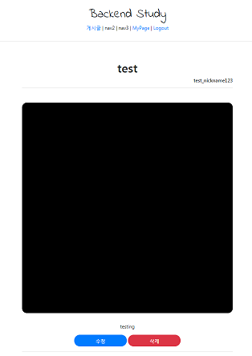

# Django 실습
##### Date 2020_12_2
오늘은 쉴라다가.. 공부.. 중간에 오타를 못찾아서 시간만 잡아먹음;;
---
### 1. ListView, Pagination
> 이번엔 Article app의 detailview를 수정하고 넘어갈것 
> 
> ListView도 장고가 기본적으로 제공해주는 view이다.
> 
> Pagination은 쉽게말하면 페이지의 객체를 생성하는 것.
> 
> 일반적으로는 페이지에 번호를 붙여서 1번 2번페이지 등으로 사용하지만
> 
> 인스타, 구글 이미지, 페이스북과 같이 스크롤을 내릴때마다 새로운 정보가 로드 되도록 하는 방법도 있다.
> - 이 방식은 infinite Scroll이라 한다. 여기선 사용하지 않을 것.
> 
> [article_list, page_obj 영상 보자](https://www.youtube.com/watch?v=E4d0vV9DBy4&list=PLQFurmxCuZ2RVfilzQB5rCGWuODBf4Qjo&index=37&t=240)
> 
> Views.py에 ```class ArticleListView(ListView):```를 아래와 같이 추가한다.
> ```Python
> class ArticleListView(ListView):
>     model = Article
>     context_object_name = 'article_list'
>     template_name = 'articleapp/list.html'
>     paginate_by = 25
>     # 하나의 페이지에 몇개의 객체를 보여줄 것인지
>     # Pagination을 하면 page_obj를 사용할 수 있다.
> ```
> 그 다음 urls.py에 'list/' 의 view부분을 수정한다.
> ```path('list/', ArticleListView.as_view(), name='list'),``` 로 수정 하였다.
> 다음으론 list.html을 수정한다.
> ```
>     
>     <div class="container">
>         
>         <a href="">
>             
>             <!--for에서 쓰인 article과 include에서 쓰인 article가 똑같다.-->
>         </a>
>         
>     </div>
>     <script src=""></script>
>     
>     <div class="text-center">
>         <h1>
>             😢 게시물이 없습니다! 😢
>         </h1>
>     </div>
>     
> 
>     
>     <!-- 페이지 버튼 만들어 주는것 연결-->
> ```
> 중간의 컨테이너 부분만 수정을 하였다 for문을 이용해 게시물을 채우도록 하였다.
> 
> 그다음 ```articleapp/templates```에 snippets폴더를 생성하고 card.html파일을 생성후 작성한다.
> ```html
> <div>
>     
> </div>
> ```
> card의 레이아웃을 수정하고 싶다면 card.html을 수정하면 된다.
> 
> 그리고 같은 폴더에 pagination.html 을 작성한다.
> 
> 해당파일은 이전/다음 페이지로 넘어가는 버튼의 기능을 제공한다.
> 
> 마지막으로 detail.html의 내용을 수정 하였다.
> ```
> 
> 
> 
> 
>     <div>
>         <div style="text-align: center; max-width: 700px; margin: 4rem auto;">
>             
>             <h1>
>                 {{ target_article.title }}
>             </h1>
>             <h6 style="text-align: right">
>                 {{ target_article.writer.profile.nickname }}
>             </h6>
>             <hr>
>                               src="{{ target_article.image.url }}" alt="">
>             <div style="">
>                 <p>
>                     {{ target_article.content }}
>                 </p>
>             </div>
>             
>             <a href=""
>                class="btn btn-primary rounded-pill col-3">
>             수정
>             </a>
>             
>             <a href=""
>                class="btn btn-danger rounded-pill col-3">
>             삭제
>             </a> 
>             
>             <hr>
>         </div>
>     </div>
> 
> 
> ```
> 
> 
> 
> 짜자잔...
> 
# 끝! 
오늘은 [36강](https://www.youtube.com/watch?v=E4d0vV9DBy4&list=PLQFurmxCuZ2RVfilzQB5rCGWuODBf4Qjo&index=37)의 학습을 진행 하였다.
## 참고한 영상 : [실용주의 프로그래머의 작정하고 장고! Django로 Pinterest 따라하기](https://www.youtube.com/playlist?list=PLQFurmxCuZ2RVfilzQB5rCGWuODBf4Qjo)
