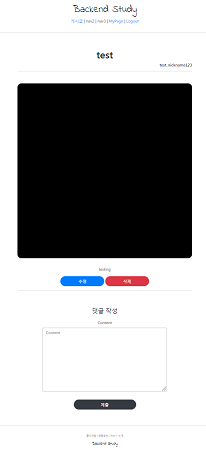

# Django 실습
##### Date 2020_12_3
---
### Mixin을 사용한 게시글 댓글 시스템 구현
> - [Mixin 영상보기](https://www.youtube.com/watch?v=SfXqtEuoJoA&list=PLQFurmxCuZ2RVfilzQB5rCGWuODBf4Qjo&index=38&t=30)
> 
> 쉽게 말하면 form이 없는 클래스에서 form 이 필요할때 다중상속을 통해 사용이 가능하도록 지원해 주는것.
> 
> 영상을 통해 반복학습하여 이해하자.
>  
> Commentapp(댓글 시스템)의 조건은 아래와 같다.
> - Create/Delete View
> 
> - Success_url ro related article
> 
> - Model(aricle, writer, content, created_at)
> 
> 1. Commentapp 생성후 등록 및 경로 설정, migrate
> ```python manage.py startapp commentapp```명령어로 commentapp생성
> 
> ```seetings.py(main인 폴더)```의```INSTALLED_APPS```에```commentapp``` 등록.
> 
> ```urls.py(main인 폴더)```의```urlpatterns```에```path('comments/', include('commentapp.urls'))```등록.
> 
> ```urls.py(commentapp)```생성 후 임시작성.
> ```Python
> from django.urls import path
> 
> app_name = 'commentapp'
> 
> urlpatterns = [
> ]
> ```
> 같은 위치에 models.py와 forms.py 생성 및 작성
> 
> models.py
> ```Python
> from django.contrib.auth.models import User
> from django.db import models
> from articleapp.models import Article
> 
> # Create your models here.
> class Comment(models.Model):
>     article = models.ForeignKey(Article, on_delete=models.SET_NULL, null=True, related_name='comment')
>     writer = models.ForeignKey(User, on_delete=models.SET_NULL, null=True, related_name='comment')
> 
>     content = models.TextField(null=False)
> 
>     create_at = models.DateTimeField(auto_now=True)
> ```
> forms.py
> ```Python
> from django.forms import ModelForm
> from commentapp.models import Comment
> 
> class CommentCreationForm(ModelForm):
>     class Meta:
>         model = Comment
>         fields = ['content']
> ```
> ```python manage.py makemigrations```, ```python manage.py migrate```명령어를 통해 DB 등록.
> 
> 2. views.py 작성.
> 
> ```Python
> from django.shortcuts import render
> from django.views.generic import reverse
> from django.views.generic import CreateView
> 
> from commentapp.forms import CommentCreationForm
> from commentapp.models import Comment
> 
> class CommentCreateView(CreateView):
>     model = Comment
>     form_class = CommentCreationForm
>     template_name = 'commentapp/create.html'
> 
>     def get_success_url(self):
>         return reverse('articleapp:detail', kwargs={'pk': self.object.article.pk})
>         # object(comment)의 article의 pk를 가진 detail로 되돌아 가는것.
> ```
> 임시로 작성 하였던 urls.py의 urlpatterns ```path('create/', CommentCreateView.as_view(), name='create'),```를 추가한다.
> 
> 3. templates폴더와 내부에 commentapp폴더를 생성하고 html파일을 작성
> create.html
> ```html
> 
> 
> 
>     <div style="text-align: center; max-width: 500px; margin: 4rem auto;">
>         <div class="mb-4">
>             <h4>댓글 작성</h4>
>         </div>
>         <form action="" method="post">
>             
>             
>             <input type="submit" class="btn btn-dark rounded-pill col-6 mt-3">
>             <input type="hidden" name="article_pk" value="{{ article_pk }}">
>             <!--이름과 값이 article_pk인 인자를 숨겨서 보내준다.-->
>         </form>
>     </div>
> 
> ```
> 4. articleapp의 detail.html
> 접속해 보면 정상적으로 작동한다 하지만 articleapp의 detail.html에 include하여 사용할 것이다.
> 
> articleapp의 detail.html에 include구문을 추가한다.
> ```html
>             
>             <hr>
>             
>             <!--안에 있는 article을 현재 있는target_article과 동기화 시킨다.-->
>         </div>
>     </div>
> ```
> 위와같이 맨 아래쪽에 새로운 구문을 추가 하였다.
> 
> 아직까지는 오류가 발생한다. mixin을 사용하지 않았기 때문이다. 
> 
> 5. mixin적용.
> 댓글은 게시물에 달려야 하며 댓글을 다는 곳에서는 게시물 을 볼 수 있어야 한다.
> 
> 이를 위해선 게시물의 세부 사항을 보는 탭인 detail을 수정 해야하며 해당 html은 수정 을 하였으니
> 
> 이젠 views.py를 수정해야한다.
> 
> articelapp의 views.py에 아래 코드를 통해 필요한 것을 import한다.
> ```Python
> from commentapp.forms import CommentCreationForm
> from django.views.generic.edit import FormMixin
> ```
> 그 다음으론 ArticleDetailView에 코드를 추가한다.
> ```Python
> class ArticleDetailView(DetailView, FormMixin):
>                         # FormMixin을 이용해 다중 상속을 받는다.
>     form_class = CommentCreationForm
>     # 필요한 form을 가져온다.
> ```
> 
> 
> 
> 이로써 form 연결은 끝이다 하지만 아직 완성은 아니다.
> 
> 6. Commentapp의 views.py 수정
> ```Python
>     def form_valid(self, form):
>         temp_comment = form.save(commit=False) #임시 저장
>         print(temp_comment)
>         print(Article.objects.get(pk=self.request.POST['article_pk']))
>         temp_comment.article = Article.objects.get(pk=self.request.POST['article_pk'])
>         # 리퀘스트에서 받은 post데이터중 article_pk라는 데이터를 article값으로 설정해주는것
>         # 즉 create.html에서 hidden으로 보낸 article.pk가 이쪽으로 넘어 오는것
>         temp_comment.writer = self.request.user
>         temp_comment.save() # 최종적으로 저장
>         return super().form_valid(form)
> ```
> 위의 코드를 CommentCreateView클래스 내부에 추가한다.
> 
> 7. 마지막으로 articleapp의 detail.html을 수정한다.
> ```html
> 
> 
> 
> 
>     <div>
>         <div style="text-align: center; max-width: 700px; margin: 4rem auto;">
>             
>             <h1>
>                 {{ target_article.title }}
>             </h1>
>             <h6 style="text-align: right">
>                 {{ target_article.writer.profile.nickname }}
>             </h6>
>             <hr>
>                               src="{{ target_article.image.url }}" alt="">
>             <div style="">
>                 <p>
>                     {{ target_article.content }}
>                 </p>
>             </div>
>             
>             <a href=""
>                class="btn btn-primary rounded-pill col-3">
>             수정
>             </a>
>             
>             <a href=""
>                class="btn btn-danger rounded-pill col-3">
>             삭제
>             </a> 
>             
>             <hr>
>             
>             
>             <!--안에 있는 article을 현재 있는target_article과 동기화 시킨다.-->
>             
>         </div>
>     </div>
> 
> 
> ```
> 로그인한 경우와 로그아웃한경우에 따라 제공하는 버튼을 달리하였다.
> 
> 오늘은 여기서끝..
> 
# 끝!
###### 요즘 너무 힘들다으아아아아아앙아아
오늘은 [37강](https://www.youtube.com/watch?v=SfXqtEuoJoA&list=PLQFurmxCuZ2RVfilzQB5rCGWuODBf4Qjo&index=38)의 학습을 진행 하였다.
## 참고한 영상 : [실용주의 프로그래머의 작정하고 장고! Django로 Pinterest 따라하기](https://www.youtube.com/playlist?list=PLQFurmxCuZ2RVfilzQB5rCGWuODBf4Qjo)
