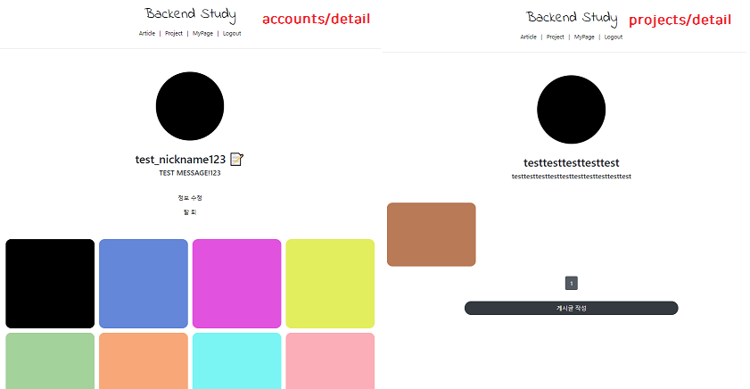

# Django 실습
##### Date 2020_12_9
---
### 1. [MultipleObjectMixin을 통한 ProjectApp 마무리](https://www.youtube.com/watch?v=O9T5I8OKRps&list=PLQFurmxCuZ2RVfilzQB5rCGWuODBf4Qjo&index=42)
> articleapp의 models.py의 ```class Article(models.Model):```에 
> 
> ```project = models.ForeignKey(Project, on_delete=models.SET_NULL, related_name='article', null=True)```를 추가한다.
> 
> 그리고 forms.py의 ```fields```내용도 아래와 같이 수정한다.
> ```
> fields = ['title', 'image', 'project', 'content']
> ```
> project가 추가 되었다.
> 
> 그 다음 models.py을 수정 하였으니 ```python manage.py makemigrations```과 ```python manage.py migrate``` 명령어를 통해 적용 시킨다.
> 
> 이제 article 에서 게시물을 작성할때 프로젝트를 설정하는 탭이 생성되었다.
> 
> 하지만 아직 프로젝트 텝에서는 프로젝트에 대한 게시물을 볼 수 없다 이제 그 기능을 작성 할 것이다.
> 
> In View Using Mixin!
> 
> projectapp의 views.py에 DetailView 부분을 수정한다.
> ```Python
>     paginate_by = 25
> 
>     def get_context_data(self, **kwargs):
>         object_list = Article.objects.filter(project=self.get_object())
>         # 현재의 프로젝트에 속한 아티클들만 필터링해서 가져옴
>         return super(ProjectDetailView, self).get_context_data(object_list=object_list, **kwargs)
> ```
> 위의 내용을 추가한 뒤 detail.html의 하단에 아내 내용을 추가한다.
> ```html
>             </h5>
>         </div>
>         <div><!--시작-->
>             
>         </div><!--끝-->
>     </div>
> ```
> 마지막으로 snippets내부에 html파일 하나를 작성한다 내용은 아래와 같다.(detail.html에서 include하는 html)
> list_bs.html 
> ```html
> 
> 
> 
> <style>
>     .container {
>         padding: 0;
>         margin: 0, auto;
>     }
>     
>     .container a {
>         width: 45%;
>         max-width: 250px;
>     }
> 
>     .container div {
>         display: flex;
>         justify-content: center;
>         align-items: center;
>         border-radius: 1rem;
>     }
>     
>     .container img {
>         width: 100%;
>         border-radius: 1rem;
>     }
> 
> </style>
>     
>     <div class="container">
>         
>         <a href="">
>             
>             <!--for에서 쓰인 article과 include에서 쓰인 article가 똑같다.-->
>         </a>
>         
>     </div>
>     <script src=""></script>
>     
>     <div class="text-center">
>         <h1>
>             😢 게시물이 없습니다! 😢
>         </h1>
>     </div>
>     
> 
>     
>     <!-- 페이지 버튼 만들어 주는것 연결 -->
> 
>     <div style="text-align: center">
>         <a href="" class="btn btn-dark rounded-pill col-3 mt-3 mb-3">
>             게시글 작성
>         </a>
>     </div>
> ```
> accoutnapp에도 지금과 같은 과정으로 DetailView를 수정해준다.
>
> 결과!
> 
> 
# 끝!
오늘은 [41강](https://www.youtube.com/watch?v=O9T5I8OKRps&list=PLQFurmxCuZ2RVfilzQB5rCGWuODBf4Qjo&index=42)의 학습을 진행 하였다.
## 참고한 영상 : [실용주의 프로그래머의 작정하고 장고! Django로 Pinterest 따라하기](https://www.youtube.com/playlist?list=PLQFurmxCuZ2RVfilzQB5rCGWuODBf4Qjo)
