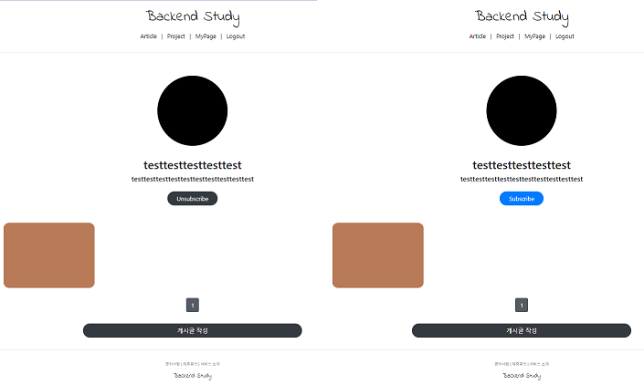
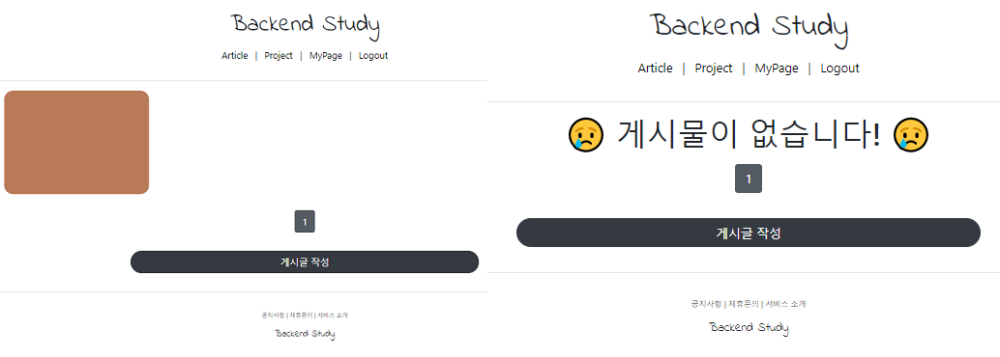
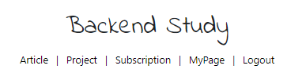

# Django 실습
##### Date 2020_12_11
---
### 1. RedirectView을 통한 SubscribeApp시작
> ```python manage.py startapp subscribeapp``` 명령어를 통해 app생성
> 
> settings.py 와 urls.py(backend_study/)에 등록
> 
> subscribeapp에 urls.py  임시 작성.
> 
> views.py 임시 작성
> 
> models.py 작성
> ```Python
> from django.db import models
> from django.contrib.auth.models import User
> from projectapp.models import Project
> 
> class Subscription(models.Model):
>     user = models.ForeignKey(User, on_delete=models.CASCADE, related_name='subscription')
>     project = models.ForeignKey(Project, on_delete=models.CASCADE, related_name='subscription')
> 
>     class Meta:
>         unique_together = ('user', 'project')
> ```
> 
> 작성이 끝나면 ```python manage.py makemigrations```와```python manage.py migrate```명령어를 통해 등록한다.
> 
> views.py 작성
> ```Python
> from django.shortcuts import render, get_object_or_404
> from django.urls import reverse
> 
> from django.views.generic import RebirectView
> 
> from django.utils.decorators import method_decorator
> from django.contrib.auth.decorators import login_required
> 
> from subscribeapp.models import Subscription
> from projectapp.models import Project
> 
> @method_decorator(login_required, 'get')
> class SubscriptionView(RebirectView):
> 
>     def get_redirect_url(self, *args, **kwargs):
>         return reverse('projectapp:detail', kwargs={'pk': self.request.GET.get('project_pk')})
> 
>     def get(self, requset, *args, **kwargs):
>         project = get_object_or_404(Project, pk = self.request.GET.get('project_pk'))
>         # project_pk가진 Project가 없다면 404  오류를 출력해라.
>         user = self.requset.user
> 
>         subscription = Subscription.object.filter(user=user, project=project)
> 
>         if subscription.exists():
>             subscription.delete()
>         else:
>             Subscription(user=user, project=project).save()
> 
>         return super(SubscriptionView, self).get(requset, *args, **kwargs)
> ```
> projectapp의 detail.html 에 구독 버튼 추가.
> - 아래에서 완성된 코드로 올린다.
> 
> projectapp의 views.py에 구독 버튼 클릭시 이벤트 처리 작성.
> ```Python
>     def get_context_data(self, **kwargs):
>         project = self.object
>         user = self.requset.user
> 
>         if user.is_authenticated: # 유저가 로그인 중이라면
>             subscription = Subscription.objects.filter(user=user, project=project)
>         
>         object_list = Article.objects.filter(project=self.get_object())
>         # 현재의 프로젝트에 속한 아티클들만 필터링해서 가져옴
>         return super(ProjectDetailView, self).get_context_data(object_list=object_list, subscription=subscription, **kwargs)
> ```
> ProjectDetailVie클래스의 get_context_data를 위와같이 수정한다.
> 
> 마지막으로 projectapp의 detail.html에 구독 취소 버튼을 추가하여 완성 시킨다.
> 
> ```Python
>         <div class="text-center mb-5">
>             
>                 <!--구독 안했을 때.-->
>                 <a href="?project_pk={{ target_project.pk }}"
>                    class="btn btn-primary rounded-pill px-4"><!--구독 하기-->
>                     Subscribe
>                 </a>
>                 <!--구독 했을 때.-->
>                 <a href="?project_pk={{ target_project.pk }}"
>                    class="btn btn-dark rounded-pill px-4"><!--구독 취소-->
>                     Unsubscribe
>                 </a>
>                 
>             
>         </div>
> ```
> 출력 화면은 아래와 같다.
> 
> 
> 
### 2. Field Lookup을 사용한 구독 페이지 구현
> 지금가지 사용했던 (pk="", user="")이 방식은 AND func방식이였다.
> 
> 이번엔 OR func, WHERE func 에 대해 알아본다.
> 1. Find user Subscripted projects
>>  - 유저가 구독하고 있는 프로젝트들 확인
> 
> 2. Find article in projects
>>  - 그 프로젝트들 안에 있는 모든 게시글들을 가져오는것.
>  
> (pk="", user="")이 방식이 아닌 (project__in=projects) 이 방식을 사용할 것이다.
> 
> 위의 방식은 Django에서 Field Lookups 라고 한다. [영상보기](https://www.youtube.com/watch?v=F0gpmEXVEEU&list=PLQFurmxCuZ2RVfilzQB5rCGWuODBf4Qjo&index=44&t=167)
> 
> 일단 subscribeapp의 views.py에 기능을 추가한다.
> ```Python
> @method_decorator(login_required, 'get')
> class SubscriptionListView(ListView):
>     model = Article
>     context_object_name = 'article_list'
>     template_name = 'subscribeapp/list.html'
>     paginate_by = 5
>     # article 전부를 가져오는 것이 아닌 특정 조건(구독여부)를 만족하는 aarticle을 가져올 것
>     # 따라서 쿼리셋관련 함수를 새로 작성할 것이다.
>     def get_queryset(self):
>         projects = Subscription.objects.filter(user=self.request.user).values_list('project')
>         # values_list : 값들을 리스트화 시킨다.
>         # 따라서 projects에는 구독한모든 프로젝트가 리스트 형식으로 담긴다.
>         article_list = Article.objects.filter(project__in=projects)
>         return article_list
> ``` 
> 위와같이 새 클래스를 작성한다.
> 
> 다음으론 list.html을 간단하게 작성한다.
> ```html
> 
> 
> 
> 
>     <div>
>         
>     </div>
>     
> 
> ```
> 출력 화면은 아래와 같다.
> 
> 
> 
> 41강에서 ```templates/snippets/```의 경로에 list_bs.html을 작성 하였다 이를 이용하여 위와같이 간단히 구현이 가능한다.
> 
> 마지막으로 header.html의 nav부분을 아래와 같이 수정하였다
> ```html
>             <a href="" class="BS_header_nav">
>                 <span>Subscription</span>
>             </a> | 
>             <!--인증부분 위에 추가함-->
> ```
> 출력 화면은 아래와 같다.
> 
> 
>  
# 끝!
오늘은 [43강](https://www.youtube.com/watch?v=F0gpmEXVEEU&list=PLQFurmxCuZ2RVfilzQB5rCGWuODBf4Qjo&index=44)까지 학습을 진행 하였다.
## 참고한 영상 : [실용주의 프로그래머의 작정하고 장고! Django로 Pinterest 따라하기](https://www.youtube.com/playlist?list=PLQFurmxCuZ2RVfilzQB5rCGWuODBf4Qjo)
