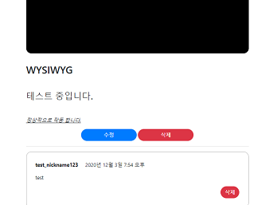
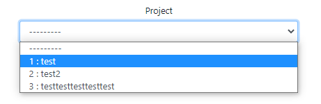
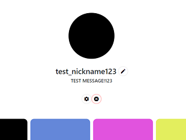

# Django 실습
##### Date 2020_12_12
---
### 1. WYSIWYG 적용
> What You See Is What You Get
> 
> 보는대로 글이 써진다.
> 
> 지금은 일반적인 텍스트로만 이루어진다.
> 
> 굵게, 언더라인, 색상등 세부 설정을 할 수 있도록 변경한다.
> 
> 오픈소스를 사용할 것이다.[Medium Editor github](https://github.com/yabwe/medium-editor)
> 
> articleapp의 forms.py를 수정한다.
> ```class ArticleCreationForm(ModelForm):``` 의 내부에 아래 코드를 작성한다.
> ```Python
>     content = forms.CharField(widget=forms.Textarea(attrs={'class': 'editable text-left',
>                                                           'style': 'height: auto;'}))
> ```
> 
> 그리고 사용할 위치(나의 경우는 articleapp의 create.html의)에 아래 코드들을 작성한다.
> ```html
> <!--  바로 아래 -->
> <script src="//cdn.jsdelivr.net/npm/medium-editor@5.23.2/dist/js/medium-editor.min.js"></script>
> <link rel="stylesheet" href="//cdn.jsdelivr.net/npm/medium-editor@5.23.2/dist/css/medium-editor.min.css" type="text/css" media="screen" charset="utf-8">\
> 
> <!-- 의 바로 위 -->
> <script>var editor = new MediumEditor('.editable');</script>
> ```
> 
> 이렇게 한다면 create에서 작성할때 옵션을 추가 할 수 있다.
> 
> 하지만 아직은  detail에서 게시물을 볼때 html태그가 달려있는 상태로 출력이 되는것을 확인 할 수 있다.
> 
> 정상적인 출력을 위해 detail.html을 수정한다.
> 
> 이전에 ```{{ target_article.content }}```로 작성된 부분을 아래와 같이 수정한다
> 
> ```html
> <!-- <p> 태그 삭제함 바로 <div> 로 감쌈 -->
> <div class="text-left">
>     {{ target_article.content | safe }}
> </div>
> ```
> 간단하다.
> 
> update에도 detail에 추가하였던 코드를 같은 위치에 추가 하였다.
> 
> 정상적으로 작동한다.
> 
> - 사랑해요 오픈소스
> 
> 
> 
> 또한 지금은 무조건 프로젝트를 골라 주어야한다.
> 
> 프로젝트를 정하지 않고도 작성 가능하도록 수정한다.
> 
> articleapp의 forms.py를 수정한다.
> 
> ```class ArticleCreationForm(ModelForm):```의 ```content```아래에
> 
> ```project = forms.ModelChoiceField(queryset=Project.objects.all(), required=False)```
> 
> 위 코드를 추가한다. ```required=False``` 옵션을 통해 가능하다.
> 
### 2. [정리 및 다듬기](https://www.youtube.com/watch?v=H9wS7PUJx4o&list=PLQFurmxCuZ2RVfilzQB5rCGWuODBf4Qjo&index=46)
> 1. 지금은 게시물 작성시 프로젝트를 고를때 '프로젝트명'이 아닌 ```Project object(1)```과 같이
> 
> 알아보기 힘들게 출력된다 이를 수정한다.
> 
> 처음으론 projectapp의 models.py에 아래의 내용을 추가한다.
> 
> ```Python
> class Project(models.Model):
>     
>     ...
>     
>     def __str__(self):
>         return f'{self.pk} : {self.title}'
>         # f''를 사용하면  ''안의 변수를 직접 출력
>         # project.pk : project.title
> ```
> 
> 
> 
> 2. subscription쪽에서 로그인을 하지 않았을 때 발생하는 오류를 수정한다.[영상보기](https://www.youtube.com/watch?v=H9wS7PUJx4o&list=PLQFurmxCuZ2RVfilzQB5rCGWuODBf4Qjo&index=46&t=170)
> 
> views.py(projectapp)내부 ```class ProjectDetailView```의 ```def get_context_data```를 수정한다.
> 
> ```Python
> if user.is_authenticated:
>     subscription = Subscription.objects.filter(user=user, project=project)
>     
> # 위의 if문은 원래 있던 내용. 아래의 else를 if 문 바로 아래에 추가 하였다.
> 
> else:
>     subscription = None
> ```
> 
> 3. accountapp의 hello_world를 삭제한다.
> migration관련 파일은 삭제하면 안된다.
> ```%%%%_initial.py``` 혹은 ```__init__.py```
> 
> 4. home 주소를 정해준다.
> main인 폴더의 urls에 path를 아래와 같이 추가해 준다.
> ```Python
> from articleapp.views import ArticleListView
> 
> path('', ArticleListView.as_view(), name='home'),
> # 주소창에 사이트의 주소만 적었을때 articleapp의 list.html로 연결해주고 name는 home로
> # 원래는 https://study-min-223.run.goorm.io/articles/list/ 로 접속 했다면
> # 지금은 https://study-min-223.run.goorm.io 로 접속하면 home고 list.html이 출력
> ```
> 
> 5. Mypage의 버튼들을 정리.
> [Google Material icons](https://material.io/resources/icons/?style=baseline), [Google Material icons Github](https://github.com/google/material-design-icons)
> - 구글에서 제공하는 무료 아이콘
> 사용하기 위해 head.html에 아래 코드를 추가한다.(나는 구글 폰트 아래에 추가했다.)
> ```html
>     <!-- GOOGLE MATERIAL ICON -->
>     <link href="https://fonts.googleapis.com/css2?family=Material+Icons" rel="stylesheet">
> ```
> 
> 다음으로는 accountapp의 detail.html을 수정한다
> ```
>         <!-- 프로필 수정 -->
>             <a class="material-icons"
>                style="box-shadow: 0 0 4px #ccc; border-radius: 10rem; padding: .4rem;"
>                href="">
>                <!-- box-shadow: 위치 위치 크기 색상 -->
>                <!--타겟 유저의 프로파일의 pk를 pk로 넘겨준다.-->
>                 edit
>             </a>
>             
>         <!-- 회원 정보 수정 -->
>             <a class="material-icons"
>                style="box-shadow: 0 0 4px #ccc; border-radius: 10rem; padding: .4rem;"
>                href="">
>                 settings
>             </a>
>             
>         <!-- 회원 탈퇴 -->
>             <a class="material-icons"
>                style="box-shadow: 0 0 4px red; border-radius: 10rem; padding: .4rem;"
>                href="">
>                 cancel
>             </a>
> ```
> 위의 코드와 같이 수정하였다.
> 
> <a>태그로 감사진 text를 통해 아이콘이 결정된다. 위쪽에 Google Material icons를 눌러 들어가서
> 
> 원하는 것이 있다면 그 이름으로 바꾸어 사용하자.
> 
> 
> 
> 깔끔하게 바뀌었다.
> 
# 끝!
오늘은 [45강](https://www.youtube.com/watch?v=H9wS7PUJx4o&list=PLQFurmxCuZ2RVfilzQB5rCGWuODBf4Qjo&index=46)까지 학습을 진행 하였다.
## 참고한 영상 : [실용주의 프로그래머의 작정하고 장고! Django로 Pinterest 따라하기](https://www.youtube.com/playlist?list=PLQFurmxCuZ2RVfilzQB5rCGWuODBf4Qjo)
