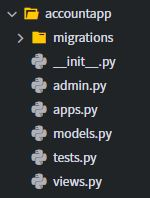
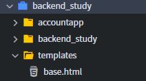
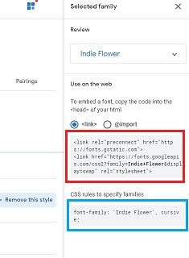
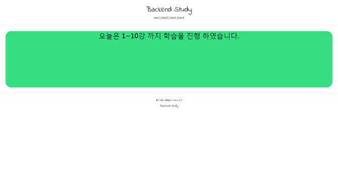

# Django 실습
##### Date 2020_11_24
---
### 1. 기본적인 환경 설정
> 영상을 보고 필요한 부분은 따라서 진행한다.
>
> 영상에선 파이참을 이용하여 git와 연결시켜 실습을 진행하지만
>
> 난 구름IDE를 통해 실습을 진행하였다.
>
### 2. accountapp 생성.
> python manage.py startapp accountapp 실행
>> 
>
> 그후 main이 되는 프로젝트(backend_study)의 하위폴더에있는 settings.py에 들어가서
>
> INSTALLED_APPS에 'accountapp' 등록시킨다.
> ```Python
> INSTALLED_APPS = [
>     'django.contrib.admin',
>     'django.contrib.auth',
>     'django.contrib.contenttypes',
>     'django.contrib.sessions',
>     'django.contrib.messages',
>     'django.contrib.staticfiles',
>     'accountapp',
> ]
> ```
> - accountapp의 view설정. 
>> accountapp 에서 사용할 내가 원하는 view는 해당 폴더의 내부에 있는 views.py에서 내가 구현한다.
>> 예시로
>> ```Python
>> def hello_world(request):
>>     return HttpResponse('Hello World!')
>> ```
>> 를 작성 하였다.
>> HttpResponse를 사용하기 위해선 ```from django.http import HttpResponse``` 해야한다.
>
> - 작성한 view를 보기 위해 연결하기.
>> 작성한 view를 보기 위해서는 view로 연결 해야한다.(라우팅 한다.)
>> 사이트의 특정 주소로 접속 했을때 해당view를 돌릴것 -> 특정 주소를 만들어야 한다.
>> main이 되는 app(backend_study)의 urls.py에서 하면 된다.
>> ```Python
>> from django.contrib import admin
>> from django.urls import path, include
>> 
>> urlpatterns = [
>>     path('admin/', admin.site.urls), #기본 생성
>>     path('account/', include('accountapp.ulrs')), #내가 생성
>> ]
>> ```
>> 위와같이 등록한다. 그후 accountapp 내부에 urls.py 생성한 뒤 
>> ```Python
>> from django.urls import path
>> from accountapp.views import hello_world
>> 
>> app_name = "accountapp"
>> 
>> urlpatterns = [
>>     path('hello_world/', hello_world, name='hello_world'),
>>     #path(route, view, kwargs=None, name=None, Pattern=)
>> ]
>> ```
>> 로 작성하여 연결 시켜준다.
>
### 3. template 사용. (8강)
> templates 폴더를 생성한다. 그후 폴더 내부에 base.html 생성한다.(탬플릿 생성)
>> 
> 
> 후에 연결하고자 하는 views에서(여기서는 accountapp의 views.py) 연결한다.
> 
> **이대로 서버를 구동하면 오류가 뜬다 템플릿의 위치를 찾지 못하기 때문이다.**
> 
> **즉 backend_study 하위의 settings.py 에서 TEMPLATES부분을 아래와 같이 수정해야한다.**
>> ```Python
>> TEMPLATES = [
>>     {
>>         'BACKEND': 'django.template.backends.django.DjangoTemplates',
>>         'DIRS': [os.path.join(BASE_DIR, 'templates')], #이부분이다.
>>         'APP_DIRS': True,
>>         'OPTIONS': {
>>             'context_processors': [
>>                 'django.template.context_processors.debug',
>>                 'django.template.context_processors.request',
>>                 'django.contrib.auth.context_processors.auth',
>>                 'django.contrib.messages.context_processors.messages',
>>             ],
>>         },
>>     },
>> ]
>> ``` 
> 
> - templates폴더 내부에 html파일들을 작성한다.
>> 우리는 head와 foot부분은 재사용 할 것이고 중간 부분의 컨탠츠들만 변경하며 사용할 것이다.
>> 그래서 계속해서 사용할 header.html과 footer.html파일을 작성한다.
>> 
>> head.html은 타이틀을 넣어둔다.
>> ```html
>> <head>
>>     <meta charset="UTF-8">
>>     <title>backend_study</title>
>> </head>
>> ```
>> 또한 base.html부분은 다음과 같이 변경 한다.
>> ```html
>> <!DOCTYPE html>
>> <html lang="ko">
>> 
>> 
>> 
>> <body>
>>     
>>     
>>     
>>     
>>     
>> 
>>     
>>     
>> </body>
>> </html>
>> ```
>>
>> 아래 예제와 같이 header.html과 footer.html을 수정하여 좀더 보기좋게 만들었다.
>> **header.html**
>> ```html
>>        <div style="text-align:center; margin: 2rem 0;">
>>        <!-- 마진을 이렇게 2개로 나눠 사용하면 앞의 2rem은 상/하의 마진 뒤의 0은 좌/우의 마진을 설정함. -->    
>>         <div>
>>             <h1 style=" font-family: 'Indie Flower', cursive;">
>>                 Backend Study
>>             </h1>
>>         </div>
>>         <div>
>>             <span>nav1</span> | 
>>             <span>nav2</span> | 
>>             <span>nav3</span> | 
>>             <span>nav4</span>
>>         </div>
>>     </div>
>>     <hr>
>>  ```
>> 
>> **footer.html**
>> ```html
>>     <hr> # 줄생기게 하는것
>>     <div style="text-align:center; margin-top: 2rem;">
>>         <div style="font-size: .6rem">
>>             <span>공지사항</span> |
>>             <span>제휴문의</span> |
>>             <span>서비스 소개</span>
>>         </div>
>>         <div style="margin-top: 1rem">
>>             <h6 style="margin-top: 1rem; font-family: 'Indie Flower', cursive;">
>>                 Backend Study
>>             </h6>
>>         </div>
>>     </div>
>> ```    
>>  영상에서는 ```<hr>```을 base.html에 사용하지만 난 header과 footer에서 사용하였다. 뭔가 그게 좀더 재사용할때 좋다고 생각 했기때문이다.
>> ```html
>> <!--영상에서 사용한 방법.-->
>>     <hr> 
>>     
>>     
>>     <hr>
>> ```
>
> - 템플릿을 가지고 오는 경로의 가독성과 혹시 모를 꼬임을 방지하기 위해 accpuntapp내부에 templates폴더를 생성하고 그 내부에 accountapp폴더를 생성한다.
>> 
>> 해당 폴더에 실습으로 hello_world.html파일을 생성하였고 내용은 다음과 같다.
>> ```html
>>  <!--이 부분을 통해 base.html의 내용을 가져오고--> 
>> 
>> 
>>  <!--block content로 감싸인 부분의 내용을 내맘대로 수정 가능하다.-->
>> 
>>     <div style="height: 20rem; background-color: #38df81; border-radius: 1rem;  margin: 2rem;">
>>         <h1>
>>             testing
>>         </h1>
>>         
>>     </div>
>> 
>> 
>> ```
>
### 4. 부트스트랩, 구글폰트 사용. (10강)
> #### - 부트스랩 사용.
> 부트스트랩은 웹사이트를 쉽게 만들 수 있게 도와주는 HTML, CSS, JS 프레임워크이며 하나의 CSS 로 휴대폰, 태블릿, 데스크탑까지 다양한 기기에서 작동한다.
>
> 다양한 기능을 제공하여 사용자가 쉽게 웹사이트를 제작, 유지, 보수할 수 있도록 도와준다.
>
> [부트스트랩](https://getbootstrap.com/docs/4.5/getting-started/introduction/)에서 사용할 수 있다.
>
> - 사용법.
>> ```html
>> <!--head.html에서 아래와 같이 사용-->
>> <head>
>>     <meta charset="UTF-8">
>>     <title>backend_study</title>
>>     
>>     <!-- BOOTSTRAP LINK -->
>>     <link rel="stylesheet" href="https://cdn.jsdelivr.net/npm/bootstrap@4.5.3/dist/css/bootstrap.min.css" integrity="sha384-TX8t27EcRE3e/ihU7zmQxVncDAy5uIKz4rEkgIXeMed4M0jlfIDPvg6uqKI2xXr2" crossorigin="anonymous">
>> </head>
>> ```
>
> #### - 구글 폰트 이용하기.
> [클릭](https://fonts.google.com/)하여 들어가보자.
>
> 들어간 곳에서 원하는 폰트를 선택한다.
> 
> 그림에 있는 select this style버튼을 클릭한다.
>> 
>
> 아래 그림에 있는 link를 CSS링크를 담아준 head.html에 기입한다.
>> 
>
> 사용하고자 하는 위치에서 CSS rules to specify families에 적힌 스타일을 적어서 사용한다.
> 
> 내가 지금 사용한 곳은 header, footer이다.
>
### 5. 결과물
> 
>
> [구경하기](https://study-min-223.run.goorm.io/account/hello_world/)
>
> 접속이 된다면 아마 공부중일 것이라 생각합니다.
>
> # 끝! 
> 오늘은 [10강](https://www.youtube.com/watch?v=0AFchbdiQ5E&list=PLQFurmxCuZ2RVfilzQB5rCGWuODBf4Qjo&index=10) 까지 학습을 진행 하였다.
> # 참고한 영상 : [실용주의 프로그래머의 작정하고 장고](https://www.youtube.com/playlist?list=PLQFurmxCuZ2RVfilzQB5rCGWuODBf4Qjo)
