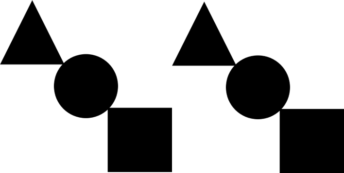

### 
> 2021/1/13
---
> 워드클라우드 마스크 이미지 관련 추가.
>
> 원하는 이미지를 이용해 워드클라우드의 모양? 을 바꿀수 있다!?!?
>
> ```Python
> from wordcloud import WordCloud, STOPWORDS
> import matplotlib.pyplot as plt
> from PIL import Image
> import numpy as np
>
> text = open('경로/워드클라우드 생성할 txt파일.확장자', encoding='UTF-8').read()
>
> image_path = '경로/사용할 마스크 이미지의 파일명.확장자'
> test_img = np.array(Image.open(image_path))
> 
> wordcloud = WordCloud(background_color='white',
>                       max_font_size = 100,
>                       max_words = 1000,
>                       stopwords = STOPWORDS,
>                       mask=test_img).generate(text)
> 
> fig = plt.figure(figsize=(15,15))
> plt.imshow(wordcloud, interpolation='bilinear', cmap='YlOrBr')
> plt.axis('off')
> 
> plt.savefig('경로/파일명.확장자')
> ```
>
> 배경이 없는 이미지와 배경을 흰색으로 지정한 이미지로 테스트를 했다.
> 
> 

> {: width="300" height="300"}
> {: width="300" height="300"}

