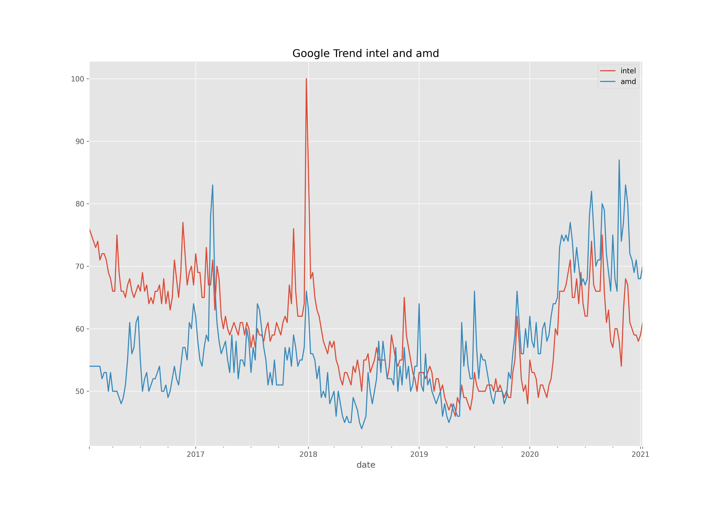
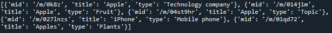
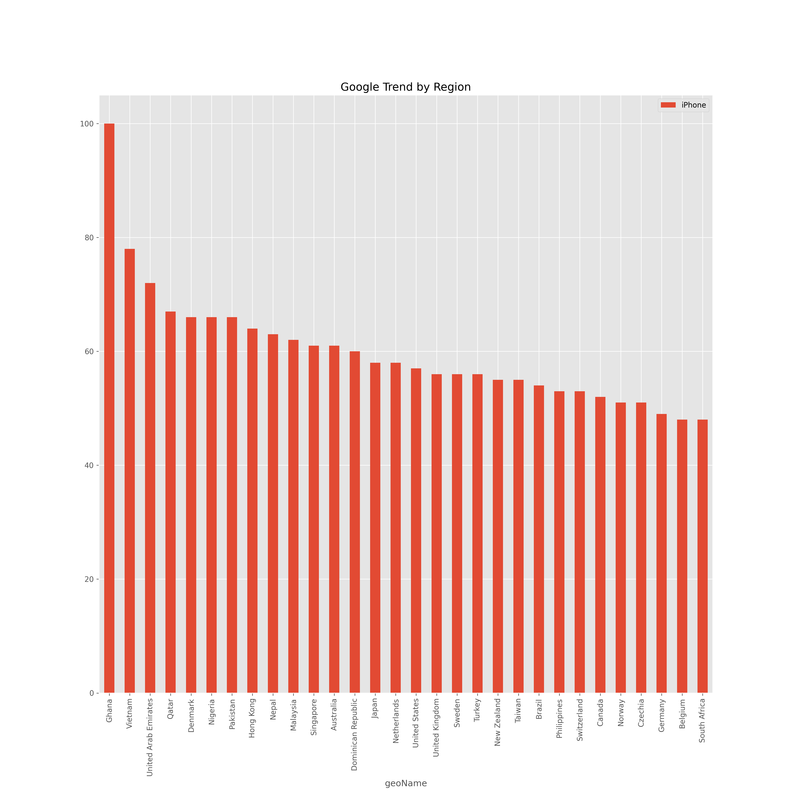

### 구글 검색어 분석? 
> 2021/1/15
> keyword를 이용해 그래프를 출력한다. 
---
> 맨 처음은 가장 단순하게 지정한 키워드의 지정한 기간동안의 검색량을 그래프로 저장한다.
> ```Python
> from pytrends.request import TrendReq # pip install pytrends 해야함. 구글의 검색어 정보를 가져오기 쉽게 해준다.
> import matplotlib.pyplot as plt #그래프 그릴거니까 사용
> import os # 이미지 파일로 저장하기 위해 사용했다.
> # import부분은 전부 동일하게 사용함으로 다음부터는 생략한다.
> 
> keyword = "Apple ICar" # 궁금한 키워드
> period = "today 3-m" # 검색기간은 최근 3개월
> 
> # Google trend 접속
> trend_obj = TrendReq() # 접속
> trend_obj.build_payload(kw_list=[keyword], timeframe=period) # 키워드와 기간을 파라미터로 전달해 정보를 얻는다.
> 
> # 시간에 따른 Trend 변화
> trend_df = trend_obj.interest_over_time() # 시간의 따른 변화 획득.
> 
> # 그래프 출력
> plt.style.use("ggplot")
> plt.figure(figsize=(14,5))
> trend_df[keyword].plot() # 그래프 생성.
> plt.title("Google Trend over time", size=15) # 타이틀 명과 타이틀의 크기를 지정한다.
> plt.legend(labels=[keyword], loc="upper right") # 그래프에 표시할 라밸과 정렬 방향 지정해준다.
> 
> # 그래프 파일 저장
> cwd = os.getcwd()
> output_filepath = os.path.join(cwd, "경로/파일명_%s.png" %keyword) # 키워드의 이름으로 이미지 파일을 저장한다.
> plt.savefig(output_filepath, dpi=300)
> plt.show()
> ```
> 
> 생각보다 간단했다. 저장한 그래프는 아래의 이미지와 같다.(클릭하면 원본)
> <br><br>
> 
>
> 다음은 지역(region)별 키워드의 검색량을 비교한다.
> ```Python
> keyword = "Sweet Home" # 한국 드라마가 아시아쪽(동아시아?)에서 유행이라길래 스위트홈으로 해봤다.
> period = "now 7-d" # 검색기간은 최근 7일
> 
> # Google trend 접속은 위와 같으니 설명은 생략한다.
> trend_obj = TrendReq()
> trend_obj.build_payload(kw_list=[keyword], timeframe=period)
> 
> # 지역별 Trend 비교(지역별 검색량 획득)
> trend_df = trend_obj.interest_by_region().sort_values(by=keyword, ascending=False)
> # 책에 있던 내용대로 작성했더니 by 값이 지정이 안되었다는 오류가 발생하여 수정하였다.
> 
> # 그래프 출력
> plt.style.use("ggplot")
> plt.figure(figsize=(14,10))
> trend_df.iloc[:50][keyword].plot(kind='bar') # 책에서는 loc[:50] 으로 작성되어 오류가 발생했다. 인덱스를 사용할 것이면 iloc를 이용해야 한다.
> plt.title("Google Trend over time", size=15)
> plt.legend(labels=[keyword], loc="upper right")
> 
> # 그래프를 이미지로 저장하는 부분은 파일명을 지정하는 것 외에는 전부 동일하기에 생략한다.
> ```
> 
> 저장한 그래프는 아래의 이미지와 같다.(클릭하면 원본)
> <br><br>
> 
>
> 다음은 복수의 키워드를 이용하여 기간동안 검색량을 하나의 그래프로 출력한다.
> ```Python
> keyword1 = "intel"
> keyword2 = "amd"
> period = "today 5-y" # 검색기간은 최근 5년
> 
> # Google trend 접속, 데이터 획득
> trend_obj = TrendReq()
> trend_obj.build_payload(kw_list=[keyword1, keyword2], timeframe=period) # kw_list는 최대 5개
> # 각각 키워드의 검색량 획득
> trend_df = trend_obj.interest_over_time()
> 
> # 그래프 출력
> plt.style.use("ggplot")
> plt.figure(figsize=(14,10))
> trend_df[keyword1].plot()
> trend_df[keyword2].plot() # 각각의 키워드의 검색량을 이용해 그래프 생성
> plt.title("Google Trend %s and %s" %(keyword1, keyword2), size=15)
> plt.legend(loc="best")
>
> # 그래프 파일 저장 생략
> ```
> 
> 저장한 그래프는 아래의 이미지와 같다.(클릭하면 원본)
> <br><br>
> 
>
> 마지막은 키워드에 대한 추천 검색어를 습득하고 습득한 검색어를 이용해 그래프를 생성하는 것이다.
> ```Python
> trend_obj = TrendReq() # 접속
> 
> keyword = "apple"
> suggested_keywords = trend_obj.suggestions(keyword) # 키워드에 대한 추천 검색어 습득
> ```
> 
> suggested_keywords에 담긴 값은 아래 이미지와 같다.
> 
> 
>
> ```Python
> new_keyword = suggested_keywords[3]['title'] # 3번째에 들어있는 iPhone 획득
> 
> period = "now 7-d"
> trend_obj.build_payload(kw_list=[new_keyword], timeframe=period) # new_keyword의 지정한 기간동안 검색량 획득
> 
> trend_df = trend_obj.interest_by_region() # 지역별 검색량 획득
> trend_top30 = trend_df.sort_values(by=new_keyword, ascending=False).head(30) # top30 획득
> 
> # 그래프 출력
> plt.style.use("ggplot")
> plt.figure(figsize=(15,15))
> trend_top30[new_keyword].plot(kind='bar')
> plt.title("Google Trend by Region", size=15)
> plt.legend(labels=[new_keyword], loc="upper right")
>
> # 그래프 파일 저장 생략
> ```
> 
> 저장한 그래프는 아래의 이미지와 같다.(클릭하면 원본)
> <br><br>
> 
>
> 
> 오늘은 여기까지..
>
> 다음은 이메일 전송, 한글 키워드 검색 등을 할 예정.
