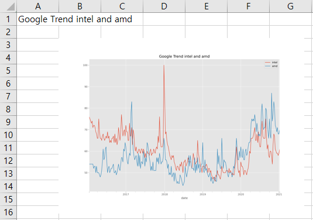

### 파이썬으로 엑셀에 이미지 삽입
> 2021/1/29
>
> 엑셀을 조작한다!!!
---
> 엑셀에 이미지를 첨부 할 수 있다?
> ```Python
> import openpyxl
> from openpyxl.drawing.image import Image
> 
> image_name = "엑셀에 삽입할 이미지 명.확장자" # 사용할 이미지 이름
> image_path = "../output/" # 사용할 이미지 경로
> 
> img = Image(image_path+image_name) # 이미지 경로이용해 이미지 객체 생성.
> 
> img.width = img.width//10 # 이미지가 너무 커서 1/10로 줄였음
> img.height = img.height//10 # 이미지가 너무 커서 1/10로 줄였음
> 
> wb = openpyxl.Workbook()
> ws = wb.create_sheet(index=0, title="Image") # 새 시트 생성, 이름은 Image
> wb.remove(wb['Sheet']) # 필요없는 시트 삭제
> 
> ws['A1'] = "Google Trend intel and amd" # A1에 이미지의 이름을 적는다.
> ws.add_image(img, 'B3') # 이미지의 왼쪽 위 모서리(시작위치)는 B3이다.
> 
> wb.save("경로/엑셀파일_이름.xlsx") # 저장
> ```
> 저장된 내용은 아래 사진과 같다.
> 
> 
>
> 이미지 삽입은 여기까지..
>
> 내일도 좋은하루!
