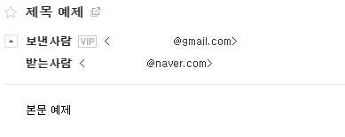

### 파이썬으로 이메일 보내기
> 2021/1/30
>
> 이메일 보내는 기초를 학습한다!
---
> smtplib사용이 필수적이다.
>
> 이메일을 보내기 위해 상용하는 프로토콜이 바로 Simple Mail Transfer Protocol즉 SMTP이니깐.
>
> SMTP 에서는 모든 문자가 7bit ASCII로 되어있어야 한다고 규정되어있다. 그래서 
>
> 마임(MIME)이라고 불리는 방식으로 7비트로 변환되어 전달한다.
> - (문자 표현에 8비트 이상의 코드를 사용하는 언어, 첨부파일, 자주 사용되는 각종 바이너리등을 변환한다.)
>
> 일단은 가장 기초부터 본다.
> ```Python
> import smtplib
> smtp_server = smtplib.SMTP(host='smtp.gmail.com', port=587) # SMTP 서버 TSL방식으로 접속
> 
> hello_message = smtp_server.ehlo() # SMTP서버에 hello 메시지 보냄
> print(hello_message,"\n")
> 
> bye_message = smtp_server.quit() # 종료
> print(bye_message)
> ```
> 위의 코드의 실행 결과는 아래의 사진과 같다.
> 
> 
> 
> 250 은 요청된 메일 동작 확인, 완료를 나타내며 221은 <도메인>서비스 종료된 전송 채널을 의미한다. [SMTP 응답 코드 보기](https://jybaek.tistory.com/624)
>
> 다음은 실제로 이메일 보내는 과정을 실습한다.
> ```Python
> # -*- coding: utf-8 -*-
> import smtplib
> from email.mime.text import MIMEText
> 
> smtp_server = smtplib.SMTP(host='smtp.gmail.com', port=587) # SMTP 서버 TSL방식으로 접속
> smtp_server.ehlo() # SMTP서버에 hello 메시지 보냄
> smtp_server.starttls() # TLS Encription 실행
> 
> my_addr = '사용할 이메일, 난 gmail을 사용하였다.'
> my_password = "생성해둔 gmail 앱 비밀번호"
> smtp_server.login(user = my_addr, password = my_password)
> 
> subject = '제목 예제'
> body = '본문 예제'
> 
> recipients = '받는 사람 메일주소, 난 naver를 사용하였다.' #  받는사람 메일주소
> # 같은 내용을 여러명에게 보낼땐 리스트로 담은 뒤
> # 아래와 같이 조인문을 이용해 쉼표로 계정 구분시켜 전달하면 됨.
> '''
> recipients_join = ','.join(recipients)
> 한 뒤 smtp_server.sendmail()의 to_addrs에 recipients_join전달 (..., to_addrs=recipients_join, ...)
> 다음 my_msg['To']에도 recipients_join전달 (my_msg['To'] = recipients_join전달)
> 이것만 방법인 것은 아니다.
> 내용도 각각 다른 내용을 사용할 것이라면 for문으로 반복 시켜도 될듯
> '''
> 
> my_msg = MIMEText(body)
> """
> email라이브러리의 MIMEText클래스 이용해 MIME구조의 이메일 객체 생성
> 단순 텍스트 타입으로 지정되고 이메일 본문으로 사용할 한글 문자열을 유니코드로 변환
> """
> 
> my_msg['Subject'] = subject # 이메일 객체에 제목 추가
> my_msg['To'] = recipients # 이메일 객체에 받는 사람 이메일 주소를 추가
> 
> smtp_server.sendmail(from_addr=my_addr,
>                      to_addrs=recipients,
>                      msg=my_msg.as_string())
> # smpt 서버를 이용해 이메일 발송(보내는 사람의 주소, 받는 사람의 주소, 보내려는 이메일 객체를 전달)
> # 이메일 객체는 as_string ()메소드를 사용해 문자열로 변환
> 
> bye_message = smtp_server.quit() # 종료
> ```
> 실행 결과는 아래 사진과 같다.
> 
> 
>
> 사용할 분야는 많은것 같다.
>
> 첨부파일도 전송 할 수 있으니 뭐 계산서, 구매내역, 문제발생시 이메일 전송 등 여러 분야에서 가능하다고 생각한다.
>
> 오늘은 여기까지...
>
> 내일도 좋은하루!, 오늘 남은 시간도 좋은시간!
