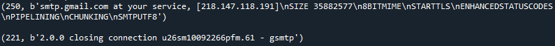

### 파이썬으로 이메일 보내기
> 2021/1/30
>
> 이메일 보내는 기초를 학습한다!
---
> smtplib사용이 필수적이다.
>
> 이메일을 보내기 위해 상용하는 프로토콜이 바로 Simple Mail Transfer Protocol즉 SMTP이니깐.
>
> SMTP 에서는 모든 문자가 7bit ASCII로 되어있어야 한다고 규정되어있다. 그래서 
>
> 마임(MIME)이라고 불리는 방식으로 7비트로 변환되어 전달한다.
> - (문자 표현에 8비트 이상의 코드를 사용하는 언어, 첨부파일, 자주 사용되는 각종 바이너리등을 변환한다.)
>
> 일단은 가장 기초부터 본다.
> ```Python
> import smtplib
> smtp_server = smtplib.SMTP(host='smtp.gmail.com', port=587) # SMTP 서버 TSL방식으로 접속
> 
> hello_message = smtp_server.ehlo() # SMTP서버에 hello 메시지 보냄
> print(hello_message,"\n")
> 
> bye_message = smtp_server.quit() # 종료
> print(bye_message)
> ```
> 위의 코드의 실행 결과는 아래의 사진과 같다.
> 
> 
> 
> 250 은 요청된 메일 동작 확인, 완료를 나타내며 221은 <도메인>서비스 종료된 전송 채널을 의미한다. [SMTP 응답 코드 보기](https://jybaek.tistory.com/624)
> 

>

> 내일도 좋은하루!
