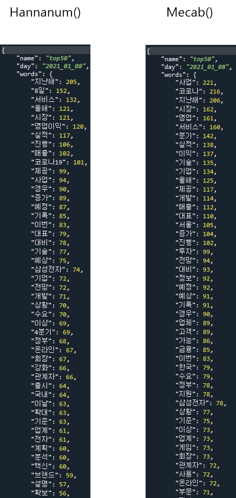

> 일단 처음으로는 신문 기사들의 리스트를 획득하는 함수이다.
```Python
def get_article_list(url, page_num):
    '''
    url = 신문사의 url
    전달받은 url을 이용해 신문 기사들의 세부 링크 리스트를 획득한다.
    '''
    now = datetime.datetime.now()
    today = now.strftime('%d')
    
    article_link = []
    search_url = url+str(page_num)

    resp = requests.get(search_url)
    html_src = resp.text
    soup = BeautifulSoup(html_src, 'html.parser')
    
    list_main = soup.find('main', attrs={'class':'list'})
    
    article_list = list_main.find_all('li', attrs={'class':'list'})
    # 기사들이 리스트로 제공되는 페이지에서 기사들의 정보 수집
    # print(news_items)
    for curt_article in article_list: 
        if today != curt_article.find('time').getText()[8:10]: #오늘 기사가 아니라면.(기사 작성일 설정 가능.)
            if article_link == []: # 반환할 기사가 없다면.
                return False
        else :
            article_link.append(curt_article.find('a').get('href')) # 수집한 기사들의 정보에서 기사 링크 획득
    
    return article_link
```
> 리스트에서 필요한 링크만 추출하여 리스트 형식으로 반환한다.
>
> 다음으로는 리스트 형식으로 전달받은 링크를 이용해 기사의 세부내용을 추출하는 부분이다.
```Python
def get_article_text(url, article_urls):
    '''
    url = 신문사의 url
    article_urls = 기사의 세부 링크
    전달받은 파라미터를 이용해 기사의 내용을 가공하여 획득한다.
    '''
    now = datetime.datetime.now()
    today = now.strftime('%Y_%m_%d')
    
    for article_url in article_urls:

        item_resp = requests.get(url+article_url) # 해당 기사 페이지 정보 습득
        item_html_src = item_resp.text # 해당 기사 페이지 정보 습득
        item_soup = BeautifulSoup(item_html_src, 'html.parser') # 해당 기사 페이지 정보 습득
        
        item_articles = item_soup.find('article', attrs={'class':'view'}) # 기사 페이지에서 타이틀과 기사내용 정보 습득
        item_article = item_articles.find_all('p') # p테그로 감싸진 것이 기사의 내용
        p_tag_text = ''
        
        for p_tag in item_article: # 각각의 p테그로 감싸진 기사를 필요한 정보만 붙여서 습득
            if '아이뉴스' in str(p_tag.text):
                p_tag_text += p_tag.text[str(p_tag.text).find(']')+2:]
                '''
                신문사, 기자이름 삭제
                text에 아이뉴스가 포함되어 있을 때
                ".find(']')"를 이용해 처음 발견되는 ']'의 위치를 반환받는다.
                슬라이싱을 이용해 ']'포함 뒤의 공백까지 삭제한다.
                '''
            else :
                p_tag_text += p_tag.text

        with open('../article/'+str(today)+'.txt', 'a', -1, 'utf-8') as f:
            f.writelines(p_tag_text+'\n') # 합쳐진 기사 내용을 txt에 작성.
```
> 한 페이지의 기사 리스트의 링크에서 전부 내용을 추출하면 txt파일에 내용을 쓴다.
>
> 다음으로는 신문기사를 조건에 맞게 반복하여 습득하도록 제어한 부분이다.
```Python
def news_crawling_start():
    '''
    임시로 작성한 함수, 파라미터 필요 X(임시니깐)
    get_article_list()함수 작동 후 get_article_text() 함수 작동
    get_article_list()에서 False 반환받으면 끝남.
    '''
    base_url = "http://www.inews24.com"
    list_url = "/list/inews?page="
    page_num = 0
    while True:
        
        page_num += 1
        temp = get_article_list(base_url+list_url, page_num)
        if temp != False:
            print(str(page_num)+"페이지 시작")
            get_article_text(base_url, temp)
        else :
            print('끝')
            break
```
>
> 전체 코드는 아래와 같다
```Python
import requests
# from selenium import webdriver
from bs4 import BeautifulSoup
import datetime
import re
from konlpy.tag import Hannanum
from collections import Counter, OrderedDict
import json

def get_article_list(url, page_num):
    '''
    url = 신문사의 url
    전달받은 url을 이용해 신문 기사들의 세부 링크 리스트를 획득한다.
    '''
    now = datetime.datetime.now()
    today = now.strftime('%d')
    
    article_link = []
    search_url = url+str(page_num)

    resp = requests.get(search_url)
    html_src = resp.text
    soup = BeautifulSoup(html_src, 'html.parser')
    
    list_main = soup.find('main', attrs={'class':'list'})
    
    article_list = list_main.find_all('li', attrs={'class':'list'})
    # 기사들이 리스트로 제공되는 페이지에서 기사들의 정보 수집
    # print(news_items)
    for curt_article in article_list: 
        if today != curt_article.find('time').getText()[8:10]: #오늘 기사가 아니라면.(기사 작성일 설정 가능.)
            if article_link == []: # 반환할 기사가 없다면.
                return False
        else :
            article_link.append(curt_article.find('a').get('href')) # 수집한 기사들의 정보에서 기사 링크 획득
    
    return article_link

def get_article_text(url, article_urls):
    '''
    url = 신문사의 url
    article_urls = 기사의 세부 링크
    전달받은 파라미터를 이용해 기사의 내용을 가공하여 획득한다.
    '''
    now = datetime.datetime.now()
    today = now.strftime('%Y_%m_%d')
    
    for article_url in article_urls:

        item_resp = requests.get(url+article_url) # 해당 기사 페이지 정보 습득
        item_html_src = item_resp.text # 해당 기사 페이지 정보 습득
        item_soup = BeautifulSoup(item_html_src, 'html.parser') # 해당 기사 페이지 정보 습득
        
        item_articles = item_soup.find('article', attrs={'class':'view'}) # 기사 페이지에서 타이틀과 기사내용 정보 습득
        item_article = item_articles.find_all('p') # p테그로 감싸진 것이 기사의 내용
        p_tag_text = ''
        
        for p_tag in item_article: # 각각의 p테그로 감싸진 기사를 필요한 정보만 붙여서 습득
            if '아이뉴스' in str(p_tag.text):
                p_tag_text += p_tag.text[str(p_tag.text).find(']')+2:]
                '''
                신문사, 기자이름 삭제
                text에 아이뉴스가 포함되어 있을 때
                ".find(']')"를 이용해 처음 발견되는 ']'의 위치를 반환받는다.
                슬라이싱을 이용해 ']'포함 뒤의 공백까지 삭제한다.
                '''
            else :
                p_tag_text += p_tag.text

        with open('../article/'+str(today)+'.txt', 'a', -1, 'utf-8') as f:
            f.writelines(p_tag_text+'\n') # 합쳐진 기사 내용을 txt에 작성.


def news_crawling_start():
    '''
    임시로 작성한 함수, 파라미터 필요 X(임시니깐)
    get_article_list()함수 작동 후 get_article_text() 함수 작동
    get_article_list()에서 False 반환받으면 끝남.
    '''
    base_url = "http://www.inews24.com"
    list_url = "/list/inews?page="
    page_num = 0
    while True:
        
        page_num += 1
        temp = get_article_list(base_url+list_url, page_num)
        if temp != False:
            print(str(page_num)+"페이지 시작")
            get_article_text(base_url, temp)
        else :
            print('끝')
            break


def top_50_keyword():
    '''
    konlpy이용 탑 50 키워드 추출
    임시 작성한것. news_crawling_start()이 끝나면 자동으로 작동하도록 수정해야함
    '''
    text = open('../article/2021_01_08.txt', 'rt', encoding='UTF8').read()
    engin = Hannanum()
    nouns = engin.nouns(text) # 명사만 추출
    
    
    nouns = [re.sub(r"[,‘’'\-_[\▲■""◆] ]", "", n) for n in nouns if len(n) > 1]
    '''        
    nouns에서 하나의 인자씩 n에 담는다.
    n의 글자 수가 2개 이상일 때에만 리스트에 담는다. 중복은 제거되지 않는다.
    필요없는 특수문자 삭제.
    '''

    count = Counter(nouns) # count는 <class 'collections.Counter'>

    tags = dict(count.most_common(50)) # 상위 50개의 데이터만 가져온다. Counter클래스에서 제공
    
    json_out = OrderedDict()
    json_out["name"] = "top50"
    json_out["day"] = "2021_01_08"
    json_out["words"] = tags
    
    with open('../article/2021_01_08_top50.json', 'a', -1, 'utf-8') as f:
        json.dump(json_out, f, ensure_ascii=False, indent="\t")
```
> 해당 웹 페이지의 robots.txt를 먼저 확인하고 크롤링을 진행 하였다. [보기](http://www.inews24.com/robots.txt)
>
> 전부 허용이길래 진행했다.
> 
> 테스트 하였을때 12페이지? 정도의 기사가 나온것으로 확인했다.
>
> 전체 기사의 내용을 konlpy를 이용해 명사들만 추출하여 각각의 명사의 출현 횟수를 토대로 top 50의 키워드를 json 파일로 저장하였다.
>
> 또한 wordcloud를 이용해 워드클라우드 이미지도 생성 하였다.
>
> konlpy의 경우 2가지의 클래스를 사용하였다.Mecab Class과 Hannanum Class이다. [설명보기](https://konlpy-ko.readthedocs.io/ko/v0.4.3/morph/)
>
> 성능에서는 확실히 Mecab이 뛰어난것 같다. 하지만 그거슨 윈도우에서 사용 할 수 없다.. 흑흑
>
> 난 우분투 환경과 윈도우 환경에서 테스트 해봤다.
>
> 일단 Hannanum을 이용해 분석한 명사를 사용한 wordcloud는 아래와 같다.
>

>
> 다음은 Mecab를 이용해 분석한 명사를 사용한 wordcloud다.
>

>
> 마지막으로 Hannanum, Mecab 각각 명사를 분석한 json을 캡쳐한 사진이다.(읽기 편하라고 크게...)
>

>
> 이미지를 보면 Mecab에서 명사가 검출된 횟수가 훨씬 많다.
>
> Mecab가 Hannanum보다 빠르고 세세하게 분석하는것을 깨달았다.
>
> 빠른건 실제로 채감했다. 약간 msg좀 보태서 체감상 20~30배는 차이가 나는것 같다.
>
> 오늘도 유익했다.
>
> 오늘은 기사를 크롤링하여 텍스트를 분석해 top50키워드를 출력하는 실습을 했다!.
>
> 내일도 공부..!
>
> #### 2/13추가
>
> 순서에 따른 차이를 확인해 볼 필요가 있는것 같다.
>
> 기사의 고유 번호를 전부 수집한 뒤 각각의 기사들을 수집할 것인지
>
> 지금처럼 페이지 단위로 기사의 고유 번호를 수집한 뒤 해당 기사 내용을 수집하는 것이 빠른지
>
> 아니면 또 다른 방법이 있는지 찾아봐야겠다.
